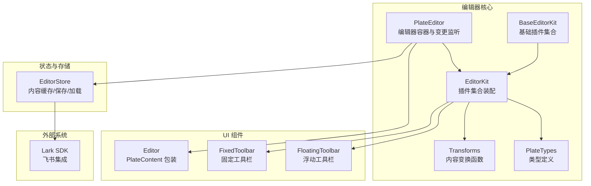
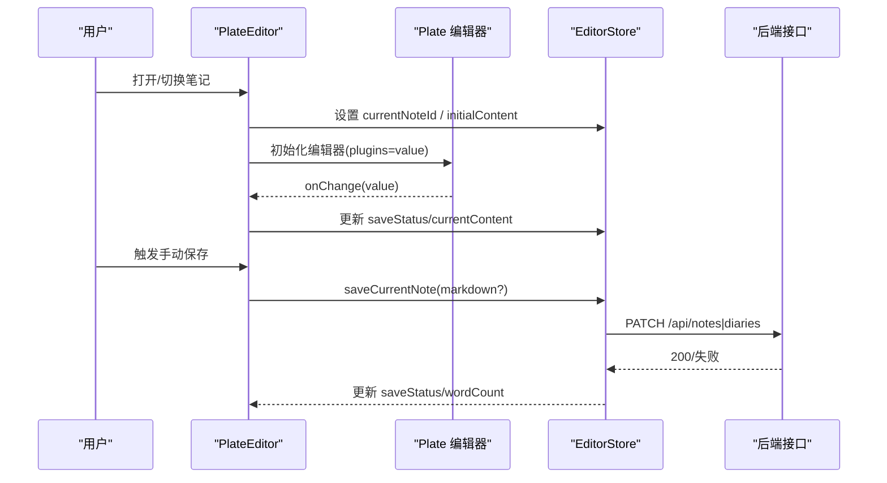
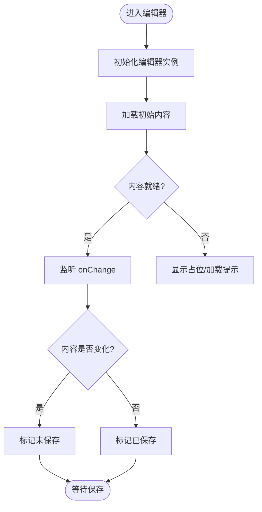
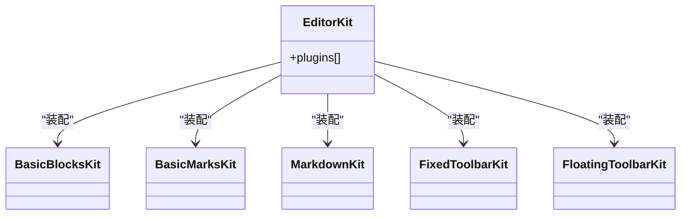
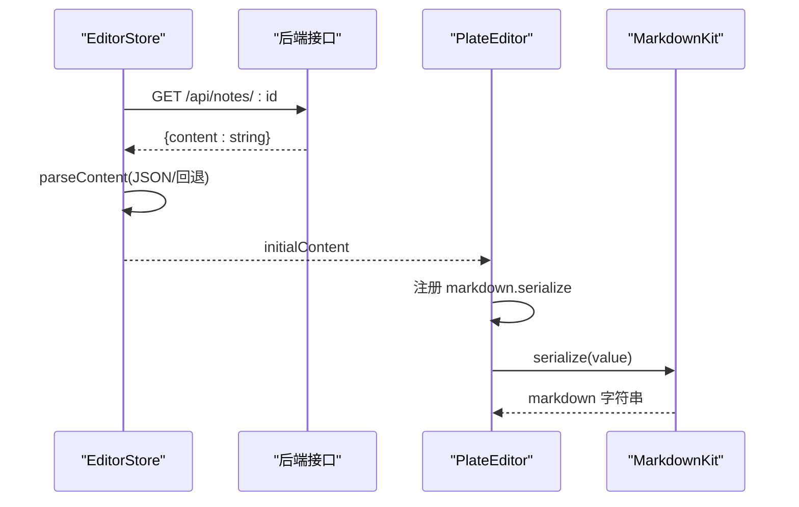
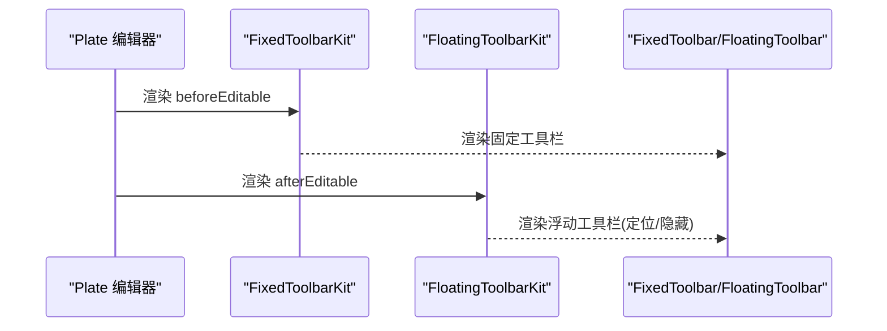
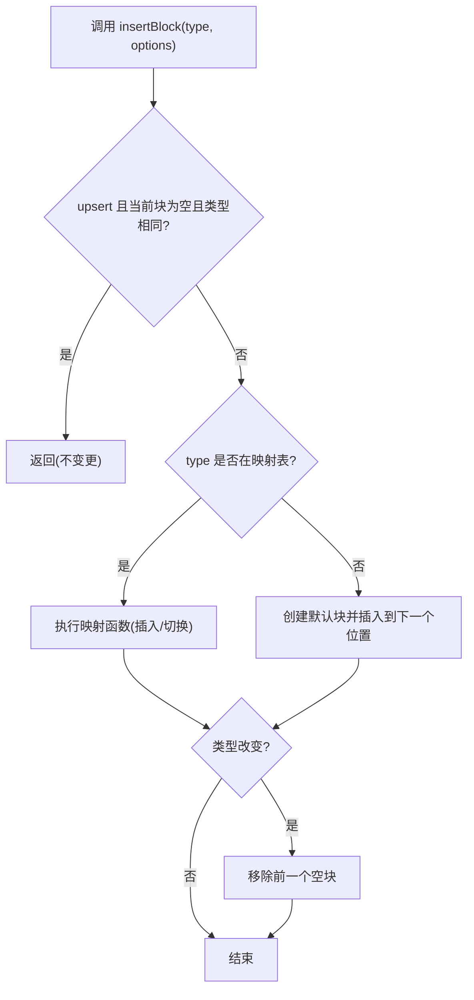
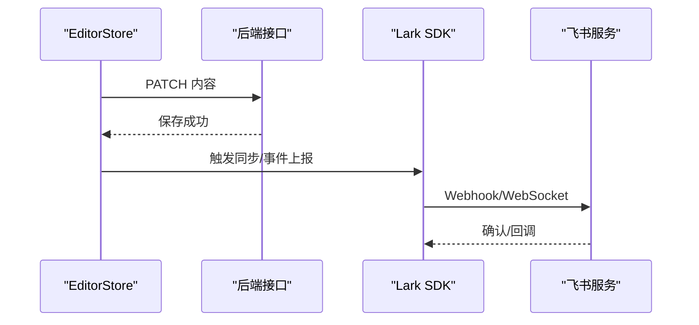
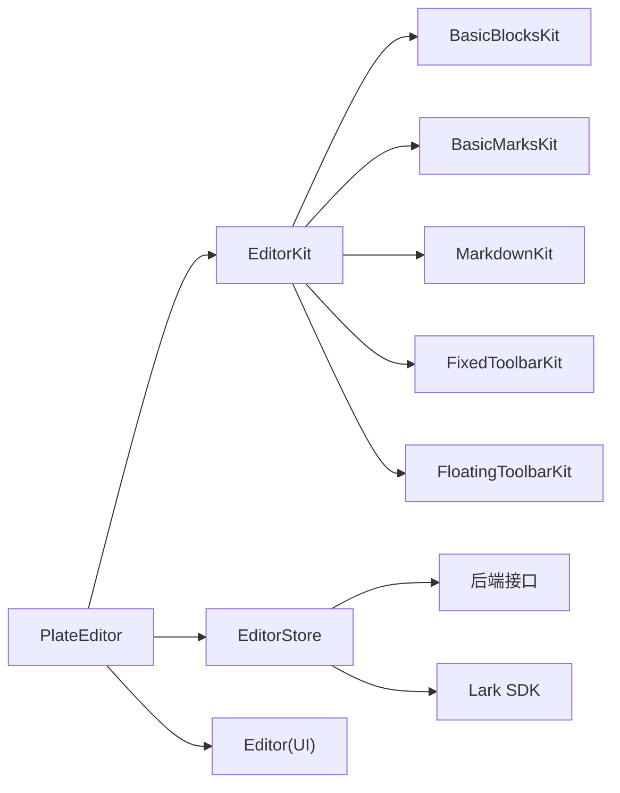

# 编辑器系统

<cite>
**本文引用的文件**
- [src/components/editor/plate-editor.tsx](file://src/components/editor/plate-editor.tsx)
- [src/components/editor/editor-kit.tsx](file://src/components/editor/editor-kit.tsx)
- [src/components/editor/editor-base-kit.tsx](file://src/components/editor/editor-base-kit.tsx)
- [src/components/editor/transforms.ts](file://src/components/editor/transforms.ts)
- [src/components/editor/plate-types.ts](file://src/components/editor/plate-types.ts)
- [src/components/editor/plugins/fixed-toolbar-kit.tsx](file://src/components/editor/plugins/fixed-toolbar-kit.tsx)
- [src/components/editor/plugins/floating-toolbar-kit.tsx](file://src/components/editor/plugins/floating-toolbar-kit.tsx)
- [src/components/editor/plugins/markdown-kit.tsx](file://src/components/editor/plugins/markdown-kit.tsx)
- [src/components/editor/plugins/basic-blocks-kit.tsx](file://src/components/editor/plugins/basic-blocks-kit.tsx)
- [src/components/editor/plugins/basic-marks-kit.tsx](file://src/components/editor/plugins/basic-marks-kit.tsx)
- [src/components/ui/editor.tsx](file://src/components/ui/editor.tsx)
- [src/components/ui/fixed-toolbar.tsx](file://src/components/ui/fixed-toolbar.tsx)
- [src/components/ui/floating-toolbar.tsx](file://src/components/ui/floating-toolbar.tsx)
- [src/stores/editor-store.ts](file://src/stores/editor-store.ts)
- [src/lib/lark.ts](file://src/lib/lark.ts)
</cite>

## 目录
1. [简介](#简介)
2. [项目结构](#项目结构)
3. [核心组件](#核心组件)
4. [架构总览](#架构总览)
5. [详细组件分析](#详细组件分析)
6. [依赖关系分析](#依赖关系分析)
7. [性能考虑](#性能考虑)
8. [故障排查指南](#故障排查指南)
9. [结论](#结论)
10. [附录](#附录)

## 简介
本文件面向编辑器系统的使用者与开发者，系统性阐述基于 Plate.js 的富文本编辑器在本项目中的集成与配置方式，涵盖以下主题：
- 编辑器初始化与基础设置
- 插件体系设计（基础节点、格式化、扩展与解析）
- 内容转换机制（序列化、反序列化、Markdown 转换）
- 工具栏实现（固定工具栏与浮动工具栏）
- 内容变换函数的使用与自定义
- 主题与样式定制
- 键盘快捷键与无障碍支持
- 性能优化策略（虚拟滚动与增量渲染思路）
- 外部系统集成（飞书文档同步）
- 扩展开发指南与最佳实践

## 项目结构
编辑器相关代码主要位于 src/components/editor 与 src/components/ui 下，配合状态管理与工具库实现完整的编辑体验。

**图表来源**
- [src/components/editor/plate-editor.tsx:63-174](file://src/components/editor/plate-editor.tsx#L63-L174)
- [src/components/editor/editor-kit.tsx:36-78](file://src/components/editor/editor-kit.tsx#L36-L78)
- [src/components/editor/editor-base-kit.tsx:20-39](file://src/components/editor/editor-base-kit.tsx#L20-L39)
- [src/components/editor/transforms.ts:87-122](file://src/components/editor/transforms.ts#L87-L122)
- [src/components/editor/plate-types.ts:148-164](file://src/components/editor/plate-types.ts#L148-L164)
- [src/components/ui/editor.tsx:91-113](file://src/components/ui/editor.tsx#L91-L113)
- [src/components/ui/fixed-toolbar.tsx:7-17](file://src/components/ui/fixed-toolbar.tsx#L7-L17)
- [src/components/ui/floating-toolbar.tsx:23-86](file://src/components/ui/floating-toolbar.tsx#L23-L86)
- [src/stores/editor-store.ts:88-280](file://src/stores/editor-store.ts#L88-L280)
- [src/lib/lark.ts:8-23](file://src/lib/lark.ts#L8-L23)

**章节来源**
- [src/components/editor/plate-editor.tsx:1-175](file://src/components/editor/plate-editor.tsx#L1-L175)
- [src/components/editor/editor-kit.tsx:1-83](file://src/components/editor/editor-kit.tsx#L1-L83)
- [src/components/editor/editor-base-kit.tsx:1-40](file://src/components/editor/editor-base-kit.tsx#L1-L40)
- [src/components/editor/transforms.ts:1-208](file://src/components/editor/transforms.ts#L1-L208)
- [src/components/editor/plate-types.ts:1-164](file://src/components/editor/plate-types.ts#L1-L164)
- [src/components/ui/editor.tsx:1-131](file://src/components/ui/editor.tsx#L1-L131)
- [src/components/ui/fixed-toolbar.tsx:1-18](file://src/components/ui/fixed-toolbar.tsx#L1-L18)
- [src/components/ui/floating-toolbar.tsx:1-87](file://src/components/ui/floating-toolbar.tsx#L1-L87)
- [src/stores/editor-store.ts:1-281](file://src/stores/editor-store.ts#L1-L281)
- [src/lib/lark.ts:1-96](file://src/lib/lark.ts#L1-L96)

## 核心组件
- PlateEditor：负责编辑器实例初始化、值变更监听、跨笔记切换重置、Markdown 序列化器注册、加载态与占位提示等。
- EditorKit：统一装配所有插件（元素节点、标记、块级样式、编辑行为、解析器、UI），形成可复用的编辑器能力集。
- Transforms：封装插入/设置块级与内联元素的常用变换，提供 upsert、批量设置等能力。
- PlateTypes：定义编辑器 Value 与各类节点/文本类型的 TypeScript 接口，确保类型安全。
- EditorStore：集中管理当前笔记、初始内容、当前编辑内容、保存状态、字数统计、内容缓存与保存流程。
- UI 组件：Editor、FixedToolbar、FloatingToolbar 提供容器、样式变体与悬浮定位逻辑。

**章节来源**
- [src/components/editor/plate-editor.tsx:63-174](file://src/components/editor/plate-editor.tsx#L63-L174)
- [src/components/editor/editor-kit.tsx:36-83](file://src/components/editor/editor-kit.tsx#L36-L83)
- [src/components/editor/transforms.ts:87-193](file://src/components/editor/transforms.ts#L87-L193)
- [src/components/editor/plate-types.ts:148-164](file://src/components/editor/plate-types.ts#L148-L164)
- [src/stores/editor-store.ts:88-280](file://src/stores/editor-store.ts#L88-L280)
- [src/components/ui/editor.tsx:91-113](file://src/components/ui/editor.tsx#L91-L113)
- [src/components/ui/fixed-toolbar.tsx:7-17](file://src/components/ui/fixed-toolbar.tsx#L7-L17)
- [src/components/ui/floating-toolbar.tsx:23-86](file://src/components/ui/floating-toolbar.tsx#L23-L86)

## 架构总览
编辑器采用“插件装配 + 变换函数 + 类型约束 + 状态管理”的分层架构。PlateEditor 作为入口，通过 EditorKit 注入插件；EditorStore 负责内容与保存；Transforms 抽象常见编辑操作；UI 组件提供工具栏与编辑区域样式。

**图表来源**
- [src/components/editor/plate-editor.tsx:79-153](file://src/components/editor/plate-editor.tsx#L79-L153)
- [src/stores/editor-store.ts:204-275](file://src/stores/editor-store.ts#L204-L275)

## 详细组件分析

### 编辑器初始化与基础设置
- 使用 Plate 的 usePlateEditor 创建编辑器实例，传入 EditorKit 与初始值。
- 通过 onChange 比较新旧值，避免不必要的保存与状态更新。
- 切换笔记时重置编辑器状态（清空历史、取消选区、滚动到顶部）。
- 注册 Markdown 序列化器，供保存时生成 Markdown 文本。

**图表来源**
- [src/components/editor/plate-editor.tsx:79-153](file://src/components/editor/plate-editor.tsx#L79-L153)

**章节来源**
- [src/components/editor/plate-editor.tsx:63-174](file://src/components/editor/plate-editor.tsx#L63-L174)

### 插件系统设计与实现
- EditorKit 将基础节点、标记、块级样式、编辑行为、解析器与 UI 插件聚合，形成完整能力集。
- 基础插件集合 BaseEditorKit 提供最小可用能力，便于按需扩展。
- 典型插件类别：
  - 基础块：标题、段落、引用、水平线等。
  - 基础标记：加粗、斜体、下划线、代码、删除线、上下标、高亮、键盘键等。
  - Markdown 解析：MarkdownPlugin 配置 remark 插件链。
  - 工具栏：固定与浮动工具栏插件。
  - 编辑行为：自动格式化、退出断行、拖拽排序、表情、菜单等。

**图表来源**
- [src/components/editor/editor-kit.tsx:36-78](file://src/components/editor/editor-kit.tsx#L36-L78)
- [src/components/editor/plugins/basic-blocks-kit.tsx:27-88](file://src/components/editor/plugins/basic-blocks-kit.tsx#L27-L88)
- [src/components/editor/plugins/basic-marks-kit.tsx:19-41](file://src/components/editor/plugins/basic-marks-kit.tsx#L19-L41)
- [src/components/editor/plugins/markdown-kit.tsx:5-11](file://src/components/editor/plugins/markdown-kit.tsx#L5-L11)
- [src/components/editor/plugins/fixed-toolbar-kit.tsx:8-19](file://src/components/editor/plugins/fixed-toolbar-kit.tsx#L8-L19)
- [src/components/editor/plugins/floating-toolbar-kit.tsx:8-19](file://src/components/editor/plugins/floating-toolbar-kit.tsx#L8-L19)

**章节来源**
- [src/components/editor/editor-kit.tsx:1-83](file://src/components/editor/editor-kit.tsx#L1-L83)
- [src/components/editor/editor-base-kit.tsx:1-40](file://src/components/editor/editor-base-kit.tsx#L1-L40)
- [src/components/editor/plugins/basic-blocks-kit.tsx:1-89](file://src/components/editor/plugins/basic-blocks-kit.tsx#L1-L89)
- [src/components/editor/plugins/basic-marks-kit.tsx:1-42](file://src/components/editor/plugins/basic-marks-kit.tsx#L1-L42)
- [src/components/editor/plugins/markdown-kit.tsx:1-12](file://src/components/editor/plugins/markdown-kit.tsx#L1-L12)
- [src/components/editor/plugins/fixed-toolbar-kit.tsx:1-20](file://src/components/editor/plugins/fixed-toolbar-kit.tsx#L1-L20)
- [src/components/editor/plugins/floating-toolbar-kit.tsx:1-20](file://src/components/editor/plugins/floating-toolbar-kit.tsx#L1-L20)

### 内容转换机制：序列化、反序列化与 Markdown 转换
- 反序列化：EditorStore.loadNote/loadDiary 从后端读取内容，尝试 JSON 解析，失败则回退为纯文本包裹。
- 序列化：PlateEditor 在挂载时注册 Markdown 序列化器，保存时可直接调用。
- Markdown 转换：MarkdownKit 使用 remark 插件链（数学公式、GFM、MDX、提及等）增强 Markdown 渲染与导入能力。

**图表来源**
- [src/stores/editor-store.ts:114-155](file://src/stores/editor-store.ts#L114-L155)
- [src/components/editor/plate-editor.tsx:146-153](file://src/components/editor/plate-editor.tsx#L146-L153)
- [src/components/editor/plugins/markdown-kit.tsx:5-11](file://src/components/editor/plugins/markdown-kit.tsx#L5-L11)

**章节来源**
- [src/stores/editor-store.ts:79-86](file://src/stores/editor-store.ts#L79-L86)
- [src/stores/editor-store.ts:114-155](file://src/stores/editor-store.ts#L114-L155)
- [src/components/editor/plate-editor.tsx:146-153](file://src/components/editor/plate-editor.tsx#L146-L153)
- [src/components/editor/plugins/markdown-kit.tsx:1-12](file://src/components/editor/plugins/markdown-kit.tsx#L1-L12)

### 工具栏实现：固定工具栏与浮动工具栏
- 固定工具栏：FixedToolbarKit 通过 beforeEditable 插槽渲染固定工具栏，适合标题/段落等高频操作。
- 浮动工具栏：FloatingToolbarKit 通过 afterEditable 插槽渲染，结合 @platejs/floating 的定位逻辑，随选区出现/隐藏，支持翻转与偏移。

**图表来源**
- [src/components/editor/plugins/fixed-toolbar-kit.tsx:8-19](file://src/components/editor/plugins/fixed-toolbar-kit.tsx#L8-L19)
- [src/components/editor/plugins/floating-toolbar-kit.tsx:8-19](file://src/components/editor/plugins/floating-toolbar-kit.tsx#L8-L19)
- [src/components/ui/fixed-toolbar.tsx:7-17](file://src/components/ui/fixed-toolbar.tsx#L7-L17)
- [src/components/ui/floating-toolbar.tsx:23-86](file://src/components/ui/floating-toolbar.tsx#L23-L86)

**章节来源**
- [src/components/editor/plugins/fixed-toolbar-kit.tsx:1-20](file://src/components/editor/plugins/fixed-toolbar-kit.tsx#L1-L20)
- [src/components/editor/plugins/floating-toolbar-kit.tsx:1-20](file://src/components/editor/plugins/floating-toolbar-kit.tsx#L1-L20)
- [src/components/ui/fixed-toolbar.tsx:1-18](file://src/components/ui/fixed-toolbar.tsx#L1-L18)
- [src/components/ui/floating-toolbar.tsx:1-87](file://src/components/ui/floating-toolbar.tsx#L1-L87)

### 内容变换函数：使用与自定义
- insertBlock：根据类型插入块级元素，支持 upsert（同类型空块不重复创建）、批量插入、自动清理空块。
- setBlockType：批量设置块级类型，兼容列表属性与特定类型切换（如代码块、三栏布局）。
- insertInlineElement：触发内联元素插入（日期、行内公式、链接等）。
- getBlockType：从节点中提取块类型（含列表类型归一化）。

**图表来源**
- [src/components/editor/transforms.ts:87-122](file://src/components/editor/transforms.ts#L87-L122)

**章节来源**
- [src/components/editor/transforms.ts:29-122](file://src/components/editor/transforms.ts#L29-L122)
- [src/components/editor/transforms.ts:157-193](file://src/components/editor/transforms.ts#L157-L193)
- [src/components/editor/transforms.ts:195-208](file://src/components/editor/transforms.ts#L195-L208)

### 主题与样式定制
- Editor 容器与视图提供多种变体（default/demo/comment/select/ai/aiChat/fullWidth/none），通过 cva 控制尺寸、边距、占位样式与焦点环。
- 固定工具栏使用粘性定位与毛玻璃背景，适配不同屏幕尺寸。
- 浮动工具栏使用 @platejs/floating 的定位中间件，支持翻转与边界检测。

**章节来源**
- [src/components/ui/editor.tsx:11-86](file://src/components/ui/editor.tsx#L11-L86)
- [src/components/ui/editor.tsx:117-131](file://src/components/ui/editor.tsx#L117-L131)
- [src/components/ui/fixed-toolbar.tsx:7-17](file://src/components/ui/fixed-toolbar.tsx#L7-L17)
- [src/components/ui/floating-toolbar.tsx:36-57](file://src/components/ui/floating-toolbar.tsx#L36-L57)

### 键盘快捷键与无障碍支持
- 快捷键示例：标题切换（mod+alt+数字）、斜体/下划线/删除线/上/下标、高亮、代码等。
- 无障碍：Editor 使用 PlateContent 的默认语义与占位符样式，保持可读性与可访问性。

**章节来源**
- [src/components/editor/plugins/basic-blocks-kit.tsx:36-85](file://src/components/editor/plugins/basic-blocks-kit.tsx#L36-L85)
- [src/components/editor/plugins/basic-marks-kit.tsx:23-41](file://src/components/editor/plugins/basic-marks-kit.tsx#L23-L41)
- [src/components/ui/editor.tsx:53-86](file://src/components/ui/editor.tsx#L53-L86)

### 编辑器性能优化策略
- 结构相等比较：自定义值比较函数，避免昂贵的 JSON 序列化，仅在结构变化时触发保存与状态更新。
- LRU 内容缓存：EditorStore 维护内容缓存与字数统计，命中时直接设置初始内容，减少网络请求。
- 无重排批量操作：Transforms 中使用 withoutNormalizing 包裹多次节点操作，降低渲染次数。
- 增量渲染思路：建议在长文档场景引入虚拟滚动（例如基于第三方库）以减少 DOM 节点数量；当前仓库未直接实现虚拟滚动，但可通过扩展 Editor 容器与渲染管线实现。

**章节来源**
- [src/components/editor/plate-editor.tsx:16-61](file://src/components/editor/plate-editor.tsx#L16-L61)
- [src/stores/editor-store.ts:66-77](file://src/stores/editor-store.ts#L66-L77)
- [src/stores/editor-store.ts:114-155](file://src/stores/editor-store.ts#L114-L155)
- [src/components/editor/transforms.ts:94-121](file://src/components/editor/transforms.ts#L94-L121)

### 与外部系统的集成：飞书文档同步
- Lark SDK：提供客户端初始化、事件模式（Webhook/WebSocket）、加密参数与文件夹令牌等配置。
- 集成路径：编辑器侧通过 API 保存内容，飞书侧通过 Webhook 或 WebSocket 推送事件，SDK 提供统一客户端与 WS 客户端。

**图表来源**
- [src/stores/editor-store.ts:204-275](file://src/stores/editor-store.ts#L204-L275)
- [src/lib/lark.ts:8-23](file://src/lib/lark.ts#L8-L23)
- [src/lib/lark.ts:69-84](file://src/lib/lark.ts#L69-L84)

**章节来源**
- [src/lib/lark.ts:1-96](file://src/lib/lark.ts#L1-L96)
- [src/stores/editor-store.ts:204-275](file://src/stores/editor-store.ts#L204-L275)

### 扩展开发指南与最佳实践
- 新增节点/标记：在对应 Kit 中注册插件与组件，确保类型声明覆盖（参考 PlateTypes）。
- 自定义变换：在 Transforms 中新增映射或封装常用组合，保持无重排批量操作。
- 工具栏按钮：在对应工具栏按钮组件中绑定变换函数，确保快捷键与点击行为一致。
- 解析器扩展：在 MarkdownKit 中追加 remark 插件，注意与现有插件的兼容性。
- 性能：优先使用结构相等比较与 LRU 缓存；对复杂变换使用 withoutNormalizing；必要时引入虚拟滚动。

**章节来源**
- [src/components/editor/plate-types.ts:25-164](file://src/components/editor/plate-types.ts#L25-L164)
- [src/components/editor/transforms.ts:29-122](file://src/components/editor/transforms.ts#L29-L122)
- [src/components/editor/plugins/markdown-kit.tsx:5-11](file://src/components/editor/plugins/markdown-kit.tsx#L5-L11)

## 依赖关系分析

**图表来源**
- [src/components/editor/plate-editor.tsx:79-82](file://src/components/editor/plate-editor.tsx#L79-L82)
- [src/components/editor/editor-kit.tsx:36-78](file://src/components/editor/editor-kit.tsx#L36-L78)
- [src/stores/editor-store.ts:204-275](file://src/stores/editor-store.ts#L204-L275)
- [src/lib/lark.ts:8-23](file://src/lib/lark.ts#L8-L23)

**章节来源**
- [src/components/editor/plate-editor.tsx:79-82](file://src/components/editor/plate-editor.tsx#L79-L82)
- [src/components/editor/editor-kit.tsx:36-78](file://src/components/editor/editor-kit.tsx#L36-L78)
- [src/stores/editor-store.ts:204-275](file://src/stores/editor-store.ts#L204-L275)
- [src/lib/lark.ts:8-23](file://src/lib/lark.ts#L8-L23)

## 性能考虑
- 结构相等比较：避免每次变更都进行深度比较，仅在结构变化时更新状态。
- 内容缓存：LRU 缓存热点笔记，减少重复加载。
- 批量操作：Transforms 使用 withoutNormalizing 合并多次节点变更。
- 建议：在超长文档场景引入虚拟滚动与懒加载渲染，减少 DOM 节点数量与重绘范围。

[本节为通用指导，无需具体文件分析]

## 故障排查指南
- 无法保存：检查 saveCurrentNote 的返回状态与错误分支，确认 API 返回码与内容序列化是否成功。
- 内容错乱：切换笔记时确保历史记录被清空、选区被取消、容器滚动到顶部。
- Markdown 序列化失败：确认 MarkdownKit 已正确注册，序列化器回调是否被设置。
- 飞书同步异常：核对 Lark SDK 配置项（App ID/Secret、事件模式、加密参数）与环境变量。

**章节来源**
- [src/stores/editor-store.ts:204-275](file://src/stores/editor-store.ts#L204-L275)
- [src/components/editor/plate-editor.tsx:102-136](file://src/components/editor/plate-editor.tsx#L102-L136)
- [src/components/editor/plate-editor.tsx:146-153](file://src/components/editor/plate-editor.tsx#L146-L153)
- [src/lib/lark.ts:8-23](file://src/lib/lark.ts#L8-L23)

## 结论
本编辑器系统以 Plate.js 为核心，通过模块化的插件装配、完善的类型约束与状态管理，实现了从基础块/标记到 Markdown 解析、工具栏交互与内容保存的全链路能力。配合 LRU 缓存与结构相等比较等优化策略，可在保证易用性的同时兼顾性能。未来可在长文档场景引入虚拟滚动与增量渲染，进一步提升大体量内容的编辑体验。

## 附录
- 快捷键参考：标题切换、斜体/下划线/删除线/上/下标、高亮、代码等。
- 类型扩展：在 PlateTypes 中补充自定义节点/文本类型，确保编辑器与渲染组件的一致性。
- 工具栏扩展：在对应按钮组件中绑定变换函数，确保快捷键与 UI 行为一致。

[本节为概念性总结，无需具体文件分析]