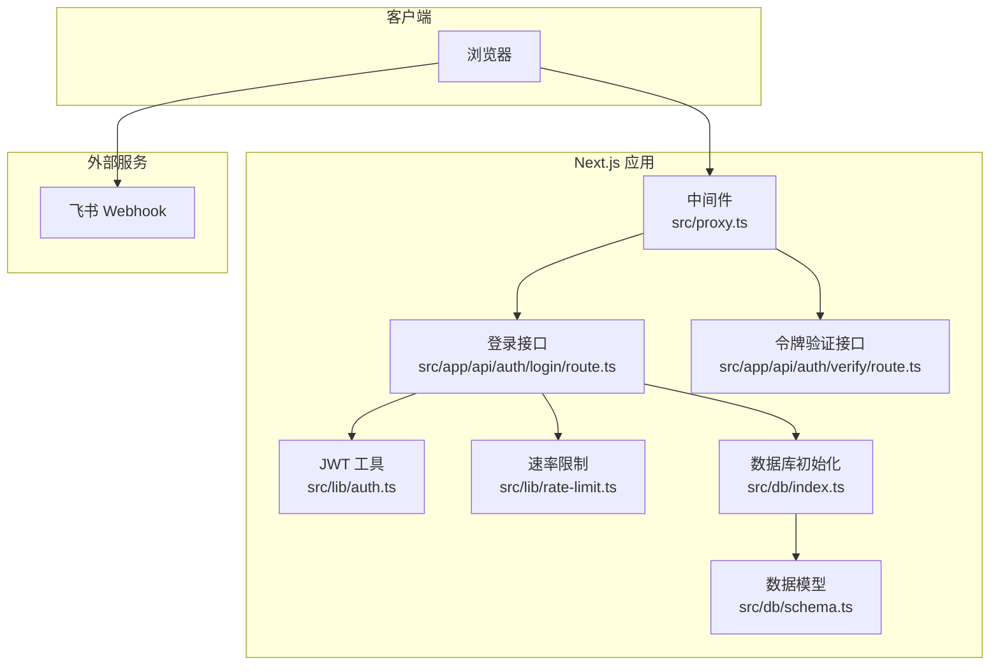
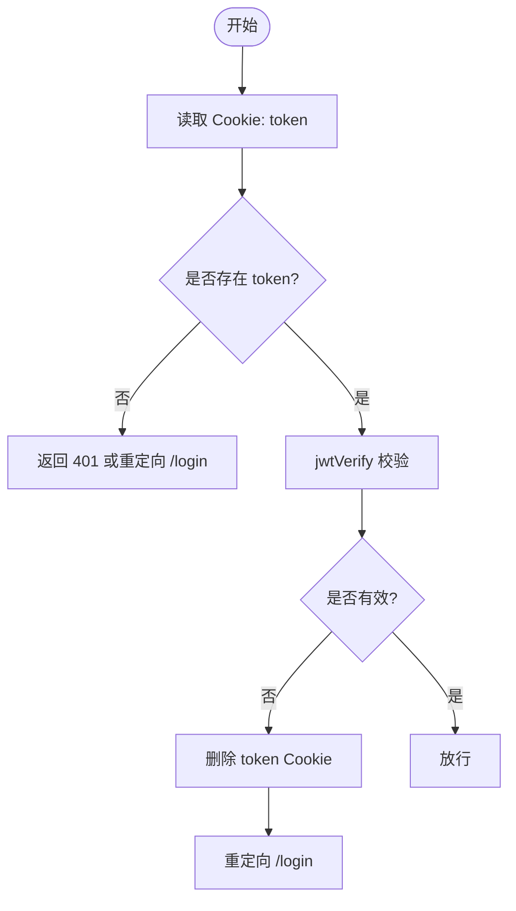
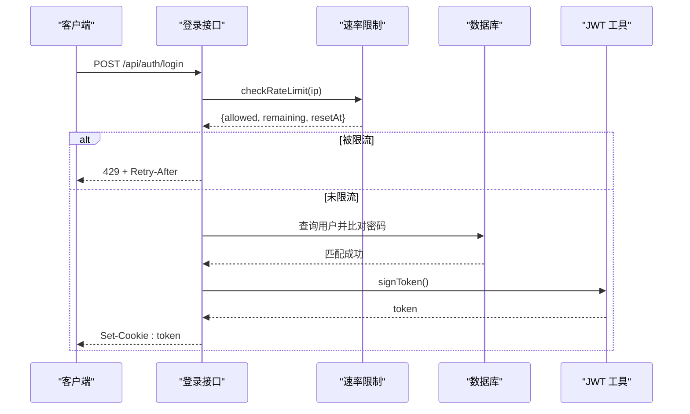
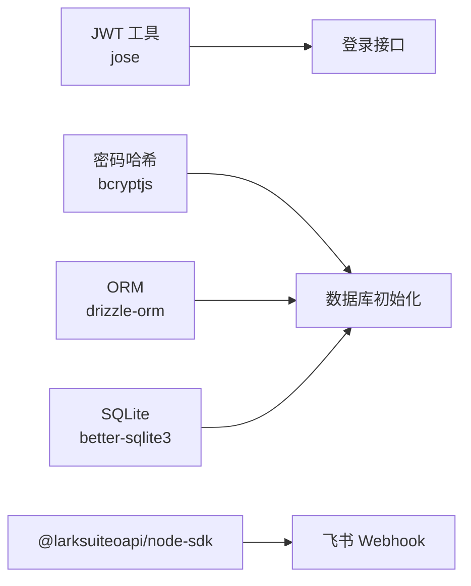

# 安全配置

<cite>
**本文引用的文件**
- [src/lib/auth.ts](file://src/lib/auth.ts)
- [src/proxy.ts](file://src/proxy.ts)
- [src/app/api/auth/login/route.ts](file://src/app/api/auth/login/route.ts)
- [src/app/api/auth/verify/route.ts](file://src/app/api/auth/verify/route.ts)
- [src/lib/rate-limit.ts](file://src/lib/rate-limit.ts)
- [src/db/index.ts](file://src/db/index.ts)
- [src/db/schema.ts](file://src/db/schema.ts)
- [next.config.ts](file://next.config.ts)
- [package.json](file://package.json)
- [src/app/api/webhook/lark/route.ts](file://src/app/api/webhook/lark/route.ts)
</cite>

## 目录
1. [简介](#简介)
2. [项目结构](#项目结构)
3. [核心组件](#核心组件)
4. [架构总览](#架构总览)
5. [详细组件分析](#详细组件分析)
6. [依赖关系分析](#依赖关系分析)
7. [性能与安全特性](#性能与安全特性)
8. [故障排查指南](#故障排查指南)
9. [结论](#结论)
10. [附录：部署与运维建议](#附录部署与运维建议)

## 简介
本文件面向安全与运维团队，系统性梳理本项目的安全配置与防护实践，覆盖以下主题：
- HTTPS 与 SSL 证书：在部署层面对接反向代理或平台提供的 TLS 终端
- CORS 策略与安全头：当前实现未显式设置，建议通过中间件或平台安全头策略补齐
- JWT 令牌：签发、校验、过期策略与 Cookie 属性
- API 访问控制与权限管理：基于令牌的统一鉴权与公开路径白名单
- 防火墙与网络安全：通过平台/云厂商安全组与 WAF 配置
- 数据加密与敏感信息保护：数据库初始化与密码哈希策略
- CSRF 与 XSS 防护：建议通过 Next.js 安全头与前端输入净化
- 安全审计与漏洞扫描：CI/CD 中集成静态分析与依赖扫描
- 应急响应与事件处理：日志记录、告警与快速处置流程

说明：本项目为单用户（admin）应用，采用自签名密钥进行 JWT HS256 签名，并通过 Cookie 持久化令牌。当前未内置 CORS 与安全头中间件，需在部署层补充。

## 项目结构
从安全视角，关键目录与文件如下：
- 认证与令牌：src/lib/auth.ts、src/app/api/auth/login/route.ts、src/app/api/auth/verify/route.ts、src/proxy.ts
- 速率限制：src/lib/rate-limit.ts
- 数据库与用户模型：src/db/index.ts、src/db/schema.ts
- Next.js 配置：next.config.ts
- 依赖与运行时：package.json
- 平台 Webhook 安全：src/app/api/webhook/lark/route.ts



图表来源
- [src/proxy.ts:1-50](file://src/proxy.ts#L1-L50)
- [src/app/api/auth/login/route.ts:1-63](file://src/app/api/auth/login/route.ts#L1-L63)
- [src/app/api/auth/verify/route.ts:1-7](file://src/app/api/auth/verify/route.ts#L1-L7)
- [src/lib/auth.ts:1-26](file://src/lib/auth.ts#L1-L26)
- [src/lib/rate-limit.ts:1-41](file://src/lib/rate-limit.ts#L1-L41)
- [src/db/index.ts:1-171](file://src/db/index.ts#L1-L171)
- [src/db/schema.ts:1-105](file://src/db/schema.ts#L1-L105)
- [src/app/api/webhook/lark/route.ts:42-85](file://src/app/api/webhook/lark/route.ts#L42-L85)

章节来源
- [src/proxy.ts:1-50](file://src/proxy.ts#L1-L50)
- [src/app/api/auth/login/route.ts:1-63](file://src/app/api/auth/login/route.ts#L1-L63)
- [src/app/api/auth/verify/route.ts:1-7](file://src/app/api/auth/verify/route.ts#L1-L7)
- [src/lib/auth.ts:1-26](file://src/lib/auth.ts#L1-L26)
- [src/lib/rate-limit.ts:1-41](file://src/lib/rate-limit.ts#L1-L41)
- [src/db/index.ts:1-171](file://src/db/index.ts#L1-L171)
- [src/db/schema.ts:1-105](file://src/db/schema.ts#L1-L105)
- [next.config.ts:1-17](file://next.config.ts#L1-L17)
- [package.json:1-119](file://package.json#L1-L119)
- [src/app/api/webhook/lark/route.ts:42-85](file://src/app/api/webhook/lark/route.ts#L42-L85)

## 核心组件
- JWT 工具：负责生成与校验 HS256 令牌，默认使用环境变量作为密钥，支持设置过期时间
- 登录接口：接收密钥，校验后签发令牌并通过 Cookie 返回；对登录尝试进行速率限制
- 代理中间件：拦截受保护路径，校验 Cookie 中的令牌有效性；支持公开路径白名单
- 速率限制：基于内存 Map 的滑动窗口计数器，定期清理过期条目
- 数据库初始化：首次运行创建表结构与索引，按需初始化管理员用户（若提供密钥）
- 飞书 Webhook：对消息类型、重复事件、来源用户等进行校验

章节来源
- [src/lib/auth.ts:1-26](file://src/lib/auth.ts#L1-L26)
- [src/app/api/auth/login/route.ts:1-63](file://src/app/api/auth/login/route.ts#L1-L63)
- [src/proxy.ts:1-50](file://src/proxy.ts#L1-L50)
- [src/lib/rate-limit.ts:1-41](file://src/lib/rate-limit.ts#L1-L41)
- [src/db/index.ts:142-157](file://src/db/index.ts#L142-L157)
- [src/app/api/webhook/lark/route.ts:42-85](file://src/app/api/webhook/lark/route.ts#L42-L85)

## 架构总览
下图展示从浏览器到后端接口的关键交互与安全控制点：

```mermaid
sequenceDiagram
participant C as "浏览器"
participant P as "代理中间件<br/>proxy.ts"
participant L as "登录接口<br/>login/route.ts"
participant V as "验证接口<br/>verify/route.ts"
participant A as "JWT 工具<br/>auth.ts"
participant RL as "速率限制<br/>rate-limit.ts"
participant DB as "数据库初始化<br/>db/index.ts"
C->>P : 访问受保护资源
P->>P : 校验 Cookie token
alt 无 token 或无效
P-->>C : 重定向至 /login 或返回 401
else 有效
P-->>C : 放行
end
C->>L : POST /api/auth/login
L->>RL : 检查速率限制
RL-->>L : 允许/拒绝
L->>DB : 查询用户并比对密码
DB-->>L : 用户存在且匹配
L->>A : 生成 JWT
A-->>L : 返回 token
L-->>C : Set-Cookie : token; httpOnly; secure; sameSite=strict
```

图表来源
- [src/proxy.ts:1-50](file://src/proxy.ts#L1-L50)
- [src/app/api/auth/login/route.ts:1-63](file://src/app/api/auth/login/route.ts#L1-L63)
- [src/app/api/auth/verify/route.ts:1-7](file://src/app/api/auth/verify/route.ts#L1-L7)
- [src/lib/auth.ts:1-26](file://src/lib/auth.ts#L1-L26)
- [src/lib/rate-limit.ts:1-41](file://src/lib/rate-limit.ts#L1-L41)
- [src/db/index.ts:142-157](file://src/db/index.ts#L142-L157)

## 详细组件分析

### JWT 令牌与 Cookie 安全配置
- 密钥与算法：使用 HS256，密钥来自环境变量；建议生产环境强制设置密钥并定期轮换
- 过期策略：默认 7 天；可通过环境变量调整
- Cookie 属性：
  - httpOnly：防止 XSS 获取令牌
  - secure：仅在 HTTPS 下传输（生产环境启用）
  - sameSite=strict：缓解 CSRF
  - maxAge：7 天
- 校验流程：中间件读取 Cookie，调用 JWT 校验；无效则删除 Cookie 并重定向



图表来源
- [src/proxy.ts:24-44](file://src/proxy.ts#L24-L44)
- [src/lib/auth.ts:18-25](file://src/lib/auth.ts#L18-L25)

章节来源
- [src/lib/auth.ts:1-26](file://src/lib/auth.ts#L1-L26)
- [src/app/api/auth/login/route.ts:49-56](file://src/app/api/auth/login/route.ts#L49-L56)
- [src/proxy.ts:24-44](file://src/proxy.ts#L24-L44)

### 登录流程与速率限制
- 登录接口：
  - 读取客户端 IP（优先 x-forwarded-for/x-real-ip）
  - 速率限制检查，超过阈值返回 429 并携带 Retry-After 与剩余次数
  - 解析 JSON 请求体，校验密钥与数据库中哈希
  - 成功后重置速率限制并签发令牌写入 Cookie
- 速率限制：
  - 窗口 15 分钟，最大尝试 5 次
  - 定期清理过期条目，避免内存泄漏



图表来源
- [src/app/api/auth/login/route.ts:9-62](file://src/app/api/auth/login/route.ts#L9-L62)
- [src/lib/rate-limit.ts:21-36](file://src/lib/rate-limit.ts#L21-L36)
- [src/db/index.ts:142-157](file://src/db/index.ts#L142-L157)
- [src/lib/auth.ts:10-16](file://src/lib/auth.ts#L10-L16)

章节来源
- [src/app/api/auth/login/route.ts:1-63](file://src/app/api/auth/login/route.ts#L1-L63)
- [src/lib/rate-limit.ts:1-41](file://src/lib/rate-limit.ts#L1-L41)
- [src/db/index.ts:142-157](file://src/db/index.ts#L142-L157)

### 代理中间件与访问控制
- 公开路径白名单：/login、/api/auth/login
- 静态资源与内部路径放行：/_next、/favicon、根路径
- 受保护路径：/app/* 与 /api/* 均需有效 token
- 未授权行为：
  - API 路径返回 401 JSON
  - 页面路径重定向至 /login，并删除失效 token

章节来源
- [src/proxy.ts:1-50](file://src/proxy.ts#L1-L50)

### 数据库初始化与密码哈希
- 初始化逻辑：
  - 创建用户、文件附件、想法、标签、日记等表及索引
  - 若提供 AUTH_SECRET_KEY 环境变量，则初始化管理员用户，密码以 bcrypt 哈希存储
- 安全要点：
  - 生产环境必须设置 AUTH_SECRET_KEY
  - 使用 bcryptjs 对密码进行哈希，避免明文存储

章节来源
- [src/db/index.ts:27-157](file://src/db/index.ts#L27-L157)
- [src/db/schema.ts:3-8](file://src/db/schema.ts#L3-L8)

### 飞书 Webhook 安全
- 配置检测：若未配置则直接返回未配置提示
- 加密负载：当前实现会记录警告并忽略加密负载（建议在生产关闭加密或配置密钥）
- 验证令牌：校验请求头中的 token 与配置一致
- 去重：基于 event_id 去重
- 来源过滤：仅允许白名单用户 ID
- 事件类型：仅处理 im.message.receive_v1 文本消息

章节来源
- [src/app/api/webhook/lark/route.ts:42-85](file://src/app/api/webhook/lark/route.ts#L42-L85)

## 依赖关系分析
- 运行时依赖：
  - jose：用于 HS256 JWT 签发与校验
  - bcryptjs：用于密码哈希
  - better-sqlite3、drizzle-orm：本地 SQLite 数据库与 ORM
  - @larksuiteoapi/node-sdk：飞书 SDK
- Next.js 配置：
  - serverExternalPackages：声明外部原生模块，便于打包与运行
  - proxyClientMaxBodySize：提升代理上传上限



图表来源
- [src/lib/auth.ts:1-26](file://src/lib/auth.ts#L1-L26)
- [src/app/api/auth/login/route.ts:2-6](file://src/app/api/auth/login/route.ts#L2-L6)
- [src/db/index.ts:1-25](file://src/db/index.ts#L1-L25)
- [src/app/api/webhook/lark/route.ts:42-85](file://src/app/api/webhook/lark/route.ts#L42-L85)
- [next.config.ts:4-13](file://next.config.ts#L4-L13)
- [package.json:57-98](file://package.json#L57-L98)

章节来源
- [package.json:1-119](file://package.json#L1-L119)
- [next.config.ts:1-17](file://next.config.ts#L1-L17)

## 性能与安全特性
- 性能
  - 速率限制基于内存 Map，适合单实例部署；如需多实例，建议迁移到分布式缓存（如 Redis）
  - 数据库使用 WAL 模式与外键约束，提升并发与一致性
- 安全
  - Cookie 启用 httpOnly 与 sameSite=strict，降低 XSS 与 CSRF 风险
  - 登录接口对请求体进行基本校验，避免空密钥
  - 飞书 Webhook 实施多层校验（配置、加密、令牌、去重、来源、事件类型）

章节来源
- [src/lib/rate-limit.ts:1-41](file://src/lib/rate-limit.ts#L1-L41)
- [src/db/index.ts:17-18](file://src/db/index.ts#L17-L18)
- [src/app/api/auth/login/route.ts:31-33](file://src/app/api/auth/login/route.ts#L31-L33)
- [src/app/api/webhook/lark/route.ts:42-85](file://src/app/api/webhook/lark/route.ts#L42-L85)

## 故障排查指南
- 无法登录或频繁被限流
  - 检查速率限制状态：确认是否触发 429，查看 Retry-After 与剩余次数
  - 确认 AUTH_SECRET_KEY 是否正确设置，数据库中管理员用户是否存在
- 令牌无效或反复跳转登录页
  - 检查 Cookie 是否包含 token，secure 属性是否与当前协议匹配
  - 校验 JWT_SECRET 与 JWT_EXPIRY 是否一致
- API 返回 401
  - 确认请求是否命中受保护路径，是否携带有效 token
  - 查看代理中间件日志，定位 token 校验失败原因
- 飞书 Webhook 不生效
  - 确认已配置验证令牌与允许用户 ID
  - 若开启加密，需配置加密密钥或在平台关闭加密

章节来源
- [src/lib/rate-limit.ts:12-19](file://src/lib/rate-limit.ts#L12-L19)
- [src/app/api/auth/login/route.ts:12-25](file://src/app/api/auth/login/route.ts#L12-L25)
- [src/db/index.ts:142-157](file://src/db/index.ts#L142-L157)
- [src/lib/auth.ts:3-4](file://src/lib/auth.ts#L3-L4)
- [src/proxy.ts:24-44](file://src/proxy.ts#L24-L44)
- [src/app/api/webhook/lark/route.ts:42-85](file://src/app/api/webhook/lark/route.ts#L42-L85)

## 结论
本项目在认证与访问控制方面具备基础能力：基于 JWT 的令牌签发与校验、Cookie 安全属性、代理中间件统一鉴权、速率限制与数据库密码哈希。建议在部署层补充 CORS 与安全头策略、HTTPS 终端与 WAF、以及 CI/CD 中的漏洞扫描与合规检查，以满足生产级安全要求。

## 附录：部署与运维建议

### HTTPS 与 SSL 证书
- 在反向代理（如 Nginx/Traefik/Caddy）或平台（如 Vercel/Cloudflare）启用 TLS 终端
- 使用 Let’s Encrypt 或企业 CA 证书，确保证书链完整与到期提醒
- 强制 HTTP 重定向到 HTTPS，启用 HSTS（如需）

### CORS 策略与安全头
- 当前未内置 CORS 中间件，建议通过平台安全头或自定义中间件设置：
  - Content-Security-Policy：限制脚本与资源来源
  - X-Frame-Options：防点击劫持
  - X-Content-Type-Options：阻止 MIME 嗅探
  - Referrer-Policy：控制引用信息
  - Permissions-Policy：最小化权限
- 仅在必要时开放特定域名，避免通配符

### JWT 令牌安全与过期策略
- 强制设置 JWT_SECRET，避免默认值；定期轮换密钥
- 过期时间按业务需求调整（当前默认 7 天），可引入刷新令牌机制
- 建议在数据库中维护黑名单（blacklist）以支持即时吊销

### API 访问控制与权限管理
- 当前为单用户 admin 模型，建议：
  - 将公开路径明确白名单化
  - 对所有 /api/* 接口统一走代理中间件校验
  - 对高风险操作增加二次确认或二次验证

### 防火墙与网络安全
- 使用平台/云厂商安全组，仅开放必要端口（如 443/80）
- 开启 WAF，屏蔽常见攻击（SQL 注入、命令注入、异常负载）
- 对内网访问限制，启用网络隔离与最小权限原则

### 数据加密与敏感信息保护
- 数据库连接与文件存储使用强加密
- 密钥与证书集中管理，避免硬编码
- 定期轮换 AUTH_SECRET_KEY、JWT_SECRET、飞书加密密钥

### CSRF 与 XSS 防护
- CSRF：利用 SameSite=strict 与后端会话/CSRF Token 双重保障
- XSS：严格输入校验与输出转义，结合 CSP 限制脚本执行

### 安全审计与漏洞扫描
- CI/CD 集成：
  - 依赖扫描：npm audit、Snyk、OSV
  - 代码扫描：ESLint 规则加固、SonarQube
  - SAST：Secrets 扫描，防止泄露密钥
- 日志与监控：集中化日志、异常告警、访问审计

### 应急响应与事件处理
- 响应流程：
  - 快速识别：日志与告警定位
  - 隔离与降级：临时关闭受影响接口或回滚版本
  - 修复与验证：修复后回归测试与灰度发布
  - 复盘与改进：完善规则与演练
- 人员与工具：建立值班与沟通机制，准备应急脚本与备份恢复方案