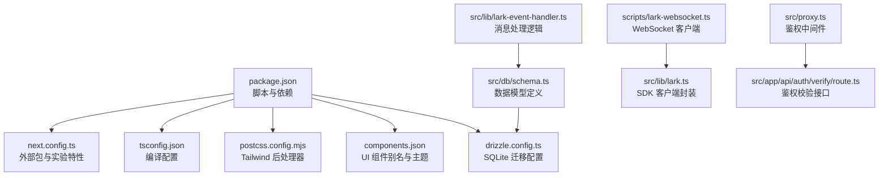
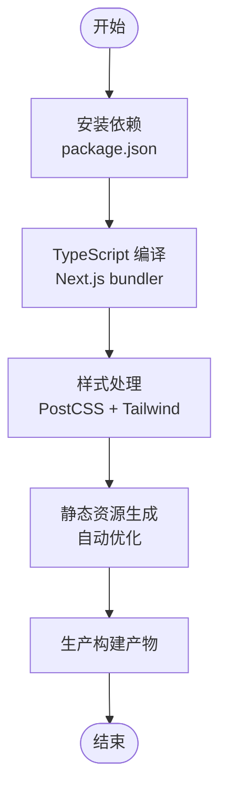
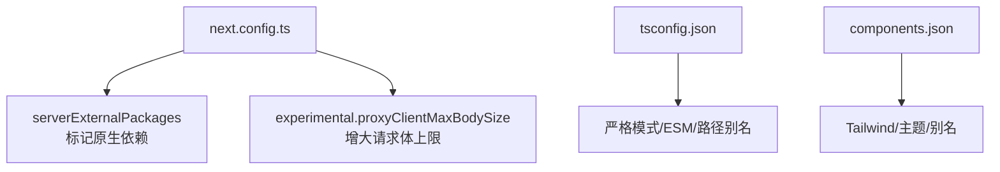
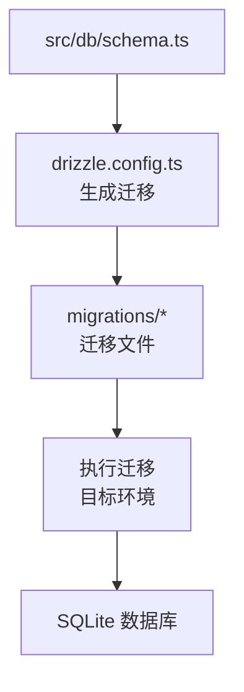
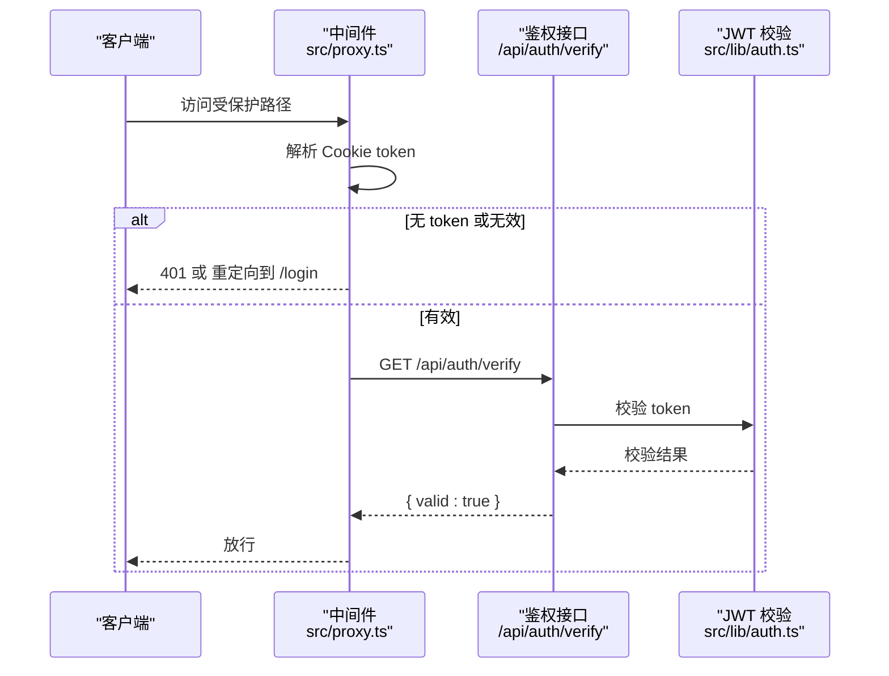
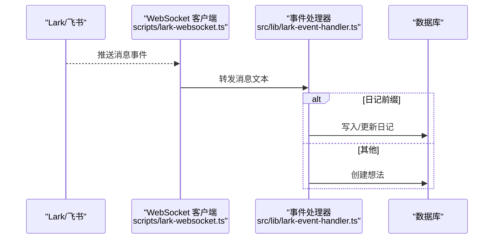
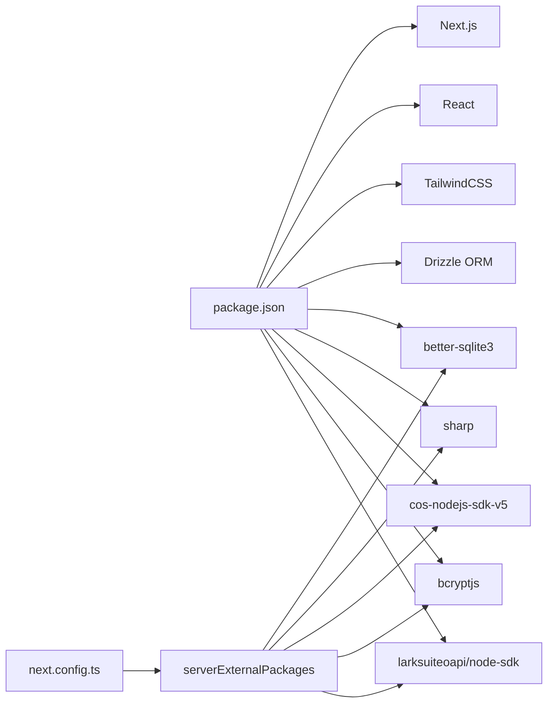

# 构建与部署

<cite>
**本文引用的文件**
- [package.json](file://package.json)
- [next.config.ts](file://next.config.ts)
- [tsconfig.json](file://tsconfig.json)
- [postcss.config.mjs](file://postcss.config.mjs)
- [components.json](file://components.json)
- [drizzle.config.ts](file://drizzle.config.ts)
- [README.md](file://README.md)
- [scripts/lark-websocket.ts](file://scripts/lark-websocket.ts)
- [src/db/schema.ts](file://src/db/schema.ts)
- [src/lib/lark.ts](file://src/lib/lark.ts)
- [src/lib/lark-event-handler.ts](file://src/lib/lark-event-handler.ts)
- [src/proxy.ts](file://src/proxy.ts)
- [src/app/api/auth/verify/route.ts](file://src/app/api/auth/verify/route.ts)
</cite>

## 目录
1. [简介](#简介)
2. [项目结构](#项目结构)
3. [核心组件](#核心组件)
4. [架构总览](#架构总览)
5. [详细组件分析](#详细组件分析)
6. [依赖分析](#依赖分析)
7. [性能考虑](#性能考虑)
8. [故障排查指南](#故障排查指南)
9. [结论](#结论)
10. [附录](#附录)

## 简介
本文件面向运维与开发团队，系统化梳理本项目的构建与部署流程，覆盖以下要点：
- 构建流程：依赖安装、TypeScript 编译、样式与静态资源生成
- 生产构建配置：外部依赖处理、体积与性能优化建议
- 部署选项：传统服务器、云平台（含 Vercel）、容器化
- 自动化与一键部署：脚本与 CI/CD 流程建议
- 数据库迁移与初始化：Drizzle 迁移与 SQLite 初始化
- 部署前后检查清单与验证步骤
- 不同部署场景的配置示例与最佳实践

## 项目结构
本项目基于 Next.js 应用，采用 App Router 结构，前端使用 TailwindCSS 与 shadcn/ui 组件体系，后端接口通过 Next.js 路由实现，数据库采用 Drizzle ORM + SQLite。



**图表来源**
- [package.json:1-119](file://package.json#L1-L119)
- [next.config.ts:1-17](file://next.config.ts#L1-L17)
- [tsconfig.json:1-35](file://tsconfig.json#L1-L35)
- [postcss.config.mjs:1-8](file://postcss.config.mjs#L1-L8)
- [components.json:1-21](file://components.json#L1-L21)
- [drizzle.config.ts:1-8](file://drizzle.config.ts#L1-L8)
- [src/db/schema.ts:1-105](file://src/db/schema.ts#L1-L105)
- [scripts/lark-websocket.ts:1-109](file://scripts/lark-websocket.ts#L1-L109)
- [src/lib/lark.ts:1-96](file://src/lib/lark.ts#L1-L96)
- [src/lib/lark-event-handler.ts:1-126](file://src/lib/lark-event-handler.ts#L1-L126)
- [src/proxy.ts:1-49](file://src/proxy.ts#L1-L49)
- [src/app/api/auth/verify/route.ts:1-6](file://src/app/api/auth/verify/route.ts#L1-L6)

**章节来源**
- [package.json:1-119](file://package.json#L1-L119)
- [next.config.ts:1-17](file://next.config.ts#L1-L17)
- [tsconfig.json:1-35](file://tsconfig.json#L1-L35)
- [postcss.config.mjs:1-8](file://postcss.config.mjs#L1-L8)
- [components.json:1-21](file://components.json#L1-L21)
- [drizzle.config.ts:1-8](file://drizzle.config.ts#L1-L8)
- [src/db/schema.ts:1-105](file://src/db/schema.ts#L1-L105)

## 核心组件
- 构建与打包
  - 使用 Next.js 内置的构建链路，TypeScript 由 Next.js 的 bundler 处理；PostCSS/Tailwind 用于样式处理；静态资源由 Next.js 自动优化。
- 配置文件
  - next.config.ts：声明外部原生依赖，避免被 Next.js 打包器处理；设置代理客户端最大请求体大小。
  - tsconfig.json：严格模式、ESM 分辨、路径别名等。
  - postcss.config.mjs：启用 Tailwind 插件。
  - components.json：shadcn/ui 配置，包含 Tailwind 主题、CSS 变量、别名映射等。
- 数据库与迁移
  - drizzle.config.ts：指定 SQLite 方言、schema 文件与迁移输出目录。
  - src/db/schema.ts：定义用户、文件夹、笔记、附件、想法、标签、日记等表结构。
- 事件与鉴权
  - scripts/lark-websocket.ts：长连接 WebSocket 客户端，用于接收 Lark/飞书 消息。
  - src/lib/lark.ts：Lark SDK 客户端封装与环境变量读取。
  - src/lib/lark-event-handler.ts：消息路由与处理（日记/想法）。
  - src/proxy.ts：统一鉴权中间件，拦截非公开路径并校验 JWT。
  - src/app/api/auth/verify/route.ts：鉴权校验接口，供前端调用确认令牌有效性。

**章节来源**
- [next.config.ts:1-17](file://next.config.ts#L1-L17)
- [tsconfig.json:1-35](file://tsconfig.json#L1-L35)
- [postcss.config.mjs:1-8](file://postcss.config.mjs#L1-L8)
- [components.json:1-21](file://components.json#L1-L21)
- [drizzle.config.ts:1-8](file://drizzle.config.ts#L1-L8)
- [src/db/schema.ts:1-105](file://src/db/schema.ts#L1-L105)
- [scripts/lark-websocket.ts:1-109](file://scripts/lark-websocket.ts#L1-L109)
- [src/lib/lark.ts:1-96](file://src/lib/lark.ts#L1-L96)
- [src/lib/lark-event-handler.ts:1-126](file://src/lib/lark-event-handler.ts#L1-L126)
- [src/proxy.ts:1-49](file://src/proxy.ts#L1-L49)
- [src/app/api/auth/verify/route.ts:1-6](file://src/app/api/auth/verify/route.ts#L1-L6)

## 架构总览
下图展示从浏览器到服务端、数据库与第三方平台的交互关系，以及构建与部署的关键节点。

```mermaid
graph TB
subgraph "客户端"
U["浏览器/移动端"]
end
subgraph "应用层"
N["Next.js 应用"]
MW["鉴权中间件<br/>src/proxy.ts"]
API["API 路由<br/>/api/*"]
AUTH["鉴权校验接口<br/>/api/auth/verify"]
end
subgraph "数据与集成"
DB["SQLite 数据库"]
DR["Drizzle ORM"]
LARK["Lark/飞书 平台"]
WS["WebSocket 客户端<br/>scripts/lark-websocket.ts"]
end
U --> N
N --> MW
MW --> API
API --> AUTH
API --> DR
DR --> DB
LARK <- --> WS
WS --> DR
```

**图表来源**
- [src/proxy.ts:1-49](file://src/proxy.ts#L1-L49)
- [src/app/api/auth/verify/route.ts:1-6](file://src/app/api/auth/verify/route.ts#L1-L6)
- [src/lib/lark-event-handler.ts:1-126](file://src/lib/lark-event-handler.ts#L1-L126)
- [scripts/lark-websocket.ts:1-109](file://scripts/lark-websocket.ts#L1-L109)
- [src/db/schema.ts:1-105](file://src/db/schema.ts#L1-L105)

## 详细组件分析

### 构建与打包流程
- 依赖安装
  - 使用包管理器安装根目录依赖与开发依赖，确保 Drizzle 工具链、TypeScript、Tailwind 等可用。
- TypeScript 编译
  - 通过 Next.js 的 bundler 处理 TS/TSX，tsconfig.json 提供严格模式与路径别名支持。
- 样式与静态资源
  - PostCSS 加载 Tailwind 插件，生成优化后的 CSS；静态资源由 Next.js 自动处理。
- 生产构建
  - Next.js 生成产物包含页面、API、静态资源与自动优化的媒体文件。



**图表来源**
- [package.json:1-119](file://package.json#L1-L119)
- [tsconfig.json:1-35](file://tsconfig.json#L1-L35)
- [postcss.config.mjs:1-8](file://postcss.config.mjs#L1-L8)

**章节来源**
- [package.json:1-119](file://package.json#L1-L119)
- [tsconfig.json:1-35](file://tsconfig.json#L1-L35)
- [postcss.config.mjs:1-8](file://postcss.config.mjs#L1-L8)

### 生产构建配置与优化
- 外部依赖处理
  - next.config.ts 声明 serverExternalPackages，将 better-sqlite3、sharp、cos-nodejs-sdk-v5、bcryptjs、@larksuiteoapi/node-sdk 等标记为外部，避免被 Next.js 打包器处理，降低构建复杂度并减少包体积。
- 实验特性
  - proxyClientMaxBodySize 设置为较大值，满足富文本上传等场景的请求体限制。
- TypeScript 与路径别名
  - tsconfig.json 启用严格模式、ESM 分辨、路径别名，提升类型安全与可维护性。
- 样式与 UI
  - components.json 配置 Tailwind、CSS 变量与别名，确保组件库与主题一致性。



**图表来源**
- [next.config.ts:1-17](file://next.config.ts#L1-L17)
- [tsconfig.json:1-35](file://tsconfig.json#L1-L35)
- [components.json:1-21](file://components.json#L1-L21)

**章节来源**
- [next.config.ts:1-17](file://next.config.ts#L1-L17)
- [tsconfig.json:1-35](file://tsconfig.json#L1-L35)
- [components.json:1-21](file://components.json#L1-L21)

### 数据库迁移与初始化
- 迁移配置
  - drizzle.config.ts 指定 SQLite 方言、schema 路径与迁移输出目录，便于生成与执行迁移。
- 数据模型
  - src/db/schema.ts 定义用户、文件夹、笔记、附件、想法、标签、日记等表，包含主键、外键、默认值与时间戳字段。
- 迁移与初始化流程
  - 生成迁移：使用 Drizzle Kit 工具根据 schema 生成迁移文件。
  - 执行迁移：在目标环境运行迁移，确保数据库结构一致。
  - 初始化数据：如需默认管理员账户或种子数据，可在应用启动时执行初始化逻辑（例如登录路由中创建默认用户）。



**图表来源**
- [drizzle.config.ts:1-8](file://drizzle.config.ts#L1-L8)
- [src/db/schema.ts:1-105](file://src/db/schema.ts#L1-L105)

**章节来源**
- [drizzle.config.ts:1-8](file://drizzle.config.ts#L1-L8)
- [src/db/schema.ts:1-105](file://src/db/schema.ts#L1-L105)

### 鉴权与中间件
- 中间件逻辑
  - src/proxy.ts 对受保护路径进行鉴权：允许公开路径与静态资源；对 API 请求返回 401；对页面重定向至登录页；校验失败时删除无效 token。
- 鉴权接口
  - /api/auth/verify 用于前端主动校验令牌有效性。
- JWT 密钥与过期
  - src/lib/auth.ts 读取环境变量中的密钥与过期时间，生成与验证 JWT。



**图表来源**
- [src/proxy.ts:1-49](file://src/proxy.ts#L1-L49)
- [src/app/api/auth/verify/route.ts:1-6](file://src/app/api/auth/verify/route.ts#L1-L6)
- [src/lib/auth.ts:1-25](file://src/lib/auth.ts#L1-L25)

**章节来源**
- [src/proxy.ts:1-49](file://src/proxy.ts#L1-L49)
- [src/app/api/auth/verify/route.ts:1-6](file://src/app/api/auth/verify/route.ts#L1-L6)
- [src/lib/auth.ts:1-25](file://src/lib/auth.ts#L1-L25)

### Lark 事件处理（WebSocket）
- WebSocket 客户端
  - scripts/lark-websocket.ts 建立与 Lark/飞书 的长连接，注册 im.message.receive_v1 事件处理器。
- 事件过滤与处理
  - src/lib/lark.ts 读取环境变量，支持 Webhook/WebSocket 两种模式；scripts/lark-websocket.ts 仅在 WebSocket 模式下运行。
  - src/lib/lark-event-handler.ts 将消息按前缀路由到日记或想法处理逻辑，并写入数据库。



**图表来源**
- [scripts/lark-websocket.ts:1-109](file://scripts/lark-websocket.ts#L1-L109)
- [src/lib/lark.ts:1-96](file://src/lib/lark.ts#L1-L96)
- [src/lib/lark-event-handler.ts:1-126](file://src/lib/lark-event-handler.ts#L1-L126)
- [src/db/schema.ts:1-105](file://src/db/schema.ts#L1-L105)

**章节来源**
- [scripts/lark-websocket.ts:1-109](file://scripts/lark-websocket.ts#L1-L109)
- [src/lib/lark.ts:1-96](file://src/lib/lark.ts#L1-L96)
- [src/lib/lark-event-handler.ts:1-126](file://src/lib/lark-event-handler.ts#L1-L126)

## 依赖分析
- 构建与运行时依赖
  - Next.js、React、TailwindCSS、shadcn/ui、Plate 编辑器生态、better-sqlite3、sharp、cos-nodejs-sdk-v5、bcryptjs、@larksuiteoapi/node-sdk 等。
- 开发与工具依赖
  - TypeScript、Drizzle Kit、ESLint、Tailwind v4、tsx、dotenv 等。
- 外部包与打包
  - next.config.ts 将若干原生依赖标记为外部，避免被 Next.js 打包器处理，减少构建时间与产物体积。



**图表来源**
- [package.json:1-119](file://package.json#L1-L119)
- [next.config.ts:1-17](file://next.config.ts#L1-L17)

**章节来源**
- [package.json:1-119](file://package.json#L1-L119)
- [next.config.ts:1-17](file://next.config.ts#L1-L17)

## 性能考虑
- 构建阶段
  - 利用 serverExternalPackages 减少打包体积与时间；保持 TypeScript 严格模式以提前发现潜在问题。
- 运行阶段
  - 合理设置代理客户端最大请求体大小，避免大文件上传失败。
  - 使用 Next.js 自带的图片优化与静态资源缓存策略。
- 数据访问
  - SQLite 在单机场景表现良好；若并发较高，建议评估分片或迁移到更合适的数据库。

[本节为通用指导，无需特定文件引用]

## 故障排查指南
- 构建失败
  - 检查 TypeScript 编译配置与路径别名是否正确；确认所有依赖已安装。
- 运行时错误
  - 若出现原生模块相关报错，确认 serverExternalPackages 是否包含对应包。
- 鉴权问题
  - 确认 JWT 密钥与过期时间环境变量已设置；检查中间件对受保护路径的匹配规则。
- Lark/WebSocket
  - 确认 LARK_APP_ID/LARK_APP_SECRET/LARK_ENCRYPT_KEY 等环境变量；WebSocket 模式下需单独运行脚本。

**章节来源**
- [next.config.ts:1-17](file://next.config.ts#L1-L17)
- [src/lib/auth.ts:1-25](file://src/lib/auth.ts#L1-L25)
- [src/proxy.ts:1-49](file://src/proxy.ts#L1-L49)
- [scripts/lark-websocket.ts:1-109](file://scripts/lark-websocket.ts#L1-L109)

## 结论
本项目基于 Next.js 提供了清晰的构建与运行时配置，结合 Drizzle ORM 与 SQLite 实现数据持久化，并通过中间件与鉴权接口保障访问安全。通过合理利用外部依赖声明与生产构建优化，可在多种部署环境中稳定运行。建议在 CI/CD 中加入数据库迁移与静态资源预构建步骤，确保部署一致性与可追溯性。

[本节为总结，无需特定文件引用]

## 附录

### 部署前检查清单
- 环境变量
  - JWT_SECRET/JWT_EXPIRY、LARK_APP_ID/LARK_APP_SECRET/LARK_ENCRYPT_KEY/LARK_ALLOWED_USER_IDS/LARK_EVENT_MODE 等。
- 数据库
  - 确认 SQLite 文件权限与路径；执行 Drizzle 迁移；必要时初始化默认数据。
- 构建产物
  - 本地执行生产构建，检查静态资源与 API 路由可用性。
- 安全
  - 仅暴露必要端口；启用 HTTPS；限制 WebSocket 模式下的用户白名单。

**章节来源**
- [src/lib/lark.ts:1-96](file://src/lib/lark.ts#L1-L96)
- [src/lib/auth.ts:1-25](file://src/lib/auth.ts#L1-L25)
- [drizzle.config.ts:1-8](file://drizzle.config.ts#L1-L8)

### 部署后验证步骤
- 功能验证
  - 登录鉴权、API 调用、静态资源加载、富文本编辑与导出。
- 数据验证
  - 写入一条日记/想法，确认数据库写入与查询正常。
- 事件验证（WebSocket）
  - 发送测试消息，确认事件被正确路由与处理。

**章节来源**
- [src/app/api/auth/verify/route.ts:1-6](file://src/app/api/auth/verify/route.ts#L1-L6)
- [src/lib/lark-event-handler.ts:1-126](file://src/lib/lark-event-handler.ts#L1-L126)

### 部署场景与最佳实践
- 传统服务器部署
  - 使用 PM2/Nginx 管理进程与反向代理；将 SQLite 存储置于持久化卷；设置环境变量与日志轮转。
- 云平台部署（含 Vercel）
  - 参考官方 Next.js 部署文档；注意 serverExternalPackages 的兼容性；将数据库与对象存储置于云服务。
- 容器化部署
  - Dockerfile 中安装原生依赖；将 SQLite 文件映射到持久化卷；通过环境变量注入密钥与平台凭据。

[本节为通用指导，无需特定文件引用]

### 一键部署脚本与自动化建议
- 本地构建与推送
  - 在 CI 中执行安装依赖、TypeScript 编译、静态资源生成与迁移；将构建产物推送到目标环境。
- 数据库迁移
  - 在部署前置入迁移脚本，确保数据库结构一致。
- 健康检查
  - 部署完成后调用鉴权接口与首页，确认服务可用。

[本节为通用指导，无需特定文件引用]