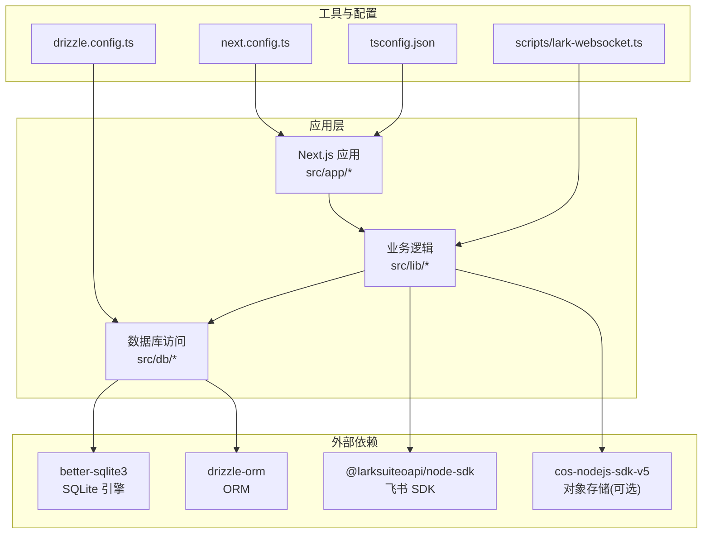
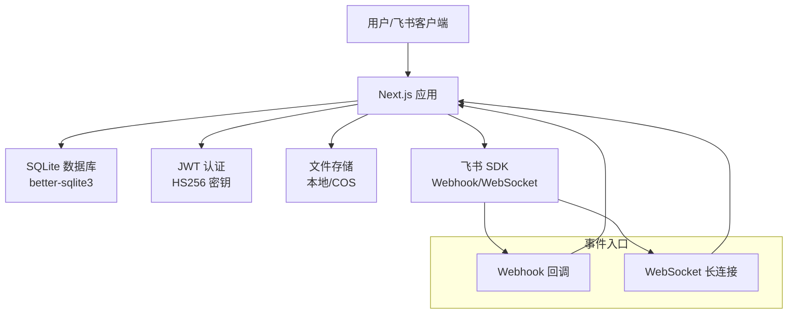
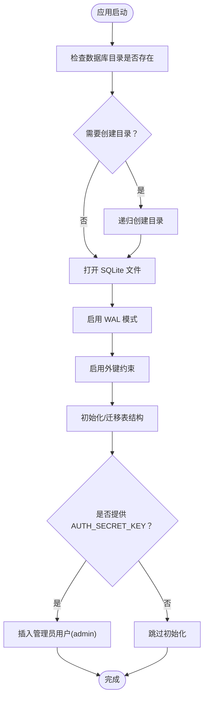
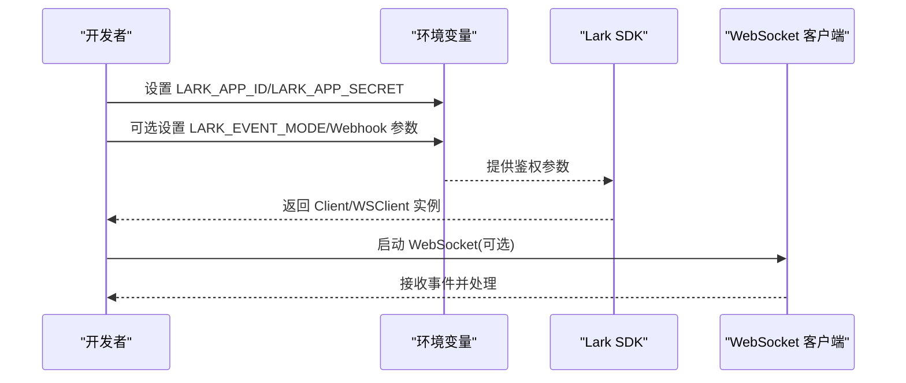
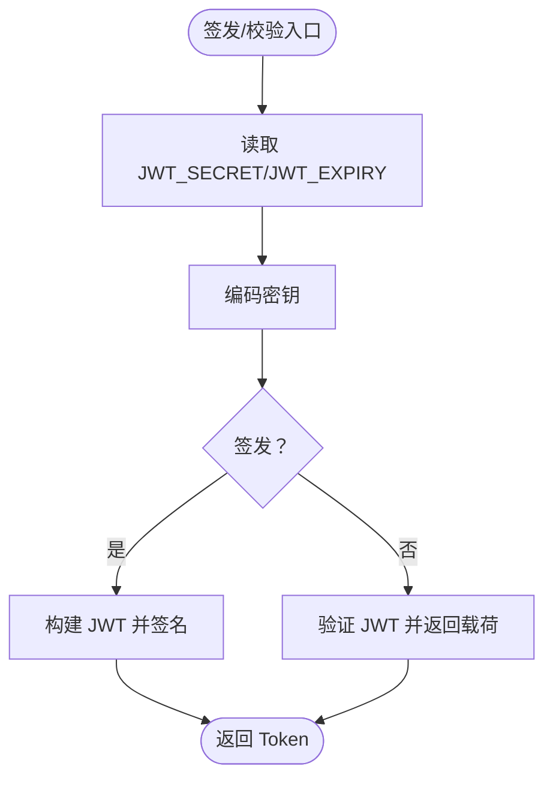
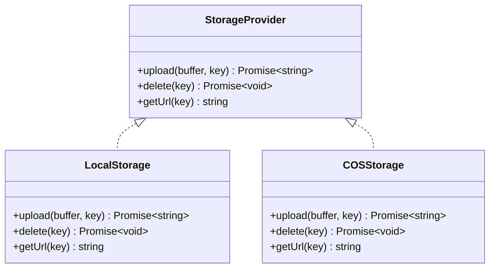
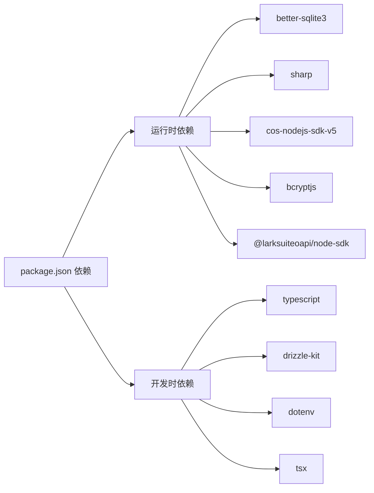

# 环境准备与配置

<cite>
**本文引用的文件**
- [package.json](file://package.json)
- [README.md](file://README.md)
- [drizzle.config.ts](file://drizzle.config.ts)
- [next.config.ts](file://next.config.ts)
- [tsconfig.json](file://tsconfig.json)
- [src/db/index.ts](file://src/db/index.ts)
- [src/lib/lark.ts](file://src/lib/lark.ts)
- [src/lib/auth.ts](file://src/lib/auth.ts)
- [src/lib/storage/index.ts](file://src/lib/storage/index.ts)
- [src/lib/storage/local.ts](file://src/lib/storage/local.ts)
- [src/lib/storage/cos.ts](file://src/lib/storage/cos.ts)
- [scripts/lark-websocket.ts](file://scripts/lark-websocket.ts)
</cite>

## 目录
1. [简介](#简介)
2. [项目结构](#项目结构)
3. [核心组件](#核心组件)
4. [架构总览](#架构总览)
5. [详细组件分析](#详细组件分析)
6. [依赖关系分析](#依赖关系分析)
7. [性能考虑](#性能考虑)
8. [故障排查指南](#故障排查指南)
9. [结论](#结论)
10. [附录](#附录)

## 简介
本文件面向生产环境部署与运维人员，系统性说明本项目的环境准备与配置要求，涵盖硬件与软件基础、操作系统兼容性、内存需求、环境变量清单、数据库与飞书 API 的配置要点、以及在 VPS、云服务器与 Docker 平台上的部署准备步骤。同时提供最佳实践与安全建议，帮助您稳定、安全地运行服务。

## 项目结构
本项目基于 Next.js 应用，采用 TypeScript 开发，使用 Drizzle ORM + better-sqlite3 作为本地数据库方案，并通过 @larksuiteoapi/node-sdk 集成飞书/多维表格事件能力。脚本目录提供独立的 WebSocket 客户端用于接收飞书消息，无需公网 Webhook。

图表来源
- [next.config.ts:1-17](file://next.config.ts#L1-L17)
- [drizzle.config.ts:1-8](file://drizzle.config.ts#L1-L8)
- [src/db/index.ts:1-171](file://src/db/index.ts#L1-L171)
- [src/lib/lark.ts:1-96](file://src/lib/lark.ts#L1-L96)
- [src/lib/storage/index.ts:1-29](file://src/lib/storage/index.ts#L1-L29)
- [scripts/lark-websocket.ts:1-109](file://scripts/lark-websocket.ts#L1-L109)

章节来源
- [package.json:1-119](file://package.json#L1-L119)
- [next.config.ts:1-17](file://next.config.ts#L1-L17)
- [drizzle.config.ts:1-8](file://drizzle.config.ts#L1-L8)
- [tsconfig.json:1-35](file://tsconfig.json#L1-L35)

## 核心组件
- 数据库与迁移：使用 SQLite（better-sqlite3），通过 Drizzle ORM 管理模式与索引；支持自动初始化与迁移。
- 飞书集成：提供 Webhook 与 WebSocket 两种事件接入方式，支持加密解密、用户白名单过滤等。
- 认证与令牌：基于 HS256 的 JWT，密钥与过期时间由环境变量控制。
- 存储：支持本地存储与腾讯云 COS，按环境变量自动切换。
- 构建与打包：Next.js 配置声明外部依赖，提升运行时兼容性。

章节来源
- [src/db/index.ts:1-171](file://src/db/index.ts#L1-L171)
- [src/lib/lark.ts:1-96](file://src/lib/lark.ts#L1-L96)
- [src/lib/auth.ts:1-26](file://src/lib/auth.ts#L1-L26)
- [src/lib/storage/index.ts:1-29](file://src/lib/storage/index.ts#L1-L29)
- [next.config.ts:1-17](file://next.config.ts#L1-L17)

## 架构总览
下图展示生产环境中的关键组件与数据流：应用通过 Drizzle 访问 SQLite；飞书事件可通过 Webhook 或 WebSocket 进入应用；认证使用 JWT；文件上传可落盘或上云。

图表来源
- [src/db/index.ts:1-171](file://src/db/index.ts#L1-L171)
- [src/lib/auth.ts:1-26](file://src/lib/auth.ts#L1-L26)
- [src/lib/storage/index.ts:1-29](file://src/lib/storage/index.ts#L1-L29)
- [src/lib/lark.ts:1-96](file://src/lib/lark.ts#L1-L96)

## 详细组件分析

### 数据库与迁移（SQLite）
- 数据库引擎：better-sqlite3
- ORM：drizzle-orm
- 模式与索引：通过 Drizzle Schema 定义，启动时自动创建表与索引
- 初始化与迁移：首次启动执行初始化 SQL；支持为现有表新增列并回填默认值
- 用户初始化：当提供 AUTH_SECRET_KEY 时，自动创建管理员账户（ID 固定为 admin）

图表来源
- [src/db/index.ts:8-25](file://src/db/index.ts#L8-L25)
- [src/db/index.ts:27-158](file://src/db/index.ts#L27-L158)

章节来源
- [drizzle.config.ts:1-8](file://drizzle.config.ts#L1-L8)
- [src/db/index.ts:1-171](file://src/db/index.ts#L1-L171)

### 飞书 API 配置
- 必需参数：LARK_APP_ID、LARK_APP_SECRET
- 可选增强：LARK_VERIFICATION_TOKEN、LARK_ENCRYPT_KEY、LARK_ALLOWED_USER_IDS、LARK_FOLDER_TOKEN、LARK_EVENT_MODE
- 事件模式：默认 Webhook；设置 LARK_EVENT_MODE=websocket 切换到 WebSocket
- WebSocket 客户端：独立脚本 scripts/lark-websocket.ts 支持长连接与消息处理

图表来源
- [src/lib/lark.ts:8-27](file://src/lib/lark.ts#L8-L27)
- [src/lib/lark.ts:47-57](file://src/lib/lark.ts#L47-L57)
- [scripts/lark-websocket.ts:24-32](file://scripts/lark-websocket.ts#L24-L32)

章节来源
- [src/lib/lark.ts:1-96](file://src/lib/lark.ts#L1-L96)
- [scripts/lark-websocket.ts:1-109](file://scripts/lark-websocket.ts#L1-L109)

### 认证与令牌（JWT）
- HS256 对称密钥：从 JWT_SECRET 获取；未设置时使用默认值（不适用于生产）
- 过期时间：从 JWT_EXPIRY 获取，默认 7 天
- 使用场景：登录签发与校验

图表来源
- [src/lib/auth.ts:3-8](file://src/lib/auth.ts#L3-L8)
- [src/lib/auth.ts:10-25](file://src/lib/auth.ts#L10-L25)

章节来源
- [src/lib/auth.ts:1-26](file://src/lib/auth.ts#L1-L26)

### 文件存储（本地/COS）
- 自动选择策略：若提供 COS_* 环境变量则使用 COS，否则使用本地存储
- 本地存储：统一上传目录 data/uploads，提供上传、删除、URL 生成
- COS 存储：使用腾讯云 COS SDK，上传前缀 ynote/

图表来源
- [src/lib/storage/index.ts:1-29](file://src/lib/storage/index.ts#L1-L29)
- [src/lib/storage/local.ts:1-29](file://src/lib/storage/local.ts#L1-L29)
- [src/lib/storage/cos.ts:1-62](file://src/lib/storage/cos.ts#L1-L62)

章节来源
- [src/lib/storage/index.ts:1-29](file://src/lib/storage/index.ts#L1-L29)
- [src/lib/storage/local.ts:1-29](file://src/lib/storage/local.ts#L1-L29)
- [src/lib/storage/cos.ts:1-62](file://src/lib/storage/cos.ts#L1-L62)

## 依赖关系分析
- 运行时外部依赖：better-sqlite3、sharp、cos-nodejs-sdk-v5、bcryptjs、@larksuiteoapi/node-sdk
- 构建时依赖：TypeScript、Drizzle Kit、dotenv、tsx 等
- Next.js 配置声明外部包，避免打包体积与兼容性问题

图表来源
- [package.json:13-99](file://package.json#L13-L99)
- [package.json:101-117](file://package.json#L101-L117)
- [next.config.ts:4-10](file://next.config.ts#L4-L10)

章节来源
- [package.json:1-119](file://package.json#L1-L119)
- [next.config.ts:1-17](file://next.config.ts#L1-L17)

## 性能考虑
- SQLite 适合中小规模写入与查询；如需高并发写入或跨节点共享，建议迁移到关系型数据库并配合连接池。
- WAL 模式已启用，有助于提升并发读取性能。
- 文件上传建议使用 COS，以减轻本地磁盘压力与 IO 峰值。
- Next.js 外部依赖配置减少打包体积，提升冷启动速度。

## 故障排查指南
- 飞书事件未到达
  - 确认 LARK_APP_ID 与 LARK_APP_SECRET 已正确设置
  - 若使用 WebSocket，确认 LARK_EVENT_MODE=websocket 且 scripts/lark-websocket.ts 正常运行
  - 检查 LARK_ALLOWED_USER_IDS 是否误过滤了发送者
- JWT 登录失败
  - 确认 JWT_SECRET 已设置且与签发端一致
  - 检查 JWT_EXPIRY 是否合理
- 数据库无法初始化
  - 检查 DATABASE_PATH 所指向目录权限
  - 确认 SQLite 文件可写
- 文件上传失败
  - 若使用 COS，检查 COS_SECRET_ID/KEY、COS_BUCKET、COS_REGION 是否齐全
  - 若使用本地存储，检查 data/uploads 目录权限

章节来源
- [src/lib/lark.ts:8-27](file://src/lib/lark.ts#L8-L27)
- [scripts/lark-websocket.ts:24-32](file://scripts/lark-websocket.ts#L24-L32)
- [src/lib/auth.ts:3-8](file://src/lib/auth.ts#L3-L8)
- [src/db/index.ts:8-25](file://src/db/index.ts#L8-L25)
- [src/lib/storage/index.ts:15-26](file://src/lib/storage/index.ts#L15-L26)

## 结论
本项目在本地 SQLite 与 Next.js 生态基础上，提供了完整的飞书事件接入能力与认证机制。生产部署的关键在于：正确配置环境变量、确保数据库目录权限、选择合适的存储后端，并根据场景选择 Webhook 或 WebSocket 事件模式。遵循本文档的准备步骤与最佳实践，可显著降低部署与运维风险。

## 附录

### 硬件与软件要求
- Node.js：推荐使用长期支持版本（LTS），具体版本请参考项目依赖中 Next.js 的 Node 兼容范围。
- 操作系统：Linux（推荐 Ubuntu/Debian/CentOS）、macOS、Windows（WSL2）均可。
- 内存：建议至少 1GB RAM，用于 SQLite 与 Next.js 进程；高并发场景建议 2GB+。
- 存储：SQLite 文件与上传目录需具备充足空间与写权限。

章节来源
- [package.json:72-72](file://package.json#L72-L72)
- [next.config.ts:1-17](file://next.config.ts#L1-L17)

### 环境变量清单与说明
- 数据库相关
  - DATABASE_PATH：SQLite 文件绝对或相对路径，默认 ./data/ynote.db
- 飞书相关
  - LARK_APP_ID：自建应用 App ID
  - LARK_APP_SECRET：自建应用 App Secret
  - LARK_VERIFICATION_TOKEN：Webhook 验证 Token（可选）
  - LARK_ENCRYPT_KEY：消息加密密钥（可选）
  - LARK_ALLOWED_USER_IDS：允许的用户 Open ID 列表（逗号分隔，可选）
  - LARK_FOLDER_TOKEN：文档库 Token（可选）
  - LARK_EVENT_MODE：事件模式，"websocket" 或 "webhook"，默认 webhook
- 认证相关
  - JWT_SECRET：JWT HS256 密钥（必须，生产环境务必替换默认值）
  - JWT_EXPIRY：JWT 过期时间（例如 7d、24h），默认 7 天
  - AUTH_SECRET_KEY：初始化管理员账户密码哈希的密钥（可选）
- 存储相关（二选一）
  - 本地存储：无需额外配置，文件保存至 data/uploads
  - 腾讯云 COS：COS_SECRET_ID、COS_SECRET_KEY、COS_BUCKET、COS_REGION
- 其他
  - NEXT_PUBLIC_LARK_APP_ID：前端可访问的 App ID（可选）

章节来源
- [src/db/index.ts:8-8](file://src/db/index.ts#L8-L8)
- [src/lib/lark.ts:10-45](file://src/lib/lark.ts#L10-L45)
- [src/lib/lark.ts:51-64](file://src/lib/lark.ts#L51-L64)
- [src/lib/auth.ts:3-4](file://src/lib/auth.ts#L3-L4)
- [src/lib/storage/index.ts:15-26](file://src/lib/storage/index.ts#L15-L26)

### 部署平台准备步骤

- VPS/云服务器
  1) 安装 Node.js（建议使用 LTS 版本）
  2) 准备数据库目录与文件权限（DATABASE_PATH 指向的目录）
  3) 配置环境变量（见“环境变量清单”）
  4) 安装依赖并构建：安装依赖后执行构建命令
  5) 启动应用：使用 pm2 或 systemd 管理进程
  6) 如需飞书 WebSocket：设置 LARK_EVENT_MODE=websocket 并运行独立脚本

- Docker
  1) 编写 Dockerfile 与 docker-compose.yml，挂载数据卷至数据库与上传目录
  2) 在容器内设置环境变量（推荐使用 .env 文件或编排工具注入）
  3) 构建镜像并启动容器
  4) 如需 WebSocket：单独启动一个容器运行 scripts/lark-websocket.ts

- 部署注意事项
  - 将敏感信息（如 JWT_SECRET、LARK_APP_ID/SECRET、COS 凭证）放入受控的密钥管理或环境变量管理器
  - 限制数据库与上传目录的文件权限，仅给运行用户读写
  - 使用反向代理（Nginx/Traefik）暴露 HTTPS 与静态资源
  - 对外开放的 Webhook URL 需要稳定的域名与证书

章节来源
- [package.json:5-11](file://package.json#L5-L11)
- [src/db/index.ts:8-8](file://src/db/index.ts#L8-L8)
- [src/lib/lark.ts:51-57](file://src/lib/lark.ts#L51-L57)
- [scripts/lark-websocket.ts:8-10](file://scripts/lark-websocket.ts#L8-L10)