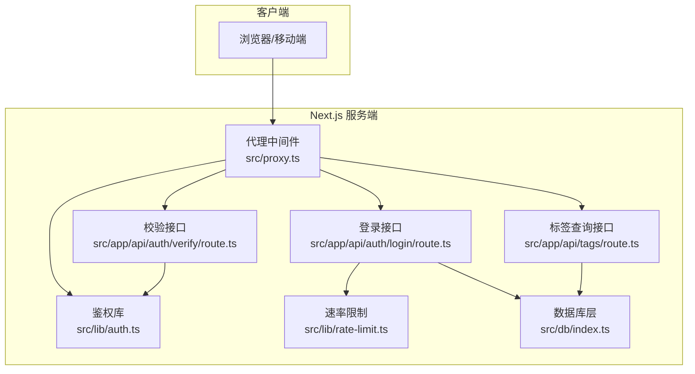
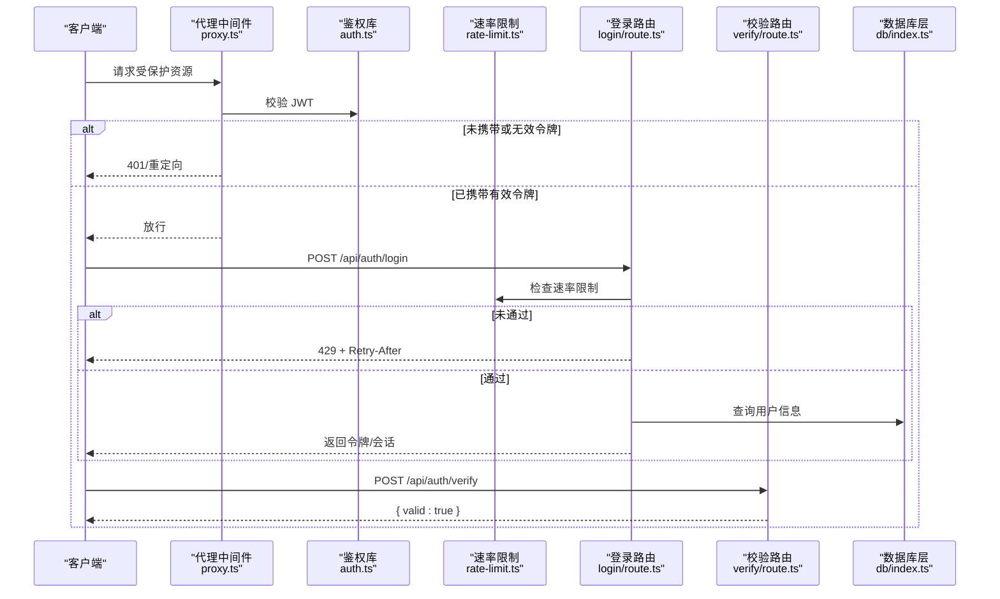
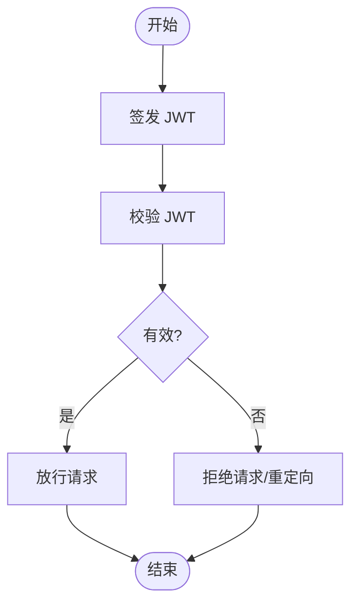
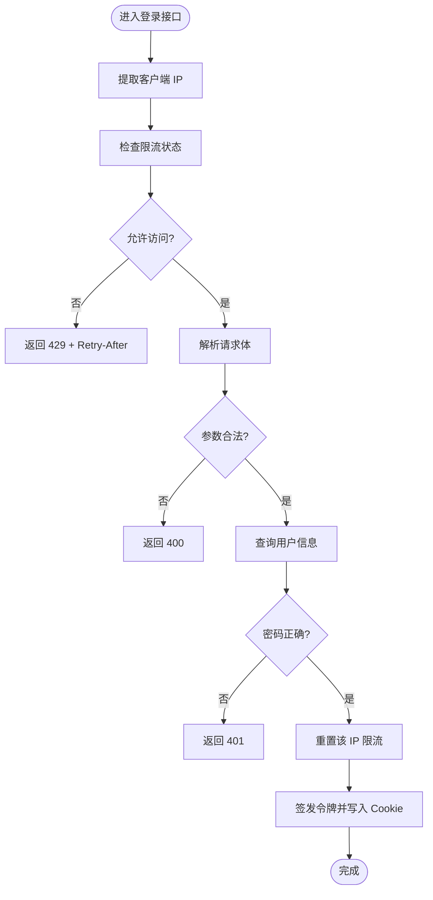
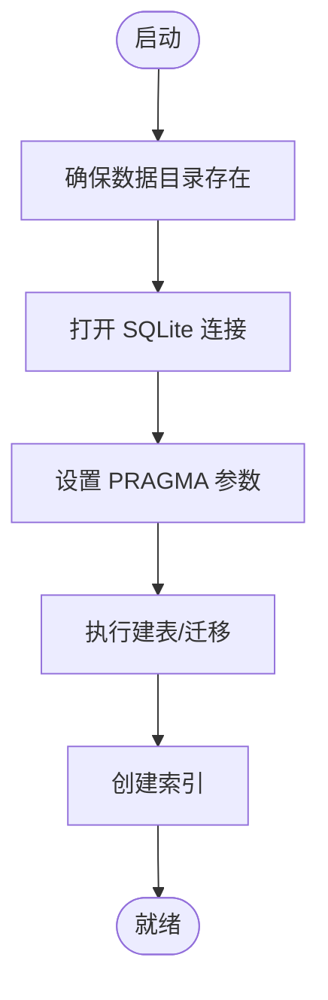
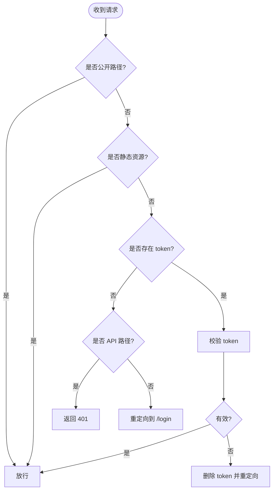
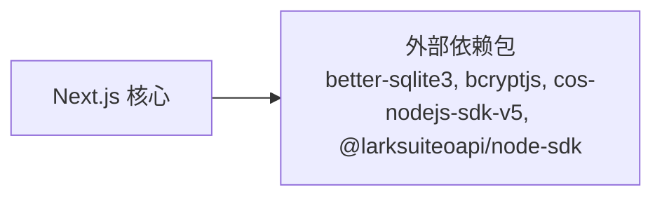

# 监控与日志

<cite>
**本文引用的文件**
- [next.config.ts](file://next.config.ts)
- [package.json](file://package.json)
- [src/db/index.ts](file://src/db/index.ts)
- [src/db/schema.ts](file://src/db/schema.ts)
- [drizzle.config.ts](file://drizzle.config.ts)
- [src/lib/rate-limit.ts](file://src/lib/rate-limit.ts)
- [src/lib/auth.ts](file://src/lib/auth.ts)
- [src/proxy.ts](file://src/proxy.ts)
- [src/app/api/auth/login/route.ts](file://src/app/api/auth/login/route.ts)
- [src/app/api/auth/verify/route.ts](file://src/app/api/auth/verify/route.ts)
- [src/app/api/tags/route.ts](file://src/app/api/tags/route.ts)
</cite>

## 目录
1. [简介](#简介)
2. [项目结构](#项目结构)
3. [核心组件](#核心组件)
4. [架构总览](#架构总览)
5. [详细组件分析](#详细组件分析)
6. [依赖关系分析](#依赖关系分析)
7. [性能考虑](#性能考虑)
8. [故障排查指南](#故障排查指南)
9. [结论](#结论)
10. [附录](#附录)

## 简介
本文件面向运维与开发团队，系统化说明本项目的监控与日志配置现状与可扩展方案。当前仓库未内置应用性能监控（APM）或第三方监控工具集成；亦未实现统一的日志级别、输出格式与存储策略。本文在不改变现有代码的前提下，提供基于 Next.js 内置能力与现有业务逻辑的监控与日志建议，并给出错误追踪、健康检查、性能指标采集、告警与通知、日志轮转与清理、以及监控仪表板的落地指引。

## 项目结构
- Next.js 应用通过中间件与路由层实现鉴权与访问控制，数据库使用 better-sqlite3 与 Drizzle ORM。
- 关键路径：认证与速率限制位于 lib 层；代理中间件负责拦截与校验；API 路由处理业务请求并进行错误捕获与返回。
- 项目未发现专门的日志配置文件或统一日志库接入。

图表来源
- [src/proxy.ts:1-50](file://src/proxy.ts#L1-L50)
- [src/lib/auth.ts:1-26](file://src/lib/auth.ts#L1-L26)
- [src/lib/rate-limit.ts:1-40](file://src/lib/rate-limit.ts#L1-L40)
- [src/app/api/auth/login/route.ts:1-63](file://src/app/api/auth/login/route.ts#L1-L63)
- [src/app/api/auth/verify/route.ts:1-7](file://src/app/api/auth/verify/route.ts#L1-L7)
- [src/app/api/tags/route.ts:1-27](file://src/app/api/tags/route.ts#L1-L27)
- [src/db/index.ts:1-171](file://src/db/index.ts#L1-L171)

章节来源
- [next.config.ts:1-17](file://next.config.ts#L1-L17)
- [package.json:1-119](file://package.json#L1-L119)

## 核心组件
- 鉴权与令牌验证：基于 HS256 的 JWT 签发与校验，支持过期时间配置。
- 速率限制：基于内存 Map 的滑动窗口限流，周期性清理过期条目。
- 数据库初始化与迁移：better-sqlite3 + Drizzle ORM，自动建表与迁移。
- 中间件代理：对受保护路径进行访问控制，未授权时返回 401 或重定向至登录页。
- API 错误处理：在路由中捕获异常并返回标准化错误响应。

章节来源
- [src/lib/auth.ts:1-26](file://src/lib/auth.ts#L1-L26)
- [src/lib/rate-limit.ts:1-40](file://src/lib/rate-limit.ts#L1-L40)
- [src/db/index.ts:1-171](file://src/db/index.ts#L1-L171)
- [src/proxy.ts:1-50](file://src/proxy.ts#L1-L50)
- [src/app/api/auth/login/route.ts:1-63](file://src/app/api/auth/login/route.ts#L1-L63)
- [src/app/api/auth/verify/route.ts:1-7](file://src/app/api/auth/verify/route.ts#L1-L7)
- [src/app/api/tags/route.ts:1-27](file://src/app/api/tags/route.ts#L1-L27)

## 架构总览
下图展示从客户端到数据库的关键调用链路，标注了鉴权、速率限制与错误处理位置，便于后续扩展监控埋点与日志采集。

图表来源
- [src/proxy.ts:1-50](file://src/proxy.ts#L1-L50)
- [src/lib/auth.ts:1-26](file://src/lib/auth.ts#L1-L26)
- [src/lib/rate-limit.ts:1-40](file://src/lib/rate-limit.ts#L1-L40)
- [src/app/api/auth/login/route.ts:1-63](file://src/app/api/auth/login/route.ts#L1-L63)
- [src/app/api/auth/verify/route.ts:1-7](file://src/app/api/auth/verify/route.ts#L1-L7)
- [src/db/index.ts:1-171](file://src/db/index.ts#L1-L171)

## 详细组件分析

### 鉴权与令牌管理
- 使用 HS256 对称加密签发 JWT，默认过期时间可配置。
- 校验失败时返回无效状态，配合代理中间件进行统一处理。
- 建议在令牌签发与校验处增加埋点，记录成功/失败计数与耗时。

图表来源
- [src/lib/auth.ts:10-25](file://src/lib/auth.ts#L10-L25)

章节来源
- [src/lib/auth.ts:1-26](file://src/lib/auth.ts#L1-L26)
- [src/proxy.ts:24-44](file://src/proxy.ts#L24-L44)

### 速率限制（滑动窗口）
- 基于内存 Map 维护每个 IP 的计数与重置时间，定期清理过期条目。
- 登录接口在请求体解析前执行限流判断，未通过时返回 429 并附带 Retry-After 头。
- 建议扩展：将 Map 替换为 Redis，以支持多实例共享；增加指标上报与告警。

图表来源
- [src/lib/rate-limit.ts:21-36](file://src/lib/rate-limit.ts#L21-L36)
- [src/app/api/auth/login/route.ts:9-62](file://src/app/api/auth/login/route.ts#L9-L62)

章节来源
- [src/lib/rate-limit.ts:1-40](file://src/lib/rate-limit.ts#L1-L40)
- [src/app/api/auth/login/route.ts:1-63](file://src/app/api/auth/login/route.ts#L1-L63)

### 数据库初始化与迁移
- 启动时确保目录存在并创建 WAL 模式与外键约束。
- 自动创建表结构与索引，并执行迁移（如新增字段）。
- 建议：在初始化前后记录事件日志，便于排障与审计。

图表来源
- [src/db/index.ts:10-25](file://src/db/index.ts#L10-L25)
- [src/db/index.ts:27-158](file://src/db/index.ts#L27-L158)

章节来源
- [src/db/index.ts:1-171](file://src/db/index.ts#L1-L171)
- [drizzle.config.ts:1-8](file://drizzle.config.ts#L1-L8)
- [src/db/schema.ts:1-105](file://src/db/schema.ts#L1-L105)

### 中间件代理与访问控制
- 对受保护路径进行拦截，未携带有效令牌时返回 401 或重定向。
- 允许静态资源与特定公开路径直接通过。
- 建议：在代理层增加访问统计与异常计数，便于识别攻击与异常流量。

图表来源
- [src/proxy.ts:7-45](file://src/proxy.ts#L7-L45)

章节来源
- [src/proxy.ts:1-50](file://src/proxy.ts#L1-L50)

### API 错误处理与日志
- 登录接口对参数与数据库查询进行 try/catch，返回标准化错误码。
- 标签查询接口捕获异常并记录错误日志，返回 500。
- 建议：引入统一日志库，规范日志级别、上下文与输出格式；对敏感信息脱敏。

章节来源
- [src/app/api/auth/login/route.ts:27-61](file://src/app/api/auth/login/route.ts#L27-L61)
- [src/app/api/tags/route.ts:23-26](file://src/app/api/tags/route.ts#L23-L26)

## 依赖关系分析
- Next.js 配置声明外部依赖包，影响构建与运行环境。
- 项目依赖包含 better-sqlite3、bcryptjs、cos-nodejs-sdk-v5、@larksuiteoapi/node-sdk 等，这些组件可作为监控与日志扩展的切入点（例如 SDK 提供的事件回调或日志钩子）。

图表来源
- [next.config.ts:4-10](file://next.config.ts#L4-L10)
- [package.json:13-99](file://package.json#L13-L99)

章节来源
- [next.config.ts:1-17](file://next.config.ts#L1-L17)
- [package.json:1-119](file://package.json#L1-L119)

## 性能考虑
- 速率限制采用内存 Map，单实例有效；多实例部署需替换为分布式缓存（如 Redis）以保证全局一致性。
- 数据库使用 WAL 模式与外键约束，有助于提升并发读写与数据一致性，但需关注磁盘 I/O 与锁竞争。
- 建议：在登录、校验与标签查询等热点接口埋点，采集 QPS、P95/P99 延迟、错误率与数据库慢查询；结合代理层访问统计，形成全链路性能画像。

## 故障排查指南
- 认证失败
  - 检查 JWT 密钥与过期时间配置是否一致。
  - 查看代理中间件对 token 的校验结果与返回状态。
- 登录频繁 429
  - 检查速率限制窗口与最大尝试次数，确认客户端是否触发限流。
  - 观察清理定时器是否正常运行，避免内存泄漏。
- 数据库初始化失败
  - 确认数据目录权限与路径变量，检查 WAL 与外键 PRAGMA 设置。
- API 异常
  - 在路由层捕获异常并记录错误日志，定位具体 SQL 与参数。

章节来源
- [src/lib/auth.ts:3-4](file://src/lib/auth.ts#L3-L4)
- [src/lib/rate-limit.ts:11-19](file://src/lib/rate-limit.ts#L11-L19)
- [src/db/index.ts:8-17](file://src/db/index.ts#L8-L17)
- [src/app/api/auth/login/route.ts:59-61](file://src/app/api/auth/login/route.ts#L59-L61)
- [src/app/api/tags/route.ts:23-26](file://src/app/api/tags/route.ts#L23-L26)

## 结论
当前项目具备基础的鉴权、速率限制与数据库初始化能力，但尚未实现系统化的监控与日志体系。建议按“基础设施—中间件—路由—数据库”分层逐步引入埋点、日志与指标上报，并配套健康检查端点与告警策略，最终形成可观测性闭环。

## 附录

### 监控与日志配置建议（概念性）
- 日志级别与格式
  - 建议采用结构化日志（JSON），包含时间戳、级别、模块、请求 ID、路径、耗时、状态码、错误信息等字段。
- 输出与存储
  - 开发环境输出到标准输出；生产环境输出到集中式日志系统（如 ELK、Loki）并持久化归档。
- 错误追踪与异常报告
  - 在路由层与数据库层增加错误捕获与上报，区分业务异常与系统异常；对高频错误触发告警。
- 健康检查端点
  - 新增 /health 探针，返回应用状态、数据库连通性与关键依赖健康状况。
- 性能指标采集
  - 在代理中间件与关键 API 路由埋点，采集 QPS、延迟、错误率、数据库慢查询等指标。
- 告警与通知
  - 基于阈值与趋势规则触发告警，对接企业微信、飞书或邮件通知。
- 日志轮转与清理
  - 使用 logrotate 或容器侧日志驱动进行按大小/时间轮转，保留策略按法规与容量设定。
- 仪表板设置与维护
  - 使用 Grafana/可视化平台创建仪表板，聚合指标并定期回顾优化。

[本节为通用实践指导，不直接分析具体源码文件，故无章节来源]