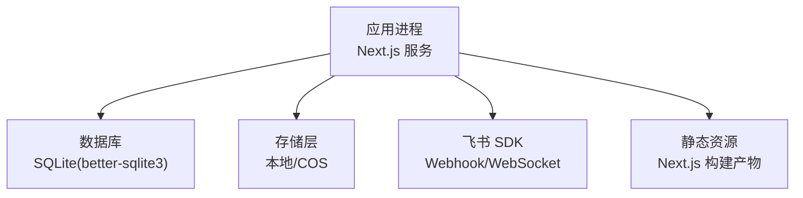
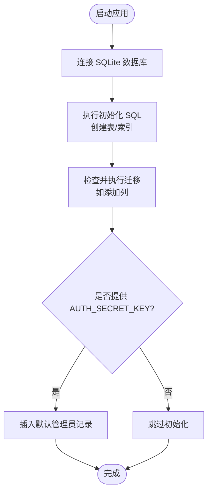
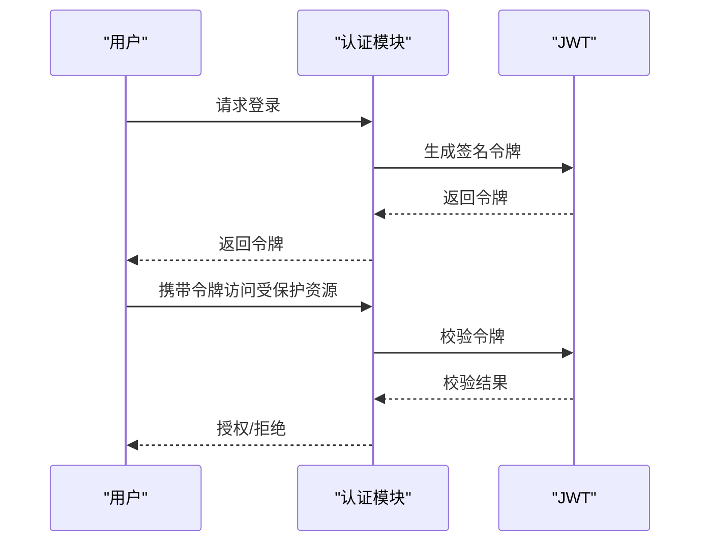
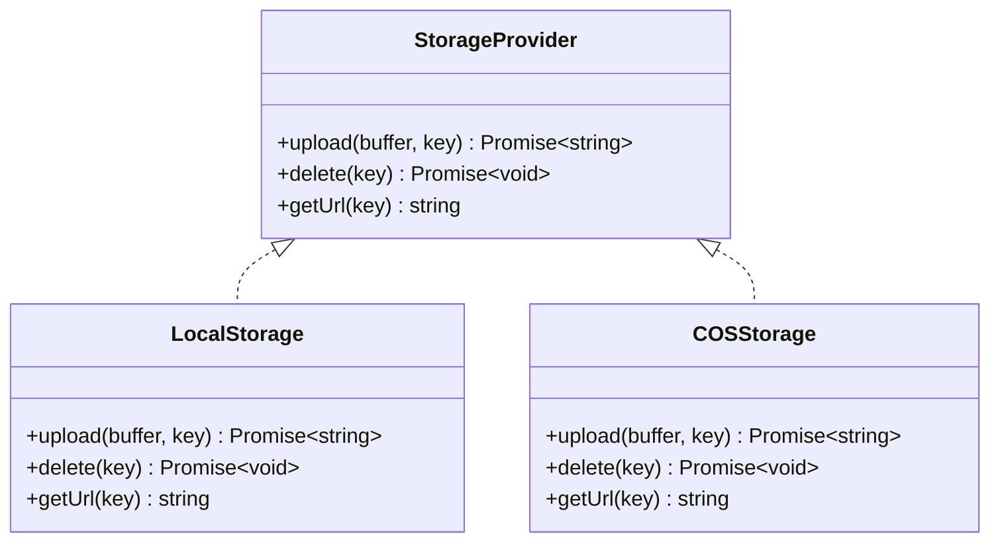
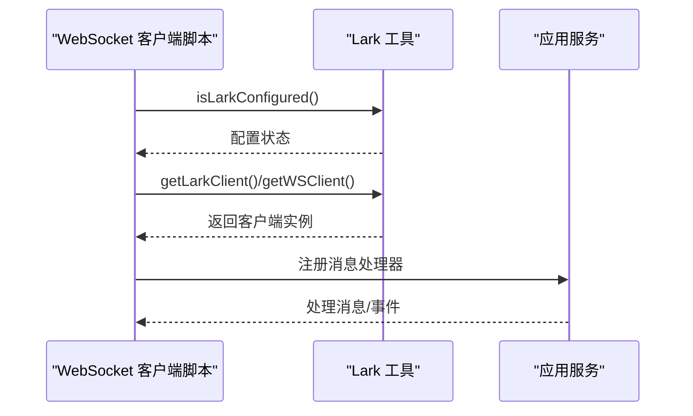
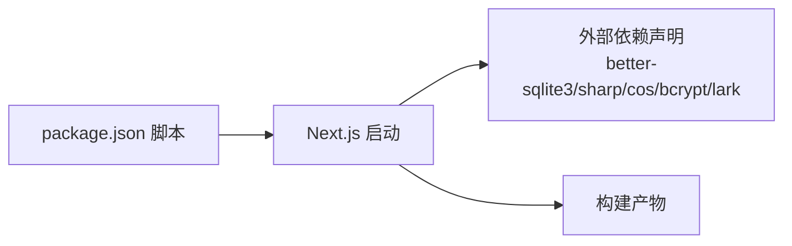

# 部署指南

<cite>
**本文引用的文件**
- [package.json](file://package.json)
- [README.md](file://README.md)
- [drizzle.config.ts](file://drizzle.config.ts)
- [next.config.ts](file://next.config.ts)
- [src/db/schema.ts](file://src/db/schema.ts)
- [src/db/index.ts](file://src/db/index.ts)
- [src/lib/lark.ts](file://src/lib/lark.ts)
- [src/lib/auth.ts](file://src/lib/auth.ts)
- [src/lib/storage/index.ts](file://src/lib/storage/index.ts)
- [src/lib/storage/local.ts](file://src/lib/storage/local.ts)
- [src/lib/storage/cos.ts](file://src/lib/storage/cos.ts)
- [scripts/lark-websocket.ts](file://scripts/lark-websocket.ts)
</cite>

## 目录
1. [简介](#简介)
2. [项目结构](#项目结构)
3. [核心组件](#核心组件)
4. [架构总览](#架构总览)
5. [详细组件分析](#详细组件分析)
6. [依赖关系分析](#依赖关系分析)
7. [性能考量](#性能考量)
8. [故障排查指南](#故障排查指南)
9. [结论](#结论)
10. [附录](#附录)

## 简介
本指南面向生产环境部署，覆盖从环境准备、依赖安装与配置、数据库迁移与初始化、静态资源构建与优化、容器化与编排（Docker/Kubernetes）、负载均衡与高可用、监控与日志、安全与 SSL、部署后验证与测试、回滚与应急响应，以及常见问题排查。项目基于 Next.js 16，使用 SQLite（better-sqlite3）作为本地数据库，并通过 Drizzle ORM 进行建模与迁移；支持本地或腾讯云对象存储（COS）文件上传；集成飞书（Lark/Feishu）Webhook/WebSocket 事件处理。

## 项目结构
- 前端框架：Next.js 16 应用，采用 App Router。
- 数据层：SQLite + Drizzle ORM，使用 better-sqlite3 驱动。
- 存储层：可选本地文件系统或腾讯云 COS。
- 第三方集成：飞书 Webhook/WebSocket 事件处理。
- 构建与运行：通过 npm 脚本进行开发、构建与启动。



图示来源
- [next.config.ts:1-17](file://next.config.ts#L1-L17)
- [src/db/index.ts:1-171](file://src/db/index.ts#L1-L171)
- [src/lib/storage/index.ts:1-29](file://src/lib/storage/index.ts#L1-L29)
- [src/lib/lark.ts:1-96](file://src/lib/lark.ts#L1-L96)

章节来源
- [README.md:1-37](file://README.md#L1-L37)
- [package.json:1-119](file://package.json#L1-L119)
- [next.config.ts:1-17](file://next.config.ts#L1-L17)

## 核心组件
- 数据库与迁移
  - 使用 Drizzle ORM 对 SQLite 进行建模与迁移，配置位于 drizzle.config.ts。
  - 初始化时自动创建表、索引与迁移逻辑，包含用户表、文件附件、想法与标签等。
- 认证与令牌
  - 使用 jose 实现 JWT 签发与校验，密钥与过期时间来自环境变量。
- 存储
  - 自动选择本地存储或 COS，依据环境变量是否齐全决定。
- 飞书集成
  - 提供获取客户端、事件模式、加密密钥、校验令牌与允许用户列表等工具函数。
- 构建与运行
  - Next.js 构建配置中声明外部依赖包，限制代理请求体大小。

章节来源
- [drizzle.config.ts:1-8](file://drizzle.config.ts#L1-L8)
- [src/db/schema.ts:1-105](file://src/db/schema.ts#L1-L105)
- [src/db/index.ts:1-171](file://src/db/index.ts#L1-L171)
- [src/lib/auth.ts:1-25](file://src/lib/auth.ts#L1-L25)
- [src/lib/storage/index.ts:1-29](file://src/lib/storage/index.ts#L1-L29)
- [src/lib/lark.ts:1-96](file://src/lib/lark.ts#L1-L96)
- [next.config.ts:1-17](file://next.config.ts#L1-L17)

## 架构总览
下图展示生产部署的关键交互：应用进程、数据库、存储层、飞书事件通道与静态资源。

```mermaid
graph TB
subgraph "应用层"
N["Next.js 服务进程"]
J["JWT 认证"]
S["存储抽象层"]
end
subgraph "数据层"
DB["SQLite 数据库"]
M["Drizzle 迁移/初始化"]
end
subgraph "外部集成"
L["飞书 SDK(Webhook/WebSocket)"]
end
subgraph "静态资源"
R["Next.js 构建产物"]
end
N --> DB
N --> S
N --> L
N --> J
DB <- --> M
R -.-> N
```

图示来源
- [src/db/index.ts:1-171](file://src/db/index.ts#L1-L171)
- [src/lib/storage/index.ts:1-29](file://src/lib/storage/index.ts#L1-L29)
- [src/lib/lark.ts:1-96](file://src/lib/lark.ts#L1-L96)
- [src/lib/auth.ts:1-25](file://src/lib/auth.ts#L1-L25)
- [next.config.ts:1-17](file://next.config.ts#L1-L17)

## 详细组件分析

### 数据库与迁移
- 模式定义：在 schema.ts 中定义用户、文件夹、笔记、附件、想法、标签、日记等表及关联。
- 初始化与迁移：在数据库连接建立时执行 SQL 创建表与索引；对现有表执行列级迁移；若提供 AUTH_SECRET_KEY，则初始化管理员账户。
- 迁移配置：drizzle.config.ts 指定方言为 sqlite，schema 路径与输出目录。



图示来源
- [src/db/index.ts:127-158](file://src/db/index.ts#L127-L158)
- [src/db/schema.ts:1-105](file://src/db/schema.ts#L1-L105)
- [drizzle.config.ts:1-8](file://drizzle.config.ts#L1-L8)

章节来源
- [src/db/index.ts:1-171](file://src/db/index.ts#L1-L171)
- [src/db/schema.ts:1-105](file://src/db/schema.ts#L1-L105)
- [drizzle.config.ts:1-8](file://drizzle.config.ts#L1-L8)

### 认证与令牌
- JWT 密钥与过期时间来自环境变量，默认值仅用于开发。
- 提供签发与校验方法，用于登录态管理。



图示来源
- [src/lib/auth.ts:1-25](file://src/lib/auth.ts#L1-L25)

章节来源
- [src/lib/auth.ts:1-25](file://src/lib/auth.ts#L1-L25)

### 存储层
- 抽象接口：统一 upload/delete/getUrl。
- 本地存储：写入 data/uploads 目录，提供相对 API 路径访问。
- COS 存储：当环境变量齐全时启用，上传至指定桶与前缀，返回公网访问 URL。



图示来源
- [src/lib/storage/index.ts:1-29](file://src/lib/storage/index.ts#L1-L29)
- [src/lib/storage/local.ts:1-29](file://src/lib/storage/local.ts#L1-L29)
- [src/lib/storage/cos.ts:1-62](file://src/lib/storage/cos.ts#L1-L62)

章节来源
- [src/lib/storage/index.ts:1-29](file://src/lib/storage/index.ts#L1-L29)
- [src/lib/storage/local.ts:1-29](file://src/lib/storage/local.ts#L1-L29)
- [src/lib/storage/cos.ts:1-62](file://src/lib/storage/cos.ts#L1-L62)

### 飞书集成
- 客户端与 WS 客户端：按需延迟创建，读取 LARK_APP_ID/LARK_APP_SECRET。
- 事件模式：默认 webhook，可通过 LARK_EVENT_MODE 切换到 websocket。
- 其他配置：校验令牌、允许用户列表、加密密钥、文件夹令牌等。



图示来源
- [scripts/lark-websocket.ts:1-36](file://scripts/lark-websocket.ts#L1-L36)
- [src/lib/lark.ts:1-96](file://src/lib/lark.ts#L1-L96)

章节来源
- [src/lib/lark.ts:1-96](file://src/lib/lark.ts#L1-L96)
- [scripts/lark-websocket.ts:1-36](file://scripts/lark-websocket.ts#L1-L36)

## 依赖关系分析
- 外部依赖声明：在 Next.js 配置中声明 better-sqlite3、sharp、cos-nodejs-sdk-v5、bcryptjs、@larksuiteoapi/node-sdk 为外部包，避免打包进服务端构建。
- 包管理与脚本：package.json 提供 dev/build/start/lint 等脚本，以及飞书 WebSocket 开发辅助脚本。



图示来源
- [package.json:1-119](file://package.json#L1-L119)
- [next.config.ts:1-17](file://next.config.ts#L1-L17)

章节来源
- [package.json:1-119](file://package.json#L1-L119)
- [next.config.ts:1-17](file://next.config.ts#L1-L17)

## 性能考量
- 代理请求体上限：通过 experimental.proxyClientMaxBodySize 设置为 100MB，满足大文件上传场景。
- 数据库事务与索引：初始化阶段创建必要索引以提升查询性能。
- 存储选择：生产建议使用 COS 以获得更好的可靠性与扩展性。

章节来源
- [next.config.ts:11-13](file://next.config.ts#L11-L13)
- [src/db/index.ts:73-129](file://src/db/index.ts#L73-L129)

## 故障排查指南
- 飞书未配置
  - 现象：启动 WebSocket 客户端时报错，要求设置 LARK_APP_ID 与 LARK_APP_SECRET。
  - 处理：补齐环境变量后重试。
- 数据库初始化失败
  - 现象：权限不足导致无法创建目录或写入数据库。
  - 处理：确保运行用户对 DATABASE_PATH 所在目录有读写权限。
- JWT 密钥缺失
  - 现象：令牌签发/校验异常。
  - 处理：设置 JWT_SECRET，重启服务。
- 存储不可用
  - 现象：上传失败或无法访问文件。
  - 处理：确认 COS 环境变量齐全或切换到本地存储。

章节来源
- [scripts/lark-websocket.ts:24-27](file://scripts/lark-websocket.ts#L24-L27)
- [src/db/index.ts:8-14](file://src/db/index.ts#L8-L14)
- [src/lib/auth.ts:3-4](file://src/lib/auth.ts#L3-L4)
- [src/lib/storage/index.ts:15-26](file://src/lib/storage/index.ts#L15-L26)

## 结论
本指南提供了从环境准备到生产部署的全流程说明。通过明确的环境变量配置、数据库迁移与初始化、静态资源构建与优化、容器化与编排、高可用与监控、安全与 SSL、验证与回滚策略，以及常见问题排查，可帮助团队稳定地交付与运维该应用。

## 附录

### 环境变量清单
- 数据库
  - DATABASE_PATH：SQLite 文件路径（默认 ./data/ynote.db）
- 飞书集成
  - LARK_APP_ID：应用 ID
  - LARK_APP_SECRET：应用密钥
  - LARK_EVENT_MODE：事件模式（webhook 或 websocket）
  - LARK_VERIFICATION_TOKEN：Webhook 校验令牌
  - LARK_ALLOWED_USER_IDS：允许的用户 ID 列表（逗号分隔）
  - LARK_ENCRYPT_KEY：消息解密密钥
  - LARK_FOLDER_TOKEN：文件夹令牌
- 认证
  - JWT_SECRET：JWT 密钥
  - JWT_EXPIRY：JWT 过期间隔
  - AUTH_SECRET_KEY：初始化管理员密码哈希的原始密钥
- 存储（可选）
  - COS_SECRET_ID：COS SecretId
  - COS_SECRET_KEY：COS SecretKey
  - COS_BUCKET：COS Bucket
  - COS_REGION：COS 区域

章节来源
- [src/db/index.ts:8](file://src/db/index.ts#L8)
- [src/lib/lark.ts:10-31](file://src/lib/lark.ts#L10-L31)
- [src/lib/lark.ts:51-64](file://src/lib/lark.ts#L51-L64)
- [src/lib/auth.ts:3-4](file://src/lib/auth.ts#L3-L4)
- [src/lib/storage/index.ts:15-26](file://src/lib/storage/index.ts#L15-L26)

### 数据库迁移与初始化
- 迁移配置：drizzle.config.ts 指定方言、schema 与输出目录。
- 初始化流程：连接数据库 → 创建表与索引 → 执行迁移（如新增列）→ 初始化管理员账户（可选）。

章节来源
- [drizzle.config.ts:1-8](file://drizzle.config.ts#L1-L8)
- [src/db/index.ts:127-158](file://src/db/index.ts#L127-L158)

### 静态资源构建与优化
- 构建命令：使用 npm run build 生成生产构建。
- 代理请求体上限：proxyClientMaxBodySize 设为 100MB。
- 外部依赖：在 serverExternalPackages 中声明，避免打包体积增大。

章节来源
- [package.json:7](file://package.json#L7)
- [next.config.ts:11-13](file://next.config.ts#L11-L13)
- [next.config.ts:4-10](file://next.config.ts#L4-L10)

### Docker 容器化部署方案
- 基础镜像：建议使用官方 Node LTS 镜像。
- 工作目录与依赖安装：设置工作目录，安装依赖（production）。
- 构建：执行构建命令生成静态产物。
- 运行：设置环境变量，启动 Next.js 服务。
- 数据卷：挂载 DATABASE_PATH 所在目录以持久化 SQLite 文件。
- 存储：如使用 COS，需在容器内配置对应环境变量。

章节来源
- [package.json:5-11](file://package.json#L5-L11)
- [src/db/index.ts:8](file://src/db/index.ts#L8)

### Kubernetes 部署配置要点
- Deployment：副本数、资源限制、探针（健康检查）。
- ConfigMap：存放环境变量（不包含敏感信息）。
- Secret：存放敏感环境变量（如 JWT_SECRET、LARK_*、COS_*、AUTH_SECRET_KEY）。
- PersistentVolumeClaim：为 DATABASE_PATH 提供持久化存储。
- Service：暴露服务端口。
- Ingress：配置域名与 TLS（见“安全与 SSL”）。

[本节为概念性说明，无需代码映射来源]

### 负载均衡与高可用
- 多副本：通过 Deployment 的 replicas 实现水平扩展。
- 负载均衡：Service/Ingress 将流量分发到多个 Pod。
- 存储一致性：建议使用共享存储或 COS，避免单点文件系统。
- 健康检查：配置 readiness/liveness 探针，确保流量只进入就绪实例。

[本节为概念性说明，无需代码映射来源]

### 监控与日志
- 日志：标准输出收集，结合平台日志系统集中管理。
- 指标：可接入 Prometheus/Grafana，关注 CPU/内存、请求延迟与错误率。
- 错误追踪：可集成错误上报服务（如 Sentry），捕获前端与服务端异常。

[本节为概念性说明，无需代码映射来源]

### 安全与 SSL
- 传输安全：通过 Ingress/TLS 终止 HTTPS，颁发可信证书。
- 认证：使用 JWT 管理会话，密钥由环境变量注入。
- 飞书集成：启用校验令牌与允许用户列表，降低风险。
- 最小权限：容器以非 root 用户运行，仅授予必要的文件系统权限。

章节来源
- [src/lib/auth.ts:3-4](file://src/lib/auth.ts#L3-L4)
- [src/lib/lark.ts:29-41](file://src/lib/lark.ts#L29-L41)

### 部署后验证与测试
- 功能验证：登录、笔记 CRUD、文件上传、飞书事件接收（根据模式选择）。
- 性能验证：并发请求、大文件上传、数据库查询。
- 健康检查：确认探针返回就绪状态。

[本节为概念性说明，无需代码映射来源]

### 回滚策略与应急响应
- 回滚：固定镜像版本，回退到上一个稳定版本；如涉及数据库变更，先备份再回滚。
- 应急响应：快速定位日志与指标异常，隔离问题实例，恢复副本数量。

[本节为概念性说明，无需代码映射来源]