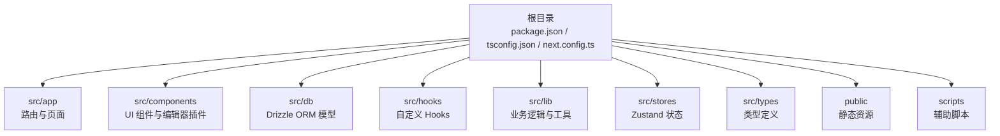
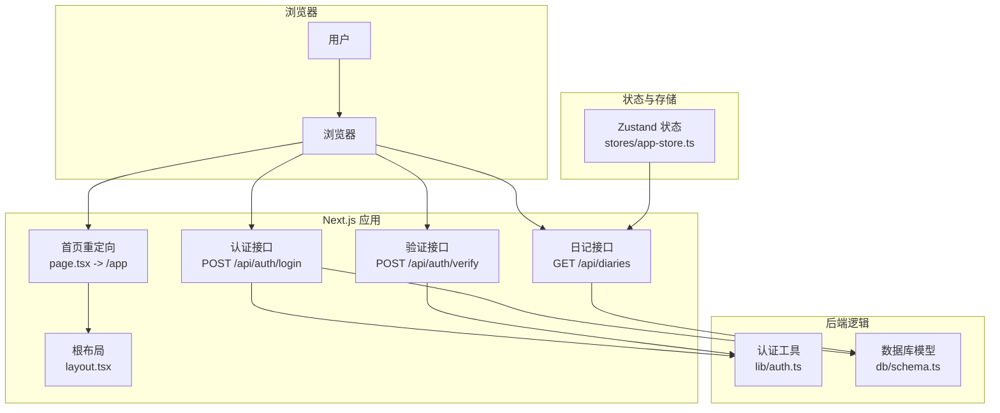
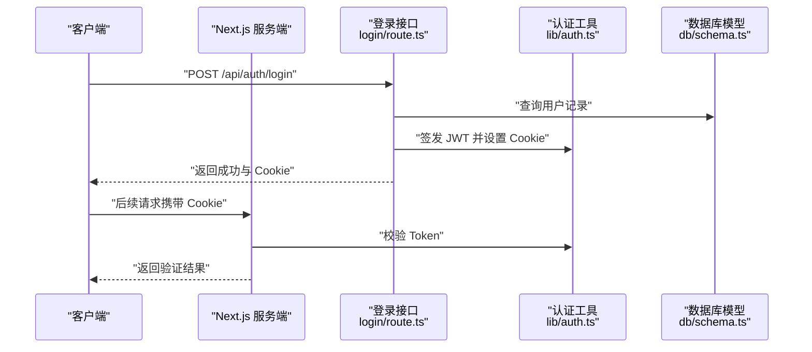
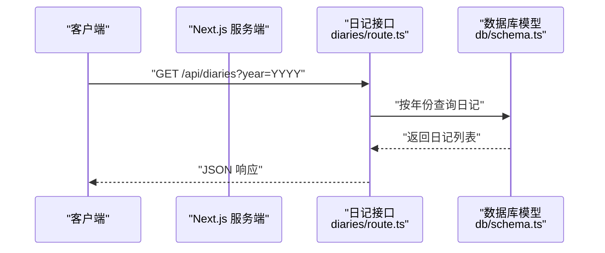
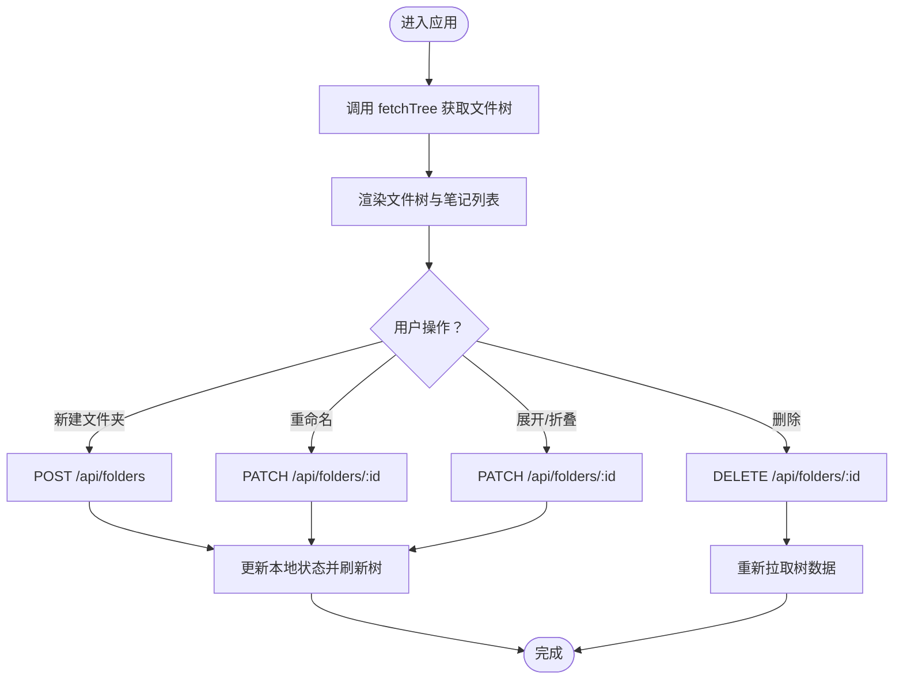
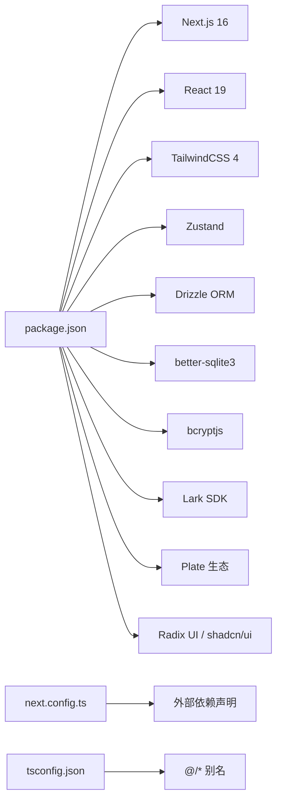

# 快速开始

<cite>
**本文引用的文件**
- [package.json](file://package.json)
- [README.md](file://README.md)
- [next.config.ts](file://next.config.ts)
- [tsconfig.json](file://tsconfig.json)
- [components.json](file://components.json)
- [src/app/layout.tsx](file://src/app/layout.tsx)
- [src/app/page.tsx](file://src/app/page.tsx)
- [src/app/api/auth/login/route.ts](file://src/app/api/auth/login/route.ts)
- [src/app/api/auth/verify/route.ts](file://src/app/api/auth/verify/route.ts)
- [src/app/api/diaries/route.ts](file://src/app/api/diaries/route.ts)
- [src/lib/auth.ts](file://src/lib/auth.ts)
- [src/db/schema.ts](file://src/db/schema.ts)
- [src/stores/app-store.ts](file://src/stores/app-store.ts)
</cite>

## 目录
1. [简介](#简介)
2. [项目结构](#项目结构)
3. [核心组件](#核心组件)
4. [架构总览](#架构总览)
5. [详细组件分析](#详细组件分析)
6. [依赖分析](#依赖分析)
7. [性能注意事项](#性能注意事项)
8. [故障排查指南](#故障排查指南)
9. [结论](#结论)
10. [附录](#附录)

## 简介
本指南面向初学者，帮助你在本地快速搭建并运行 YNote v2 项目。你将完成环境准备、依赖安装、开发服务器启动与基础配置，并了解项目启动后默认页面与基本功能。完成后，你可以基于此进行二次开发与部署。

## 项目结构
YNote v2 是一个基于 Next.js App Router 的前端应用，采用 TypeScript 开发，使用 Drizzle ORM 进行 SQLite 数据库建模，配合 Zustand 管理前端状态，UI 组件基于 shadcn/ui 与 TailwindCSS。

- 根目录包含构建脚本、类型检查、样式与工具链配置等文件
- 源代码位于 src/ 下，按功能模块组织
  - app：Next.js 应用入口与路由定义
  - components：可复用 UI 组件与编辑器插件
  - db：数据库模型与连接
  - hooks：自定义 React Hooks
  - lib：业务逻辑与工具函数
  - stores：Zustand 全局状态管理
  - types：全局类型定义
- public：静态资源
- scripts：辅助脚本（如 WebSocket 示例）

**章节来源**
- [package.json:1-119](file://package.json#L1-L119)
- [tsconfig.json:1-35](file://tsconfig.json#L1-L35)
- [next.config.ts:1-17](file://next.config.ts#L1-L17)

## 核心组件
- 路由与页面
  - 应用根布局与元数据在根布局文件中定义
  - 首页重定向至应用主页面
- 认证与权限
  - 登录接口负责校验密钥并签发安全 Cookie
  - Token 校验接口用于中间件验证
- 数据模型
  - 用户、文件夹、笔记、附件、想法、标签、日记等表结构
- 前端状态
  - 使用 Zustand 管理标签页、文件树、选中项、搜索结果等
- 构建与运行
  - 提供开发、构建、启动与 Lark 相关脚本

**章节来源**
- [src/app/layout.tsx:1-38](file://src/app/layout.tsx#L1-L38)
- [src/app/page.tsx:1-6](file://src/app/page.tsx#L1-L6)
- [src/app/api/auth/login/route.ts:1-63](file://src/app/api/auth/login/route.ts#L1-L63)
- [src/app/api/auth/verify/route.ts:1-7](file://src/app/api/auth/verify/route.ts#L1-L7)
- [src/db/schema.ts:1-105](file://src/db/schema.ts#L1-L105)
- [src/stores/app-store.ts:1-318](file://src/stores/app-store.ts#L1-L318)

## 架构总览
下图展示了从浏览器访问到服务端处理的关键路径，以及前端状态与数据库交互的关系。

**图表来源**
- [src/app/layout.tsx:1-38](file://src/app/layout.tsx#L1-L38)
- [src/app/page.tsx:1-6](file://src/app/page.tsx#L1-L6)
- [src/app/api/auth/login/route.ts:1-63](file://src/app/api/auth/login/route.ts#L1-L63)
- [src/app/api/auth/verify/route.ts:1-7](file://src/app/api/auth/verify/route.ts#L1-L7)
- [src/app/api/diaries/route.ts:1-45](file://src/app/api/diaries/route.ts#L1-L45)
- [src/lib/auth.ts:1-26](file://src/lib/auth.ts#L1-L26)
- [src/db/schema.ts:1-105](file://src/db/schema.ts#L1-L105)
- [src/stores/app-store.ts:1-318](file://src/stores/app-store.ts#L1-L318)

## 详细组件分析

### 认证流程（登录与验证）
该流程涵盖客户端发起登录请求、服务端校验密钥、签发安全 Cookie，以及后续验证请求合法性。

**图表来源**
- [src/app/api/auth/login/route.ts:1-63](file://src/app/api/auth/login/route.ts#L1-L63)
- [src/lib/auth.ts:1-26](file://src/lib/auth.ts#L1-L26)
- [src/db/schema.ts:1-105](file://src/db/schema.ts#L1-L105)

**章节来源**
- [src/app/api/auth/login/route.ts:1-63](file://src/app/api/auth/login/route.ts#L1-L63)
- [src/app/api/auth/verify/route.ts:1-7](file://src/app/api/auth/verify/route.ts#L1-L7)
- [src/lib/auth.ts:1-26](file://src/lib/auth.ts#L1-L26)

### 日记数据读取流程
客户端通过 GET 请求获取指定年份的日记列表，服务端执行查询并返回结果。

**图表来源**
- [src/app/api/diaries/route.ts:1-45](file://src/app/api/diaries/route.ts#L1-L45)
- [src/db/schema.ts:1-105](file://src/db/schema.ts#L1-L105)

**章节来源**
- [src/app/api/diaries/route.ts:1-45](file://src/app/api/diaries/route.ts#L1-L45)
- [src/db/schema.ts:1-105](file://src/db/schema.ts#L1-L105)

### 前端状态与文件树交互
应用使用 Zustand 管理文件树与笔记列表，支持创建、重命名、删除、展开/折叠等操作，并与后端 API 协同更新。

**图表来源**
- [src/stores/app-store.ts:1-318](file://src/stores/app-store.ts#L1-L318)

**章节来源**
- [src/stores/app-store.ts:1-318](file://src/stores/app-store.ts#L1-L318)

## 依赖分析
- 运行时依赖
  - Next.js 16、React 19、TailwindCSS 4、Plate 编辑器生态、Radix UI、Zustand 状态管理、Drizzle ORM、better-sqlite3、bcryptjs、@larksuiteoapi/node-sdk 等
- 开发依赖
  - TypeScript、ESLint、TailwindCSS、tsx、dotenv、drizzle-kit、concurrently 等
- 构建与运行
  - next.config.ts 中声明外部依赖与实验性配置
  - tsconfig.json 定义编译选项与路径别名

**图表来源**
- [package.json:1-119](file://package.json#L1-L119)
- [next.config.ts:1-17](file://next.config.ts#L1-L17)
- [tsconfig.json:1-35](file://tsconfig.json#L1-L35)

**章节来源**
- [package.json:1-119](file://package.json#L1-L119)
- [next.config.ts:1-17](file://next.config.ts#L1-L17)
- [tsconfig.json:1-35](file://tsconfig.json#L1-L35)

## 性能注意事项
- 启动参数与代理
  - 实验性配置允许较大的代理请求体，适合富文本与媒体场景
- 外部包
  - 将部分原生扩展包标记为外部，减少打包体积并避免 SSR 问题
- 类型与编译
  - 使用 bundler 模式解析模块，开启严格模式与增量编译提升开发体验

**章节来源**
- [next.config.ts:1-17](file://next.config.ts#L1-L17)
- [tsconfig.json:1-35](file://tsconfig.json#L1-L35)

## 故障排查指南
- 开发服务器无法启动
  - 确认 Node.js 版本满足项目需求（Next.js 16 需要较新的 LTS 版本）
  - 清理缓存后重装依赖：删除 node_modules 与锁定文件，重新安装
- 端口占用或跨平台兼容
  - 默认开发端口为 3000；若冲突请调整环境变量或使用其他端口
- 认证相关
  - 登录接口需要正确的密钥；若频繁失败会触发限流
  - 验证接口用于确认 Token 是否有效
- 数据库与模型
  - 若首次运行缺少表结构，请根据 Drizzle 配置生成迁移并执行
- 前端状态异常
  - 文件树或笔记列表未更新时，尝试手动刷新或检查网络请求是否成功

**章节来源**
- [src/app/api/auth/login/route.ts:1-63](file://src/app/api/auth/login/route.ts#L1-L63)
- [src/app/api/auth/verify/route.ts:1-7](file://src/app/api/auth/verify/route.ts#L1-L7)
- [src/db/schema.ts:1-105](file://src/db/schema.ts#L1-L105)
- [src/stores/app-store.ts:1-318](file://src/stores/app-store.ts#L1-L318)

## 结论
通过本指南，你已完成了环境准备、依赖安装、开发服务器启动与基础配置，并理解了项目启动后的默认页面与核心功能路径。建议在本地先完成一次完整的登录与数据读取流程，再逐步探索编辑器与文件树功能，最后进行构建与部署。

## 附录

### 环境准备与安装步骤
- 准备 Node.js（满足 Next.js 16 的版本要求）
- 克隆仓库后，在项目根目录安装依赖
  - 推荐使用 npm、yarn 或 pnpm
- 启动开发服务器
  - 支持 npm run dev、yarn dev、pnpm dev、bun dev
- 打开浏览器访问
  - 默认地址为 http://localhost:3000

**章节来源**
- [README.md:1-37](file://README.md#L1-L37)
- [package.json:5-12](file://package.json#L5-L12)

### 基本配置说明
- 路由与页面
  - 根布局定义站点标题、字体与全局样式
  - 首页重定向至 /app
- 构建与运行
  - next.config.ts 声明外部依赖与实验性配置
  - tsconfig.json 设置路径别名与严格模式
  - components.json 配置 UI 组件库与 Tailwind

**章节来源**
- [src/app/layout.tsx:1-38](file://src/app/layout.tsx#L1-L38)
- [src/app/page.tsx:1-6](file://src/app/page.tsx#L1-L6)
- [next.config.ts:1-17](file://next.config.ts#L1-L17)
- [tsconfig.json:1-35](file://tsconfig.json#L1-L35)
- [components.json:1-21](file://components.json#L1-L21)

### 常见开发命令
- 开发模式：npm run dev / yarn dev / pnpm dev / bun dev
- 构建：npm run build
- 启动生产：npm run start
- Lark WebSocket 示例：npm run lark:ws
- 同时启动开发与 WebSocket：npm run dev:ws
- 代码检查：npm run lint

**章节来源**
- [package.json:5-12](file://package.json#L5-L12)

### 浏览器访问与默认页面
- 访问 http://localhost:3000
- 首页会自动跳转到应用主页面
- 登录后可查看文件树、笔记列表与编辑器界面

**章节来源**
- [README.md:17-17](file://README.md#L17-L17)
- [src/app/page.tsx:1-6](file://src/app/page.tsx#L1-L6)

### 基础功能演示
- 登录
  - 调用登录接口，成功后服务端设置安全 Cookie
- 验证
  - 调用验证接口确认 Token 有效性
- 日记
  - 通过 GET /api/diaries?year=YYYY 获取指定年份的日记列表
- 文件树与笔记
  - 使用 Zustand 状态管理进行增删改查，并与后端 API 协同

**章节来源**
- [src/app/api/auth/login/route.ts:1-63](file://src/app/api/auth/login/route.ts#L1-L63)
- [src/app/api/auth/verify/route.ts:1-7](file://src/app/api/auth/verify/route.ts#L1-L7)
- [src/app/api/diaries/route.ts:1-45](file://src/app/api/diaries/route.ts#L1-L45)
- [src/stores/app-store.ts:1-318](file://src/stores/app-store.ts#L1-L318)