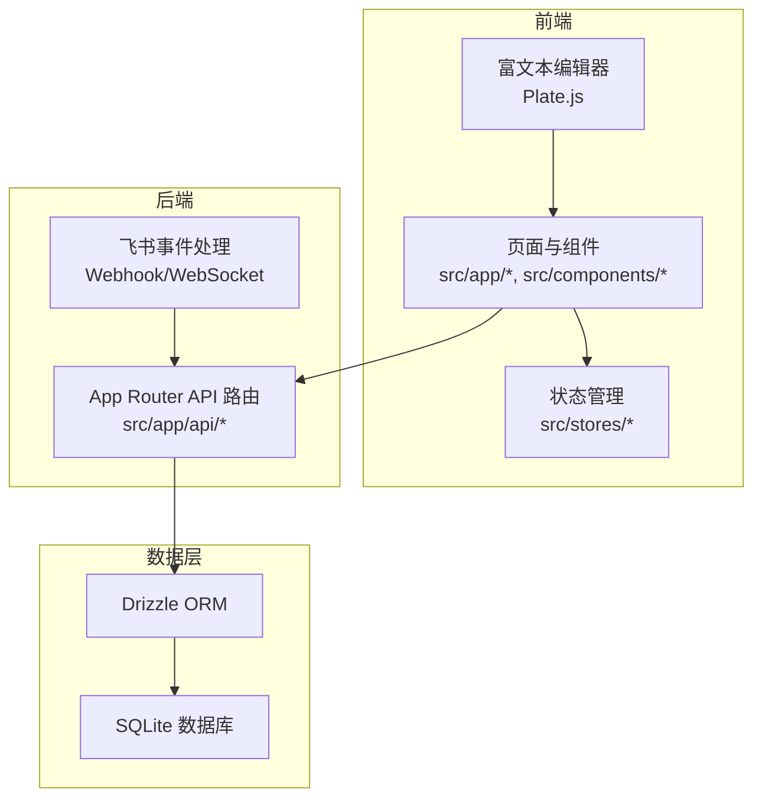
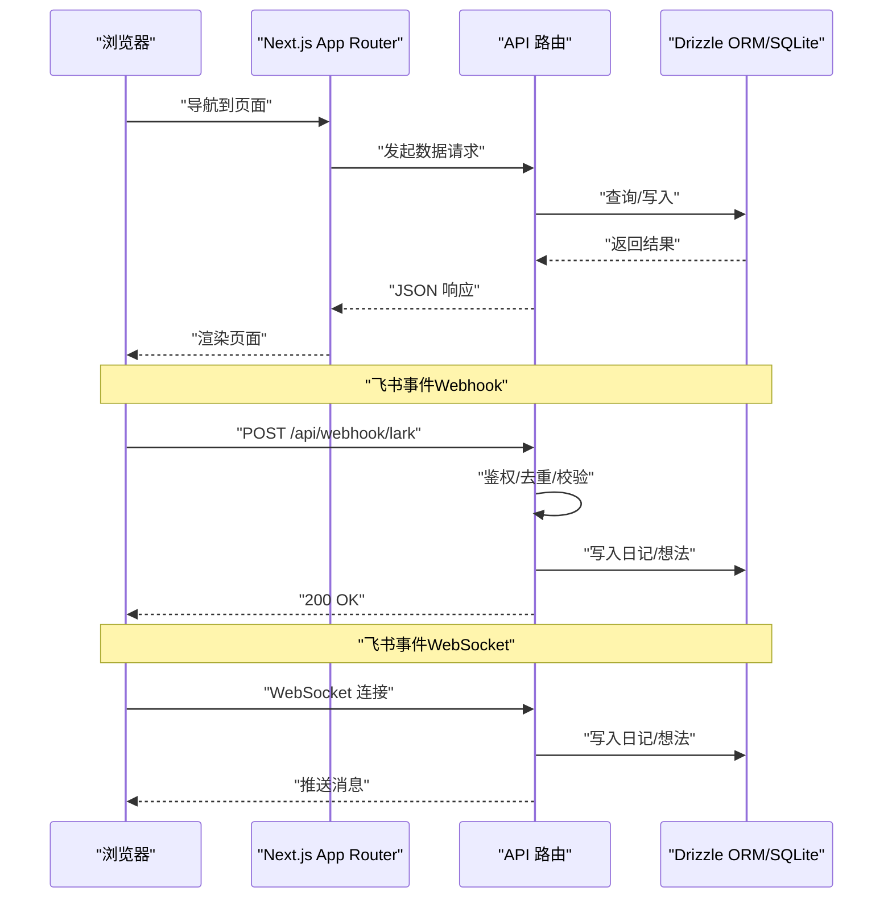
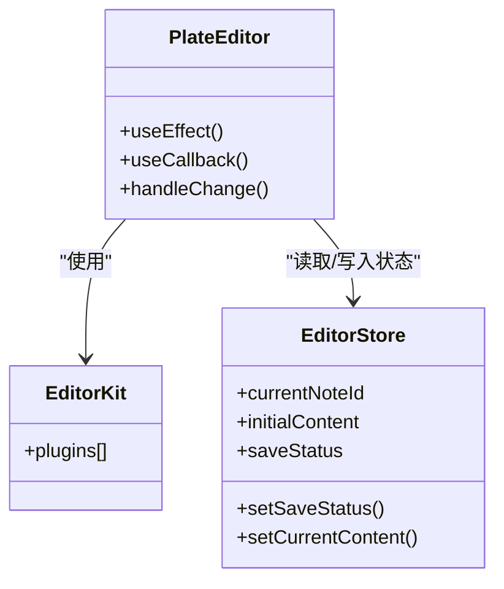
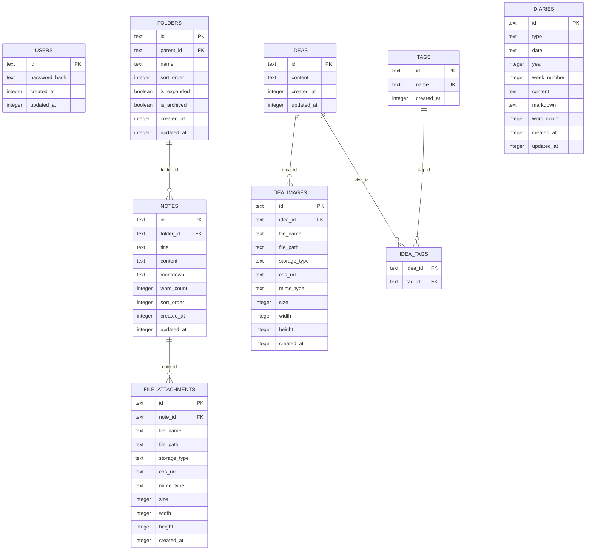
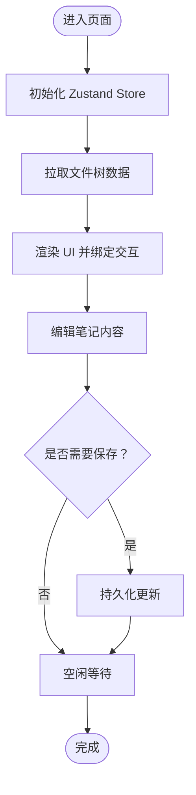
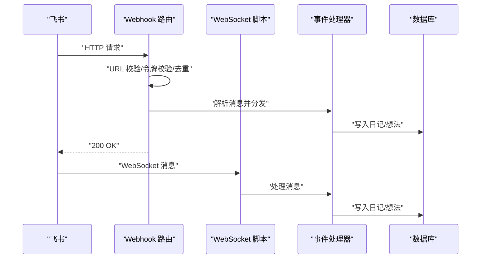
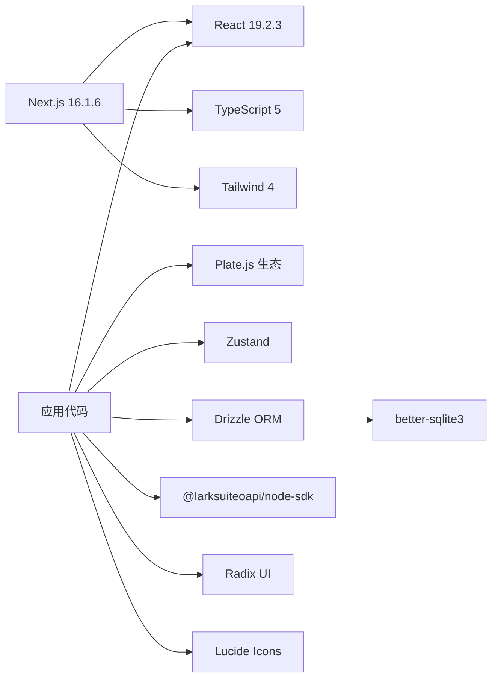

# 技术栈概览

<cite>
**本文引用的文件**
- [package.json](file://package.json)
- [next.config.ts](file://next.config.ts)
- [drizzle.config.ts](file://drizzle.config.ts)
- [tsconfig.json](file://tsconfig.json)
- [README.md](file://README.md)
- [src/lib/lark.ts](file://src/lib/lark.ts)
- [src/db/index.ts](file://src/db/index.ts)
- [src/db/schema.ts](file://src/db/schema.ts)
- [src/stores/app-store.ts](file://src/stores/app-store.ts)
- [src/components/editor/plate-editor.tsx](file://src/components/editor/plate-editor.tsx)
- [src/components/editor/editor-kit.tsx](file://src/components/editor/editor-kit.tsx)
- [src/app/layout.tsx](file://src/app/layout.tsx)
- [src/app/api/notes/route.ts](file://src/app/api/notes/route.ts)
- [src/app/api/webhook/lark/route.ts](file://src/app/api/webhook/lark/route.ts)
- [src/lib/lark-event-handler.ts](file://src/lib/lark-event-handler.ts)
- [scripts/lark-websocket.ts](file://scripts/lark-websocket.ts)
- [src/types/index.ts](file://src/types/index.ts)
</cite>

## 目录
1. [简介](#简介)
2. [项目结构](#项目结构)
3. [核心组件](#核心组件)
4. [架构总览](#架构总览)
5. [详细组件分析](#详细组件分析)
6. [依赖关系分析](#依赖关系分析)
7. [性能考量](#性能考量)
8. [故障排查指南](#故障排查指南)
9. [结论](#结论)
10. [附录](#附录)

## 简介
本文件为 YNote v2 项目的技术栈概览，聚焦以下方面：
- Next.js 16 App Router 架构的优势与特性
- TypeScript 在全栈开发中的应用与类型安全
- Plate.js 富文本编辑器框架的选择与能力
- Drizzle ORM 在数据库操作中的优势
- Zustand 状态管理的轻量化与适用场景
- 飞书 API 集成与云服务价值
并提供版本信息、兼容性要求与学习资源链接。

## 项目结构
项目采用 Next.js 16 App Router 的目录组织方式，以功能域划分 src/app 下的路由与 API；数据层通过 Drizzle ORM + better-sqlite3 访问 SQLite；富文本编辑采用 Plate.js；状态管理使用 Zustand；飞书集成通过 Webhook/WebSocket 两种模式接入。

图表来源
- [src/app/layout.tsx:1-38](file://src/app/layout.tsx#L1-L38)
- [src/app/api/notes/route.ts:1-86](file://src/app/api/notes/route.ts#L1-L86)
- [src/lib/lark-event-handler.ts:1-126](file://src/lib/lark-event-handler.ts#L1-L126)
- [src/db/index.ts:1-171](file://src/db/index.ts#L1-L171)

章节来源
- [README.md:1-37](file://README.md#L1-L37)
- [next.config.ts:1-17](file://next.config.ts#L1-L17)

## 核心组件
- Next.js 16 App Router：以文件系统为路由规范，支持 App 目录、布局、中间件、流式渲染等特性，提升开发体验与性能。
- TypeScript：严格类型检查、编译时错误发现、IDE 智能提示与重构保障。
- Plate.js：基于 Slate 的可扩展富文本编辑器，模块化插件体系覆盖块/内联样式、列表、表格、公式、媒体、自动格式化等。
- Drizzle ORM：类型安全的 SQL 查询构建器，SQLite 适配良好，迁移工具完善。
- Zustand：极简状态管理，无样板代码，适合小型到中型应用的状态需求。
- 飞书集成：支持 Webhook 与 WebSocket 两种事件接收模式，具备鉴权、去重、加解密等能力。

章节来源
- [package.json:13-99](file://package.json#L13-L99)
- [tsconfig.json:1-35](file://tsconfig.json#L1-L35)
- [src/components/editor/plate-editor.tsx:1-175](file://src/components/editor/plate-editor.tsx#L1-L175)
- [src/db/index.ts:1-171](file://src/db/index.ts#L1-L171)
- [src/stores/app-store.ts:1-318](file://src/stores/app-store.ts#L1-L318)
- [src/lib/lark.ts:1-96](file://src/lib/lark.ts#L1-L96)

## 架构总览
下图展示从浏览器到数据库的典型请求链路，以及飞书事件的两种接入路径。

图表来源
- [src/app/api/notes/route.ts:1-86](file://src/app/api/notes/route.ts#L1-L86)
- [src/app/api/webhook/lark/route.ts:1-106](file://src/app/api/webhook/lark/route.ts#L1-L106)
- [src/lib/lark-event-handler.ts:1-126](file://src/lib/lark-event-handler.ts#L1-L126)
- [src/db/index.ts:1-171](file://src/db/index.ts#L1-L171)

## 详细组件分析

### Next.js 16 App Router 架构
- 特性与优势
  - 文件系统路由：按目录结构自动生成路由，减少配置成本。
  - App 目录：支持布局、加载、错误边界、并行数据获取等。
  - 流式渲染与并发：提升首屏性能与用户体验。
  - 中间件与拦截器：统一处理鉴权、国际化、CORS 等横切关注点。
- 兼容性与版本
  - React 19.2.3，Next.js 16.1.6，TypeScript 5，Tailwind 4。
- 学习资源
  - [Next.js 文档](https://nextjs.org/docs)
  - [Learn Next.js](https://nextjs.org/learn)

章节来源
- [package.json:72-72](file://package.json#L72-L72)
- [package.json:107-107](file://package.json#L107-L107)
- [package.json:116-116](file://package.json#L116-L116)
- [next.config.ts:1-17](file://next.config.ts#L1-L17)
- [README.md:25-30](file://README.md#L25-L30)

### TypeScript 类型系统
- 严格模式与隔离模块：提升类型安全性与构建稳定性。
- 路径别名：@/* 统一导入路径，便于维护。
- 类型定义：全局类型集中于 src/types/index.ts，确保跨组件一致性。
- 学习资源
  - [TypeScript 官方文档](https://www.typescriptlang.org/docs/)

章节来源
- [tsconfig.json:1-35](file://tsconfig.json#L1-L35)
- [src/types/index.ts:1-74](file://src/types/index.ts#L1-L74)

### Plate.js 富文本编辑器
- 选型原因
  - 插件化架构：覆盖标题、段落、列表、表格、代码块、公式、媒体、自动格式化等。
  - 可组合性：通过 EditorKit 将多个插件聚合，按需启用。
  - 性能优化：快速值比较、历史记录隔离、滚动复位等策略降低切换开销。
- 关键实现
  - 编辑器容器与变更监听：在组件挂载与笔记切换时重置编辑器状态。
  - 快速值比较：避免不必要的保存与回退。
  - Markdown 序列化：在编辑器初始化时注入序列化器。
- 学习资源
  - [Plate.js 官方文档](https://platejs.org/)

图表来源
- [src/components/editor/plate-editor.tsx:63-175](file://src/components/editor/plate-editor.tsx#L63-L175)
- [src/components/editor/editor-kit.tsx:1-83](file://src/components/editor/editor-kit.tsx#L1-L83)
- [src/stores/editor-store.ts](file://src/stores/editor-store.ts)

章节来源
- [src/components/editor/plate-editor.tsx:1-175](file://src/components/editor/plate-editor.tsx#L1-L175)
- [src/components/editor/editor-kit.tsx:1-83](file://src/components/editor/editor-kit.tsx#L1-L83)

### Drizzle ORM 数据访问
- 优势
  - 类型安全：Schema 定义与运行时查询强类型绑定，减少运行期错误。
  - SQLite 友好：better-sqlite3 驱动，WAL 模式与外键约束增强可靠性。
  - 迁移友好：drizzle-kit 配置化迁移输出，便于版本演进。
- 数据模型
  - 用户、文件夹、笔记、附件、想法、标签、日记等表，含索引与唯一约束。
- 初始化流程
  - 单例连接、首次启动建表、索引创建、迁移补丁、管理员账户初始化。
- 学习资源
  - [Drizzle ORM 文档](https://orm.drizzle.team/)

图表来源
- [src/db/schema.ts:1-105](file://src/db/schema.ts#L1-L105)
- [src/db/index.ts:27-158](file://src/db/index.ts#L27-L158)

章节来源
- [drizzle.config.ts:1-8](file://drizzle.config.ts#L1-L8)
- [src/db/schema.ts:1-105](file://src/db/schema.ts#L1-L105)
- [src/db/index.ts:1-171](file://src/db/index.ts#L1-L171)

### Zustand 状态管理
- 轻量化特性
  - 无 Provider 包装，直接 create/store 使用。
  - 与 React Hooks 自然融合，易于测试与调试。
- 使用场景
  - 应用态（活动标签页、树形数据、搜索）、笔记 CRUD、编辑器缓存与序列化器注册。
- 学习资源
  - [Zustand 官方文档](https://docs.pmnd.rs/zustand)

图表来源
- [src/stores/app-store.ts:49-318](file://src/stores/app-store.ts#L49-L318)

章节来源
- [src/stores/app-store.ts:1-318](file://src/stores/app-store.ts#L1-L318)

### 飞书 API 集成
- 重要性
  - 支持“消息即输入”工作流：通过飞书消息触发日记/想法创建。
  - 云服务价值：无需公网地址即可接收即时消息，降低部署复杂度。
- 接入方式
  - Webhook：标准 HTTP 回调，Next.js API 路由处理验证、去重与转发。
  - WebSocket：长连接直连，本地脚本或服务常驻保持连接。
- 关键能力
  - 鉴权令牌校验、消息去重（内存 TTL）、加密字段检测、发送者白名单过滤。
  - 事件分发：根据消息前缀路由到日记或想法处理器。
- 学习资源
  - [飞书开放平台](https://open.feishu.cn/)

图表来源
- [src/app/api/webhook/lark/route.ts:28-105](file://src/app/api/webhook/lark/route.ts#L28-L105)
- [scripts/lark-websocket.ts:38-108](file://scripts/lark-websocket.ts#L38-L108)
- [src/lib/lark-event-handler.ts:104-125](file://src/lib/lark-event-handler.ts#L104-L125)
- [src/lib/lark.ts:1-96](file://src/lib/lark.ts#L1-L96)

章节来源
- [src/lib/lark.ts:1-96](file://src/lib/lark.ts#L1-L96)
- [src/app/api/webhook/lark/route.ts:1-106](file://src/app/api/webhook/lark/route.ts#L1-L106)
- [scripts/lark-websocket.ts:1-109](file://scripts/lark-websocket.ts#L1-L109)
- [src/lib/lark-event-handler.ts:1-126](file://src/lib/lark-event-handler.ts#L1-L126)

## 依赖关系分析
- 外部依赖
  - React 生态：React 19、ReactDOM 19、Radix UI、Lucide Icons。
  - 工具库：date-fns、lodash、nanoid、bcryptjs、sharp、docx/pdf-lib 等。
  - ORM 与数据库：drizzle-orm、better-sqlite3、drizzle-kit。
  - 富文本：Plate.js 及其生态插件。
  - 飞书 SDK：@larksuiteoapi/node-sdk。
  - 状态管理：zustand。
- Next.js 配置
  - serverExternalPackages：声明原生模块外部化，避免打包问题。
  - 实验性参数：代理客户端最大体积分流设置。

图表来源
- [package.json:13-99](file://package.json#L13-L99)
- [next.config.ts:4-13](file://next.config.ts#L4-L13)

章节来源
- [package.json:1-119](file://package.json#L1-L119)
- [next.config.ts:1-17](file://next.config.ts#L1-L17)

## 性能考量
- 编辑器性能
  - 快速值比较避免无效保存；切换笔记时清空历史与选择，防止跨笔记状态污染。
  - 初始内容就绪后延迟标记初始化，减少抖动。
- 数据库性能
  - WAL 模式提升并发写入；外键约束保证数据一致性；索引覆盖常用查询字段。
- 网络与事件
  - Webhook 去重与最小化响应，降低重复处理成本；WebSocket 自动重连与优雅关闭。
- 建议
  - 对大文档采用分页/懒加载；对频繁写入的笔记启用节流保存；对图片/视频进行压缩与懒加载。

## 故障排查指南
- 飞书相关
  - 确认环境变量：LARK_APP_ID、LARK_APP_SECRET、LARK_VERIFICATION_TOKEN、LARK_ALLOWED_USER_IDS、LARK_ENCRYPT_KEY。
  - Webhook：若收到加密负载，需配置加密密钥或在飞书控制台关闭加密。
  - WebSocket：检查本地脚本日志与连接状态，确认允许用户集合与消息类型。
- 数据库
  - 若迁移导致异常，检查 drizzle-kit 输出与 schema 定义；确认 WAL 与外键 pragma 设置。
- 编辑器
  - 若保存状态异常，检查当前笔记 ID、baseline 内容与变更回调逻辑。
- 状态管理
  - 若 UI 不更新，确认 Zustand 状态订阅与 action 触发路径。

章节来源
- [src/lib/lark.ts:10-31](file://src/lib/lark.ts#L10-L31)
- [src/app/api/webhook/lark/route.ts:47-53](file://src/app/api/webhook/lark/route.ts#L47-L53)
- [src/db/index.ts:17-18](file://src/db/index.ts#L17-L18)
- [src/components/editor/plate-editor.tsx:84-99](file://src/components/editor/plate-editor.tsx#L84-L99)

## 结论
YNote v2 以 Next.js 16 App Router 为核心，结合 TypeScript 提供强类型保障，使用 Drizzle ORM 与 SQLite 实现高效可靠的数据访问，通过 Plate.js 构建现代化富文本体验，并以 Zustand 简化状态管理。飞书集成通过 Webhook/WebSocket 提供云服务价值，使“消息即输入”的工作流得以顺畅执行。整体技术栈在易用性、性能与可维护性之间取得良好平衡。

## 附录
- 版本与兼容性
  - Next.js 16.1.6，React 19.2.3，TypeScript 5，Tailwind 4，Drizzle ORM 0.45.1，better-sqlite3 12.8.0，Plate.js 52.x，Zustand 5.0.11，@larksuiteoapi/node-sdk 1.59.0。
- 学习资源
  - [Next.js 文档](https://nextjs.org/docs)
  - [TypeScript 官方文档](https://www.typescriptlang.org/docs/)
  - [Drizzle ORM 文档](https://orm.drizzle.team/)
  - [Plate.js 官方文档](https://platejs.org/)
  - [Zustand 官方文档](https://docs.pmnd.rs/zustand)
  - [飞书开放平台](https://open.feishu.cn/)