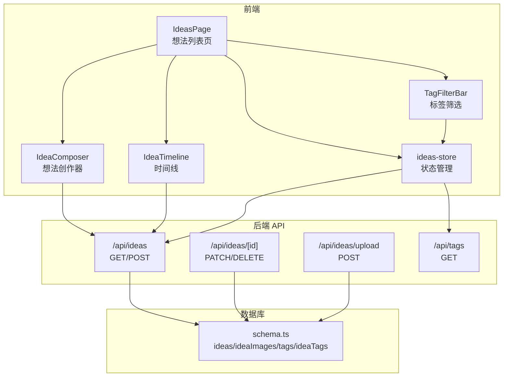
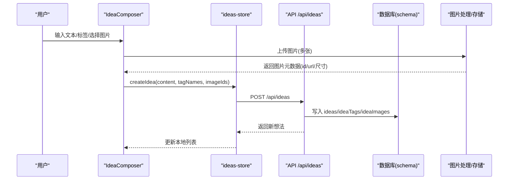
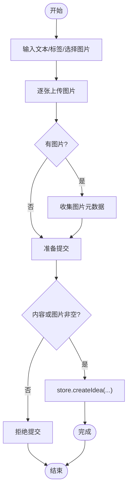
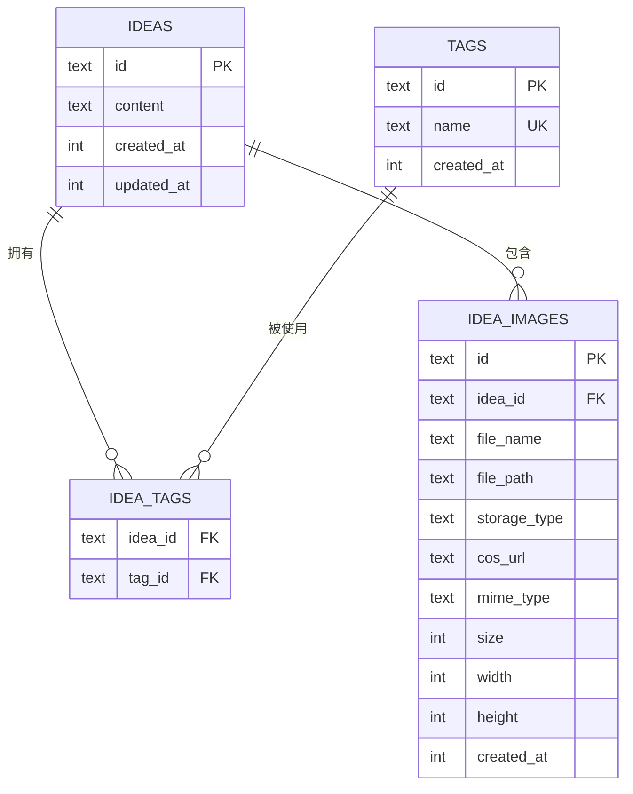
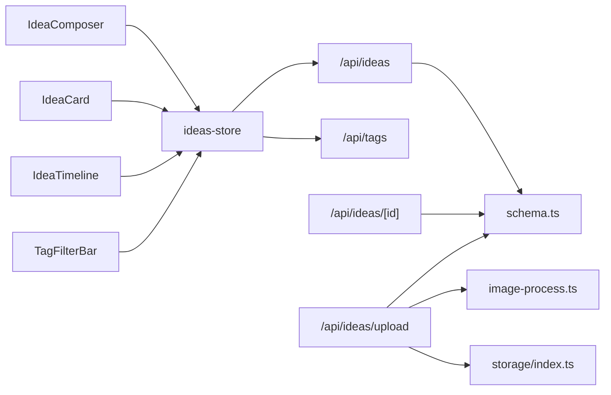

# 想法记录系统

<cite>
**本文引用的文件**
- [src/app/api/ideas/route.ts](file://src/app/api/ideas/route.ts)
- [src/app/api/ideas/[id]/route.ts](file://src/app/api/ideas/[id]/route.ts)
- [src/app/api/ideas/upload/route.ts](file://src/app/api/ideas/upload/route.ts)
- [src/app/api/tags/route.ts](file://src/app/api/tags/route.ts)
- [src/components/ideas/ideas-page.tsx](file://src/components/ideas/ideas-page.tsx)
- [src/components/ideas/idea-composer.tsx](file://src/components/ideas/idea-composer.tsx)
- [src/components/ideas/idea-card.tsx](file://src/components/ideas/idea-card.tsx)
- [src/components/ideas/idea-timeline.tsx](file://src/components/ideas/idea-timeline.tsx)
- [src/components/ideas/tag-filter-bar.tsx](file://src/components/ideas/tag-filter-bar.tsx)
- [src/stores/ideas-store.ts](file://src/stores/ideas-store.ts)
- [src/db/schema.ts](file://src/db/schema.ts)
- [src/lib/image-process.ts](file://src/lib/image-process.ts)
- [src/lib/storage/index.ts](file://src/lib/storage/index.ts)
- [src/types/index.ts](file://src/types/index.ts)
</cite>

## 目录
1. [简介](#简介)
2. [项目结构](#项目结构)
3. [核心组件](#核心组件)
4. [架构总览](#架构总览)
5. [详细组件分析](#详细组件分析)
6. [依赖关系分析](#依赖关系分析)
7. [性能考量](#性能考量)
8. [故障排查指南](#故障排查指南)
9. [结论](#结论)
10. [附录：API 与前端使用](#附录api-与前端使用)

## 简介
本系统是一个想法记录应用，支持：
- 文本输入与图片上传
- 标签分类与筛选
- 时间线展示（无限滚动）
- 图片网格视图
- 文件上传、图片压缩与存储策略
- 搜索与筛选（基于标签）

系统采用前后端分离的 Next.js 应用，后端 API 使用 Drizzle ORM 访问 SQLite 数据库；前端使用 Zustand 状态管理与自定义组件构建。

## 项目结构
- 后端 API
  - 想法：GET/POST/DELETE/PATCH，分页与标签过滤
  - 标签：GET 获取带计数的标签列表
  - 上传：单文件上传，图片压缩与存储
- 前端页面与组件
  - 页面：想法列表页，包含创作器、时间线与标签筛选
  - 组件：想法卡片、标签筛选条、图片网格
  - 状态：Zustand store 管理想法、标签、加载状态与游标
  - 类型：统一的 Idea/Tag/IdeaImage 类型定义

**图表来源**
- [src/components/ideas/ideas-page.tsx:9-42](file://src/components/ideas/ideas-page.tsx#L9-L42)
- [src/components/ideas/idea-composer.tsx:16-201](file://src/components/ideas/idea-composer.tsx#L16-L201)
- [src/components/ideas/idea-timeline.tsx:8-68](file://src/components/ideas/idea-timeline.tsx#L8-L68)
- [src/components/ideas/tag-filter-bar.tsx:6-51](file://src/components/ideas/tag-filter-bar.tsx#L6-L51)
- [src/stores/ideas-store.ts:20-125](file://src/stores/ideas-store.ts#L20-L125)
- [src/app/api/ideas/route.ts:7-84](file://src/app/api/ideas/route.ts#L7-L84)
- [src/app/api/ideas/[id]/route.ts](file://src/app/api/ideas/[id]/route.ts#L40-L116)
- [src/app/api/ideas/upload/route.ts:11-65](file://src/app/api/ideas/upload/route.ts#L11-L65)
- [src/app/api/tags/route.ts:6-27](file://src/app/api/tags/route.ts#L6-L27)
- [src/db/schema.ts:57-91](file://src/db/schema.ts#L57-L91)

**章节来源**
- [src/components/ideas/ideas-page.tsx:9-42](file://src/components/ideas/ideas-page.tsx#L9-L42)
- [src/stores/ideas-store.ts:20-125](file://src/stores/ideas-store.ts#L20-L125)

## 核心组件
- 想法列表页：组合创作器、时间线与标签筛选，负责初始化加载与筛选变更触发刷新
- 想法创作器：文本输入、标签输入、图片上传与提交
- 想法卡片：查看/编辑想法、标签管理、删除确认
- 时间线：无限滚动加载、占位哨兵元素
- 标签筛选：全选与按标签过滤
- 状态管理：想法列表、标签、游标、加载状态与 CRUD 操作
- 数据模型：Idea、Tag、IdeaImage 的类型定义

**章节来源**
- [src/components/ideas/idea-composer.tsx:16-201](file://src/components/ideas/idea-composer.tsx#L16-L201)
- [src/components/ideas/idea-card.tsx:14-189](file://src/components/ideas/idea-card.tsx#L14-L189)
- [src/components/ideas/idea-timeline.tsx:8-68](file://src/components/ideas/idea-timeline.tsx#L8-L68)
- [src/components/ideas/tag-filter-bar.tsx:6-51](file://src/components/ideas/tag-filter-bar.tsx#L6-L51)
- [src/stores/ideas-store.ts:20-125](file://src/stores/ideas-store.ts#L20-L125)
- [src/types/index.ts:37-74](file://src/types/index.ts#L37-L74)

## 架构总览
系统采用“前端组件 + Zustand 状态 + Next.js API 路由”的分层架构。前端通过 store 发起请求到后端 API，后端使用 Drizzle ORM 查询 SQLite 表，图片上传经由本地存储或对象存储（COS）提供服务。

**图表来源**
- [src/components/ideas/idea-composer.tsx:45-103](file://src/components/ideas/idea-composer.tsx#L45-L103)
- [src/stores/ideas-store.ts:73-91](file://src/stores/ideas-store.ts#L73-L91)
- [src/app/api/ideas/route.ts:86-150](file://src/app/api/ideas/route.ts#L86-L150)
- [src/app/api/ideas/upload/route.ts:11-65](file://src/app/api/ideas/upload/route.ts#L11-L65)
- [src/db/schema.ts:57-91](file://src/db/schema.ts#L57-L91)

## 详细组件分析

### 想法列表页（IdeasPage）
- 职责：初始化加载标签与想法；监听标签筛选变化触发刷新
- 关键点：首次加载时 fetchTags 与 fetchIdeas；当 selectedTagId 改变时重新拉取

**章节来源**
- [src/components/ideas/ideas-page.tsx:9-42](file://src/components/ideas/ideas-page.tsx#L9-L42)
- [src/stores/ideas-store.ts:29-59](file://src/stores/ideas-store.ts#L29-L59)

### 想法创作器（IdeaComposer）
- 文本输入：受控组件，提交前 trim 校验
- 标签输入：支持回车/逗号分隔，支持退格删除最后一个
- 图片上传：隐藏文件输入，逐张上传至 /api/ideas/upload，返回 id/url/尺寸
- 提交：调用 store.createIdea，成功后清空输入并刷新标签

**图表来源**
- [src/components/ideas/idea-composer.tsx:16-103](file://src/components/ideas/idea-composer.tsx#L16-L103)
- [src/app/api/ideas/upload/route.ts:11-65](file://src/app/api/ideas/upload/route.ts#L11-L65)

**章节来源**
- [src/components/ideas/idea-composer.tsx:16-201](file://src/components/ideas/idea-composer.tsx#L16-L201)

### 想法卡片（IdeaCard）
- 查看模式：显示内容、图片网格、标签与相对时间
- 编辑模式：可修改内容与标签，支持快捷键保存/取消
- 删除：二次确认，调用 store.deleteIdea

**章节来源**
- [src/components/ideas/idea-card.tsx:14-189](file://src/components/ideas/idea-card.tsx#L14-L189)
- [src/stores/ideas-store.ts:114-124](file://src/stores/ideas-store.ts#L114-L124)

### 时间线（IdeaTimeline）
- 无限滚动：使用 IntersectionObserver 观察哨兵元素，进入可视区域时触发下一页加载
- 加载态：loading 控制加载动画
- 结束提示：hasMore=false 且存在数据时显示“没有更多了”

**章节来源**
- [src/components/ideas/idea-timeline.tsx:8-68](file://src/components/ideas/idea-timeline.tsx#L8-L68)
- [src/stores/ideas-store.ts:29-59](file://src/stores/ideas-store.ts#L29-L59)

### 标签筛选（TagFilterBar）
- 列表：从 store.tags 渲染，支持显示计数
- 选择：点击切换 selectedTagId，触发刷新
- 默认：全部（null）表示不过滤

**章节来源**
- [src/components/ideas/tag-filter-bar.tsx:6-51](file://src/components/ideas/tag-filter-bar.tsx#L6-L51)
- [src/stores/ideas-store.ts:27-27](file://src/stores/ideas-store.ts#L27-L27)

### 状态管理（ideas-store）
- 数据：ideas、tags、selectedTagId、hasMore、loading
- 方法：fetchIdeas（支持 reset 与游标）、fetchTags、createIdea、updateIdea、deleteIdea
- 交互：根据 selectedTagId 与最后一条 createdAt 设置查询参数；合并或替换列表

**章节来源**
- [src/stores/ideas-store.ts:20-125](file://src/stores/ideas-store.ts#L20-L125)

### 数据模型（schema 与类型）
- 表结构：ideas、ideaImages、tags、ideaTags 多对多关联
- 类型：Idea、Tag、IdeaImage 定义字段与关系

**图表来源**
- [src/db/schema.ts:57-91](file://src/db/schema.ts#L57-L91)
- [src/types/index.ts:43-58](file://src/types/index.ts#L43-L58)

**章节来源**
- [src/db/schema.ts:57-91](file://src/db/schema.ts#L57-L91)
- [src/types/index.ts:37-58](file://src/types/index.ts#L37-L58)

### 图片上传与存储策略
- 接口：/api/ideas/upload，支持 PNG/JPEG/GIF/WEBP/SVG，最大 10MB
- 处理：sharp 压缩到最大宽度 1920，输出 WEBP，质量 80
- 存储：优先 COS（若环境变量齐全），否则本地存储；记录 cosUrl 或本地路径
- 返回：url/id/宽高，供前端预览与后续绑定到想法

**章节来源**
- [src/app/api/ideas/upload/route.ts:11-65](file://src/app/api/ideas/upload/route.ts#L11-L65)
- [src/lib/image-process.ts:3-20](file://src/lib/image-process.ts#L3-L20)
- [src/lib/storage/index.ts:12-29](file://src/lib/storage/index.ts#L12-L29)

### 标签分类系统
- 创建：POST /api/ideas 时，批量插入或忽略重复标签，再写入关联表
- 管理：GET /api/tags 返回带计数的标签列表（按使用次数降序）
- 过滤：GET /api/ideas?tagId=... 实现按标签分页加载

**章节来源**
- [src/app/api/ideas/route.ts:102-117](file://src/app/api/ideas/route.ts#L102-L117)
- [src/app/api/ideas/[id]/route.ts](file://src/app/api/ideas/[id]/route.ts#L70-L86)
- [src/app/api/tags/route.ts:6-27](file://src/app/api/tags/route.ts#L6-L27)

### 时间线展示算法与数据结构
- 分页游标：以 createdAt 降序，使用 cursor 参数作为上一页最后一条的时间戳
- 限流：默认 limit=20，最大 50
- 结果：返回 ideas + hasMore，前端据此决定是否继续加载

**章节来源**
- [src/app/api/ideas/route.ts:7-84](file://src/app/api/ideas/route.ts#L7-L84)
- [src/stores/ideas-store.ts:36-52](file://src/stores/ideas-store.ts#L36-L52)

### 图片网格视图与列表视图切换逻辑
- 当前实现：组件内部未见显式“网格/列表”切换逻辑；图片以网格形式渲染
- 建议：如需切换，可在父组件传入视图模式 props，并在子组件内根据模式渲染不同布局

**章节来源**
- [src/components/ideas/idea-card.tsx:140-144](file://src/components/ideas/idea-card.tsx#L140-L144)
- [src/components/ideas/idea-composer.tsx:150-158](file://src/components/ideas/idea-composer.tsx#L150-L158)

### 搜索与筛选（当前实现）
- 想法：未提供全文搜索接口；可通过标签过滤与时间线浏览
- 笔记：存在独立的搜索接口（用于笔记模块），可参考其模式扩展到想法模块

**章节来源**
- [src/app/api/notes/search/route.ts:6-43](file://src/app/api/notes/search/route.ts#L6-L43)

## 依赖关系分析

**图表来源**
- [src/components/ideas/idea-composer.tsx:25-25](file://src/components/ideas/idea-composer.tsx#L25-L25)
- [src/components/ideas/idea-card.tsx:24-24](file://src/components/ideas/idea-card.tsx#L24-L24)
- [src/components/ideas/idea-timeline.tsx:12-12](file://src/components/ideas/idea-timeline.tsx#L12-L12)
- [src/components/ideas/tag-filter-bar.tsx:9-10](file://src/components/ideas/tag-filter-bar.tsx#L9-L10)
- [src/stores/ideas-store.ts:13-17](file://src/stores/ideas-store.ts#L13-L17)
- [src/app/api/ideas/route.ts:7-84](file://src/app/api/ideas/route.ts#L7-L84)
- [src/app/api/ideas/[id]/route.ts](file://src/app/api/ideas/[id]/route.ts#L40-L116)
- [src/app/api/ideas/upload/route.ts:11-65](file://src/app/api/ideas/upload/route.ts#L11-L65)
- [src/app/api/tags/route.ts:6-27](file://src/app/api/tags/route.ts#L6-L27)
- [src/db/schema.ts:57-91](file://src/db/schema.ts#L57-L91)
- [src/lib/image-process.ts:3-20](file://src/lib/image-process.ts#L3-L20)
- [src/lib/storage/index.ts:12-29](file://src/lib/storage/index.ts#L12-L29)

**章节来源**
- [src/stores/ideas-store.ts:20-125](file://src/stores/ideas-store.ts#L20-L125)
- [src/app/api/ideas/route.ts:7-84](file://src/app/api/ideas/route.ts#L7-L84)

## 性能考量
- 无限滚动：使用 IntersectionObserver 减少重排与频繁请求
- 分页游标：避免跳页与重复数据，提升加载效率
- 图片压缩：限制最大宽度与输出格式，降低带宽与存储成本
- 存储策略：优先对象存储（COS）以提升可用性与扩展性

[本节为通用建议，无需特定文件引用]

## 故障排查指南
- 上传失败
  - 检查文件类型与大小限制
  - 确认存储实例初始化（COS 环境变量或本地存储）
- 创建/更新失败
  - 校验内容非空与标签合法性
  - 查看后端错误日志与状态码
- 列表不刷新
  - 确认 selectedTagId 变更已触发 fetchIdeas
  - 检查 hasMore 与 loading 状态

**章节来源**
- [src/app/api/ideas/upload/route.ts:17-27](file://src/app/api/ideas/upload/route.ts#L17-L27)
- [src/lib/storage/index.ts:15-26](file://src/lib/storage/index.ts#L15-L26)
- [src/app/api/ideas/route.ts:86-94](file://src/app/api/ideas/route.ts#L86-L94)
- [src/stores/ideas-store.ts:29-59](file://src/stores/ideas-store.ts#L29-L59)

## 结论
该系统提供了完整的想法记录能力：从创作、图片上传、标签管理到时间线展示与筛选。通过清晰的前后端职责划分与状态管理，实现了良好的用户体验与可维护性。未来可扩展全文搜索、网格/列表切换与更丰富的筛选维度。

[本节为总结，无需特定文件引用]

## 附录：API 与前端使用

### API 定义
- 获取想法列表
  - 方法：GET
  - 路径：/api/ideas
  - 查询参数：tagId（可选）、cursor（可选）、limit（默认 20，最大 50）
  - 返回：{ ideas: Idea[], hasMore: boolean }
- 创建想法
  - 方法：POST
  - 路径：/api/ideas
  - 请求体：{ content: string, tagNames: string[], imageIds: string[] }
  - 返回：Idea（201）
- 更新想法
  - 方法：PATCH
  - 路径：/api/ideas/[id]
  - 请求体：{ content: string, tagNames: string[] }
  - 返回：Idea
- 删除想法
  - 方法：DELETE
  - 路径：/api/ideas/[id]
  - 返回：{ success: boolean }
- 上传图片
  - 方法：POST
  - 路径：/api/ideas/upload
  - 表单字段：file（必填）、ideaId（可选）
  - 返回：{ url: string, id: string, width: number, height: number }
- 获取标签
  - 方法：GET
  - 路径：/api/tags
  - 返回：{ tags: { id: string, name: string, count: number }[] }

**章节来源**
- [src/app/api/ideas/route.ts:7-84](file://src/app/api/ideas/route.ts#L7-L84)
- [src/app/api/ideas/route.ts:86-150](file://src/app/api/ideas/route.ts#L86-L150)
- [src/app/api/ideas/[id]/route.ts](file://src/app/api/ideas/[id]/route.ts#L40-L116)
- [src/app/api/ideas/upload/route.ts:11-65](file://src/app/api/ideas/upload/route.ts#L11-L65)
- [src/app/api/tags/route.ts:6-27](file://src/app/api/tags/route.ts#L6-L27)

### 前端组件使用
- 想法列表页
  - 引入：IdeasPage
  - 行为：自动加载标签与想法；切换标签筛选后刷新
- 想法创作器
  - 引入：IdeaComposer
  - 行为：输入文本/标签，选择图片上传，提交后清空并刷新
- 想法卡片
  - 引入：IdeaCard
  - 行为：查看/编辑内容与标签，删除二次确认
- 时间线
  - 引入：IdeaTimeline
  - 行为：无限滚动加载
- 标签筛选
  - 引入：TagFilterBar
  - 行为：点击切换 selectedTagId

**章节来源**
- [src/components/ideas/ideas-page.tsx:9-42](file://src/components/ideas/ideas-page.tsx#L9-L42)
- [src/components/ideas/idea-composer.tsx:16-201](file://src/components/ideas/idea-composer.tsx#L16-L201)
- [src/components/ideas/idea-card.tsx:14-189](file://src/components/ideas/idea-card.tsx#L14-L189)
- [src/components/ideas/idea-timeline.tsx:8-68](file://src/components/ideas/idea-timeline.tsx#L8-L68)
- [src/components/ideas/tag-filter-bar.tsx:6-51](file://src/components/ideas/tag-filter-bar.tsx#L6-L51)