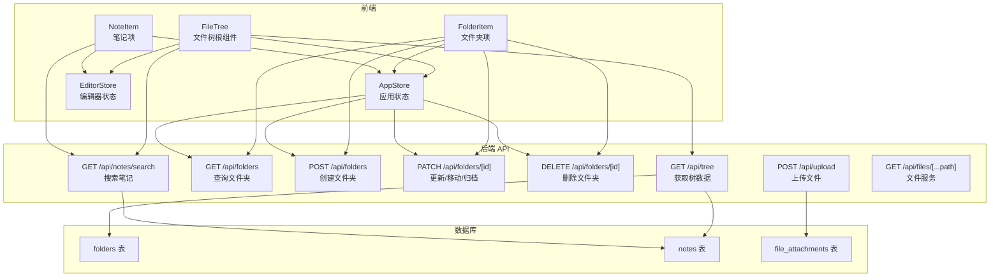
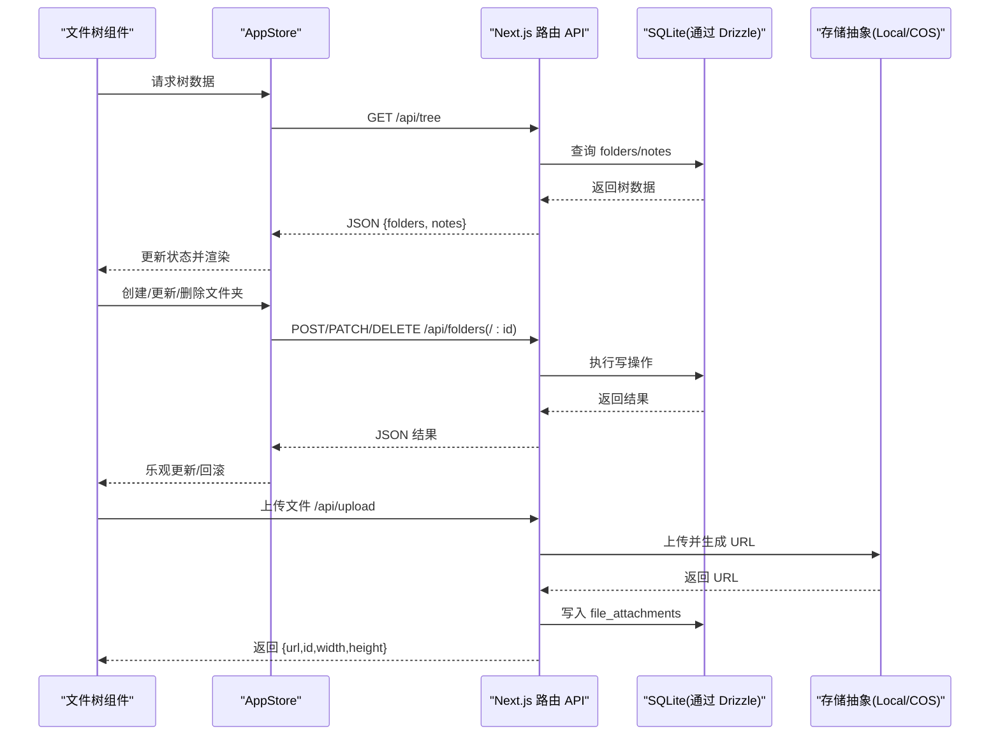
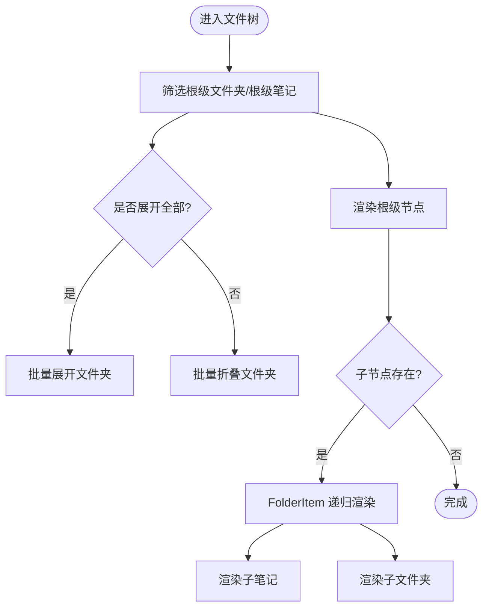
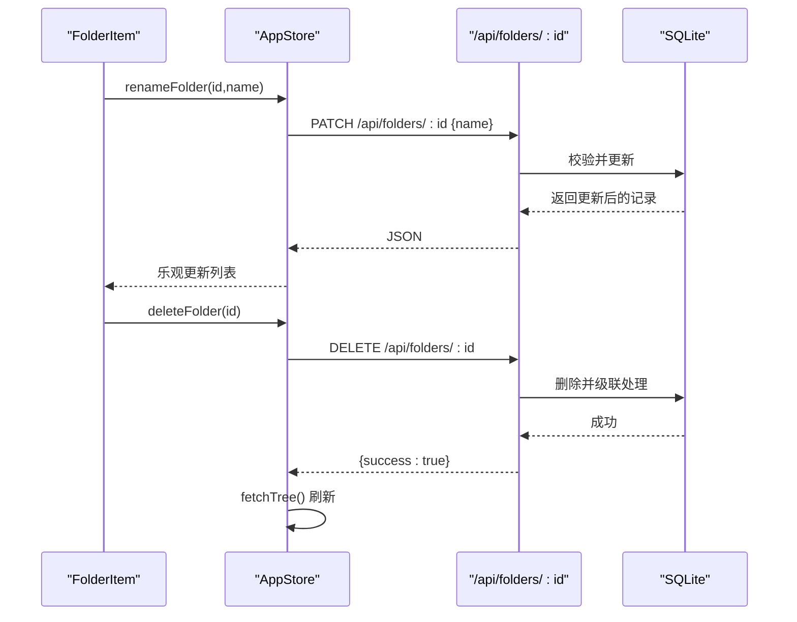
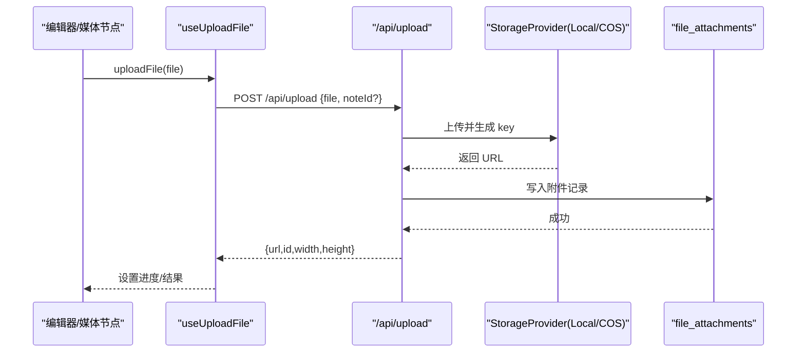
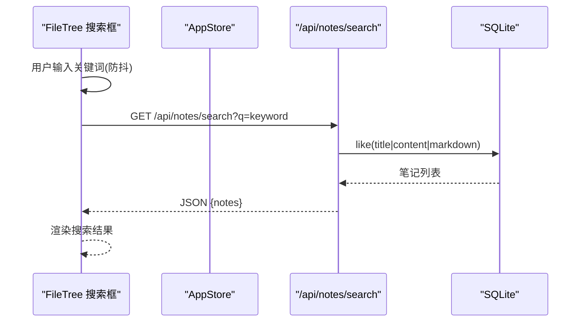
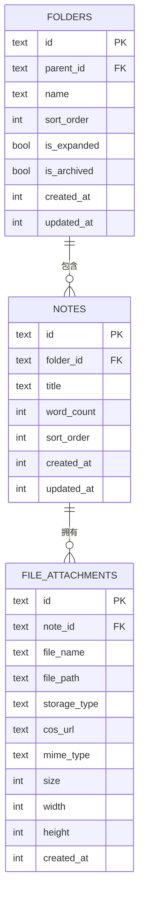
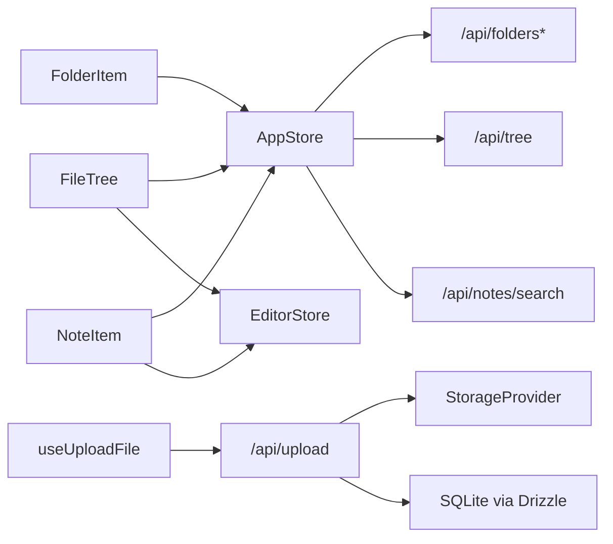

# 文件管理系统

<cite>
**本文引用的文件**
- [src/components/file-tree/file-tree.tsx](file://src/components/file-tree/file-tree.tsx)
- [src/components/file-tree/folder-item.tsx](file://src/components/file-tree/folder-item.tsx)
- [src/components/file-tree/note-item.tsx](file://src/components/file-tree/note-item.tsx)
- [src/stores/app-store.ts](file://src/stores/app-store.ts)
- [src/stores/editor-store.ts](file://src/stores/editor-store.ts)
- [src/app/api/tree/route.ts](file://src/app/api/tree/route.ts)
- [src/app/api/folders/route.ts](file://src/app/api/folders/route.ts)
- [src/app/api/folders/[id]/route.ts](file://src/app/api/folders/[id]/route.ts)
- [src/app/api/notes/search/route.ts](file://src/app/api/notes/search/route.ts)
- [src/app/api/files/[...path]/route.ts](file://src/app/api/files/[...path]/route.ts)
- [src/app/api/upload/route.ts](file://src/app/api/upload/route.ts)
- [src/hooks/use-upload-file.ts](file://src/hooks/use-upload-file.ts)
- [src/lib/storage/index.ts](file://src/lib/storage/index.ts)
- [src/db/schema.ts](file://src/db/schema.ts)
- [src/types/index.ts](file://src/types/index.ts)
</cite>

## 目录
1. [简介](#简介)
2. [项目结构](#项目结构)
3. [核心组件](#核心组件)
4. [架构总览](#架构总览)
5. [详细组件分析](#详细组件分析)
6. [依赖分析](#依赖分析)
7. [性能考虑](#性能考虑)
8. [故障排查指南](#故障排查指南)
9. [结论](#结论)
10. [附录](#附录)

## 简介
本文件管理系统围绕“文件树导航”“笔记与文件关联”“上传与下载”“搜索与过滤”等核心能力构建。前端通过 React 组件与 Zustand 状态管理驱动 UI，后端采用 Next.js 路由 API 提供数据访问与文件服务；数据库使用 Drizzle ORM 操作 SQLite；文件存储支持本地与云对象存储（COS）双栈。

## 项目结构
- 前端组件集中在 src/components/file-tree，负责文件树渲染、上下文菜单、搜索与交互。
- 状态管理位于 src/stores，包含应用状态与编辑器状态。
- 后端路由位于 src/app/api，覆盖树数据、文件夹、笔记、搜索、上传、文件服务等。
- 数据模型位于 src/db/schema，定义文件夹、笔记、附件等表结构。
- 类型定义位于 src/types，统一前后端数据契约。
- 存储抽象位于 src/lib/storage，按环境选择本地或 COS。

图表来源
- [src/components/file-tree/file-tree.tsx:1-326](file://src/components/file-tree/file-tree.tsx#L1-L326)
- [src/components/file-tree/folder-item.tsx:1-299](file://src/components/file-tree/folder-item.tsx#L1-L299)
- [src/components/file-tree/note-item.tsx:1-220](file://src/components/file-tree/note-item.tsx#L1-L220)
- [src/stores/app-store.ts:1-318](file://src/stores/app-store.ts#L1-L318)
- [src/app/api/tree/route.ts:1-36](file://src/app/api/tree/route.ts#L1-L36)
- [src/app/api/folders/route.ts:1-75](file://src/app/api/folders/route.ts#L1-L75)
- [src/app/api/folders/[id]/route.ts:1-101](file://src/app/api/folders/[id]/route.ts#L1-L101)
- [src/app/api/notes/search/route.ts:1-44](file://src/app/api/notes/search/route.ts#L1-L44)
- [src/app/api/upload/route.ts:1-153](file://src/app/api/upload/route.ts#L1-L153)
- [src/app/api/files/[...path]/route.ts:1-48](file://src/app/api/files/[...path]/route.ts#L1-L48)
- [src/db/schema.ts:1-105](file://src/db/schema.ts#L1-L105)

章节来源
- [src/components/file-tree/file-tree.tsx:1-326](file://src/components/file-tree/file-tree.tsx#L1-L326)
- [src/components/file-tree/folder-item.tsx:1-299](file://src/components/file-tree/folder-item.tsx#L1-L299)
- [src/components/file-tree/note-item.tsx:1-220](file://src/components/file-tree/note-item.tsx#L1-L220)
- [src/stores/app-store.ts:1-318](file://src/stores/app-store.ts#L1-L318)
- [src/app/api/tree/route.ts:1-36](file://src/app/api/tree/route.ts#L1-L36)
- [src/app/api/folders/route.ts:1-75](file://src/app/api/folders/route.ts#L1-L75)
- [src/app/api/folders/[id]/route.ts:1-101](file://src/app/api/folders/[id]/route.ts#L1-L101)
- [src/app/api/notes/search/route.ts:1-44](file://src/app/api/notes/search/route.ts#L1-L44)
- [src/app/api/upload/route.ts:1-153](file://src/app/api/upload/route.ts#L1-L153)
- [src/app/api/files/[...path]/route.ts:1-48](file://src/app/api/files/[...path]/route.ts#L1-L48)
- [src/db/schema.ts:1-105](file://src/db/schema.ts#L1-L105)

## 核心组件
- 文件树根组件：负责根级文件夹、根级笔记、归档区、搜索框与批量展开/折叠控制。
- 文件夹项组件：支持重命名、新建子文件夹/笔记、删除、归档/取消归档、上下文菜单。
- 笔记项组件：支持重命名、下载、导入飞书、删除、未保存提示与切换。
- 应用状态（Zustand）：封装树数据获取、文件夹/笔记 CRUD、搜索、批量展开/折叠、归档/取消归档。
- 编辑器状态：负责笔记加载、切换、保存状态与缓存失效。

章节来源
- [src/components/file-tree/file-tree.tsx:22-300](file://src/components/file-tree/file-tree.tsx#L22-L300)
- [src/components/file-tree/folder-item.tsx:23-299](file://src/components/file-tree/folder-item.tsx#L23-L299)
- [src/components/file-tree/note-item.tsx:24-220](file://src/components/file-tree/note-item.tsx#L24-L220)
- [src/stores/app-store.ts:49-318](file://src/stores/app-store.ts#L49-L318)

## 架构总览
系统采用“前端组件 + Zustand 状态 + Next.js 路由 API + Drizzle ORM + SQLite + 存储抽象”的分层设计。文件树数据通过 /api/tree 获取；文件夹操作通过 /api/folders 与 /api/folders/[id]；笔记搜索通过 /api/notes/search；文件上传通过 /api/upload；静态资源通过 /api/files/[...path] 提供。

图表来源
- [src/stores/app-store.ts:69-191](file://src/stores/app-store.ts#L69-L191)
- [src/app/api/tree/route.ts:6-35](file://src/app/api/tree/route.ts#L6-L35)
- [src/app/api/folders/route.ts:34-74](file://src/app/api/folders/route.ts#L34-L74)
- [src/app/api/folders/[id]/route.ts:9-79](file://src/app/api/folders/[id]/route.ts#L9-L79)
- [src/app/api/upload/route.ts:50-153](file://src/app/api/upload/route.ts#L50-L153)
- [src/lib/storage/index.ts:12-29](file://src/lib/storage/index.ts#L12-L29)

## 详细组件分析

### 文件树导航与递归渲染
- 根组件筛选根级文件夹与根级笔记，归档区可折叠展开；支持全展开/折叠。
- 文件夹项组件递归渲染子文件夹与笔记，深度通过样式缩进体现。
- 支持在任意层级新建子文件夹与笔记，自动展开目标节点。

图表来源
- [src/components/file-tree/file-tree.tsx:43-53](file://src/components/file-tree/file-tree.tsx#L43-L53)
- [src/components/file-tree/folder-item.tsx:254-295](file://src/components/file-tree/folder-item.tsx#L254-L295)

章节来源
- [src/components/file-tree/file-tree.tsx:43-300](file://src/components/file-tree/file-tree.tsx#L43-L300)
- [src/components/file-tree/folder-item.tsx:23-299](file://src/components/file-tree/folder-item.tsx#L23-L299)

### 文件夹的创建、删除与重命名
- 创建：POST /api/folders，限制名称长度与非法字符，最多两级目录。
- 重命名：PATCH /api/folders/[id]，校验名称合法性。
- 删除：DELETE /api/folders/[id]，服务端刷新树以处理级联与笔记迁移。
- 归档/取消归档：PATCH 更新 isArchived，支持乐观更新与失败回滚。
- 移动：PATCH 支持变更 parentId，禁止自环与越级移动。

图表来源
- [src/stores/app-store.ts:102-131](file://src/stores/app-store.ts#L102-L131)
- [src/stores/app-store.ts:193-261](file://src/stores/app-store.ts#L193-L261)
- [src/app/api/folders/[id]/route.ts:9-79](file://src/app/api/folders/[id]/route.ts#L9-L79)
- [src/app/api/folders/route.ts:34-74](file://src/app/api/folders/route.ts#L34-L74)

章节来源
- [src/stores/app-store.ts:84-131](file://src/stores/app-store.ts#L84-L131)
- [src/stores/app-store.ts:193-261](file://src/stores/app-store.ts#L193-L261)
- [src/app/api/folders/route.ts:19-74](file://src/app/api/folders/route.ts#L19-L74)
- [src/app/api/folders/[id]/route.ts:9-101](file://src/app/api/folders/[id]/route.ts#L9-L101)

### 笔记的创建、重命名、删除与下载
- 创建：POST /api/notes，返回新笔记并加入状态。
- 重命名：PATCH /api/notes/:id。
- 删除：DELETE /api/notes/:id，清理编辑器缓存并重置选中。
- 下载：NoteItem 上下文菜单触发 /api/notes/:id/download（路由文件未在仓库中展示，但组件已调用）。

章节来源
- [src/stores/app-store.ts:263-317](file://src/stores/app-store.ts#L263-L317)
- [src/components/file-tree/note-item.tsx:92-98](file://src/components/file-tree/note-item.tsx#L92-L98)

### 文件上传与下载
- 上传：POST /api/upload，支持图片、视频、音频、文档类型与大小限制；图片经处理为 webp；写入 file_attachments 并返回 URL。
- 下载：/api/files/[...path] 提供静态资源服务，带 MIME 映射与缓存头；防止目录穿越。
- 进度：useUploadFile 提供上传进度模拟与状态管理。

图表来源
- [src/hooks/use-upload-file.ts:16-43](file://src/hooks/use-upload-file.ts#L16-L43)
- [src/app/api/upload/route.ts:50-153](file://src/app/api/upload/route.ts#L50-L153)
- [src/lib/storage/index.ts:12-29](file://src/lib/storage/index.ts#L12-L29)
- [src/db/schema.ts:41-55](file://src/db/schema.ts#L41-L55)

章节来源
- [src/hooks/use-upload-file.ts:1-53](file://src/hooks/use-upload-file.ts#L1-L53)
- [src/app/api/upload/route.ts:1-153](file://src/app/api/upload/route.ts#L1-L153)
- [src/app/api/files/[...path]/route.ts:1-48](file://src/app/api/files/[...path]/route.ts#L1-L48)
- [src/lib/storage/index.ts:1-30](file://src/lib/storage/index.ts#L1-L30)
- [src/db/schema.ts:41-55](file://src/db/schema.ts#L41-L55)

### 文件类型识别与预览
- 上传时根据 MIME 类型区分处理：图片走图像处理流程，视频/音频/文档直接保存。
- 静态文件服务根据扩展名映射常见图片 MIME，返回带缓存头的二进制流。
- 预览范围：图片（含 webp）、PDF、Markdown、Office 文档、压缩包等。

章节来源
- [src/app/api/upload/route.ts:60-117](file://src/app/api/upload/route.ts#L60-L117)
- [src/app/api/files/[...path]/route.ts:28-42](file://src/app/api/files/[...path]/route.ts#L28-L42)

### 文件移动与复制
- 移动：通过 PATCH /api/folders/:id 的 parentId 字段实现，服务端校验层级与自环。
- 复制：当前仓库未提供复制接口；如需实现可在前端发起请求并在后端新增路由。

章节来源
- [src/app/api/folders/[id]/route.ts:45-69](file://src/app/api/folders/[id]/route.ts#L45-L69)

### 文件搜索与过滤
- 前端：输入防抖 300ms，调用 /api/notes/search?q= 关键词。
- 后端：对 title/content/markdown 使用模糊匹配检索，返回笔记元数据列表。
- UI：展示结果数量与空状态提示。

图表来源
- [src/components/file-tree/file-tree.tsx:87-122](file://src/components/file-tree/file-tree.tsx#L87-L122)
- [src/app/api/notes/search/route.ts:6-43](file://src/app/api/notes/search/route.ts#L6-L43)

章节来源
- [src/components/file-tree/file-tree.tsx:87-122](file://src/components/file-tree/file-tree.tsx#L87-L122)
- [src/app/api/notes/search/route.ts:1-44](file://src/app/api/notes/search/route.ts#L1-L44)

### 与笔记内容的关联关系与元数据管理
- 笔记元数据：id、folderId、title、wordCount、sortOrder、createdAt、updatedAt。
- 附件关联：file_attachments 记录文件名、路径、MIME、尺寸、宽高与创建时间。
- 文件树数据：/api/tree 返回 folders 与 notes，用于渲染。

图表来源
- [src/db/schema.ts:10-39](file://src/db/schema.ts#L10-L39)
- [src/db/schema.ts:41-55](file://src/db/schema.ts#L41-L55)

章节来源
- [src/types/index.ts:12-25](file://src/types/index.ts#L12-L25)
- [src/db/schema.ts:10-55](file://src/db/schema.ts#L10-L55)
- [src/app/api/tree/route.ts:6-35](file://src/app/api/tree/route.ts#L6-L35)

### 文件存储策略与缓存机制
- 存储策略：优先使用 COS（若配置完整），否则回退本地存储；URL 选择取决于存储类型。
- 缓存机制：静态文件服务为图片设置长期缓存头；上传成功后返回 URL 供后续引用。

章节来源
- [src/lib/storage/index.ts:12-29](file://src/lib/storage/index.ts#L12-L29)
- [src/app/api/files/[...path]/route.ts:37-42](file://src/app/api/files/[...path]/route.ts#L37-L42)

### API 接口调用示例与前端组件使用方法
- 获取树数据
  - 方法：GET /api/tree
  - 前端：AppStore.fetchTree()
- 创建文件夹
  - 方法：POST /api/folders
  - 前端：AppStore.createFolder(name, parentId?)
- 更新文件夹（含重命名、排序、展开状态、归档、移动）
  - 方法：PATCH /api/folders/[id]
  - 前端：AppStore.renameFolder(id, name) / toggleFolder(id) / archiveFolder(id) / unarchiveFolder(id)
- 删除文件夹
  - 方法：DELETE /api/folders/[id]
  - 前端：AppStore.deleteFolder(id)
- 搜索笔记
  - 方法：GET /api/notes/search?q=关键词
  - 前端：FileTree 内部调用
- 上传文件
  - 方法：POST /api/upload
  - 前端：useUploadFile.hook 或直接调用
- 下载文件
  - 方法：GET /api/files/[...path]
  - 前端：NoteItem 导出 Markdown 或静态资源

章节来源
- [src/stores/app-store.ts:69-191](file://src/stores/app-store.ts#L69-L191)
- [src/components/file-tree/file-tree.tsx:87-122](file://src/components/file-tree/file-tree.tsx#L87-L122)
- [src/hooks/use-upload-file.ts:16-43](file://src/hooks/use-upload-file.ts#L16-L43)
- [src/app/api/files/[...path]/route.ts:1-48](file://src/app/api/files/[...path]/route.ts#L1-L48)

## 依赖分析
- 组件耦合：FileTree 依赖 AppStore 与 EditorStore；FolderItem/NoteItem 依赖 AppStore；NoteItem 依赖 EditorStore。
- 后端耦合：/api/tree 依赖 folders/notes；/api/folders 与 /api/folders/[id] 依赖 Drizzle ORM；/api/upload 依赖存储抽象与数据库。
- 外部依赖：lucide-react 图标、@radix-ui/react-context-menu 上下文菜单、Radix UI Tooltip、Sonner toast。

图表来源
- [src/components/file-tree/file-tree.tsx:22-34](file://src/components/file-tree/file-tree.tsx#L22-L34)
- [src/components/file-tree/folder-item.tsx:23-35](file://src/components/file-tree/folder-item.tsx#L23-L35)
- [src/components/file-tree/note-item.tsx:24-33](file://src/components/file-tree/note-item.tsx#L24-L33)
- [src/stores/app-store.ts:49-82](file://src/stores/app-store.ts#L49-L82)
- [src/hooks/use-upload-file.ts:16-43](file://src/hooks/use-upload-file.ts#L16-L43)
- [src/app/api/upload/route.ts:50-153](file://src/app/api/upload/route.ts#L50-L153)

章节来源
- [src/components/file-tree/file-tree.tsx:1-326](file://src/components/file-tree/file-tree.tsx#L1-L326)
- [src/components/file-tree/folder-item.tsx:1-299](file://src/components/file-tree/folder-item.tsx#L1-L299)
- [src/components/file-tree/note-item.tsx:1-220](file://src/components/file-tree/note-item.tsx#L1-L220)
- [src/stores/app-store.ts:1-318](file://src/stores/app-store.ts#L1-L318)
- [src/hooks/use-upload-file.ts:1-53](file://src/hooks/use-upload-file.ts#L1-L53)

## 性能考虑
- 递归渲染：通过深度参数控制缩进，避免不必要的 DOM 层级；仅在展开时渲染子节点。
- 批量操作：展开/折叠使用乐观更新与并发 PATCH，减少等待时间。
- 搜索防抖：300ms 防抖降低请求频率。
- 缓存：静态文件服务设置长期缓存，减少重复请求。
- 上传进度：前端模拟进度，提升用户感知。

## 故障排查指南
- 目录穿越防护：/api/files/[...path] 对路径进行解析并校验前缀，违规返回 403。
- 名称校验：文件夹/笔记名称长度与非法字符检查，超限或非法返回 400。
- 移动限制：禁止自环、越级移动与带子节点的文件夹被移动。
- 删除影响：删除文件夹后刷新树以正确处理级联与笔记迁移。
- 上传失败：类型/大小限制、存储异常、数据库写入失败均会返回错误信息。

章节来源
- [src/app/api/files/[...path]/route.ts:15-19](file://src/app/api/files/[...path]/route.ts#L15-L19)
- [src/app/api/folders/route.ts:10-17](file://src/app/api/folders/route.ts#L10-L17)
- [src/app/api/folders/[id]/route.ts:45-69](file://src/app/api/folders/[id]/route.ts#L45-L69)
- [src/stores/app-store.ts:120-131](file://src/stores/app-store.ts#L120-L131)
- [src/app/api/upload/route.ts:65-82](file://src/app/api/upload/route.ts#L65-L82)

## 结论
该文件管理系统以清晰的分层架构实现了文件树导航、文件夹与笔记的 CRUD、搜索与上传下载等核心功能。通过 Drizzle ORM 与 SQLite 简化了数据持久化，结合本地/COS 双栈存储满足不同部署需求。前端组件与状态管理配合良好的错误处理与性能优化，提供了稳定可用的用户体验。

## 附录
- 前端组件使用建议
  - 在需要树数据的页面初始化时调用 AppStore.fetchTree。
  - 使用 NoteItem 的上下文菜单进行重命名、下载、导入飞书与删除。
  - 使用 useUploadFile 在编辑器中插入媒体时提供进度反馈。
- 后端接口扩展建议
  - 增加文件复制接口与批量操作。
  - 增强搜索：支持标签、全文索引与高亮。
  - 增加文件版本与历史记录。