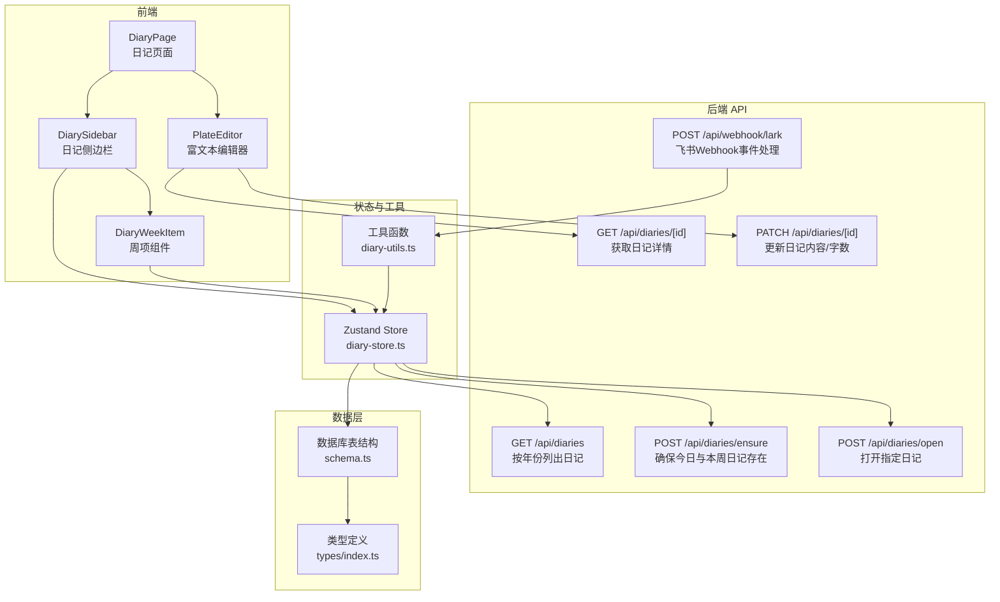
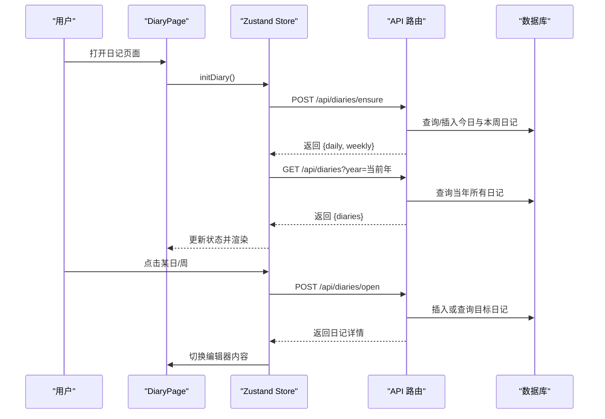
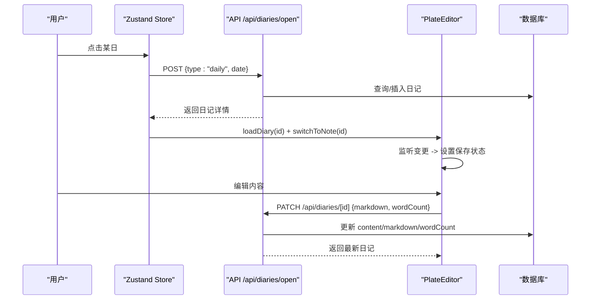
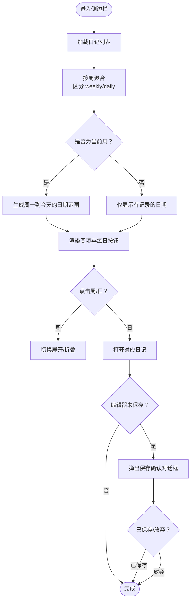
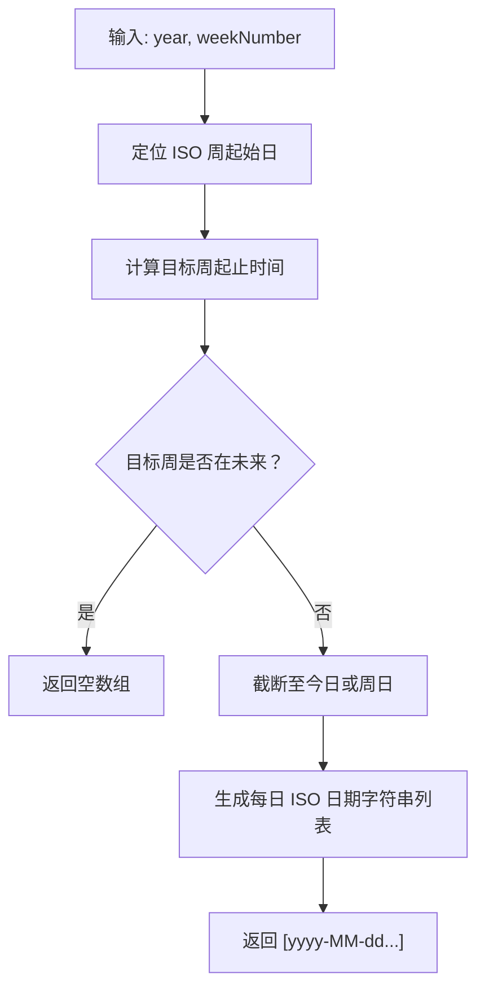
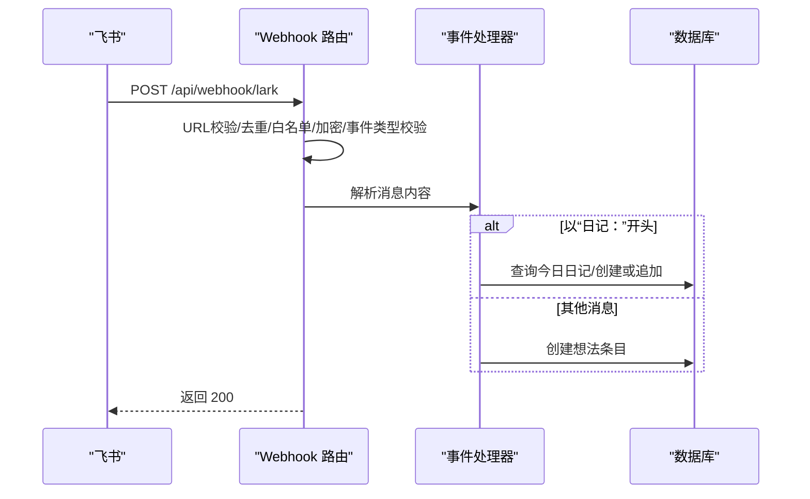
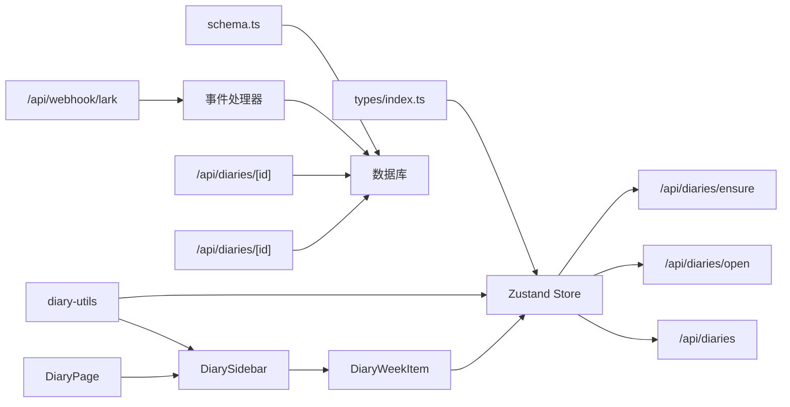

# 日记系统

<cite>
**本文引用的文件**
- [src/components/diary/diary-page.tsx](file://src/components/diary/diary-page.tsx)
- [src/components/diary/diary-sidebar.tsx](file://src/components/diary/diary-sidebar.tsx)
- [src/components/diary/diary-week-item.tsx](file://src/components/diary/diary-week-item.tsx)
- [src/lib/diary-utils.ts](file://src/lib/diary-utils.ts)
- [src/stores/diary-store.ts](file://src/stores/diary-store.ts)
- [src/app/api/diaries/route.ts](file://src/app/api/diaries/route.ts)
- [src/app/api/diaries/[id]/route.ts](file://src/app/api/diaries/[id]/route.ts)
- [src/app/api/diaries/ensure/route.ts](file://src/app/api/diaries/ensure/route.ts)
- [src/app/api/diaries/open/route.ts](file://src/app/api/diaries/open/route.ts)
- [src/db/schema.ts](file://src/db/schema.ts)
- [src/types/index.ts](file://src/types/index.ts)
- [src/components/editor/plate-editor.tsx](file://src/components/editor/plate-editor.tsx)
- [src/lib/lark.ts](file://src/lib/lark.ts)
- [src/lib/lark-event-handler.ts](file://src/lib/lark-event-handler.ts)
- [src/app/api/webhook/lark/route.ts](file://src/app/api/webhook/lark/route.ts)
</cite>

## 目录
1. [简介](#简介)
2. [项目结构](#项目结构)
3. [核心组件](#核心组件)
4. [架构总览](#架构总览)
5. [详细组件分析](#详细组件分析)
6. [依赖关系分析](#依赖关系分析)
7. [性能考量](#性能考量)
8. [故障排查指南](#故障排查指南)
9. [结论](#结论)
10. [附录](#附录)

## 简介
本文件为日记系统的功能文档，围绕“每日日记创建与编辑”、“每周总结”、“年度回顾设计思路”、“状态管理（草稿与发布）”、“侧边栏导航与历史记录”、“搜索与过滤”、“飞书云文档同步与冲突处理”、“时间序列分析与可视化”等主题进行系统化说明。文档既面向开发者也面向非技术读者，提供从架构到实现细节、从流程图到最佳实践的完整说明。

## 项目结构
日记系统采用前端 React 组件 + Zustand 状态管理 + Next.js API Routes 后端 + Drizzle ORM 数据层的分层架构。核心入口为日记页面组件，通过日记侧边栏组织周/日条目，编辑器负责内容输入与持久化，后端 API 提供日记的创建、查询、更新能力，并支持与飞书云文档的事件集成。

图表来源
- [src/components/diary/diary-page.tsx:1-29](file://src/components/diary/diary-page.tsx#L1-L29)
- [src/components/diary/diary-sidebar.tsx:1-116](file://src/components/diary/diary-sidebar.tsx#L1-L116)
- [src/components/diary/diary-week-item.tsx:1-122](file://src/components/diary/diary-week-item.tsx#L1-L122)
- [src/stores/diary-store.ts:1-234](file://src/stores/diary-store.ts#L1-L234)
- [src/lib/diary-utils.ts:1-113](file://src/lib/diary-utils.ts#L1-L113)
- [src/app/api/diaries/route.ts:1-45](file://src/app/api/diaries/route.ts#L1-L45)
- [src/app/api/diaries/ensure/route.ts:1-127](file://src/app/api/diaries/ensure/route.ts#L1-L127)
- [src/app/api/diaries/open/route.ts:1-130](file://src/app/api/diaries/open/route.ts#L1-L130)
- [src/app/api/diaries/[id]/route.ts:1-63](file://src/app/api/diaries/[id]/route.ts#L1-L63)
- [src/app/api/webhook/lark/route.ts:1-106](file://src/app/api/webhook/lark/route.ts#L1-L106)
- [src/db/schema.ts:1-105](file://src/db/schema.ts#L1-L105)
- [src/types/index.ts:1-74](file://src/types/index.ts#L1-L74)

章节来源
- [src/components/diary/diary-page.tsx:1-29](file://src/components/diary/diary-page.tsx#L1-L29)
- [src/components/diary/diary-sidebar.tsx:1-116](file://src/components/diary/diary-sidebar.tsx#L1-L116)
- [src/components/diary/diary-week-item.tsx:1-122](file://src/components/diary/diary-week-item.tsx#L1-L122)
- [src/stores/diary-store.ts:1-234](file://src/stores/diary-store.ts#L1-L234)
- [src/lib/diary-utils.ts:1-113](file://src/lib/diary-utils.ts#L1-L113)
- [src/app/api/diaries/route.ts:1-45](file://src/app/api/diaries/route.ts#L1-L45)
- [src/app/api/diaries/ensure/route.ts:1-127](file://src/app/api/diaries/ensure/route.ts#L1-L127)
- [src/app/api/diaries/open/route.ts:1-130](file://src/app/api/diaries/open/route.ts#L1-L130)
- [src/app/api/diaries/[id]/route.ts:1-63](file://src/app/api/diaries/[id]/route.ts#L1-L63)
- [src/app/api/webhook/lark/route.ts:1-106](file://src/app/api/webhook/lark/route.ts#L1-L106)
- [src/db/schema.ts:1-105](file://src/db/schema.ts#L1-L105)
- [src/types/index.ts:1-74](file://src/types/index.ts#L1-L74)

## 核心组件
- 日记页面容器：负责布局与挂载侧边栏与编辑器。
- 日记侧边栏：按年/周/日组织条目，支持年份切换、周展开/折叠、当前周高亮。
- 周项组件：渲染周标题与每日条目，处理点击打开、保存确认对话框。
- 日记存储（Zustand）：集中管理选中年份、日记列表、展开周集合、加载状态、初始化流程、打开日记、确保今日日记等。
- 工具函数：ISO 周计算、周内天数生成、标签格式化、当前周判断等。
- 编辑器：基于 Plate 的富文本编辑器，负责内容变更检测、保存状态、Markdown 序列化。
- API 层：提供日记列表、确保今日/本周、打开指定日记、读取/更新日记详情；并提供飞书 Webhook 入口。
- 数据模型：定义日记表结构与类型别名，统一前后端数据契约。

章节来源
- [src/components/diary/diary-page.tsx:1-29](file://src/components/diary/diary-page.tsx#L1-L29)
- [src/components/diary/diary-sidebar.tsx:1-116](file://src/components/diary/diary-sidebar.tsx#L1-L116)
- [src/components/diary/diary-week-item.tsx:1-122](file://src/components/diary/diary-week-item.tsx#L1-L122)
- [src/stores/diary-store.ts:1-234](file://src/stores/diary-store.ts#L1-L234)
- [src/lib/diary-utils.ts:1-113](file://src/lib/diary-utils.ts#L1-L113)
- [src/components/editor/plate-editor.tsx:1-175](file://src/components/editor/plate-editor.tsx#L1-L175)
- [src/app/api/diaries/route.ts:1-45](file://src/app/api/diaries/route.ts#L1-L45)
- [src/app/api/diaries/ensure/route.ts:1-127](file://src/app/api/diaries/ensure/route.ts#L1-L127)
- [src/app/api/diaries/open/route.ts:1-130](file://src/app/api/diaries/open/route.ts#L1-L130)
- [src/app/api/diaries/[id]/route.ts:1-63](file://src/app/api/diaries/[id]/route.ts#L1-L63)
- [src/db/schema.ts:1-105](file://src/db/schema.ts#L1-L105)
- [src/types/index.ts:1-74](file://src/types/index.ts#L1-L74)

## 架构总览
系统采用“前端组件 + 状态管理 + API 路由 + 数据库”的清晰分层：
- 前端负责交互与视图渲染，通过 Zustand 维护日记状态。
- API 路由负责数据访问与业务校验（如日期有效性、未来日期禁止）。
- 数据库通过 Drizzle ORM 映射到 SQLite 表结构，统一字段与约束。
- 飞书 Webhook 作为外部事件入口，调用共享的消息处理器，实现“日记：”前缀消息的自动创建/追加。

图表来源
- [src/components/diary/diary-page.tsx:1-29](file://src/components/diary/diary-page.tsx#L1-L29)
- [src/stores/diary-store.ts:153-185](file://src/stores/diary-store.ts#L153-L185)
- [src/app/api/diaries/ensure/route.ts:1-127](file://src/app/api/diaries/ensure/route.ts#L1-L127)
- [src/app/api/diaries/route.ts:1-45](file://src/app/api/diaries/route.ts#L1-L45)
- [src/app/api/diaries/open/route.ts:1-130](file://src/app/api/diaries/open/route.ts#L1-L130)

## 详细组件分析

### 每日日记创建与编辑流程
- 初始化：首次进入页面时，自动确保“今日日记”和“本周周记”存在，并拉取当年全部日记，展开当前周，自动打开今日日记。
- 打开日记：点击侧边栏的周或日，触发打开流程，若不存在则创建；成功后切换编辑器内容并标记为已保存基线。
- 内容变更检测：编辑器通过结构化比较快速判断内容是否变化，设置保存状态；支持保存确认对话框，避免未保存丢失。
- 更新持久化：编辑器序列化为 Markdown，提交 PATCH 请求更新内容与字数统计。

图表来源
- [src/stores/diary-store.ts:102-142](file://src/stores/diary-store.ts#L102-L142)
- [src/app/api/diaries/open/route.ts:1-130](file://src/app/api/diaries/open/route.ts#L1-L130)
- [src/components/editor/plate-editor.tsx:63-175](file://src/components/editor/plate-editor.tsx#L1-L175)
- [src/app/api/diaries/[id]/route.ts:26-62](file://src/app/api/diaries/[id]/route.ts#L1-L63)

章节来源
- [src/stores/diary-store.ts:153-185](file://src/stores/diary-store.ts#L153-L185)
- [src/app/api/diaries/open/route.ts:14-130](file://src/app/api/diaries/open/route.ts#L1-L130)
- [src/components/editor/plate-editor.tsx:63-175](file://src/components/editor/plate-editor.tsx#L1-L175)
- [src/app/api/diaries/[id]/route.ts:26-62](file://src/app/api/diaries/[id]/route.ts#L1-L63)

### 侧边栏导航与历史记录
- 年份选择：支持上一年/下一年切换，禁用未来年份按钮。
- 周分组：按周号聚合周记与日记，当前周显示从周一到“今天”的所有日期，历史周仅显示有记录的日期。
- 展开/折叠：点击周标题切换展开状态；周内日期高亮当前选中项。
- 交互保护：当编辑器处于“未保存”状态时，先弹出保存确认对话框再执行跳转。

图表来源
- [src/components/diary/diary-sidebar.tsx:17-61](file://src/components/diary/diary-sidebar.tsx#L17-L61)
- [src/components/diary/diary-week-item.tsx:27-46](file://src/components/diary/diary-week-item.tsx#L27-L46)
- [src/lib/diary-utils.ts:67-91](file://src/lib/diary-utils.ts#L67-L91)

章节来源
- [src/components/diary/diary-sidebar.tsx:1-116](file://src/components/diary/diary-sidebar.tsx#L1-L116)
- [src/components/diary/diary-week-item.tsx:1-122](file://src/components/diary/diary-week-item.tsx#L1-L122)
- [src/lib/diary-utils.ts:1-113](file://src/lib/diary-utils.ts#L1-L113)

### ISO 周计算与周数据聚合
- ISO 周算法：基于本地时间计算 ISO 周年与周数，支持“当前周”判断与“周内天数生成”。
- 周内天数：对于未来周返回空数组；对当前周返回周一到“今天”的日期列表；对历史周仅返回已有记录的日期。
- 前端聚合：Store 中按周号构建 Map，分离 weekly 与 daily，并按周倒序排列，按日期倒序排列日条目。

图表来源
- [src/lib/diary-utils.ts:67-91](file://src/lib/diary-utils.ts#L67-L91)
- [src/stores/diary-store.ts:187-232](file://src/stores/diary-store.ts#L187-L232)

章节来源
- [src/lib/diary-utils.ts:1-113](file://src/lib/diary-utils.ts#L1-L113)
- [src/stores/diary-store.ts:187-232](file://src/stores/diary-store.ts#L187-L232)

### 年度回顾设计思路与数据统计
- 数据来源：按年份查询日记列表，包含 daily 与 weekly 条目。
- 统计维度：可按周聚合字数、条目数量、平均字数等；按月汇总周数分布。
- 可视化建议：折线图展示月均字数趋势，柱状图展示周字数分布，热力图标注活跃日期。
- 实现要点：前端 Store 提供 getWeekGroups 便于按周聚合；后端 API 支持按年筛选与排序。

章节来源
- [src/app/api/diaries/route.ts:6-36](file://src/app/api/diaries/route.ts#L1-L45)
- [src/stores/diary-store.ts:187-232](file://src/stores/diary-store.ts#L187-L232)

### 状态管理：草稿与发布机制
- 保存状态：编辑器通过结构化比较判断“已保存/未保存/保存中/错误”，并在切换笔记时重置基线。
- 发布/保存：未保存状态下切换日记会弹出确认对话框，允许先保存再跳转或直接放弃。
- 字数统计：编辑器序列化为 Markdown 后提交 PATCH 接口，接口更新 wordCount 字段。

章节来源
- [src/components/editor/plate-editor.tsx:16-61](file://src/components/editor/plate-editor.tsx#L1-L175)
- [src/components/diary/diary-week-item.tsx:27-46](file://src/components/diary/diary-week-item.tsx#L1-L122)
- [src/app/api/diaries/[id]/route.ts:40-54](file://src/app/api/diaries/[id]/route.ts#L1-L63)

### 搜索与过滤功能
- 当前实现：侧边栏按年份与周聚合展示，未提供全文搜索与标签过滤。
- 建议扩展：在 Store 中增加 filterDiaries 方法，支持关键词匹配 content/markdown、按周/日过滤、按字数区间过滤；后端可新增搜索路由配合数据库 LIKE 或全文索引。

章节来源
- [src/components/diary/diary-sidebar.tsx:17-61](file://src/components/diary/diary-sidebar.tsx#L17-L61)
- [src/stores/diary-store.ts:187-232](file://src/stores/diary-store.ts#L187-L232)

### 飞书云文档同步与冲突解决
- Webhook 入口：接收飞书 im.message.receive_v1 事件，进行 URL 校验、去重、白名单校验、加密校验与消息类型校验。
- 消息处理：共享处理器根据“日记：”前缀创建/追加今日日记；否则作为想法条目处理。
- 冲突策略：Webhook 事件去重（5 分钟 TTL），避免重复写入；编辑器保存采用“结构化比较 + 保存确认”，降低并发覆盖风险。

图表来源
- [src/app/api/webhook/lark/route.ts:28-105](file://src/app/api/webhook/lark/route.ts#L1-L106)
- [src/lib/lark-event-handler.ts:28-87](file://src/lib/lark-event-handler.ts#L1-L126)

章节来源
- [src/app/api/webhook/lark/route.ts:1-106](file://src/app/api/webhook/lark/route.ts#L1-L106)
- [src/lib/lark-event-handler.ts:1-126](file://src/lib/lark-event-handler.ts#L1-L126)

### 时间序列分析与可视化展示
- 数据准备：按周/日聚合字数、条目数、活跃天数。
- 建议指标：周均字数、月均字数、连续活跃天数、周内最高/最低字数。
- 可视化方案：折线图（趋势）、柱状图（分布）、热力图（活跃度）。
- 技术要点：前端 Store 提供 getWeekGroups 与按年筛选；后端 API 支持按年查询；编辑器保存后及时更新 wordCount。

章节来源
- [src/stores/diary-store.ts:187-232](file://src/stores/diary-store.ts#L187-L232)
- [src/app/api/diaries/route.ts:6-36](file://src/app/api/diaries/route.ts#L1-L45)
- [src/app/api/diaries/[id]/route.ts:40-54](file://src/app/api/diaries/[id]/route.ts#L1-L63)

## 依赖关系分析
- 组件耦合：DiaryPage 依赖 DiarySidebar 与 PlateEditor；DiarySidebar 依赖 DiaryWeekItem 与 Store；DiaryWeekItem 依赖 Store 与工具函数。
- 存储与 API：Store 通过 API 路由与数据库交互；API 路由依赖 Drizzle ORM 与 schema 定义。
- 飞书集成：Webhook 路由依赖 Lark 配置与事件处理器；事件处理器依赖数据库与日期工具。

图表来源
- [src/components/diary/diary-page.tsx:1-29](file://src/components/diary/diary-page.tsx#L1-L29)
- [src/components/diary/diary-sidebar.tsx:1-116](file://src/components/diary/diary-sidebar.tsx#L1-L116)
- [src/components/diary/diary-week-item.tsx:1-122](file://src/components/diary/diary-week-item.tsx#L1-L122)
- [src/stores/diary-store.ts:1-234](file://src/stores/diary-store.ts#L1-L234)
- [src/lib/diary-utils.ts:1-113](file://src/lib/diary-utils.ts#L1-L113)
- [src/app/api/diaries/route.ts:1-45](file://src/app/api/diaries/route.ts#L1-L45)
- [src/app/api/diaries/ensure/route.ts:1-127](file://src/app/api/diaries/ensure/route.ts#L1-L127)
- [src/app/api/diaries/open/route.ts:1-130](file://src/app/api/diaries/open/route.ts#L1-L130)
- [src/app/api/diaries/[id]/route.ts:1-63](file://src/app/api/diaries/[id]/route.ts#L1-L63)
- [src/app/api/webhook/lark/route.ts:1-106](file://src/app/api/webhook/lark/route.ts#L1-L106)
- [src/lib/lark-event-handler.ts:1-126](file://src/lib/lark-event-handler.ts#L1-L126)
- [src/db/schema.ts:1-105](file://src/db/schema.ts#L1-L105)
- [src/types/index.ts:1-74](file://src/types/index.ts#L1-L74)

## 性能考量
- 渲染优化：侧边栏使用 useMemo 缓存周分组计算，避免重复渲染。
- 网络请求：Store 在年份切换与初始化时批量请求，减少多次往返。
- 编辑性能：编辑器采用结构化比较，避免深度 JSON 比较带来的性能损耗。
- 数据库：API 查询按周/日排序，减少前端排序成本；Drizzle ORM 提供类型安全与最小化字段选择。

章节来源
- [src/components/diary/diary-sidebar.tsx:17-61](file://src/components/diary/diary-sidebar.tsx#L17-L61)
- [src/stores/diary-store.ts:69-82](file://src/stores/diary-store.ts#L69-L82)
- [src/components/editor/plate-editor.tsx:16-61](file://src/components/editor/plate-editor.tsx#L1-L175)
- [src/app/api/diaries/route.ts:20-36](file://src/app/api/diaries/route.ts#L1-L45)

## 故障排查指南
- Webhook 未生效
  - 检查 LARK_APP_ID/LARK_APP_SECRET 是否配置；验证 Verification Token 与加密密钥设置。
  - 确认事件类型为 im.message.receive_v1，且消息类型为 text。
  - 查看去重日志与白名单限制。
- 无法打开未来日期/周
  - 后端对 daily 日期与 weekly 周号做了未来日期校验，需确保客户端传入合法值。
- 保存冲突
  - 编辑器未保存状态下切换日记会弹出确认对话框；若出现覆盖问题，检查并发保存策略与去重逻辑。
- 数据不一致
  - 确认 PATCH 接口正确更新 wordCount；检查 Drizzle ORM 字段映射与默认值。

章节来源
- [src/app/api/webhook/lark/route.ts:28-105](file://src/app/api/webhook/lark/route.ts#L1-L106)
- [src/app/api/diaries/open/route.ts:33-73](file://src/app/api/diaries/open/route.ts#L1-L130)
- [src/app/api/diaries/[id]/route.ts:40-54](file://src/app/api/diaries/[id]/route.ts#L1-L63)
- [src/db/schema.ts:93-104](file://src/db/schema.ts#L1-L105)

## 结论
本系统以清晰的分层架构实现了“每日日记 + 周汇总 + 年度回顾”的核心功能，结合飞书 Webhook 实现外部输入的自动化处理。通过 ISO 周算法与周内天数生成，提供了自然的时间组织方式；编辑器的结构化比较与保存确认机制有效保障了内容安全。后续可在搜索过滤、可视化分析、冲突处理等方面进一步增强用户体验与数据洞察力。

## 附录
- 用户操作指南（概要）
  - 打开应用 → 自动进入今日日记；左侧年份可切换；点击周标题展开/收起；点击具体日期打开对应日记；编辑器未保存时切换会提示保存。
  - 通过“日记：”消息在飞书内快速创建/追加今日日记；消息去重与白名单控制保证稳定性。
  - 年度回顾：按年筛选，统计周均字数、活跃天数，生成可视化图表辅助复盘。