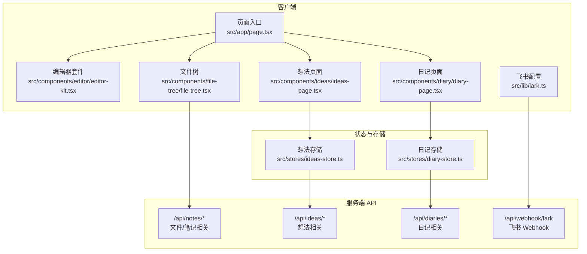
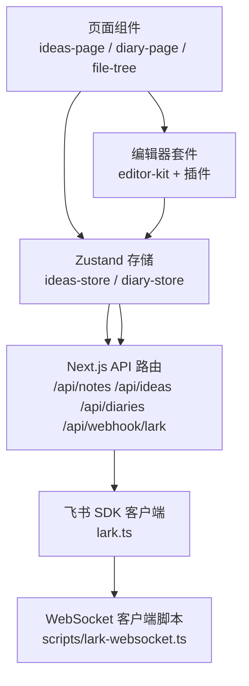
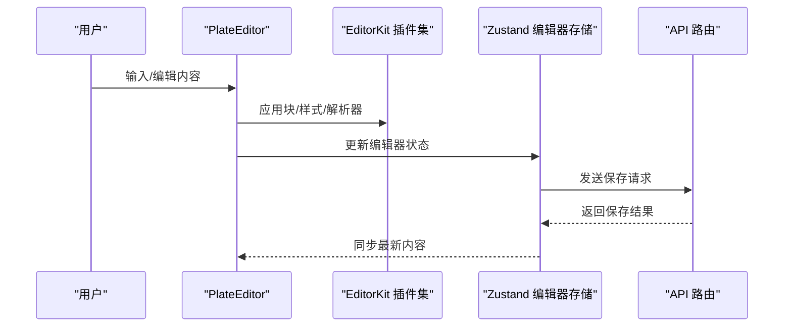
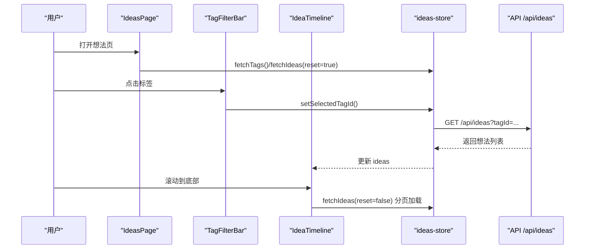
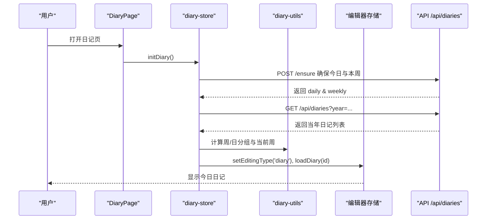
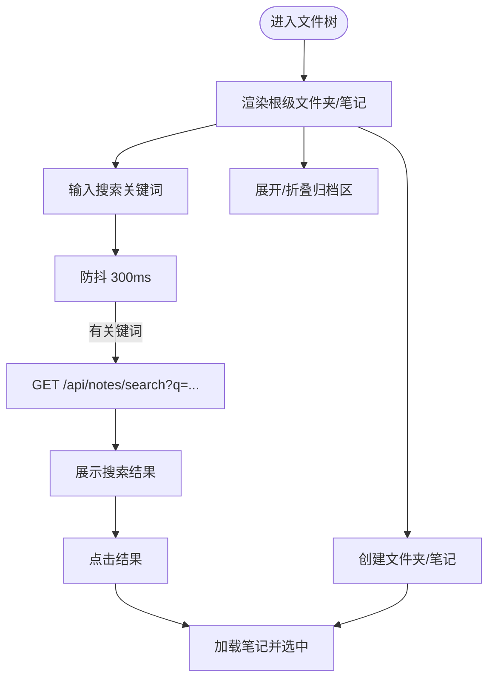
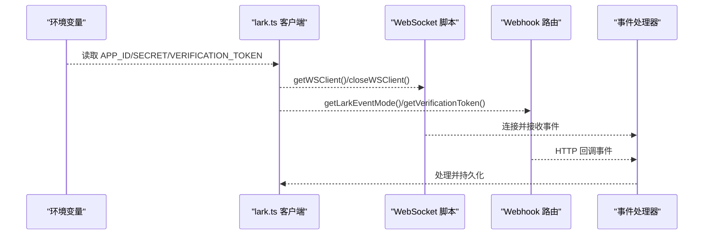
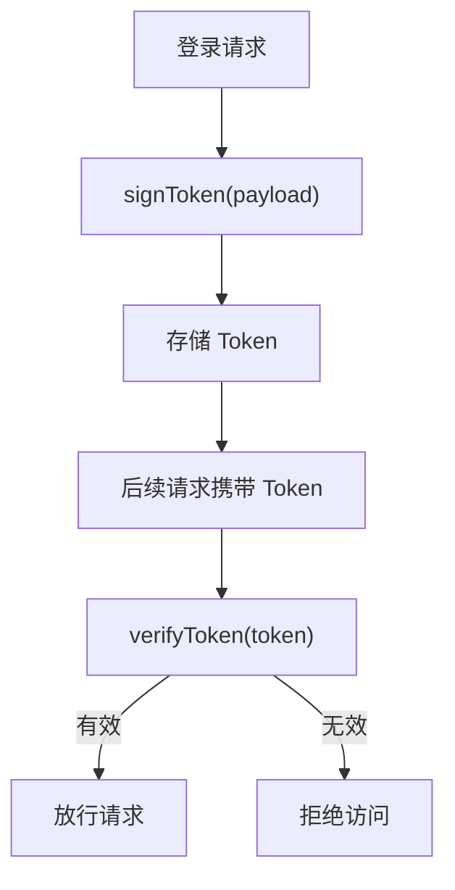
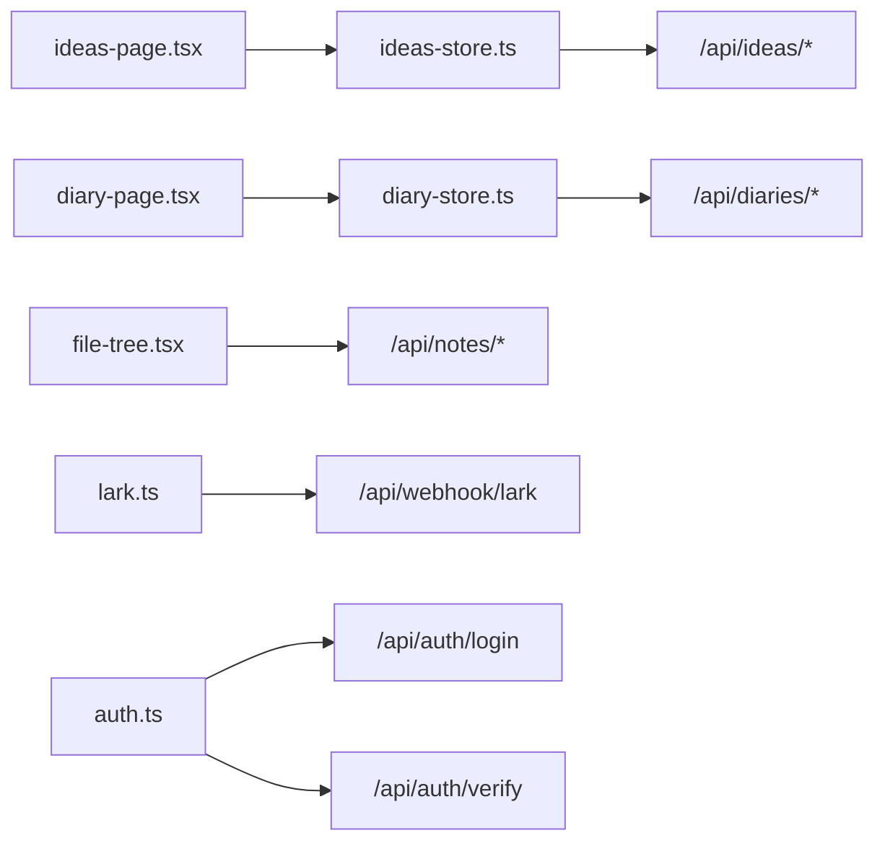

# 核心功能特性

<cite>
**本文引用的文件**
- [README.md](file://README.md)
- [src/app/page.tsx](file://src/app/page.tsx)
- [src/components/editor/editor-kit.tsx](file://src/components/editor/editor-kit.tsx)
- [src/components/ideas/ideas-page.tsx](file://src/components/ideas/ideas-page.tsx)
- [src/components/ideas/tag-filter-bar.tsx](file://src/components/ideas/tag-filter-bar.tsx)
- [src/components/ideas/idea-timeline.tsx](file://src/components/ideas/idea-timeline.tsx)
- [src/stores/ideas-store.ts](file://src/stores/ideas-store.ts)
- [src/components/diary/diary-page.tsx](file://src/components/diary/diary-page.tsx)
- [src/components/diary/diary-sidebar.tsx](file://src/components/diary/diary-sidebar.tsx)
- [src/components/diary/diary-week-item.tsx](file://src/components/diary/diary-week-item.tsx)
- [src/stores/diary-store.ts](file://src/stores/diary-store.ts)
- [src/lib/diary-utils.ts](file://src/lib/diary-utils.ts)
- [src/components/file-tree/file-tree.tsx](file://src/components/file-tree/file-tree.tsx)
- [src/lib/lark.ts](file://src/lib/lark.ts)
- [scripts/lark-websocket.ts](file://scripts/lark-websocket.ts)
- [src/lib/auth.ts](file://src/lib/auth.ts)
- [src/lib/image-process.ts](file://src/lib/image-process.ts)
</cite>

## 目录
1. [简介](#简介)
2. [项目结构](#项目结构)
3. [核心组件](#核心组件)
4. [架构总览](#架构总览)
5. [详细组件分析](#详细组件分析)
6. [依赖分析](#依赖分析)
7. [性能考虑](#性能考虑)
8. [故障排除指南](#故障排除指南)
9. [结论](#结论)
10. [附录](#附录)

## 简介
本文件面向 YNote v2 项目，系统性梳理其核心功能特性与实现要点，覆盖以下方面：
- 富文本编辑：基于 Plate 的可扩展编辑器套件，支持块级元素、内联样式、媒体、表格、公式、目录等。
- Markdown 支持：通过 MarkdownKit 解析器实现 Markdown 到编辑器内容模型的转换。
- 内容管理：文件树导航、笔记搜索、归档与层级组织。
- 想法记录系统：想法的增删改查、标签分类、时间线展示与分页加载。
- 日记系统：每日记录、每周汇总、年度回顾；侧边栏按周/日组织，自动确保今日与本周存在。
- 飞书云文档集成：配置化事件模式（Webhook/WebSocket），长连接与消息解密，支持双向同步。
- 用户认证与权限：基于 JWT 的登录与校验流程。
- 功能间协作与数据流：编辑器状态、全局存储、API 路由与飞书事件处理之间的联动。

## 项目结构
YNote v2 采用 Next.js App Router 结构，前端以组件与存储为核心，后端 API 路由位于 app/api 下，工具库集中在 src/lib，WebSocket 客户端脚本位于 scripts。

图表来源
- [src/app/page.tsx:1-6](file://src/app/page.tsx#L1-L6)
- [src/components/editor/editor-kit.tsx:1-83](file://src/components/editor/editor-kit.tsx#L1-L83)
- [src/components/ideas/ideas-page.tsx:1-43](file://src/components/ideas/ideas-page.tsx#L1-L43)
- [src/components/diary/diary-page.tsx:1-29](file://src/components/diary/diary-page.tsx#L1-L29)
- [src/components/file-tree/file-tree.tsx:1-326](file://src/components/file-tree/file-tree.tsx#L1-L326)
- [src/lib/lark.ts:1-96](file://src/lib/lark.ts#L1-L96)
- [src/stores/ideas-store.ts:1-126](file://src/stores/ideas-store.ts#L1-L126)
- [src/stores/diary-store.ts:1-234](file://src/stores/diary-store.ts#L1-L234)

章节来源
- [README.md:1-37](file://README.md#L1-L37)
- [src/app/page.tsx:1-6](file://src/app/page.tsx#L1-L6)

## 核心组件
- 富文本编辑器套件：通过 EditorKit 组合多种插件（块、标记、列表、对齐、行高、链接、提及、表格、目录、数学公式、日期、媒体、拖拽、占位符、固定/浮动工具栏等），并启用 Markdown 与 DOCX 解析器，满足多格式内容创作与导入。
- 想法记录系统：包含想法时间线、标签筛选、新增/更新/删除想法，支持无限滚动加载与标签计数刷新。
- 日记系统：侧边栏按年份切换，按周聚合，当前周显示至今日的所有日期，支持周/日条目打开与自动确保今日日记存在。
- 文件树导航：支持创建文件夹/笔记、展开/折叠全部、搜索笔记、归档区显示与切换。
- 飞书集成：统一客户端初始化、事件模式选择（Webhook/WebSocket）、消息解密与加密密钥配置、允许用户白名单、文件夹令牌等。
- 认证与权限：基于 JWT 的签发与校验，支持过期时间与密钥配置。

章节来源
- [src/components/editor/editor-kit.tsx:1-83](file://src/components/editor/editor-kit.tsx#L1-L83)
- [src/stores/ideas-store.ts:1-126](file://src/stores/ideas-store.ts#L1-L126)
- [src/stores/diary-store.ts:1-234](file://src/stores/diary-store.ts#L1-L234)
- [src/components/file-tree/file-tree.tsx:1-326](file://src/components/file-tree/file-tree.tsx#L1-L326)
- [src/lib/lark.ts:1-96](file://src/lib/lark.ts#L1-L96)
- [src/lib/auth.ts:1-26](file://src/lib/auth.ts#L1-L26)

## 架构总览
YNote v2 的前端采用组件驱动与状态管理分离的设计：页面组件负责布局与交互，Zustand 存储负责数据与异步逻辑，API 路由提供后端能力，飞书 SDK 提供云端同步与事件订阅。

图表来源
- [src/components/ideas/ideas-page.tsx:1-43](file://src/components/ideas/ideas-page.tsx#L1-L43)
- [src/components/diary/diary-page.tsx:1-29](file://src/components/diary/diary-page.tsx#L1-L29)
- [src/components/file-tree/file-tree.tsx:1-326](file://src/components/file-tree/file-tree.tsx#L1-L326)
- [src/stores/ideas-store.ts:1-126](file://src/stores/ideas-store.ts#L1-L126)
- [src/stores/diary-store.ts:1-234](file://src/stores/diary-store.ts#L1-L234)
- [src/lib/lark.ts:1-96](file://src/lib/lark.ts#L1-L96)
- [scripts/lark-websocket.ts](file://scripts/lark-websocket.ts)

## 详细组件分析

### 富文本编辑器（Editor）
- 核心价值：提供类 Notion 的所见即所得体验，支持块级元素、内联样式、媒体、表格、公式、目录、拖拽排序、自动格式化、占位提示、固定/浮动工具栏等。
- 使用场景：撰写 Markdown 文档、插入图片/视频、构建带样式的段落与列表、嵌入公式与表格。
- 基本操作流程：初始化编辑器实例 → 注入插件套件 → 渲染编辑器 → 用户输入/编辑 → 保存到后端。
- 数据流转：编辑器状态变更 → 触发保存请求 → 后端持久化 → 状态同步。

图表来源
- [src/components/editor/editor-kit.tsx:1-83](file://src/components/editor/editor-kit.tsx#L1-L83)

章节来源
- [src/components/editor/editor-kit.tsx:1-83](file://src/components/editor/editor-kit.tsx#L1-L83)

### 想法记录系统（Ideas）
- 核心价值：集中沉淀灵感与创意，支持标签分类、时间线展示与无限滚动加载，便于回顾与检索。
- 使用场景：快速记录想法、按标签筛选、查看历史时间线。
- 基本操作流程：进入想法页 → 初始化标签与时间线 → 选择标签过滤 → 新增/编辑想法 → 删除想法。
- 数据流转：UI 事件 → Store 方法 → API 请求 → 后端返回 → Store 更新 → UI 重新渲染。

图表来源
- [src/components/ideas/ideas-page.tsx:1-43](file://src/components/ideas/ideas-page.tsx#L1-L43)
- [src/components/ideas/tag-filter-bar.tsx:1-52](file://src/components/ideas/tag-filter-bar.tsx#L1-L52)
- [src/components/ideas/idea-timeline.tsx:1-69](file://src/components/ideas/idea-timeline.tsx#L1-L69)
- [src/stores/ideas-store.ts:1-126](file://src/stores/ideas-store.ts#L1-L126)

章节来源
- [src/components/ideas/ideas-page.tsx:1-43](file://src/components/ideas/ideas-page.tsx#L1-L43)
- [src/components/ideas/tag-filter-bar.tsx:1-52](file://src/components/ideas/tag-filter-bar.tsx#L1-L52)
- [src/components/ideas/idea-timeline.tsx:1-69](file://src/components/ideas/idea-timeline.tsx#L1-L69)
- [src/stores/ideas-store.ts:1-126](file://src/stores/ideas-store.ts#L1-L126)

### 日记系统（Diary）
- 核心价值：以 ISO 周为单位组织日常与周度记录，自动确保今日与本周存在，支持年度回顾与周内快速跳转。
- 使用场景：每日写日记、每周总结、年度回顾与浏览。
- 基本操作流程：初始化 → 确保今日日记 → 获取当年条目 → 展开当前周 → 自动打开今日日记 → 侧边栏切换年份/周/日。
- 数据流转：Store 初始化 → 调用 ensureToday → 拉取当年日记 → 组装周/日分组 → 打开选中日记 → 编辑器加载对应内容。

图表来源
- [src/components/diary/diary-page.tsx:1-29](file://src/components/diary/diary-page.tsx#L1-L29)
- [src/stores/diary-store.ts:1-234](file://src/stores/diary-store.ts#L1-L234)
- [src/lib/diary-utils.ts:1-113](file://src/lib/diary-utils.ts#L1-L113)

章节来源
- [src/components/diary/diary-page.tsx:1-29](file://src/components/diary/diary-page.tsx#L1-L29)
- [src/stores/diary-store.ts:1-234](file://src/stores/diary-store.ts#L1-L234)
- [src/lib/diary-utils.ts:1-113](file://src/lib/diary-utils.ts#L1-L113)

### 文件树导航（File Tree）
- 核心价值：以树形结构组织笔记与文件夹，支持创建、搜索、展开/折叠、归档管理，提升大体量内容的可发现性。
- 使用场景：快速定位笔记、批量创建/移动、按关键字检索。
- 基本操作流程：渲染根级文件夹/笔记 → 展示归档区 → 输入关键词触发防抖搜索 → 点击结果加载笔记。
- 数据流转：UI 事件 → Store 方法 → API 搜索 → 返回结果 → 选中并加载笔记。

图表来源
- [src/components/file-tree/file-tree.tsx:1-326](file://src/components/file-tree/file-tree.tsx#L1-L326)

章节来源
- [src/components/file-tree/file-tree.tsx:1-326](file://src/components/file-tree/file-tree.tsx#L1-L326)

### 飞书云文档集成（Lark）
- 核心价值：通过 Webhook 或 WebSocket 接收飞书事件，实现双向同步与实时通信；支持消息解密、用户白名单与文件夹令牌。
- 使用场景：将本地笔记与飞书云文档保持一致，接收云端变更并回写本地。
- 基本操作流程：配置环境变量 → 初始化 SDK 客户端 → 选择事件模式 → 处理事件（Webhook 或 WebSocket）→ 关闭连接。
- 数据流转：SDK 客户端 → 事件回调 → 业务处理器 → 本地状态/数据库更新。

图表来源
- [src/lib/lark.ts:1-96](file://src/lib/lark.ts#L1-L96)
- [scripts/lark-websocket.ts](file://scripts/lark-websocket.ts)

章节来源
- [src/lib/lark.ts:1-96](file://src/lib/lark.ts#L1-L96)
- [scripts/lark-websocket.ts](file://scripts/lark-websocket.ts)

### 用户认证与权限（Auth）
- 核心价值：提供登录签发与校验能力，支持自定义过期时间与密钥，保障会话安全。
- 使用场景：登录态维护、接口鉴权、权限控制。
- 基本操作流程：登录请求 → 生成 JWT → 存储 Token → 校验 Token。
- 数据流转：auth 工具 → API 路由 → 前端存储 → 请求头携带 Token。

图表来源
- [src/lib/auth.ts:1-26](file://src/lib/auth.ts#L1-L26)

章节来源
- [src/lib/auth.ts:1-26](file://src/lib/auth.ts#L1-L26)

## 依赖分析
- 组件耦合：页面组件仅依赖存储与工具库，存储通过 fetch 与 API 路由交互，降低 UI 与后端的直接耦合。
- 外部依赖：飞书 SDK、date-fns、sharp（图像处理）、jose（JWT）等。
- 可能的循环依赖：当前结构以单向数据流为主，未见明显循环依赖迹象。

图表来源
- [src/components/ideas/ideas-page.tsx:1-43](file://src/components/ideas/ideas-page.tsx#L1-L43)
- [src/stores/ideas-store.ts:1-126](file://src/stores/ideas-store.ts#L1-L126)
- [src/components/diary/diary-page.tsx:1-29](file://src/components/diary/diary-page.tsx#L1-L29)
- [src/stores/diary-store.ts:1-234](file://src/stores/diary-store.ts#L1-L234)
- [src/components/file-tree/file-tree.tsx:1-326](file://src/components/file-tree/file-tree.tsx#L1-L326)
- [src/lib/lark.ts:1-96](file://src/lib/lark.ts#L1-L96)
- [src/lib/auth.ts:1-26](file://src/lib/auth.ts#L1-L26)

## 性能考虑
- 想法时间线：使用 IntersectionObserver 实现“到达底部加载更多”，减少不必要的请求与重绘。
- 文件树搜索：300ms 防抖降低频繁网络请求，提升响应速度。
- 图像处理：使用 sharp 对图片进行压缩与格式转换，控制尺寸与质量，平衡清晰度与体积。
- 无限滚动与分页：Store 中的 reset 与 cursor 参数配合，避免重复数据与内存占用。

章节来源
- [src/components/ideas/idea-timeline.tsx:1-69](file://src/components/ideas/idea-timeline.tsx#L1-L69)
- [src/components/file-tree/file-tree.tsx:87-122](file://src/components/file-tree/file-tree.tsx#L87-L122)
- [src/lib/image-process.ts:1-21](file://src/lib/image-process.ts#L1-L21)

## 故障排除指南
- 飞书事件未生效
  - 检查环境变量是否正确设置（APP_ID、APP_SECRET、VERIFICATION_TOKEN、EVENT_MODE、ENCRYPT_KEY、ALLOWED_USER_IDS、FOLDER_TOKEN）。
  - 确认事件模式与部署方式匹配（Webhook vs WebSocket）。
  - 查看 WebSocket 客户端是否正常连接与关闭。
- JWT 校验失败
  - 确认密钥与过期时间配置一致，检查 Token 是否过期。
- 想法/日记加载异常
  - 检查 API 路由返回状态码与数据结构，确认 Store 的 fetch 方法参数（如 tagId、cursor）。
- 文件树搜索无结果
  - 确认搜索关键词非空且防抖已触发，检查 /api/notes/search 的实现与返回字段。

章节来源
- [src/lib/lark.ts:25-57](file://src/lib/lark.ts#L25-L57)
- [src/lib/lark.ts:69-95](file://src/lib/lark.ts#L69-L95)
- [src/lib/auth.ts:18-25](file://src/lib/auth.ts#L18-L25)
- [src/stores/ideas-store.ts:29-59](file://src/stores/ideas-store.ts#L29-L59)
- [src/stores/diary-store.ts:69-82](file://src/stores/diary-store.ts#L69-L82)
- [src/components/file-tree/file-tree.tsx:87-108](file://src/components/file-tree/file-tree.tsx#L87-L108)

## 结论
YNote v2 通过模块化的组件与存储设计，结合丰富的编辑器插件与飞书集成，提供了从内容创作到协同同步的完整闭环。想法与日记两大知识管理模块分别覆盖“碎片化灵感”和“结构化记录”，文件树与搜索则保证了大规模内容的可发现性。建议在生产环境中完善错误边界与日志采集，并持续优化图像处理与网络请求策略。

## 附录
- 快速入口：首页重定向至 /app，作为应用主入口。
- 开发与部署：参考项目根 README 的开发与部署说明。

章节来源
- [src/app/page.tsx:1-6](file://src/app/page.tsx#L1-L6)
- [README.md:1-37](file://README.md#L1-L37)