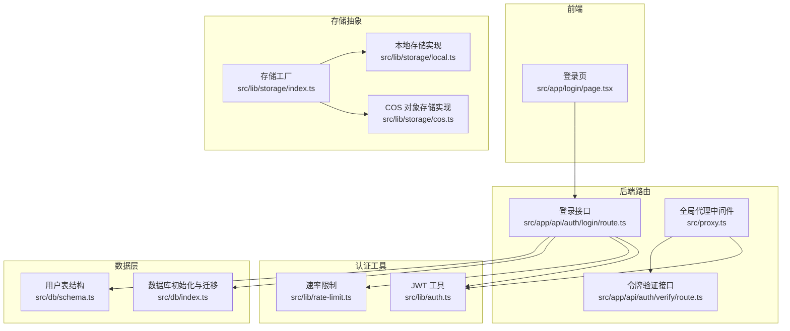
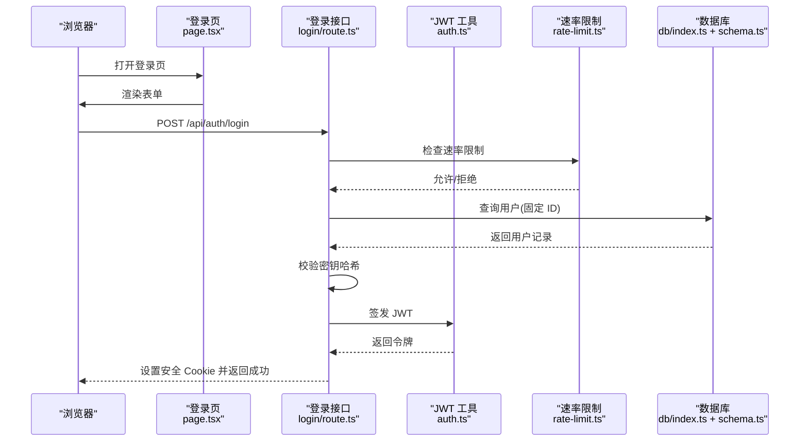
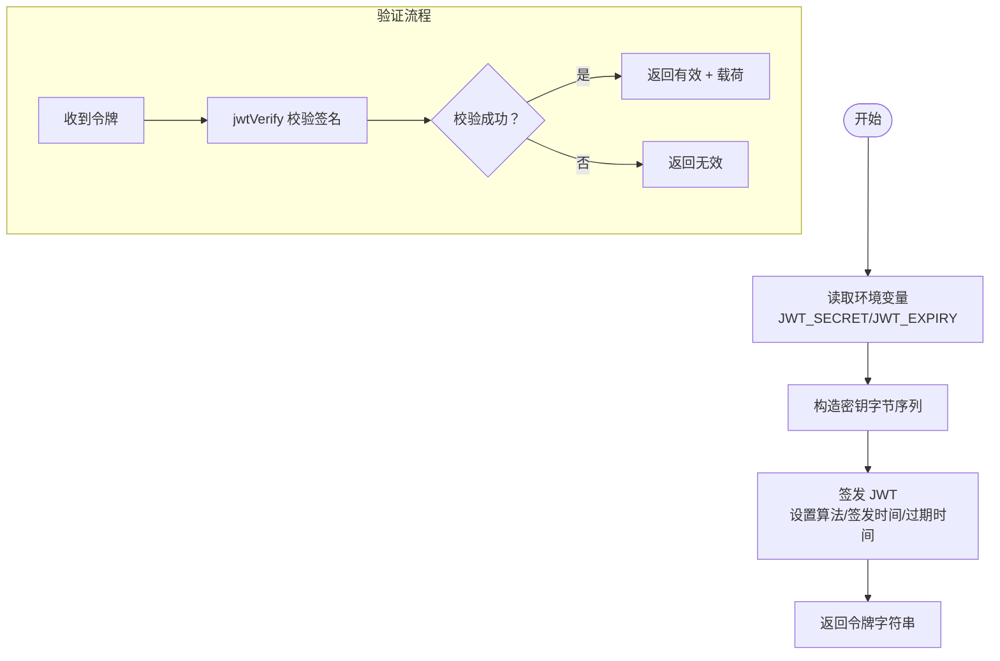
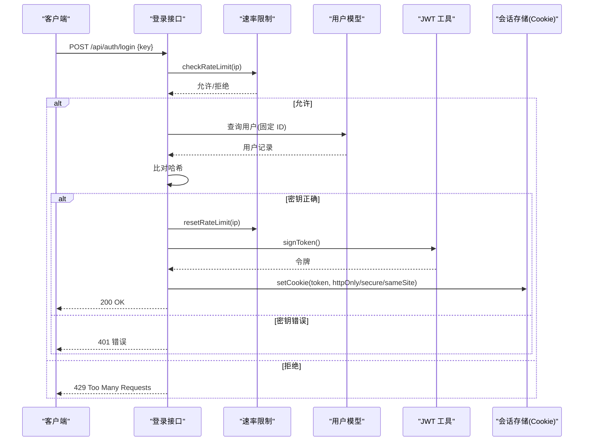
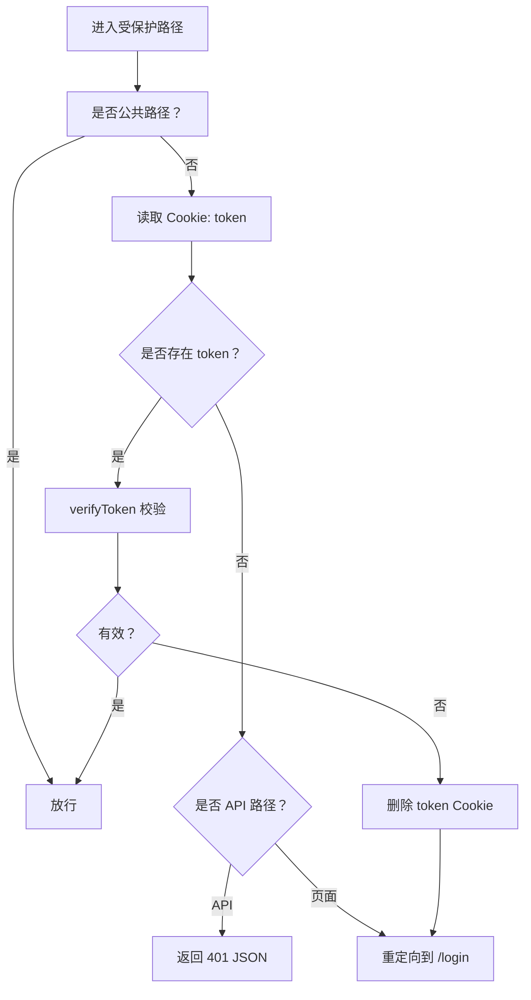
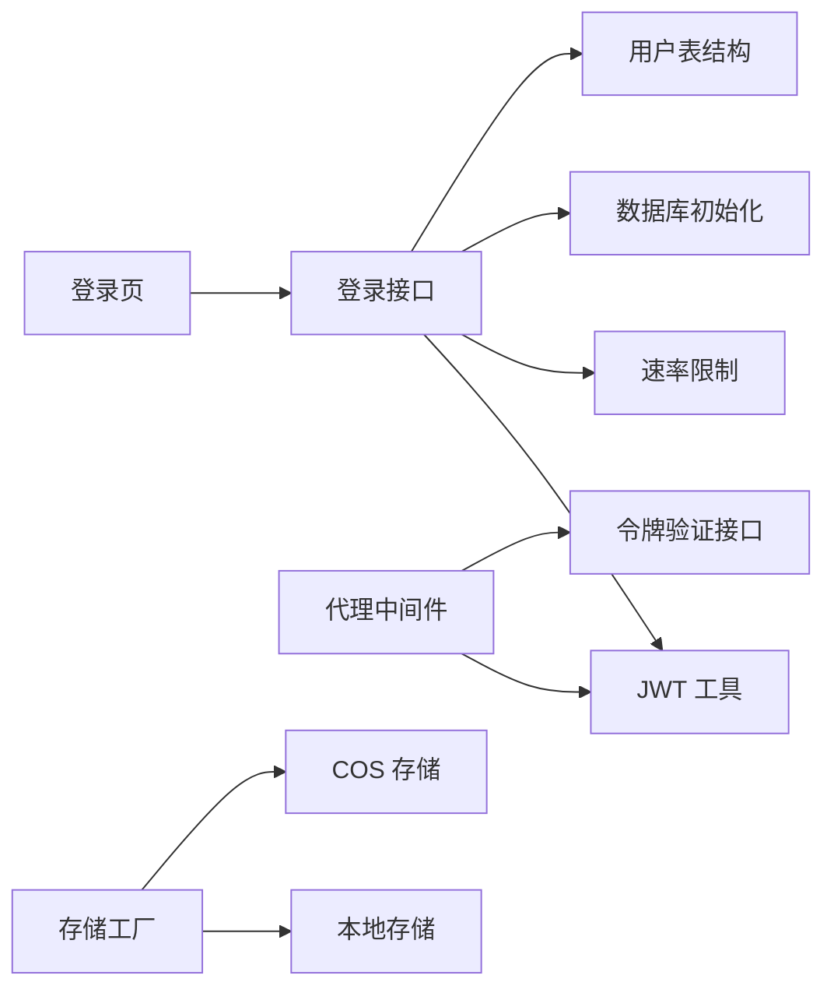

# 用户认证系统

<cite>
**本文引用的文件**
- [src/lib/auth.ts](file://src/lib/auth.ts)
- [src/app/api/auth/login/route.ts](file://src/app/api/auth/login/route.ts)
- [src/app/api/auth/verify/route.ts](file://src/app/api/auth/verify/route.ts)
- [src/app/login/page.tsx](file://src/app/login/page.tsx)
- [src/proxy.ts](file://src/proxy.ts)
- [src/lib/rate-limit.ts](file://src/lib/rate-limit.ts)
- [src/db/index.ts](file://src/db/index.ts)
- [src/db/schema.ts](file://src/db/schema.ts)
- [src/lib/storage/index.ts](file://src/lib/storage/index.ts)
- [src/lib/storage/local.ts](file://src/lib/storage/local.ts)
- [src/lib/storage/cos.ts](file://src/lib/storage/cos.ts)
- [package.json](file://package.json)
</cite>

## 目录
1. [简介](#简介)
2. [项目结构](#项目结构)
3. [核心组件](#核心组件)
4. [架构总览](#架构总览)
5. [详细组件分析](#详细组件分析)
6. [依赖关系分析](#依赖关系分析)
7. [性能与安全特性](#性能与安全特性)
8. [故障排查指南](#故障排查指南)
9. [结论](#结论)
10. [附录：API 与安全配置](#附录api-与安全配置)

## 简介
本文件面向“用户认证系统”的安全设计与实现，围绕以下目标展开：
- 全面阐述基于 JWT 的令牌生成、验证与过期处理机制
- 深入解析登录流程（凭据校验、速率限制、会话管理）
- 访问控制与权限策略（路由级保护、组件级权限检查建议）
- 用户状态与本地存储策略
- CSRF 与 XSS 防护现状与改进建议
- 密码加密与安全存储最佳实践
- 认证失败的错误处理与用户体验优化
- 具体 API 调用示例与安全配置指南
- 常见安全威胁与应急响应流程

## 项目结构
该认证系统采用 Next.js App Router 架构，认证相关代码主要分布在以下模块：
- 路由层：登录接口、令牌验证接口、全局中间件代理
- 业务层：JWT 工具、速率限制、数据库初始化与用户模型
- 前端层：登录页面，负责发起登录请求与跳转
- 存储层：本地或对象存储抽象，用于附件上传等能力（与认证直接关联度较低）

图表来源
- [src/app/login/page.tsx:1-99](file://src/app/login/page.tsx#L1-L99)
- [src/app/api/auth/login/route.ts:1-63](file://src/app/api/auth/login/route.ts#L1-L63)
- [src/app/api/auth/verify/route.ts:1-7](file://src/app/api/auth/verify/route.ts#L1-L7)
- [src/proxy.ts:1-49](file://src/proxy.ts#L1-L49)
- [src/lib/auth.ts:1-26](file://src/lib/auth.ts#L1-L26)
- [src/lib/rate-limit.ts:1-41](file://src/lib/rate-limit.ts#L1-L41)
- [src/db/index.ts:1-171](file://src/db/index.ts#L1-L171)
- [src/db/schema.ts:1-105](file://src/db/schema.ts#L1-L105)
- [src/lib/storage/index.ts:1-30](file://src/lib/storage/index.ts#L1-L30)
- [src/lib/storage/local.ts:1-29](file://src/lib/storage/local.ts#L1-L29)
- [src/lib/storage/cos.ts:1-62](file://src/lib/storage/cos.ts#L1-L62)

章节来源
- [src/app/login/page.tsx:1-99](file://src/app/login/page.tsx#L1-L99)
- [src/app/api/auth/login/route.ts:1-63](file://src/app/api/auth/login/route.ts#L1-L63)
- [src/app/api/auth/verify/route.ts:1-7](file://src/app/api/auth/verify/route.ts#L1-L7)
- [src/proxy.ts:1-49](file://src/proxy.ts#L1-L49)
- [src/lib/auth.ts:1-26](file://src/lib/auth.ts#L1-L26)
- [src/lib/rate-limit.ts:1-41](file://src/lib/rate-limit.ts#L1-L41)
- [src/db/index.ts:1-171](file://src/db/index.ts#L1-L171)
- [src/db/schema.ts:1-105](file://src/db/schema.ts#L1-L105)
- [src/lib/storage/index.ts:1-30](file://src/lib/storage/index.ts#L1-L30)
- [src/lib/storage/local.ts:1-29](file://src/lib/storage/local.ts#L1-L29)
- [src/lib/storage/cos.ts:1-62](file://src/lib/storage/cos.ts#L1-L62)

## 核心组件
- JWT 工具：负责签发与验证令牌，设置算法、签发时间与过期时间
- 登录接口：接收密钥，校验速率限制，查询用户并比对哈希，成功后写入安全 Cookie
- 代理中间件：拦截受保护路径，读取 Cookie 中的令牌并验证有效性
- 速率限制：基于内存 Map 的滑动窗口限流，防止暴力破解
- 数据库初始化与用户模型：初始化 SQLite 表结构，按需创建管理员用户并写入哈希密码
- 存储抽象：统一上传/删除/获取 URL 的接口，支持本地或 COS

章节来源
- [src/lib/auth.ts:1-26](file://src/lib/auth.ts#L1-L26)
- [src/app/api/auth/login/route.ts:1-63](file://src/app/api/auth/login/route.ts#L1-L63)
- [src/proxy.ts:1-49](file://src/proxy.ts#L1-L49)
- [src/lib/rate-limit.ts:1-41](file://src/lib/rate-limit.ts#L1-L41)
- [src/db/index.ts:1-171](file://src/db/index.ts#L1-L171)
- [src/db/schema.ts:1-105](file://src/db/schema.ts#L1-L105)
- [src/lib/storage/index.ts:1-30](file://src/lib/storage/index.ts#L1-L30)

## 架构总览
下图展示了从浏览器到后端路由、再到数据库与存储的完整认证链路。

图表来源
- [src/app/login/page.tsx:1-99](file://src/app/login/page.tsx#L1-L99)
- [src/app/api/auth/login/route.ts:1-63](file://src/app/api/auth/login/route.ts#L1-L63)
- [src/lib/auth.ts:1-26](file://src/lib/auth.ts#L1-L26)
- [src/lib/rate-limit.ts:1-41](file://src/lib/rate-limit.ts#L1-L41)
- [src/db/index.ts:1-171](file://src/db/index.ts#L1-L171)
- [src/db/schema.ts:1-105](file://src/db/schema.ts#L1-L105)

## 详细组件分析

### 组件一：JWT 令牌生成与验证
- 令牌算法：HS256（对称密钥）
- 过期时间：通过环境变量配置，默认 7 天
- 密钥来源：环境变量，未设置时使用默认值（存在安全风险）
- 签发：包含子(subject)标识与可选负载
- 验证：捕获异常并返回布尔结果

图表来源
- [src/lib/auth.ts:1-26](file://src/lib/auth.ts#L1-L26)

章节来源
- [src/lib/auth.ts:1-26](file://src/lib/auth.ts#L1-L26)

### 组件二：登录流程与会话管理
- 客户端：提交密钥，处理 429/401 错误与网络异常
- 服务端：速率限制 → 解析请求体 → 查询用户 → 比对哈希 → 成功重置限流并签发令牌 → 写入安全 Cookie（httpOnly/secure/sameSite/过期/路径）

图表来源
- [src/app/api/auth/login/route.ts:1-63](file://src/app/api/auth/login/route.ts#L1-L63)
- [src/lib/rate-limit.ts:1-41](file://src/lib/rate-limit.ts#L1-L41)
- [src/db/schema.ts:1-105](file://src/db/schema.ts#L1-L105)
- [src/db/index.ts:1-171](file://src/db/index.ts#L1-L171)
- [src/lib/auth.ts:1-26](file://src/lib/auth.ts#L1-L26)

章节来源
- [src/app/api/auth/login/route.ts:1-63](file://src/app/api/auth/login/route.ts#L1-L63)
- [src/app/login/page.tsx:1-99](file://src/app/login/page.tsx#L1-L99)
- [src/lib/rate-limit.ts:1-41](file://src/lib/rate-limit.ts#L1-L41)
- [src/db/schema.ts:1-105](file://src/db/schema.ts#L1-L105)
- [src/db/index.ts:1-171](file://src/db/index.ts#L1-L171)
- [src/lib/auth.ts:1-26](file://src/lib/auth.ts#L1-L26)

### 组件三：访问控制与权限策略
- 全局代理中间件：拦截受保护路径，读取 Cookie 中的 token，验证有效性；无效则重定向至登录页或返回 401
- 公共路径：登录页与登录接口放行
- API 与页面分流：API 路径返回 JSON，页面路径进行重定向

图表来源
- [src/proxy.ts:1-49](file://src/proxy.ts#L1-L49)
- [src/lib/auth.ts:1-26](file://src/lib/auth.ts#L1-L26)

章节来源
- [src/proxy.ts:1-49](file://src/proxy.ts#L1-L49)
- [src/lib/auth.ts:1-26](file://src/lib/auth.ts#L1-L26)

### 组件四：速率限制与防暴力破解
- 窗口大小：15 分钟
- 最大尝试次数：5 次
- 存储：内存 Map，定期清理过期条目
- 触发 429 时返回 Retry-After 与剩余次数头

章节来源
- [src/lib/rate-limit.ts:1-41](file://src/lib/rate-limit.ts#L1-L41)
- [src/app/api/auth/login/route.ts:1-63](file://src/app/api/auth/login/route.ts#L1-L63)

### 组件五：数据库与密码存储
- 初始化：自动创建表结构，启用外键与 WAL 模式
- 用户表：固定 ID 为 admin，仅保存哈希密码
- 密钥导入：启动时从环境变量读取 AUTH_SECRET_KEY，若不存在则不创建；存在则以 bcrypt 生成哈希并插入

章节来源
- [src/db/index.ts:1-171](file://src/db/index.ts#L1-L171)
- [src/db/schema.ts:1-105](file://src/db/schema.ts#L1-L105)

### 组件六：存储抽象（与认证间接相关）
- 抽象接口：upload/delete/getUrl
- 实现：本地文件系统与腾讯云 COS
- 用途：附件上传等，非认证核心，但影响整体安全性（如 CORS、鉴权、URL 可达性）

章节来源
- [src/lib/storage/index.ts:1-30](file://src/lib/storage/index.ts#L1-L30)
- [src/lib/storage/local.ts:1-29](file://src/lib/storage/local.ts#L1-L29)
- [src/lib/storage/cos.ts:1-62](file://src/lib/storage/cos.ts#L1-L62)

## 依赖关系分析
- 登录接口依赖：JWT 工具、速率限制、数据库、用户模型
- 代理中间件依赖：JWT 工具、公共路径白名单
- 前端登录页依赖：Next.js 路由器、fetch API
- 存储抽象独立于认证，但被其他业务模块复用

图表来源
- [src/app/login/page.tsx:1-99](file://src/app/login/page.tsx#L1-L99)
- [src/app/api/auth/login/route.ts:1-63](file://src/app/api/auth/login/route.ts#L1-L63)
- [src/app/api/auth/verify/route.ts:1-7](file://src/app/api/auth/verify/route.ts#L1-L7)
- [src/proxy.ts:1-49](file://src/proxy.ts#L1-L49)
- [src/lib/auth.ts:1-26](file://src/lib/auth.ts#L1-L26)
- [src/lib/rate-limit.ts:1-41](file://src/lib/rate-limit.ts#L1-L41)
- [src/db/index.ts:1-171](file://src/db/index.ts#L1-L171)
- [src/db/schema.ts:1-105](file://src/db/schema.ts#L1-L105)
- [src/lib/storage/index.ts:1-30](file://src/lib/storage/index.ts#L1-L30)
- [src/lib/storage/local.ts:1-29](file://src/lib/storage/local.ts#L1-L29)
- [src/lib/storage/cos.ts:1-62](file://src/lib/storage/cos.ts#L1-L62)

章节来源
- [src/app/login/page.tsx:1-99](file://src/app/login/page.tsx#L1-L99)
- [src/app/api/auth/login/route.ts:1-63](file://src/app/api/auth/login/route.ts#L1-L63)
- [src/app/api/auth/verify/route.ts:1-7](file://src/app/api/auth/verify/route.ts#L1-L7)
- [src/proxy.ts:1-49](file://src/proxy.ts#L1-L49)
- [src/lib/auth.ts:1-26](file://src/lib/auth.ts#L1-L26)
- [src/lib/rate-limit.ts:1-41](file://src/lib/rate-limit.ts#L1-L41)
- [src/db/index.ts:1-171](file://src/db/index.ts#L1-L171)
- [src/db/schema.ts:1-105](file://src/db/schema.ts#L1-L105)
- [src/lib/storage/index.ts:1-30](file://src/lib/storage/index.ts#L1-L30)
- [src/lib/storage/local.ts:1-29](file://src/lib/storage/local.ts#L1-L29)
- [src/lib/storage/cos.ts:1-62](file://src/lib/storage/cos.ts#L1-L62)

## 性能与安全特性
- 性能
  - 速率限制为内存 Map，适合单实例部署；多实例需共享缓存
  - JWT 验证为纯内存操作，延迟低
  - 登录接口仅查询固定 ID，命中率高
- 安全
  - 使用 httpOnly/secure/sameSite Cookie，降低 XSS 与 CSRF 风险
  - 密钥使用 bcrypt 哈希存储，避免明文
  - 令牌过期时间可控，便于缩短会话生命周期
  - 代理中间件统一校验，避免漏保护

[本节为通用讨论，无需列出具体文件来源]

## 故障排查指南
- 登录 429
  - 现象：短时间内多次失败，触发限流
  - 处理：等待冷却时间或调整限流参数
  - 参考
    - [src/app/api/auth/login/route.ts:1-63](file://src/app/api/auth/login/route.ts#L1-L63)
    - [src/lib/rate-limit.ts:1-41](file://src/lib/rate-limit.ts#L1-L41)
- 密钥错误
  - 现象：401，提示密钥错误
  - 处理：确认密钥与数据库中的哈希一致
  - 参考
    - [src/app/api/auth/login/route.ts:1-63](file://src/app/api/auth/login/route.ts#L1-L63)
    - [src/db/schema.ts:1-105](file://src/db/schema.ts#L1-L105)
- 令牌无效或过期
  - 现象：代理中间件重定向到登录页或返回 401
  - 处理：清除 Cookie 后重新登录
  - 参考
    - [src/proxy.ts:1-49](file://src/proxy.ts#L1-L49)
    - [src/lib/auth.ts:1-26](file://src/lib/auth.ts#L1-L26)
- 网络错误
  - 现象：前端 catch 到网络异常
  - 处理：检查网络连通性与代理配置
  - 参考
    - [src/app/login/page.tsx:1-99](file://src/app/login/page.tsx#L1-L99)

章节来源
- [src/app/api/auth/login/route.ts:1-63](file://src/app/api/auth/login/route.ts#L1-L63)
- [src/lib/rate-limit.ts:1-41](file://src/lib/rate-limit.ts#L1-L41)
- [src/db/schema.ts:1-105](file://src/db/schema.ts#L1-L105)
- [src/proxy.ts:1-49](file://src/proxy.ts#L1-L49)
- [src/lib/auth.ts:1-26](file://src/lib/auth.ts#L1-L26)
- [src/app/login/page.tsx:1-99](file://src/app/login/page.tsx#L1-L99)

## 结论
该认证系统在工程上实现了“最小可用”的安全登录闭环：前端表单、后端登录接口、JWT 令牌、代理中间件与速率限制协同工作。其优势在于：
- 明确的令牌生命周期与安全 Cookie 设置
- 针对暴力破解的速率限制
- bcrypt 哈希的密码存储

但仍存在若干可改进点：
- 密钥管理：默认密钥与硬编码密钥需替换为强随机密钥并纳入密钥管理
- 多实例部署：速率限制需持久化或共享
- CSRF 防护：当前依赖 SameSite，建议结合 CSRF Token 与 Origin/Referer 校验
- XSS 防护：建议启用 CSP、内容安全策略，避免内联脚本与 eval
- 权限细化：当前为全局保护，建议引入角色/权限模型与细粒度路由守卫

[本节为总结性内容，无需列出具体文件来源]

## 附录：API 与安全配置

### API 接口定义
- 登录
  - 方法：POST
  - 路径：/api/auth/login
  - 请求体：{ key: string }
  - 成功：200，设置安全 Cookie: token
  - 失败：400/401/429，返回错误信息
  - 参考
    - [src/app/api/auth/login/route.ts:1-63](file://src/app/api/auth/login/route.ts#L1-L63)
- 令牌验证
  - 方法：POST
  - 路径：/api/auth/verify
  - 成功：200 { valid: true }
  - 参考
    - [src/app/api/auth/verify/route.ts:1-7](file://src/app/api/auth/verify/route.ts#L1-L7)

章节来源
- [src/app/api/auth/login/route.ts:1-63](file://src/app/api/auth/login/route.ts#L1-L63)
- [src/app/api/auth/verify/route.ts:1-7](file://src/app/api/auth/verify/route.ts#L1-L7)

### 安全配置清单
- 环境变量
  - JWT_SECRET：强随机密钥，长度≥32 字节
  - JWT_EXPIRY：例如 7d、24h、1h 等
  - AUTH_SECRET_KEY：首次部署时设置，用于初始化管理员账户
  - DATABASE_PATH：SQLite 文件路径
  - NODE_ENV：生产环境开启 secure Cookie
  - 参考
    - [src/lib/auth.ts:1-26](file://src/lib/auth.ts#L1-L26)
    - [src/db/index.ts:1-171](file://src/db/index.ts#L1-L171)
- Cookie 安全属性
  - httpOnly：阻止 XSS 读取
  - secure：HTTPS 环境传输
  - sameSite：strict
  - maxAge：根据业务设定
  - path：/ 或更精确路径
  - 参考
    - [src/app/api/auth/login/route.ts:1-63](file://src/app/api/auth/login/route.ts#L1-L63)
- 速率限制
  - 窗口与最大尝试次数可根据业务调整
  - 多实例需共享存储或使用外部缓存
  - 参考
    - [src/lib/rate-limit.ts:1-41](file://src/lib/rate-limit.ts#L1-L41)

章节来源
- [src/lib/auth.ts:1-26](file://src/lib/auth.ts#L1-L26)
- [src/db/index.ts:1-171](file://src/db/index.ts#L1-L171)
- [src/app/api/auth/login/route.ts:1-63](file://src/app/api/auth/login/route.ts#L1-L63)
- [src/lib/rate-limit.ts:1-41](file://src/lib/rate-limit.ts#L1-L41)

### CSRF 与 XSS 防护建议
- CSRF
  - 在表单与关键 API 中引入 CSRF Token，并在服务端校验
  - 配合 SameSite=Strict/Lax 与 Origin/Referer 校验
- XSS
  - 启用 Content-Security-Policy，禁止内联脚本与 eval
  - 对用户输入与富文本输出进行严格净化与转义
  - 使用 httpOnly Cookie，避免前端读取敏感令牌
- 参考
  - [src/app/api/auth/login/route.ts:1-63](file://src/app/api/auth/login/route.ts#L1-L63)
  - [src/proxy.ts:1-49](file://src/proxy.ts#L1-L49)

章节来源
- [src/app/api/auth/login/route.ts:1-63](file://src/app/api/auth/login/route.ts#L1-L63)
- [src/proxy.ts:1-49](file://src/proxy.ts#L1-L49)

### 密码加密与安全存储最佳实践
- 使用 bcrypt 或更高成本因子（如 12）确保抗暴力破解
- 不要存储明文或可逆加密后的密码
- 初始化时一次性写入哈希，避免重复计算
- 参考
  - [src/db/index.ts:1-171](file://src/db/index.ts#L1-L171)
  - [src/db/schema.ts:1-105](file://src/db/schema.ts#L1-L105)
  - [package.json:57-57](file://package.json#L57-L57)

章节来源
- [src/db/index.ts:1-171](file://src/db/index.ts#L1-L171)
- [src/db/schema.ts:1-105](file://src/db/schema.ts#L1-L105)
- [package.json:57-57](file://package.json#L57-L57)

### 认证失败的错误处理与用户体验
- 前端
  - 区分 429（频率过高）、401（密钥错误）、网络异常
  - 提供明确提示与可读文案
- 后端
  - 429 返回 Retry-After 与剩余次数头，便于前端展示
  - 401 返回统一错误结构
- 参考
  - [src/app/login/page.tsx:1-99](file://src/app/login/page.tsx#L1-L99)
  - [src/app/api/auth/login/route.ts:1-63](file://src/app/api/auth/login/route.ts#L1-L63)

章节来源
- [src/app/login/page.tsx:1-99](file://src/app/login/page.tsx#L1-L99)
- [src/app/api/auth/login/route.ts:1-63](file://src/app/api/auth/login/route.ts#L1-L63)

### 常见安全威胁与应急响应
- 威胁类型
  - 暴力破解：通过速率限制缓解
  - 令牌泄露：短令牌有效期、强制重新登录
  - CSRF：SameSite、CSRF Token、Origin/Referer 校验
  - XSS：CSP、净化与转义
  - 令牌劫持：HTTPS + secure httpOnly
- 应急响应
  - 立即轮换 JWT_SECRET
  - 清空受影响用户的会话（删除 Cookie）
  - 检查日志与告警，必要时临时封禁 IP
  - 回滚可疑变更，恢复备份
- 参考
  - [src/lib/auth.ts:1-26](file://src/lib/auth.ts#L1-L26)
  - [src/app/api/auth/login/route.ts:1-63](file://src/app/api/auth/login/route.ts#L1-L63)
  - [src/proxy.ts:1-49](file://src/proxy.ts#L1-L49)

章节来源
- [src/lib/auth.ts:1-26](file://src/lib/auth.ts#L1-L26)
- [src/app/api/auth/login/route.ts:1-63](file://src/app/api/auth/login/route.ts#L1-L63)
- [src/proxy.ts:1-49](file://src/proxy.ts#L1-L49)