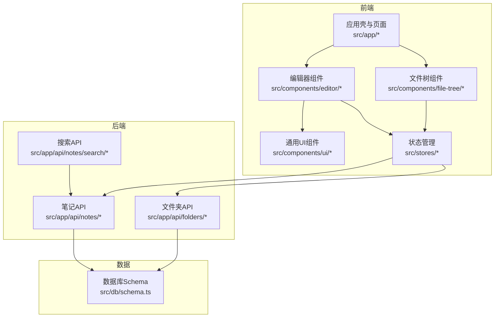
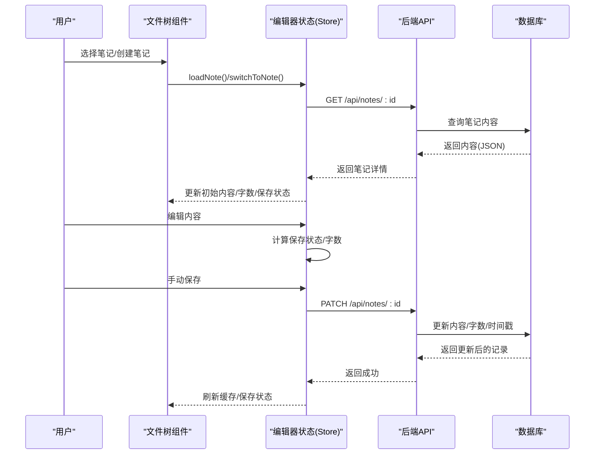
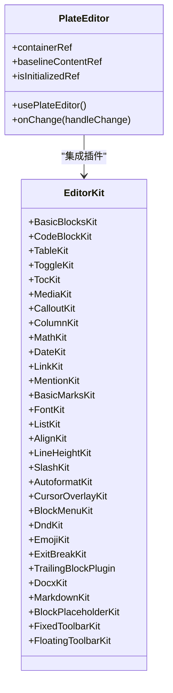
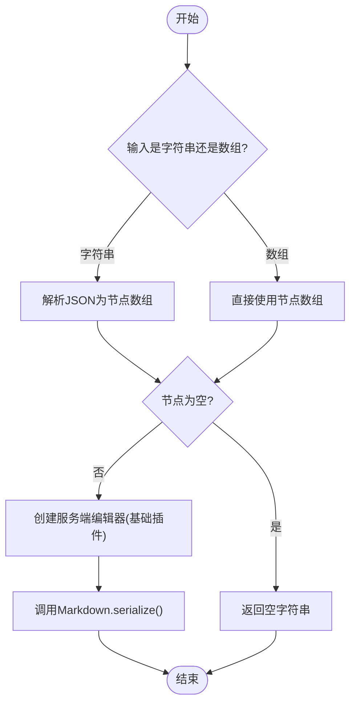
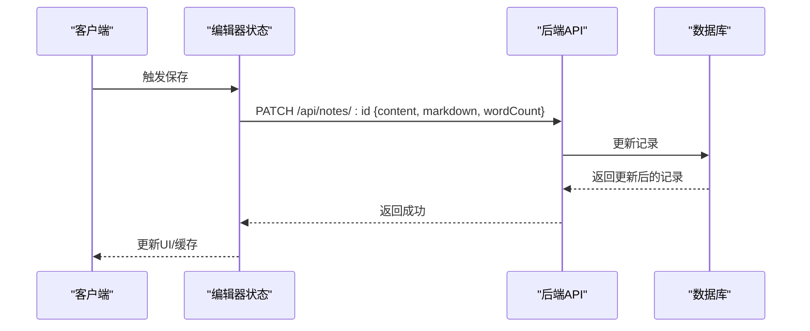
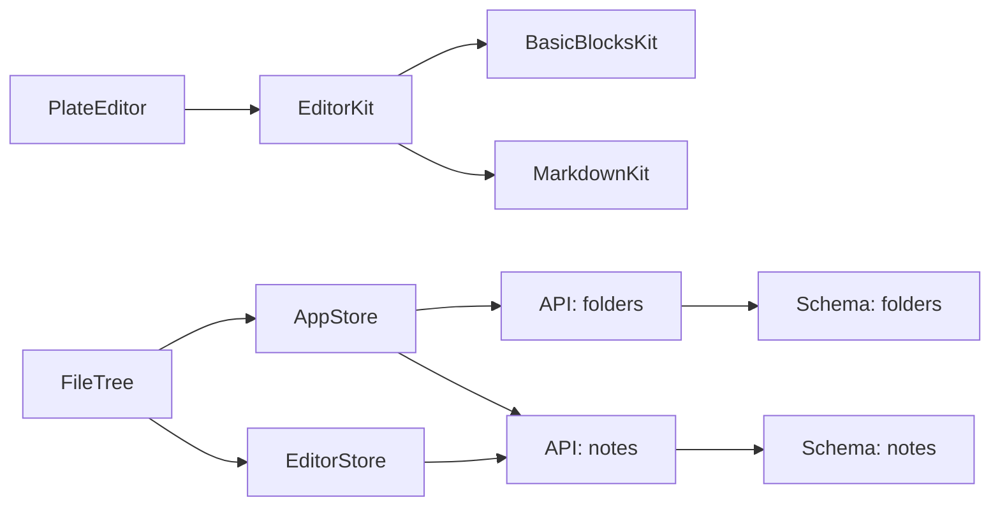

# 笔记管理系统

<cite>
**本文引用的文件**
- [README.md](file://README.md)
- [src/app/api/notes/route.ts](file://src/app/api/notes/route.ts)
- [src/app/api/notes/[id]/route.ts](file://src/app/api/notes/[id]/route.ts)
- [src/app/api/notes/search/route.ts](file://src/app/api/notes/search/route.ts)
- [src/app/api/folders/route.ts](file://src/app/api/folders/route.ts)
- [src/components/editor/plate-editor.tsx](file://src/components/editor/plate-editor.tsx)
- [src/components/editor/editor-kit.tsx](file://src/components/editor/editor-kit.tsx)
- [src/components/editor/plugins/markdown-kit.tsx](file://src/components/editor/plugins/markdown-kit.tsx)
- [src/components/editor/plugins/basic-blocks-kit.tsx](file://src/components/editor/plugins/basic-blocks-kit.tsx)
- [src/lib/server-markdown.ts](file://src/lib/server-markdown.ts)
- [src/stores/editor-store.ts](file://src/stores/editor-store.ts)
- [src/stores/app-store.ts](file://src/stores/app-store.ts)
- [src/components/file-tree/file-tree.tsx](file://src/components/file-tree/file-tree.tsx)
- [src/db/schema.ts](file://src/db/schema.ts)
- [src/types/index.ts](file://src/types/index.ts)
</cite>

## 目录
1. [简介](#简介)
2. [项目结构](#项目结构)
3. [核心组件](#核心组件)
4. [架构总览](#架构总览)
5. [详细组件分析](#详细组件分析)
6. [依赖关系分析](#依赖关系分析)
7. [性能考量](#性能考量)
8. [故障排查指南](#故障排查指南)
9. [结论](#结论)
10. [附录](#附录)

## 简介
本系统是一个基于 Next.js 的笔记管理系统，采用 Plate.js 作为富文本编辑器内核，结合自研的编辑器插件体系与状态管理，提供完整的笔记 CRUD、文件夹组织、Markdown 转换与实时预览能力。后端使用 Drizzle ORM 连接 SQLite 数据库，前端通过 Zustand 管理应用与编辑器状态，提供良好的用户体验与可扩展性。

## 项目结构
系统采用“按功能域分层”的组织方式：
- 前端页面与组件：位于 src/app 与 src/components 下，包含编辑器、文件树、UI 组件等
- 状态管理：src/stores 下的 app-store 与 editor-store
- 后端 API：src/app/api 下的路由处理器
- 数据模型：src/db/schema.ts 定义数据库表结构
- 工具与类型：src/lib 与 src/types 提供工具函数与类型定义

图表来源
- [src/app/api/notes/route.ts:1-86](file://src/app/api/notes/route.ts#L1-L86)
- [src/app/api/notes/[id]/route.ts](file://src/app/api/notes/[id]/route.ts#L1-L104)
- [src/app/api/notes/search/route.ts:1-44](file://src/app/api/notes/search/route.ts#L1-L44)
- [src/app/api/folders/route.ts:1-75](file://src/app/api/folders/route.ts#L1-L75)
- [src/db/schema.ts:1-105](file://src/db/schema.ts#L1-L105)

章节来源
- [README.md:1-37](file://README.md#L1-L37)

## 核心组件
- 富文本编辑器（Plate.js）：负责内容渲染、插件系统、序列化与撤销重做
- 编辑器插件体系：基础块级节点、标记样式、列表、对齐、行高、链接、提及、数学公式、表格、目录、媒体、拖拽、Markdown 解析等
- 状态管理（Zustand）：编辑器状态、内容缓存、保存状态、字数统计与加载状态
- 文件树与导航：文件夹层级、笔记列表、搜索、归档与批量展开/折叠
- 后端 API：笔记的增删改查、搜索；文件夹的增删改查；Markdown 序列化

章节来源
- [src/components/editor/plate-editor.tsx:1-175](file://src/components/editor/plate-editor.tsx#L1-L175)
- [src/components/editor/editor-kit.tsx:1-83](file://src/components/editor/editor-kit.tsx#L1-L83)
- [src/stores/editor-store.ts:1-281](file://src/stores/editor-store.ts#L1-L281)
- [src/components/file-tree/file-tree.tsx:1-326](file://src/components/file-tree/file-tree.tsx#L1-L326)
- [src/app/api/notes/route.ts:1-86](file://src/app/api/notes/route.ts#L1-L86)
- [src/app/api/notes/[id]/route.ts:1-104](file://src/app/api/notes/[id]/route.ts#L1-L104)
- [src/app/api/notes/search/route.ts:1-44](file://src/app/api/notes/search/route.ts#L1-L44)
- [src/app/api/folders/route.ts:1-75](file://src/app/api/folders/route.ts#L1-L75)

## 架构总览
系统采用前后端分离的路由式 API 设计，前端通过 fetch 调用后端接口，编辑器通过插件系统实现丰富的富文本能力，状态管理统一协调 UI 与持久化。

图表来源
- [src/components/file-tree/file-tree.tsx:65-77](file://src/components/file-tree/file-tree.tsx#L65-L77)
- [src/stores/editor-store.ts:114-155](file://src/stores/editor-store.ts#L114-L155)
- [src/stores/editor-store.ts:204-275](file://src/stores/editor-store.ts#L204-L275)
- [src/app/api/notes/[id]/route.ts:29-L82](file://src/app/api/notes/[id]/route.ts#L29-L82)

## 详细组件分析

### 富文本编辑器与 Plate.js 集成
- 编辑器初始化：通过 PlateEditor 创建编辑器实例，注入 EditorKit 插件集合
- 内容比较与保存状态：使用结构化比较算法快速判断内容是否变化，避免不必要的保存
- 基线内容与撤销栈：切换笔记时清空历史，防止跨笔记撤销；滚动到顶部避免滚动记忆残留
- Markdown 序列化：在编辑器挂载时注册 Markdown 序列化器，支持服务端导出与客户端预览

图表来源
- [src/components/editor/plate-editor.tsx:63-175](file://src/components/editor/plate-editor.tsx#L63-L175)
- [src/components/editor/editor-kit.tsx:36-78](file://src/components/editor/editor-kit.tsx#L36-L78)

章节来源
- [src/components/editor/plate-editor.tsx:12-175](file://src/components/editor/plate-editor.tsx#L12-L175)
- [src/components/editor/editor-kit.tsx:1-83](file://src/components/editor/editor-kit.tsx#L1-L83)

### 编辑器插件系统
- 基础块级节点：段落、标题、引用、水平线
- 标记样式：粗体、斜体、下划线、删除线、上标、下标、高亮
- 列表与对齐：有序/无序列表、文本对齐
- 行高与字体：行高调节、字号与颜色
- 链接与提及：超链接、@提及
- 数学公式与代码块：LaTeX 公式、代码高亮
- 表格与目录：表格、目录生成
- 媒体：图片、音频、视频、文件附件
- 交互与快捷键：光标覆盖、块菜单、拖拽排序、斜杠命令
- 解析与导入：Markdown、DOCX 解析

章节来源
- [src/components/editor/plugins/basic-blocks-kit.tsx:1-89](file://src/components/editor/plugins/basic-blocks-kit.tsx#L1-L89)
- [src/components/editor/plugins/markdown-kit.tsx:1-12](file://src/components/editor/plugins/markdown-kit.tsx#L1-L12)
- [src/components/editor/editor-kit.tsx:6-78](file://src/components/editor/editor-kit.tsx#L6-L78)

### 内容序列化机制（Markdown）
- 客户端序列化：编辑器挂载时注册 Markdown 序列化器，支持导出 Markdown
- 服务端序列化：独立模块在服务端创建编辑器，使用基础插件与 remark 生态（数学、GFM、Mention 等）进行稳定转换

图表来源
- [src/lib/server-markdown.ts:85-108](file://src/lib/server-markdown.ts#L85-L108)

章节来源
- [src/lib/server-markdown.ts:1-138](file://src/lib/server-markdown.ts#L1-L138)
- [src/stores/editor-store.ts:242-250](file://src/stores/editor-store.ts#L242-L250)

### 笔记 CRUD 流程
- 创建：前端调用 POST /api/notes，后端校验标题长度与非法字符，生成唯一 ID，返回新笔记元数据
- 读取：GET /api/notes 或 GET /api/notes/:id，支持按文件夹过滤与单条查询
- 更新：PATCH /api/notes/:id，支持标题、内容、Markdown、字数、排序、文件夹移动
- 删除：DELETE /api/notes/:id，返回成功状态

图表来源
- [src/stores/editor-store.ts:204-275](file://src/stores/editor-store.ts#L204-L275)
- [src/app/api/notes/[id]/route.ts:29-L82](file://src/app/api/notes/[id]/route.ts#L29-L82)

章节来源
- [src/app/api/notes/route.ts:1-86](file://src/app/api/notes/route.ts#L1-L86)
- [src/app/api/notes/[id]/route.ts:1-L104](file://src/app/api/notes/[id]/route.ts#L1-L104)

### 搜索功能
- 支持按标题、内容、Markdown 文本进行模糊搜索
- 前端输入防抖，减少请求频率
- 结果以笔记元数据形式返回，便于直接展示与跳转

章节来源
- [src/app/api/notes/search/route.ts:1-44](file://src/app/api/notes/search/route.ts#L1-L44)
- [src/components/file-tree/file-tree.tsx:87-122](file://src/components/file-tree/file-tree.tsx#L87-L122)

### 文件夹组织结构
- 层级设计：支持最多两级文件夹（根级与子级），父级必须为根级
- 展开/折叠：支持批量展开/折叠非归档文件夹
- 归档：归档文件夹单独显示，不影响笔记归属
- 变更同步：创建/重命名/删除/归档均通过 API 同步至服务器，并可乐观更新 UI

章节来源
- [src/app/api/folders/route.ts:1-75](file://src/app/api/folders/route.ts#L1-L75)
- [src/stores/app-store.ts:84-317](file://src/stores/app-store.ts#L84-L317)
- [src/components/file-tree/file-tree.tsx:43-53](file://src/components/file-tree/file-tree.tsx#L43-L53)

### 状态管理、撤销重做与实时预览
- 状态管理：编辑器状态包含当前笔记 ID、初始内容、当前编辑内容、保存状态、字数、加载状态与 LRU 缓存
- 撤销重做：切换笔记时清空历史，避免跨笔记干扰；编辑器内置历史栈
- 实时预览：通过 Markdown 序列化器与服务端转换，支持导出与预览

章节来源
- [src/stores/editor-store.ts:15-64](file://src/stores/editor-store.ts#L15-L64)
- [src/stores/editor-store.ts:100-155](file://src/stores/editor-store.ts#L100-L155)
- [src/stores/editor-store.ts:204-275](file://src/stores/editor-store.ts#L204-L275)
- [src/components/editor/plate-editor.tsx:101-153](file://src/components/editor/plate-editor.tsx#L101-L153)

## 依赖关系分析
- 组件耦合：编辑器组件依赖插件集合与 UI 组件；文件树依赖状态管理与 API；状态管理依赖数据库 Schema 与类型定义
- 外部依赖：Plate.js、Drizzle ORM、remark 生态、Lucide 图标库、Zustand 状态库
- 循环依赖：当前结构未见循环依赖，各模块职责清晰

图表来源
- [src/components/editor/plate-editor.tsx:63-175](file://src/components/editor/plate-editor.tsx#L63-L175)
- [src/components/editor/editor-kit.tsx:36-78](file://src/components/editor/editor-kit.tsx#L36-L78)
- [src/components/file-tree/file-tree.tsx:22-34](file://src/components/file-tree/file-tree.tsx#L22-L34)
- [src/stores/app-store.ts:49-82](file://src/stores/app-store.ts#L49-L82)
- [src/stores/editor-store.ts:88-155](file://src/stores/editor-store.ts#L88-L155)
- [src/db/schema.ts:27-39](file://src/db/schema.ts#L27-L39)
- [src/db/schema.ts:10-25](file://src/db/schema.ts#L10-L25)

章节来源
- [src/db/schema.ts:1-105](file://src/db/schema.ts#L1-L105)
- [src/types/index.ts:1-74](file://src/types/index.ts#L1-L74)

## 性能考量
- 内容缓存：编辑器状态维护 LRU 缓存，命中则直接渲染，未命中再发起网络请求
- 结构化比较：避免 JSON 序列化带来的性能损耗，提升保存状态判断效率
- 懒加载与防抖：搜索输入防抖，批量展开/折叠使用并发请求
- 数据库索引：按排序与创建时间排序，适合常见浏览场景

## 故障排查指南
- 编辑器无法保存
  - 检查保存状态是否为“错误”，确认网络请求返回码
  - 查看控制台错误日志，确认序列化器是否可用
- 切换笔记后撤销异常
  - 确认切换逻辑是否清空历史栈
- 搜索无结果
  - 确认关键词非空且去空格
  - 检查数据库中是否存在匹配内容
- 文件夹层级异常
  - 确认父级为根级，且不超过两级深度
  - 归档文件夹不会参与常规层级展示

章节来源
- [src/stores/editor-store.ts:267-275](file://src/stores/editor-store.ts#L267-L275)
- [src/components/editor/plate-editor.tsx:111-120](file://src/components/editor/plate-editor.tsx#L111-L120)
- [src/app/api/notes/search/route.ts:11-13](file://src/app/api/notes/search/route.ts#L11-L13)
- [src/app/api/folders/route.ts:44-56](file://src/app/api/folders/route.ts#L44-L56)

## 结论
该系统通过 Plate.js 与自研插件体系实现了强大的富文本能力，配合 Zustand 状态管理与 Drizzle ORM，提供了高效稳定的笔记 CRUD、文件夹组织与搜索体验。Markdown 序列化模块确保了内容的可移植性与一致性。未来可在插件生态扩展、性能监控与错误追踪方面进一步增强。

## 附录

### API 接口一览（路径与行为）
- GET /api/notes
  - 查询笔记列表，支持按文件夹过滤
- POST /api/notes
  - 创建笔记，标题校验与非法字符过滤
- GET /api/notes/[id]
  - 获取单条笔记详情
- PATCH /api/notes/[id]
  - 更新笔记（标题、内容、Markdown、字数、排序、文件夹）
- DELETE /api/notes/[id]
  - 删除笔记
- GET /api/notes/search?q=关键词
  - 模糊搜索笔记（标题/内容/Markdown）
- GET /api/folders
  - 获取文件夹列表
- POST /api/folders
  - 创建文件夹（校验名称与层级）
- PATCH /api/folders/[id]
  - 更新文件夹（名称/展开/归档）
- DELETE /api/folders/[id]
  - 删除文件夹（级联处理）

章节来源
- [src/app/api/notes/route.ts:1-86](file://src/app/api/notes/route.ts#L1-L86)
- [src/app/api/notes/[id]/route.ts:1-L104](file://src/app/api/notes/[id]/route.ts#L1-L104)
- [src/app/api/notes/search/route.ts:1-44](file://src/app/api/notes/search/route.ts#L1-L44)
- [src/app/api/folders/route.ts:1-75](file://src/app/api/folders/route.ts#L1-L75)