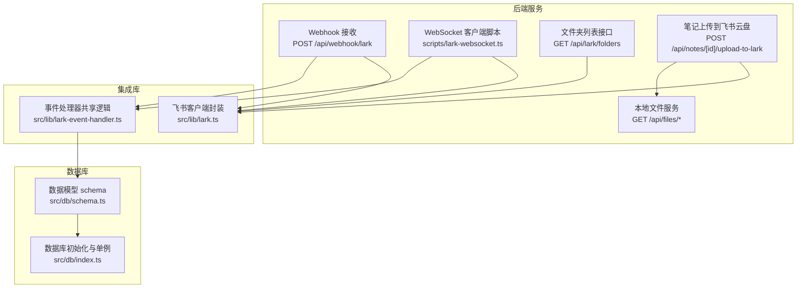
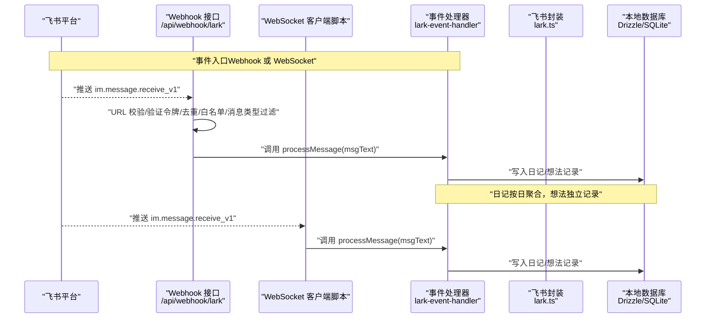
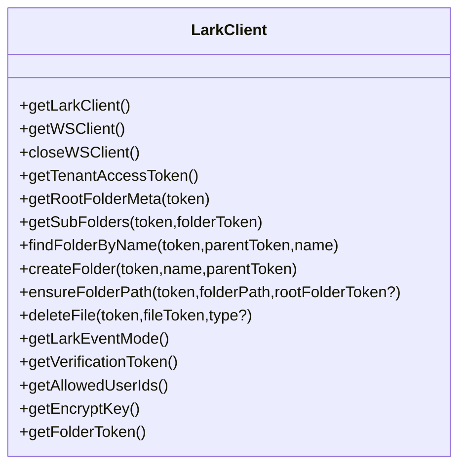
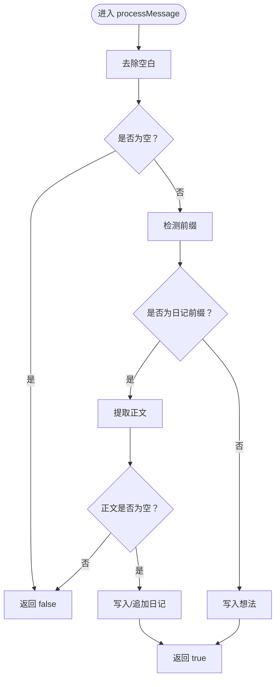
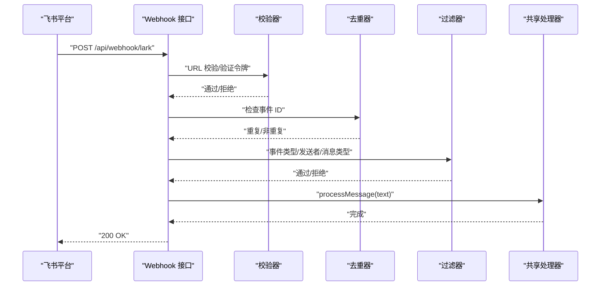
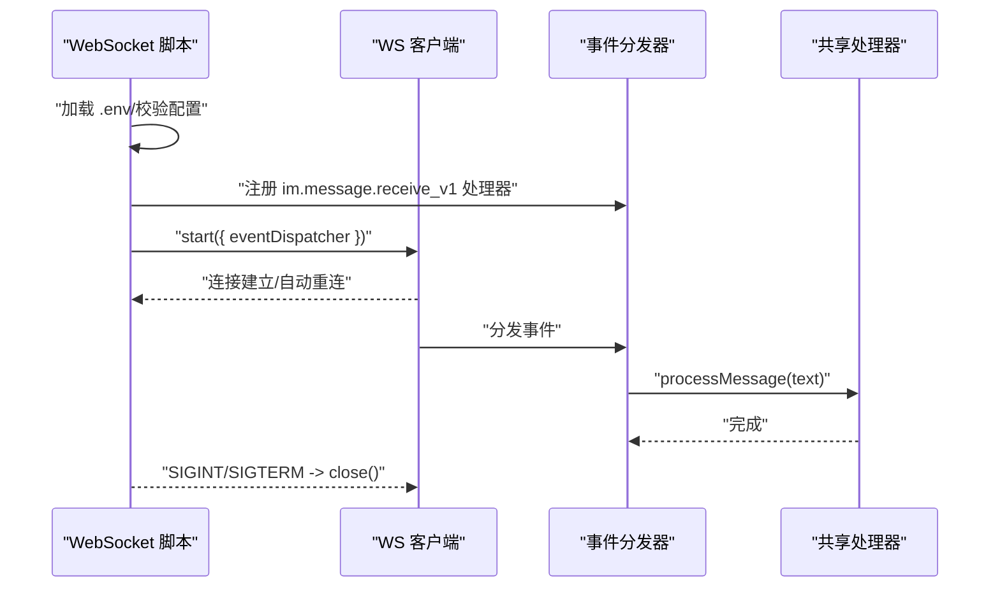
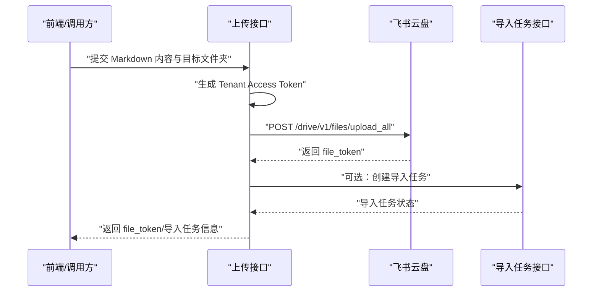
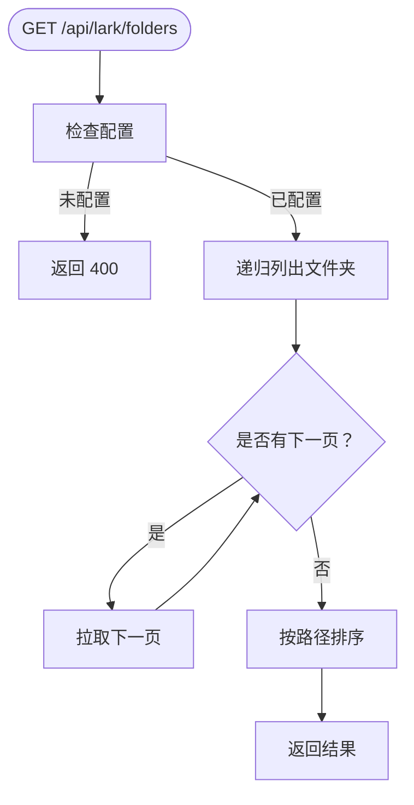
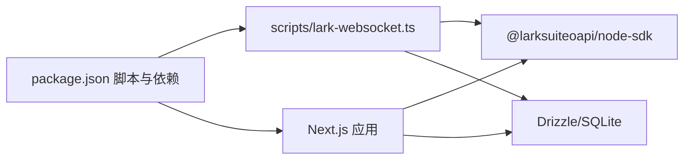

# 飞书集成

<cite>
**本文引用的文件**
- [src/lib/lark.ts](file://src/lib/lark.ts)
- [src/lib/lark-event-handler.ts](file://src/lib/lark-event-handler.ts)
- [scripts/lark-websocket.ts](file://scripts/lark-websocket.ts)
- [src/app/api/webhook/lark/route.ts](file://src/app/api/webhook/lark/route.ts)
- [src/app/api/lark/folders/route.ts](file://src/app/api/lark/folders/route.ts)
- [src/app/api/notes/[id]/upload-to-lark/route.ts](file://src/app/api/notes/[id]/upload-to-lark/route.ts)
- [src/db/schema.ts](file://src/db/schema.ts)
- [src/db/index.ts](file://src/db/index.ts)
- [package.json](file://package.json)
- [src/app/api/files/[...path]/route.ts](file://src/app/api/files/[...path]/route.ts)
</cite>

## 目录
1. [简介](#简介)
2. [项目结构](#项目结构)
3. [核心组件](#核心组件)
4. [架构总览](#架构总览)
5. [详细组件分析](#详细组件分析)
6. [依赖关系分析](#依赖关系分析)
7. [性能考虑](#性能考虑)
8. [故障排查指南](#故障排查指南)
9. [结论](#结论)
10. [附录](#附录)

## 简介
本技术文档面向飞书（Lark/Feishu）集成能力，覆盖以下主题：
- 飞书 API 客户端的配置与初始化，认证机制与 SDK 使用
- WebSocket 实时通信的建立与维护（连接管理、心跳与断线重连）
- Webhook 事件处理的完整流程（接收、鉴权、去重、解析与响应）
- 云文档同步与上传（文档读取、上传到飞书云盘、导入任务）
- 事件处理器的设计模式与扩展机制
- 与本地数据的同步策略与一致性保障
- 飞书应用配置指南与调用示例
- 错误处理、性能优化与监控告警最佳实践

## 项目结构
飞书集成相关代码主要分布在如下位置：
- 集成库与工具：src/lib/lark.ts、src/lib/lark-event-handler.ts
- Webhook 接收：src/app/api/webhook/lark/route.ts
- WebSocket 客户端脚本：scripts/lark-websocket.ts
- 云文档与文件夹接口：src/app/api/lark/folders/route.ts、src/app/api/notes/[id]/upload-to-lark/route.ts
- 本地文件服务：src/app/api/files/[...path]/route.ts
- 数据模型与数据库：src/db/schema.ts、src/db/index.ts
- 依赖与脚本：package.json

图表来源
- [src/app/api/webhook/lark/route.ts:1-106](file://src/app/api/webhook/lark/route.ts#L1-L106)
- [scripts/lark-websocket.ts:1-109](file://scripts/lark-websocket.ts#L1-L109)
- [src/app/api/lark/folders/route.ts:1-99](file://src/app/api/lark/folders/route.ts#L1-L99)
- [src/app/api/notes/[id]/upload-to-lark/route.ts](file://src/app/api/notes/[id]/upload-to-lark/route.ts#L22-L93)
- [src/lib/lark.ts:1-367](file://src/lib/lark.ts#L1-L367)
- [src/lib/lark-event-handler.ts:1-126](file://src/lib/lark-event-handler.ts#L1-L126)
- [src/db/schema.ts:1-105](file://src/db/schema.ts#L1-L105)
- [src/db/index.ts:1-171](file://src/db/index.ts#L1-L171)

章节来源
- [src/lib/lark.ts:1-367](file://src/lib/lark.ts#L1-L367)
- [src/lib/lark-event-handler.ts:1-126](file://src/lib/lark-event-handler.ts#L1-L126)
- [src/app/api/webhook/lark/route.ts:1-106](file://src/app/api/webhook/lark/route.ts#L1-L106)
- [scripts/lark-websocket.ts:1-109](file://scripts/lark-websocket.ts#L1-L109)
- [src/app/api/lark/folders/route.ts:1-99](file://src/app/api/lark/folders/route.ts#L1-L99)
- [src/app/api/notes/[id]/upload-to-lark/route.ts:22-L93](file://src/app/api/notes/[id]/upload-to-lark/route.ts#L22-L93)
- [src/db/schema.ts:1-105](file://src/db/schema.ts#L1-L105)
- [src/db/index.ts:1-171](file://src/db/index.ts#L1-L171)
- [src/app/api/files/[...path]/route.ts:1-L48](file://src/app/api/files/[...path]/route.ts#L1-L48)
- [package.json:1-119](file://package.json#L1-L119)

## 核心组件
- 飞书客户端封装（src/lib/lark.ts）
  - 提供统一的 Lark/Feishu 客户端实例与 WS 客户端实例，支持按需懒加载与单例复用
  - 支持获取租户访问令牌（Tenant Access Token）、根文件夹元数据、文件夹树遍历、确保路径存在、删除文件等
  - 支持通过环境变量切换事件模式（webhook 或 websocket），并提供加密密钥与校验令牌配置
- 事件处理器共享逻辑（src/lib/lark-event-handler.ts）
  - 统一的消息路由与处理：支持“日记”与“想法”两类消息前缀，分别写入本地数据库
  - 基于 Drizzle ORM 的 SQLite 存储，支持日记的按日聚合与追加
- Webhook 接收（src/app/api/webhook/lark/route.ts）
  - 支持 URL 校验、v2.0 验证令牌校验、事件去重（内存 Map，5 分钟 TTL）、仅处理文本消息、仅允许白名单用户
- WebSocket 客户端脚本（scripts/lark-websocket.ts）
  - 以独立进程方式运行，注册 im.message.receive_v1 事件处理器，支持自动重连与优雅关闭
- 云文档与文件夹接口
  - 文件夹列表：递归遍历并返回层级化路径
  - 笔记上传到飞书云盘：将 Markdown 内容上传为云盘文件，并可创建导入任务
- 本地文件服务（src/app/api/files/[...path]/route.ts）
  - 提供静态文件读取，用于本地存储的图片/附件访问
- 数据模型与数据库（src/db/schema.ts、src/db/index.ts）
  - 包含 diaries、ideas 等表，支持日记按日期聚合、想法记录等
  - 初始化数据库、索引与迁移，采用 WAL 模式与外键约束

章节来源
- [src/lib/lark.ts:1-367](file://src/lib/lark.ts#L1-L367)
- [src/lib/lark-event-handler.ts:1-126](file://src/lib/lark-event-handler.ts#L1-L126)
- [src/app/api/webhook/lark/route.ts:1-106](file://src/app/api/webhook/lark/route.ts#L1-L106)
- [scripts/lark-websocket.ts:1-109](file://scripts/lark-websocket.ts#L1-L109)
- [src/app/api/lark/folders/route.ts:1-99](file://src/app/api/lark/folders/route.ts#L1-L99)
- [src/app/api/notes/[id]/upload-to-lark/route.ts:22-L93](file://src/app/api/notes/[id]/upload-to-lark/route.ts#L22-L93)
- [src/app/api/files/[...path]/route.ts:1-L48](file://src/app/api/files/[...path]/route.ts#L1-L48)
- [src/db/schema.ts:1-105](file://src/db/schema.ts#L1-L105)
- [src/db/index.ts:1-171](file://src/db/index.ts#L1-L171)

## 架构总览
飞书集成由“事件入口（Webhook/WebSocket）—共享处理器—飞书 API 封装—本地数据库/文件系统”构成的闭环。

图表来源
- [src/app/api/webhook/lark/route.ts:28-105](file://src/app/api/webhook/lark/route.ts#L28-L105)
- [scripts/lark-websocket.ts:38-108](file://scripts/lark-websocket.ts#L38-L108)
- [src/lib/lark-event-handler.ts:104-125](file://src/lib/lark-event-handler.ts#L104-L125)
- [src/lib/lark.ts:1-367](file://src/lib/lark.ts#L1-L367)
- [src/db/schema.ts:93-104](file://src/db/schema.ts#L93-L104)
- [src/db/index.ts:160-171](file://src/db/index.ts#L160-L171)

## 详细组件分析

### 飞书 API 客户端封装（src/lib/lark.ts）
- 认证与初始化
  - 通过环境变量 LARK_APP_ID、LARK_APP_SECRET 初始化 SDK 客户端
  - 支持获取租户访问令牌（Tenant Access Token），用于云盘相关 API
  - 支持获取事件模式（webhook/websocket），以及校验令牌、加密密钥、允许用户集合、默认文件夹 token
- WebSocket 客户端
  - 单例模式，支持自动重连与日志级别配置
  - 关闭时清理实例，避免重复连接
- 云文档与文件夹操作
  - 获取根文件夹元数据、分页拉取子文件夹、按名称查找、创建文件夹、确保路径存在、删除文件
  - 路径确保支持三种起始点：配置的文件夹 token、传入的根目录 token、我的空间根目录
- 适用场景
  - Webhook 与 WebSocket 场景均可复用同一客户端封装
  - 云盘上传、文件夹管理、路径构建等通用能力

图表来源
- [src/lib/lark.ts:8-367](file://src/lib/lark.ts#L8-L367)

章节来源
- [src/lib/lark.ts:1-367](file://src/lib/lark.ts#L1-L367)

### 事件处理器设计与扩展（src/lib/lark-event-handler.ts）
- 设计模式
  - 共享处理器：processMessage(msgText) 作为统一入口，根据消息前缀路由到具体处理函数
  - 可扩展性：新增消息类型只需在路由分支中添加新前缀与处理函数
- 处理逻辑
  - 日记消息：以“日记：/日记:”开头，按日聚合写入本地数据库；若当日已有记录则追加
  - 想法消息：直接写入想法表
- 数据一致性
  - 使用 Drizzle ORM 进行原子写入，日记内容以 JSON 字符串存储，便于后续渲染
  - 日记按日期唯一索引，避免重复创建

图表来源
- [src/lib/lark-event-handler.ts:104-125](file://src/lib/lark-event-handler.ts#L104-L125)

章节来源
- [src/lib/lark-event-handler.ts:1-126](file://src/lib/lark-event-handler.ts#L1-L126)
- [src/db/schema.ts:93-104](file://src/db/schema.ts#L93-L104)
- [src/db/index.ts:160-171](file://src/db/index.ts#L160-L171)

### Webhook 事件处理流程（src/app/api/webhook/lark/route.ts）
- 流程要点
  - URL 校验：当 type 为 url_verification 时，校验 token 并返回 challenge
  - 配置检查：未配置则直接返回
  - 加密负载：当前实现不处理加密 payload，收到加密时记录警告并忽略
  - 验证令牌：校验 v2.0 schema 的 header.token
  - 去重：基于事件 ID 的内存去重（5 分钟 TTL）
  - 类型过滤：仅处理 im.message.receive_v1
  - 白名单：sender.open_id 必须在允许用户集合中（可为空表示不限制）
  - 消息类型：仅处理 text 类型
  - 内容解析：从 message.content 解析出 text 字段
  - 处理：调用共享处理器 processMessage
  - 响应：始终返回 200，避免平台重试
- 错误处理
  - 异常捕获并记录，最终返回空对象，确保平台不再重试

图表来源
- [src/app/api/webhook/lark/route.ts:28-105](file://src/app/api/webhook/lark/route.ts#L28-L105)

章节来源
- [src/app/api/webhook/lark/route.ts:1-106](file://src/app/api/webhook/lark/route.ts#L1-L106)

### WebSocket 实时通信（scripts/lark-websocket.ts）
- 启动流程
  - 加载 .env，校验配置，打印应用 ID 与允许用户集合
  - 注册 im.message.receive_v1 事件处理器，执行与 Webhook 相同的处理链
  - 创建 WS 客户端并启动，开启自动重连
- 断线重连与优雅关闭
  - 监听 SIGINT/SIGTERM，执行关闭并退出
- 适用场景
  - 无需公网 Webhook 场景，适合开发调试或内网环境

图表来源
- [scripts/lark-websocket.ts:38-108](file://scripts/lark-websocket.ts#L38-L108)

章节来源
- [scripts/lark-websocket.ts:1-109](file://scripts/lark-websocket.ts#L1-L109)

### 云文档同步与上传（src/app/api/notes/[id]/upload-to-lark/route.ts）
- 功能概述
  - 将本地笔记内容（Markdown）上传至飞书云盘，生成 file_token
  - 支持上传到指定文件夹（explorer）或应用资源空间（ccm_resource）
  - 可选创建导入任务（REST API），将云盘文件导入为可编辑文档
- 关键步骤
  - 生成 Tenant Access Token
  - 准备 FormData（文件名、父节点类型与 token、文件大小、Blob）
  - 调用上传接口，解析返回的 file_token
  - 可选：调用导入任务接口，等待导入完成（可在后续轮询或回调中处理）

图表来源
- [src/app/api/notes/[id]/upload-to-lark/route.ts](file://src/app/api/notes/[id]/upload-to-lark/route.ts#L22-L93)

章节来源
- [src/app/api/notes/[id]/upload-to-lark/route.ts:22-L93](file://src/app/api/notes/[id]/upload-to-lark/route.ts#L22-L93)
- [src/lib/lark.ts:102-130](file://src/lib/lark.ts#L102-L130)

### 文件夹列表接口（src/app/api/lark/folders/route.ts）
- 功能概述
  - 递归列出所有文件夹，支持分页与路径拼接
  - 使用 SDK 客户端驱动，按层级展开并返回完整路径
- 性能建议
  - 分页参数 page_size 建议保持在 200 左右，避免单次请求过大
  - 前端展示时可进行缓存与懒加载

图表来源
- [src/app/api/lark/folders/route.ts:14-89](file://src/app/api/lark/folders/route.ts#L14-L89)

章节来源
- [src/app/api/lark/folders/route.ts:1-99](file://src/app/api/lark/folders/route.ts#L1-L99)

### 本地文件服务（src/app/api/files/[...path]/route.ts）
- 功能概述
  - 提供静态文件读取，防止目录穿越，支持常见图片 MIME 类型
  - 适用于本地存储的图片/附件访问
- 安全建议
  - 严格限制上传目录与访问范围
  - 对外部暴露的文件服务建议配合鉴权与 CDN 缓存策略

章节来源
- [src/app/api/files/[...path]/route.ts:1-L48](file://src/app/api/files/[...path]/route.ts#L1-L48)

## 依赖关系分析
- 依赖 SDK
  - 使用 @larksuiteoapi/node-sdk 进行飞书认证、事件分发与云盘操作
- 数据库
  - Drizzle ORM + better-sqlite3，SQLite 采用 WAL 模式与外键约束
- 开发与运行
  - 脚本 npm run lark:ws 与 concurrently 结合，支持同时运行 Next.js 与 WebSocket 客户端

图表来源
- [package.json:5-11](file://package.json#L5-L11)
- [scripts/lark-websocket.ts:13-21](file://scripts/lark-websocket.ts#L13-L21)
- [src/lib/lark.ts:1-2](file://src/lib/lark.ts#L1-L2)

章节来源
- [package.json:1-119](file://package.json#L1-L119)
- [scripts/lark-websocket.ts:1-109](file://scripts/lark-websocket.ts#L1-L109)
- [src/lib/lark.ts:1-367](file://src/lib/lark.ts#L1-L367)

## 性能考虑
- Webhook 去重
  - 使用内存 Map 存储事件 ID，TTL 5 分钟，避免重复处理
- 分页与批量
  - 云盘文件夹列表与上传均采用分页（page_size=200），减少单次请求开销
- 数据库优化
  - SQLite WAL 模式提升并发读写性能；为常用查询字段建立索引
- 事件处理
  - 共享处理器仅处理文本消息与白名单用户，降低无效处理成本
- WebSocket
  - 自动重连与日志级别可控，适合开发调试；生产环境建议配合反向代理与健康检查

## 故障排查指南
- 飞书未配置
  - 症状：Webhook 返回“未配置”，WebSocket 启动失败
  - 处理：检查 LARK_APP_ID、LARK_APP_SECRET 是否正确设置
- URL 校验失败
  - 症状：Webhook 返回空对象且日志提示 token 不匹配
  - 处理：确认平台配置的校验令牌与 LARK_VERIFICATION_TOKEN 一致
- 加密负载
  - 症状：收到加密 payload，接口记录警告并忽略
  - 处理：在飞书控制台关闭加密或配置 LARK_ENCRYPT_KEY
- 事件去重
  - 症状：短时间内无重复事件但处理未生效
  - 处理：等待 5 分钟 TTL 清理或重启服务清空内存去重表
- 白名单限制
  - 症状：来自非白名单用户的事件被忽略
  - 处理：在 LARK_ALLOWED_USER_IDS 中添加允许的 open_id
- 云盘上传失败
  - 症状：上传接口报错或返回 code 非 0
  - 处理：检查 Tenant Access Token、父节点类型与 token、文件大小限制
- 数据库异常
  - 症状：日记/想法写入失败
  - 处理：查看 Drizzle 初始化日志与索引状态，确认 WAL 与外键启用

章节来源
- [src/app/api/webhook/lark/route.ts:1-106](file://src/app/api/webhook/lark/route.ts#L1-L106)
- [scripts/lark-websocket.ts:1-109](file://scripts/lark-websocket.ts#L1-L109)
- [src/lib/lark.ts:102-130](file://src/lib/lark.ts#L102-L130)
- [src/db/index.ts:1-171](file://src/db/index.ts#L1-L171)

## 结论
本集成方案通过统一的飞书封装、共享事件处理器与清晰的接口边界，实现了 Webhook 与 WebSocket 两种事件入口的兼容，以及云盘上传与文件夹管理的完整能力。结合本地数据库与静态文件服务，满足了从消息接收、内容处理到云端同步的全流程需求。建议在生产环境中进一步完善加密解密、事件幂等与监控告警体系，以提升稳定性与可观测性。

## 附录

### 飞书应用配置指南
- 应用凭证
  - LARK_APP_ID、LARK_APP_SECRET：在飞书开发者后台创建自建应用后获取
- 事件订阅
  - Webhook：在应用后台配置事件订阅地址与校验令牌
  - WebSocket：设置 LARK_EVENT_MODE=websocket，运行 lark:ws 脚本
- 加密与白名单
  - 若启用加密，配置 LARK_ENCRYPT_KEY；否则在平台关闭加密
  - LARK_ALLOWED_USER_IDS：逗号分隔的 open_id 列表，留空表示不限制
- 默认文件夹
  - LARK_FOLDER_TOKEN：指定上传目标的云盘文件夹 token

章节来源
- [src/lib/lark.ts:25-64](file://src/lib/lark.ts#L25-L64)
- [src/app/api/webhook/lark/route.ts:32-85](file://src/app/api/webhook/lark/route.ts#L32-L85)
- [scripts/lark-websocket.ts:23-36](file://scripts/lark-websocket.ts#L23-L36)

### API 调用示例（路径指引）
- 获取租户访问令牌
  - [src/lib/lark.ts:102-130](file://src/lib/lark.ts#L102-L130)
- 获取根文件夹元数据
  - [src/lib/lark.ts:136-165](file://src/lib/lark.ts#L136-L165)
- 递归获取文件夹列表
  - [src/app/api/lark/folders/route.ts:14-89](file://src/app/api/lark/folders/route.ts#L14-L89)
- 确保路径存在
  - [src/lib/lark.ts:278-334](file://src/lib/lark.ts#L278-L334)
- 上传文件到飞书云盘
  - [src/app/api/notes/[id]/upload-to-lark/route.ts:25-L88](file://src/app/api/notes/[id]/upload-to-lark/route.ts#L25-L88)
- 删除云盘文件
  - [src/lib/lark.ts:343-366](file://src/lib/lark.ts#L343-L366)