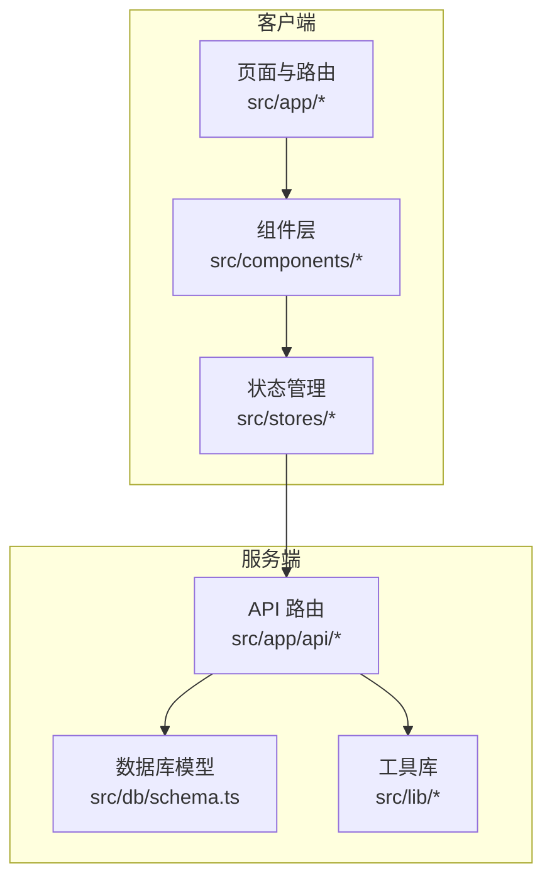
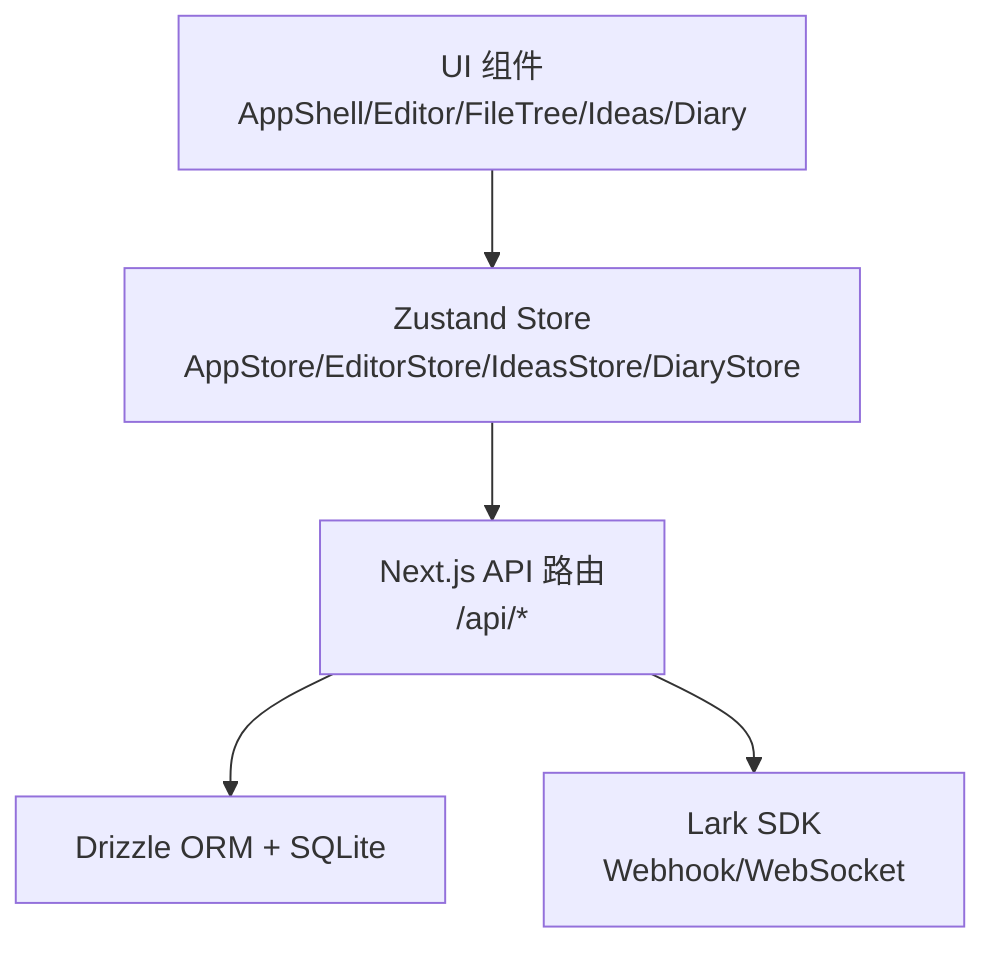
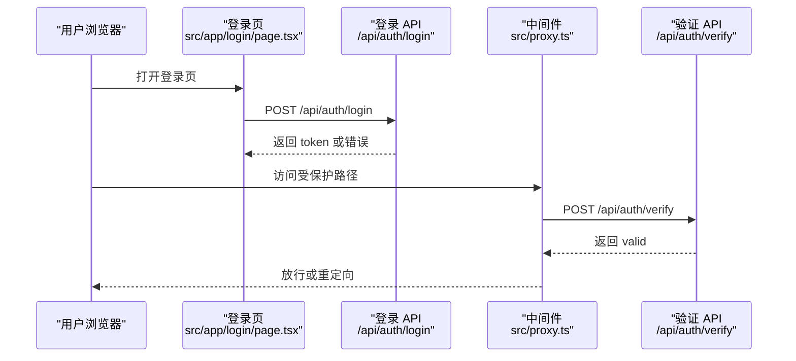
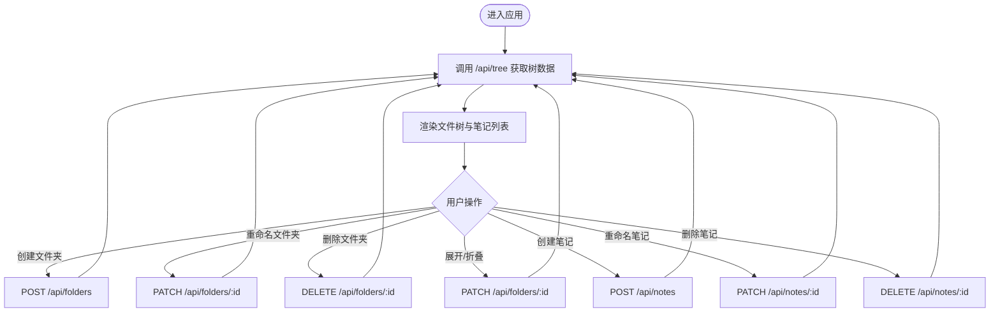
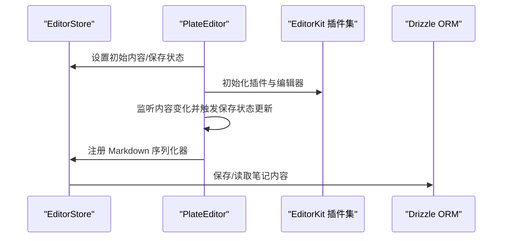
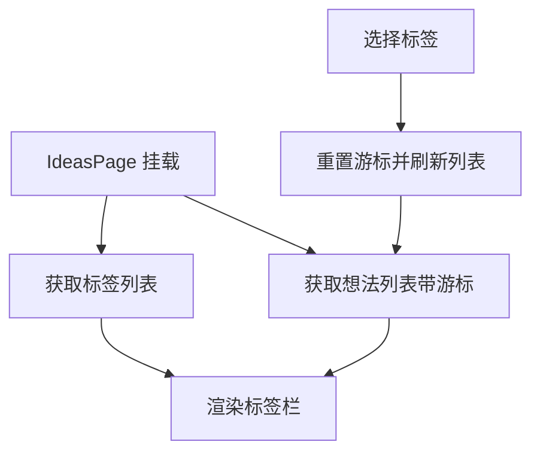
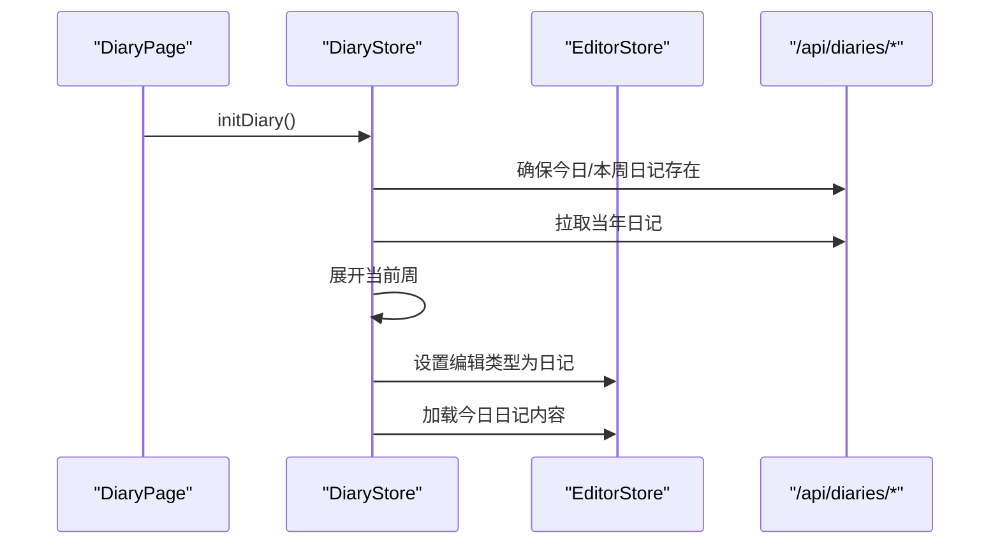
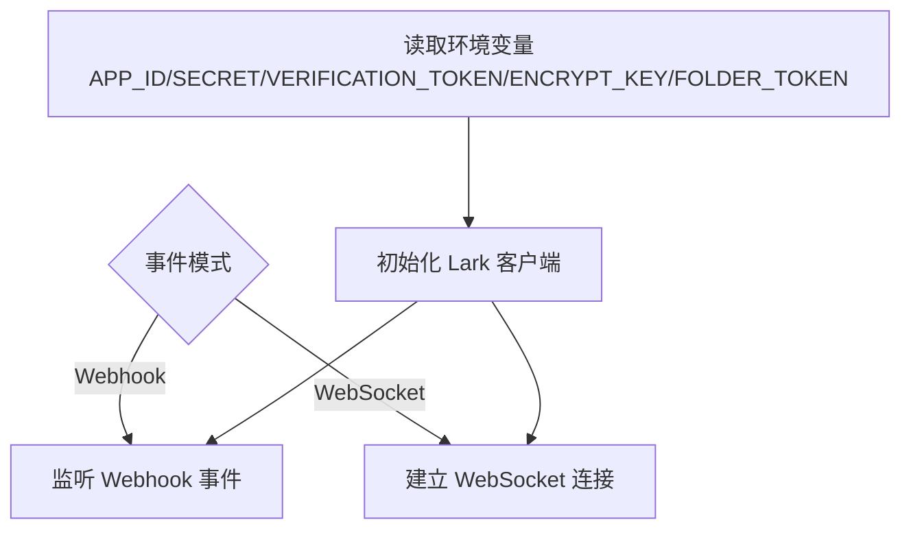
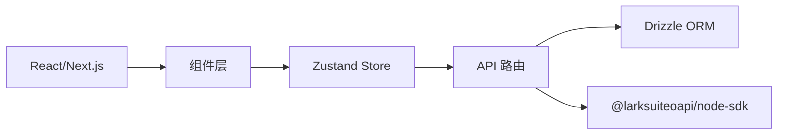

# 项目概述

<cite>
**本文引用的文件**
- [README.md](file://README.md)
- [package.json](file://package.json)
- [src/app/layout.tsx](file://src/app/layout.tsx)
- [src/app/page.tsx](file://src/app/page.tsx)
- [src/proxy.ts](file://src/proxy.ts)
- [src/lib/auth.ts](file://src/lib/auth.ts)
- [src/app/api/auth/login/route.ts](file://src/app/api/auth/login/route.ts)
- [src/app/api/auth/verify/route.ts](file://src/app/api/auth/verify/route.ts)
- [src/app/login/page.tsx](file://src/app/login/page.tsx)
- [src/db/schema.ts](file://src/db/schema.ts)
- [src/app/api/tree/route.ts](file://src/app/api/tree/route.ts)
- [src/stores/app-store.ts](file://src/stores/app-store.ts)
- [src/stores/editor-store.ts](file://src/stores/editor-store.ts)
- [src/stores/ideas-store.ts](file://src/stores/ideas-store.ts)
- [src/stores/diary-store.ts](file://src/stores/diary-store.ts)
- [src/components/layout/app-shell.tsx](file://src/components/layout/app-shell.tsx)
- [src/components/layout/header.tsx](file://src/components/layout/header.tsx)
- [src/components/editor/plate-editor.tsx](file://src/components/editor/plate-editor.tsx)
- [src/components/editor/editor-kit.tsx](file://src/components/editor/editor-kit.tsx)
- [src/components/file-tree/file-tree.tsx](file://src/components/file-tree/file-tree.tsx)
- [src/components/ideas/ideas-page.tsx](file://src/components/ideas/ideas-page.tsx)
- [src/components/diary/diary-page.tsx](file://src/components/diary/diary-page.tsx)
- [src/lib/lark.ts](file://src/lib/lark.ts)
- [src/lib/utils.ts](file://src/lib/utils.ts)
- [src/types/index.ts](file://src/types/index.ts)
</cite>

## 目录
1. [简介](#简介)
2. [项目结构](#项目结构)
3. [核心组件](#核心组件)
4. [架构总览](#架构总览)
5. [详细组件分析](#详细组件分析)
6. [依赖关系分析](#依赖关系分析)
7. [性能考量](#性能考量)
8. [故障排查指南](#故障排查指南)
9. [结论](#结论)
10. [附录](#附录)

## 简介
YNote v2 是一个基于 Next.js 16 的全栈 TypeScript 应用，定位为个人知识管理与创作平台。其核心目标是提供一体化的 Markdown 笔记、想法记录与日记写作体验，并通过飞书（Lark）云文档实现内容同步与协作能力。项目采用分层架构与组件化设计，结合 Plate.js 富文本引擎、Drizzle ORM 数据访问层以及 Zustand 状态管理，构建出高性能、可扩展且易维护的应用。

设计理念：
- 以“个人知识库”为核心：支持笔记、想法、日记三大模块，统一在侧边文件树中组织与导航。
- 高效编辑体验：基于 Plate.js 的插件化富文本编辑器，支持块级节点、列表、表格、公式、媒体等多种内容类型。
- 数据持久化与一致性：使用 Drizzle ORM 访问 SQLite，配合严格的字段约束与排序策略，确保数据结构清晰。
- 安全与可用性：内置登录鉴权、速率限制、会话校验与中间件拦截，保障应用安全。
- 飞书集成：提供 Webhook/WebSocket 事件处理与文件夹令牌配置，便于与飞书云文档联动。

## 项目结构
项目遵循 Next.js App Router 的目录约定，采用按功能域划分的组织方式：
- 根目录包含构建脚本、配置文件与根页面重定向。
- src/app 下为路由层（API 路由与页面），负责认证、树形数据、笔记、想法、日记、文件上传等。
- src/components 提供 UI 组件与业务组件（编辑器、文件树、想法页、日记页等）。
- src/stores 使用 Zustand 构建全局状态（应用态、编辑器态、想法态、日记态）。
- src/db 定义 Drizzle ORM 的数据库表结构。
- src/lib 提供工具函数、鉴权、Lark SDK 封装、Markdown 处理等。
- src/types 定义跨层共享的数据模型。

图表来源
- [src/app/layout.tsx:1-38](file://src/app/layout.tsx#L1-L38)
- [src/app/api/tree/route.ts:1-36](file://src/app/api/tree/route.ts#L1-L36)
- [src/db/schema.ts:1-105](file://src/db/schema.ts#L1-L105)

章节来源
- [README.md:1-37](file://README.md#L1-L37)
- [src/app/layout.tsx:1-38](file://src/app/layout.tsx#L1-L38)
- [src/app/page.tsx:1-6](file://src/app/page.tsx#L1-L6)

## 核心组件
- 应用壳与布局：AppShell 负责头部、侧边栏与主内容区的布局切换；Header 提供顶部导航与标签页切换。
- 编辑器：PlateEditor 基于 Plate.js 插件集，提供富文本编辑、自动保存、撤销/重做隔离与 Markdown 序列化。
- 文件树：FileTree 展示层级文件夹与笔记条目，支持展开/折叠、归档/解档、排序与搜索。
- 想法页：IdeasPage 提供想法创作、时间线展示与标签筛选。
- 日记页：DiaryPage 提供日记侧边栏与编辑器，支持按日/周组织日记。
- 全局状态：AppStore 管理标签页、树数据与 CRUD；EditorStore 管理当前编辑内容、保存状态与缓存；IdeasStore/DiaryStore 管理想法与日记数据流。

章节来源
- [src/components/layout/app-shell.tsx:1-43](file://src/components/layout/app-shell.tsx#L1-L43)
- [src/components/editor/plate-editor.tsx:1-175](file://src/components/editor/plate-editor.tsx#L1-L175)
- [src/components/file-tree/file-tree.tsx](file://src/components/file-tree/file-tree.tsx)
- [src/components/ideas/ideas-page.tsx:1-43](file://src/components/ideas/ideas-page.tsx#L1-L43)
- [src/components/diary/diary-page.tsx:1-29](file://src/components/diary/diary-page.tsx#L1-L29)
- [src/stores/app-store.ts:1-318](file://src/stores/app-store.ts#L1-L318)
- [src/stores/editor-store.ts:1-102](file://src/stores/editor-store.ts#L1-L102)
- [src/stores/ideas-store.ts:1-40](file://src/stores/ideas-store.ts#L1-L40)
- [src/stores/diary-store.ts:144-188](file://src/stores/diary-store.ts#L144-L188)

## 架构总览
系统采用前后端分离但紧密耦合的分层架构：
- 表现层：Next.js App Router 页面与组件，负责渲染与交互。
- 业务层：API 路由处理请求、调用数据库与外部服务。
- 数据层：Drizzle ORM + SQLite 存储，定义强类型的表结构与查询。
- 状态层：Zustand Store 管理应用状态与缓存，减少重复请求。
- 集成层：Lark SDK 封装，支持 Webhook/WebSocket 事件处理与文件夹令牌配置。

图表来源
- [src/components/layout/app-shell.tsx:1-43](file://src/components/layout/app-shell.tsx#L1-L43)
- [src/stores/app-store.ts:1-318](file://src/stores/app-store.ts#L1-L318)
- [src/stores/editor-store.ts:1-102](file://src/stores/editor-store.ts#L1-L102)
- [src/app/api/tree/route.ts:1-36](file://src/app/api/tree/route.ts#L1-L36)
- [src/db/schema.ts:1-105](file://src/db/schema.ts#L1-L105)
- [src/lib/lark.ts:1-96](file://src/lib/lark.ts#L1-L96)

## 详细组件分析

### 登录与鉴权流程
用户通过登录页提交密钥，后端进行速率限制与密码校验，成功后签发 JWT 并写入 Cookie。后续请求由中间件校验 Token，未通过则重定向到登录页并清理无效 Cookie。

图表来源
- [src/app/login/page.tsx:1-44](file://src/app/login/page.tsx#L1-L44)
- [src/app/api/auth/login/route.ts:1-47](file://src/app/api/auth/login/route.ts#L1-L47)
- [src/proxy.ts:1-49](file://src/proxy.ts#L1-L49)
- [src/app/api/auth/verify/route.ts:1-6](file://src/app/api/auth/verify/route.ts#L1-L6)
- [src/lib/auth.ts:1-26](file://src/lib/auth.ts#L1-L26)

章节来源
- [src/app/login/page.tsx:1-44](file://src/app/login/page.tsx#L1-L44)
- [src/app/api/auth/login/route.ts:1-47](file://src/app/api/auth/login/route.ts#L1-L47)
- [src/proxy.ts:1-49](file://src/proxy.ts#L1-L49)
- [src/app/api/auth/verify/route.ts:1-6](file://src/app/api/auth/verify/route.ts#L1-L6)
- [src/lib/auth.ts:1-26](file://src/lib/auth.ts#L1-L26)

### 文件树与笔记管理
- 初始加载：AppStore 调用 /api/tree 获取所有文件夹与笔记元数据。
- 文件夹操作：支持创建、重命名、删除、展开/折叠、全部展开/折叠、归档/解档。
- 笔记操作：支持创建、重命名、删除；删除时同步清理编辑器缓存与当前选中项。

图表来源
- [src/stores/app-store.ts:69-317](file://src/stores/app-store.ts#L69-L317)
- [src/app/api/tree/route.ts:1-36](file://src/app/api/tree/route.ts#L1-L36)
- [src/app/api/folders/route.ts](file://src/app/api/folders/route.ts)
- [src/app/api/notes/route.ts:1-86](file://src/app/api/notes/route.ts#L1-L86)

章节来源
- [src/stores/app-store.ts:1-318](file://src/stores/app-store.ts#L1-L318)
- [src/app/api/tree/route.ts:1-36](file://src/app/api/tree/route.ts#L1-L36)
- [src/app/api/notes/route.ts:1-86](file://src/app/api/notes/route.ts#L1-L86)

### 富文本编辑器（Plate.js）
- 内容比较：自定义深度比较算法，避免昂贵的 JSON 序列化，提升变更检测性能。
- 初始化与切换：每次笔记切换时重置编辑器状态，清空历史与选区，滚动至顶部。
- Markdown 序列化：由编辑器注册序列化回调，支持导出 Markdown。
- 缓存与撤销：编辑器撤销/重做历史与内容缓存相互独立，防止跨笔记污染。

图表来源
- [src/components/editor/plate-editor.tsx:1-175](file://src/components/editor/plate-editor.tsx#L1-L175)
- [src/stores/editor-store.ts:1-102](file://src/stores/editor-store.ts#L1-L102)
- [src/components/editor/editor-kit.tsx](file://src/components/editor/editor-kit.tsx)

章节来源
- [src/components/editor/plate-editor.tsx:1-175](file://src/components/editor/plate-editor.tsx#L1-L175)
- [src/stores/editor-store.ts:1-102](file://src/stores/editor-store.ts#L1-L102)

### 想法记录与标签筛选
- 数据流：IdeasStore 负责想法列表、标签与分页游标；IdeasPage 在挂载时拉取标签与初始化列表。
- 标签过滤：切换标签后重新拉取列表，保持 UI 与数据一致。
- 图像与标签：想法可关联图片与标签，支持多维检索与聚合。

图表来源
- [src/components/ideas/ideas-page.tsx:1-43](file://src/components/ideas/ideas-page.tsx#L1-L43)
- [src/stores/ideas-store.ts:1-40](file://src/stores/ideas-store.ts#L1-L40)

章节来源
- [src/components/ideas/ideas-page.tsx:1-43](file://src/components/ideas/ideas-page.tsx#L1-L43)
- [src/stores/ideas-store.ts:1-40](file://src/stores/ideas-store.ts#L1-L40)

### 日记模块（日/周维度）
- 初始化：首次进入日记页时，自动确保今日日记与本周周记存在，拉取当年日记并展开当前周。
- 侧边栏：按年份与周数组织，支持展开/收起周条目。
- 编辑器：切换日记条目后，编辑器加载对应内容并设置编辑类型为日记。

图表来源
- [src/components/diary/diary-page.tsx:1-29](file://src/components/diary/diary-page.tsx#L1-L29)
- [src/stores/diary-store.ts:144-188](file://src/stores/diary-store.ts#L144-L188)
- [src/stores/editor-store.ts:1-102](file://src/stores/editor-store.ts#L1-L102)

章节来源
- [src/components/diary/diary-page.tsx:1-29](file://src/components/diary/diary-page.tsx#L1-L29)
- [src/stores/diary-store.ts:144-188](file://src/stores/diary-store.ts#L144-L188)

### 飞书云文档集成
- SDK 初始化：封装 Lark 客户端与 WebSocket 客户端，支持从环境变量读取配置。
- 事件模式：支持 Webhook 与 WebSocket 两种事件模式，默认 Webhook。
- 权限与加密：支持校验令牌、加密密钥与允许用户 ID 白名单。
- 文件夹令牌：用于与特定云文档文件夹进行同步。

图表来源
- [src/lib/lark.ts:1-96](file://src/lib/lark.ts#L1-L96)

章节来源
- [src/lib/lark.ts:1-96](file://src/lib/lark.ts#L1-L96)

## 依赖关系分析
- 技术栈概览
  - 前端框架：Next.js 16（App Router）、React 19、TypeScript
  - 富文本：Plate.js 及其生态插件（基础节点、样式、列表、表格、数学公式、媒体、链接、斜杠命令等）
  - 状态管理：Zustand（轻量、直观的状态容器）
  - 数据库：Drizzle ORM + better-sqlite3（SQLite）
  - UI 组件：Radix UI、Sonner、Tailwind CSS
  - 工具库：date-fns、lodash、nanoid、jose（JWT）、bcryptjs（密码哈希）
  - 飞书集成：@larksuiteoapi/node-sdk
- 关键依赖关系
  - 组件依赖 Store：编辑器、文件树、想法页、日记页均通过 Zustand 访问全局状态。
  - Store 依赖 API：AppStore/EditorStore/IdeasStore/DiaryStore 通过 fetch 调用 /api/*。
  - API 依赖 ORM：API 路由使用 Drizzle ORM 读写 SQLite。
  - API 依赖 Lark：部分路由可能与 Lark 事件处理相关联。

图表来源
- [package.json:1-119](file://package.json#L1-L119)
- [src/stores/app-store.ts:1-318](file://src/stores/app-store.ts#L1-L318)
- [src/stores/editor-store.ts:1-102](file://src/stores/editor-store.ts#L1-L102)
- [src/app/api/tree/route.ts:1-36](file://src/app/api/tree/route.ts#L1-L36)
- [src/db/schema.ts:1-105](file://src/db/schema.ts#L1-L105)
- [src/lib/lark.ts:1-96](file://src/lib/lark.ts#L1-L96)

章节来源
- [package.json:1-119](file://package.json#L1-L119)

## 性能考量
- 编辑器性能
  - 自定义值比较算法替代 JSON 深拷贝，降低变更检测成本。
  - 切换笔记时重置撤销/重做历史，避免跨笔记状态污染。
- 状态缓存
  - 编辑器内容采用 LRU 缓存，控制最大容量，平衡内存占用与回放速度。
- 请求优化
  - AppStore 对文件夹展开/折叠与归档/解档采用乐观更新，减少等待时间。
  - 批量操作（如全部展开/折叠）使用 Promise.all 并行处理。
- 数据库
  - 查询按排序字段与创建时间排序，保证稳定顺序与良好索引利用。

章节来源
- [src/components/editor/plate-editor.tsx:1-175](file://src/components/editor/plate-editor.tsx#L1-L175)
- [src/stores/editor-store.ts:1-102](file://src/stores/editor-store.ts#L1-L102)
- [src/stores/app-store.ts:149-191](file://src/stores/app-store.ts#L149-L191)

## 故障排查指南
- 登录失败
  - 检查密钥是否正确，确认后端返回的错误信息与状态码。
  - 查看速率限制响应头（Retry-After、X-RateLimit-Remaining）。
- 无权限访问
  - 中间件会拦截未登录或无效 Token 的请求，检查 Cookie 与 Token 是否过期。
- 编辑器异常
  - 若内容不更新或保存状态异常，确认 handleChange 触发条件与 baselineContentRef 是否正确更新。
- 数据库问题
  - 确认 Drizzle ORM 初始化与 SQLite 文件权限，检查表结构与字段类型。
- Lark 集成
  - 确认环境变量配置完整，事件模式选择正确；若使用 WebSocket，检查连接状态与自动重连。

章节来源
- [src/app/api/auth/login/route.ts:1-47](file://src/app/api/auth/login/route.ts#L1-L47)
- [src/proxy.ts:1-49](file://src/proxy.ts#L1-L49)
- [src/components/editor/plate-editor.tsx:1-175](file://src/components/editor/plate-editor.tsx#L1-L175)
- [src/db/schema.ts:1-105](file://src/db/schema.ts#L1-L105)
- [src/lib/lark.ts:1-96](file://src/lib/lark.ts#L1-L96)

## 结论
YNote v2 通过清晰的分层架构与组件化设计，将富文本编辑、笔记管理、想法记录与日记写作整合为统一的知识工作流。借助 Plate.js 的强大插件体系与 Drizzle ORM 的类型安全，项目在易用性与可维护性之间取得良好平衡。配合飞书云文档集成，进一步拓展了内容协作与同步能力。建议在生产环境中完善监控与日志、增强错误边界与离线策略，并持续优化编辑器性能与缓存策略。

## 附录
- 开发环境要求
  - Node.js 版本与包管理器（npm/yarn/pnpm/bun）
  - SQLite 环境（better-sqlite3）
  - 飞书应用配置（可选）
- 快速开始
  - 启动开发服务器：运行 dev 脚本后访问本地端口
  - 登录：在登录页输入密钥完成鉴权
  - 功能入口：通过顶部标签页在“笔记/想法/日记”之间切换

章节来源
- [README.md:1-37](file://README.md#L1-L37)
- [package.json:1-119](file://package.json#L1-L119)
- [src/app/login/page.tsx:1-44](file://src/app/login/page.tsx#L1-L44)