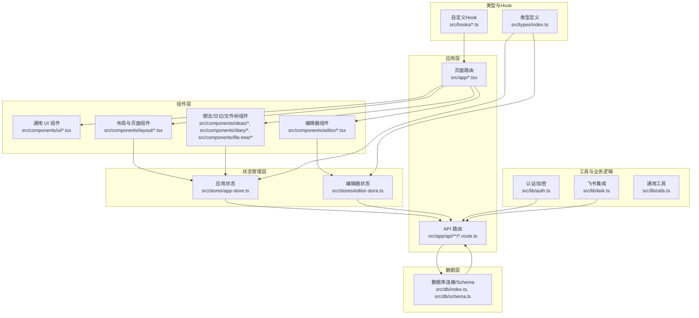
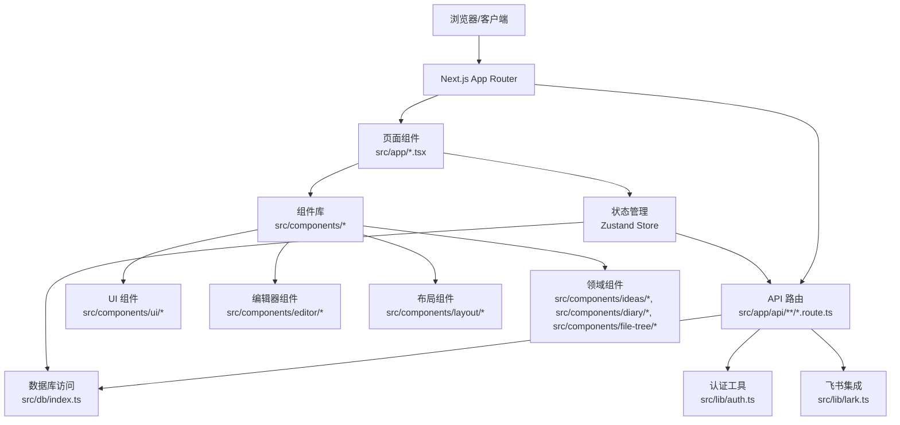
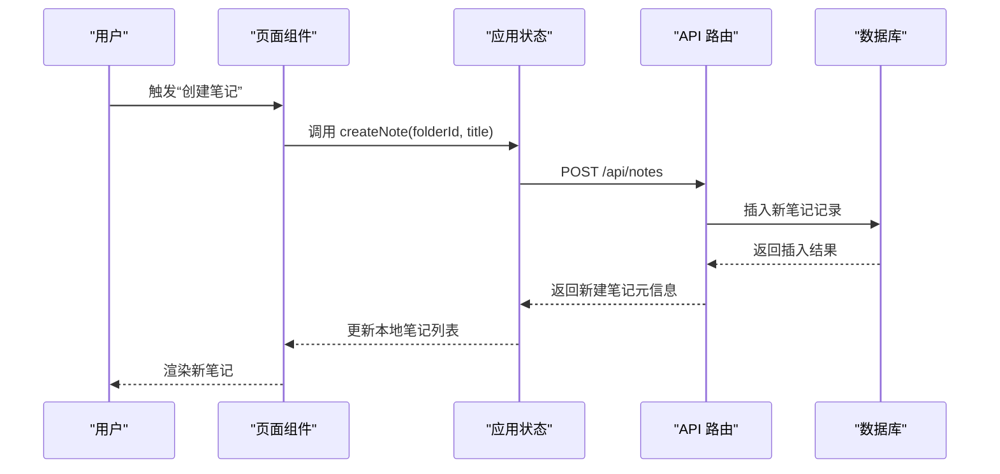
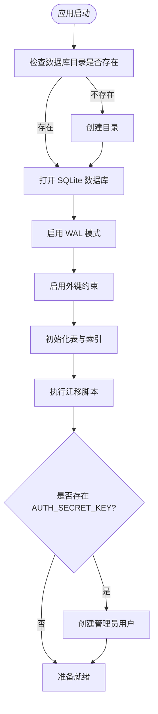
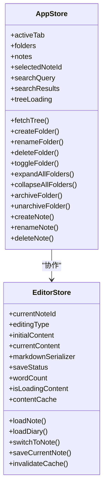
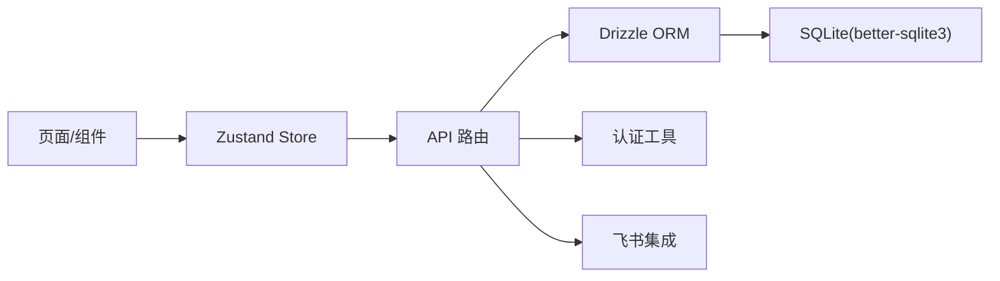

# 项目结构说明

<cite>
**本文引用的文件**
- [package.json](file://package.json)
- [README.md](file://README.md)
- [src/app/layout.tsx](file://src/app/layout.tsx)
- [src/app/page.tsx](file://src/app/page.tsx)
- [src/app/api/notes/route.ts](file://src/app/api/notes/route.ts)
- [src/app/api/folders/route.ts](file://src/app/api/folders/route.ts)
- [src/db/index.ts](file://src/db/index.ts)
- [src/lib/utils.ts](file://src/lib/utils.ts)
- [src/lib/auth.ts](file://src/lib/auth.ts)
- [src/lib/lark.ts](file://src/lib/lark.ts)
- [src/stores/app-store.ts](file://src/stores/app-store.ts)
- [src/stores/editor-store.ts](file://src/stores/editor-store.ts)
- [src/hooks/use-mounted.ts](file://src/hooks/use-mounted.ts)
- [src/types/index.ts](file://src/types/index.ts)
- [src/components/layout/app-shell.tsx](file://src/components/layout/app-shell.tsx)
- [src/components/editor/plate-editor.tsx](file://src/components/editor/plate-editor.tsx)
</cite>

## 目录

1. [简介](#简介)
2. [项目结构](#项目结构)
3. [核心组件](#核心组件)
4. [架构总览](#架构总览)
5. [详细组件分析](#详细组件分析)
6. [依赖关系分析](#依赖关系分析)
7. [性能考量](#性能考量)
8. [故障排查指南](#故障排查指南)
9. [结论](#结论)
10. [附录](#附录)

## 简介

本文件面向 YNote v2 项目，系统性梳理项目目录组织原则、Next.js App Router 的页面与 API 路由组织方式、可复用组件分类与命名规范、数据层设计与数据库连接配置、工具函数库与业务逻辑模块、状态管理容器设计、自定义 Hook 实现，并提供目录间依赖关系图与数据流向说明，最后总结文件命名约定与代码组织最佳实践。

## 项目结构

- 顶层采用 Next.js App Router 目录结构，页面路由位于 `src/app/`，API 路由位于 `src/app/api/`。
- 组件层位于 `src/components/`，按功能域分包（如 `editor/`、`layout/`、`ui/`、`ideas/`、`diary/`、`file-tree/`），体现高内聚低耦合。
- 数据层位于 `src/db/`，通过 Drizzle ORM + better-sqlite3 访问 SQLite 数据库，提供单例连接与初始化迁移。
- 工具与业务逻辑位于 `src/lib/`，包含认证、飞书集成、富文本序列化、时间格式化等。
- 状态管理位于 `src/stores/`，基于 Zustand 构建应用全局状态与编辑器状态。
- 自定义 Hook 位于 `src/hooks/`，提供跨组件复用的交互逻辑。
- 类型定义位于 `src/types/`，统一导出接口类型。
- 公共样式与字体在 `src/app/globals.css` 与布局入口 `src/app/layout.tsx` 中集中配置。

图表来源
- [src/app/layout.tsx](file://src/app/layout.tsx)
- [src/app/api/notes/route.ts](file://src/app/api/notes/route.ts)
- [src/app/api/folders/route.ts](file://src/app/api/folders/route.ts)
- [src/components/editor/plate-editor.tsx](file://src/components/editor/plate-editor.tsx)
- [src/components/layout/app-shell.tsx](file://src/components/layout/app-shell.tsx)
- [src/stores/app-store.ts](file://src/stores/app-store.ts)
- [src/stores/editor-store.ts](file://src/stores/editor-store.ts)
- [src/db/index.ts](file://src/db/index.ts)
- [src/lib/auth.ts](file://src/lib/auth.ts)
- [src/lib/lark.ts](file://src/lib/lark.ts)
- [src/lib/utils.ts](file://src/lib/utils.ts)
- [src/types/index.ts](file://src/types/index.ts)
- [src/hooks/use-mounted.ts](file://src/hooks/use-mounted.ts)

章节来源
- [src/app/layout.tsx](file://src/app/layout.tsx)
- [src/app/page.tsx](file://src/app/page.tsx)
- [package.json](file://package.json)
- [README.md](file://README.md)

## 核心组件

- 应用壳与路由入口
  - 根布局负责全局样式与 Provider 包装，页面入口重定向到应用主路由。
  - 页面路由与 API 路由遵循 Next.js App Router 命名约定，以 `route.ts` 定义请求处理函数。

- 数据层
  - 使用 better-sqlite3 作为底层存储，Drizzle ORM 提供类型安全的查询与迁移。
  - 单例模式管理数据库连接，启动时自动创建表与索引，并进行必要的迁移与默认用户初始化。

- 状态管理
  - 应用状态：维护标签页、文件树、选中项、搜索结果、加载状态以及对文件夹/笔记的增删改查。
  - 编辑器状态：维护当前编辑内容、缓存、保存状态、字数统计与 Markdown 序列化回调。

- 组件体系
  - 编辑器组件基于 Plate.js，提供富文本编辑能力；UI 组件基于 Radix UI 与 Tailwind。
  - 布局组件负责头部、侧边树与主编辑区的组合；想法/日记/文件树组件按功能域拆分。

- 工具与业务逻辑
  - 认证：基于 JWT 的签发与校验，支持过期时间配置。
  - 飞书集成：提供客户端初始化、WebSocket 客户端、云空间文件夹操作与路径确保能力。
  - 通用工具：类名合并、Tailwind 合并等。

章节来源
- [src/app/layout.tsx](file://src/app/layout.tsx)
- [src/app/page.tsx](file://src/app/page.tsx)
- [src/db/index.ts](file://src/db/index.ts)
- [src/stores/app-store.ts](file://src/stores/app-store.ts)
- [src/stores/editor-store.ts](file://src/stores/editor-store.ts)
- [src/components/editor/plate-editor.tsx](file://src/components/editor/plate-editor.tsx)
- [src/components/layout/app-shell.tsx](file://src/components/layout/app-shell.tsx)
- [src/lib/auth.ts](file://src/lib/auth.ts)
- [src/lib/lark.ts](file://src/lib/lark.ts)
- [src/lib/utils.ts](file://src/lib/utils.ts)

## 架构总览

图表来源
- [src/app/layout.tsx](file://src/app/layout.tsx)
- [src/app/api/notes/route.ts](file://src/app/api/notes/route.ts)
- [src/app/api/folders/route.ts](file://src/app/api/folders/route.ts)
- [src/db/index.ts](file://src/db/index.ts)
- [src/lib/auth.ts](file://src/lib/auth.ts)
- [src/lib/lark.ts](file://src/lib/lark.ts)
- [src/stores/app-store.ts](file://src/stores/app-store.ts)
- [src/stores/editor-store.ts](file://src/stores/editor-store.ts)
- [src/components/editor/plate-editor.tsx](file://src/components/editor/plate-editor.tsx)
- [src/components/layout/app-shell.tsx](file://src/components/layout/app-shell.tsx)

## 详细组件分析

### Next.js App Router 结构与路由组织

- 页面路由
  - 根页面重定向至应用主页面，应用壳负责渲染头部、侧边树与主编辑区。
  - 页面组件通过状态管理与 API 路由交互，实现数据驱动的视图更新。

- API 路由
  - 笔记 API：支持按文件夹筛选列出笔记、创建笔记；响应字段包含元信息与排序字段。
  - 文件夹 API：支持列出所有文件夹、创建文件夹；限制名称长度与非法字符，强制二级深度。
  - 其他 API（如 diaries、tags、tree、upload 等）均遵循相同模式：参数解析、校验、数据库操作、错误处理与统一响应。

图表来源
- [src/stores/app-store.ts](file://src/stores/app-store.ts)
- [src/app/api/notes/route.ts](file://src/app/api/notes/route.ts)

章节来源
- [src/app/page.tsx](file://src/app/page.tsx)
- [src/components/layout/app-shell.tsx](file://src/components/layout/app-shell.tsx)
- [src/app/api/notes/route.ts](file://src/app/api/notes/route.ts)
- [src/app/api/folders/route.ts](file://src/app/api/folders/route.ts)

### 数据层设计与数据库连接配置

- 连接与初始化
  - 通过 better-sqlite3 打开数据库文件，启用 WAL 模式与外键约束。
  - 初始化表结构与索引，执行迁移（如新增归档字段），并根据环境变量初始化管理员账户。

- Schema 与查询
  - 使用 Drizzle ORM 的类型安全查询，避免手写 SQL 的脆弱性。
  - 常见查询包括按排序与创建时间排序、空值条件过滤等。

图表来源
- [src/db/index.ts](file://src/db/index.ts)

章节来源
- [src/db/index.ts](file://src/db/index.ts)

### 可复用组件分类与命名规范

- 组件分类
  - UI 组件：基础控件（按钮、输入框、对话框、菜单等），统一风格与交互。
  - 编辑器组件：围绕 Plate.js 的插件集合、编辑器容器、工具栏等。
  - 布局组件：应用壳、头部、侧边栏等。
  - 领域组件：想法、日记、文件树等按功能域划分。

- 命名规范
  - 文件名使用小驼峰或短横线分隔，组件名使用帕斯卡命名。
  - 功能域前缀清晰表达归属，如 `editor-*`、`layout-*`、`ideas-*`、`diary-*`、`file-tree-*`。

章节来源
- [src/components/editor/plate-editor.tsx](file://src/components/editor/plate-editor.tsx)
- [src/components/layout/app-shell.tsx](file://src/components/layout/app-shell.tsx)

### 状态管理容器设计

- 应用状态（Zustand）
  - 维护活动标签页、文件树、笔记列表、选中项、搜索状态与加载状态。
  - 对文件夹与笔记提供增删改查方法，内部通过 API 路由与数据库交互，并乐观更新 UI。

- 编辑器状态（Zustand）
  - 维护当前编辑内容、Markdown 序列化器、保存状态、字数统计与 LRU 内容缓存。
  - 支持手动保存、内容加载与缓存失效。

图表来源
- [src/stores/app-store.ts](file://src/stores/app-store.ts)
- [src/stores/editor-store.ts](file://src/stores/editor-store.ts)

章节来源
- [src/stores/app-store.ts](file://src/stores/app-store.ts)
- [src/stores/editor-store.ts](file://src/stores/editor-store.ts)

### 自定义 Hook 实现

- useMounted：用于判断组件是否已挂载，避免服务端渲染期间执行客户端逻辑。
- use-debounce、use-mobile、use-is-touch-device、use-upload-file：提供通用交互与行为抽象，便于跨组件复用。

章节来源
- [src/hooks/use-mounted.ts](file://src/hooks/use-mounted.ts)

### 工具函数库与业务逻辑模块

- 认证（JWT）
  - 支持签发与校验，密钥与过期时间来自环境变量。
- 飞书集成
  - 提供客户端初始化、WebSocket 客户端、租户访问令牌获取、云空间文件夹层级确保等。
- 通用工具
  - 类名合并与 Tailwind 合并，简化样式拼接。

章节来源
- [src/lib/auth.ts](file://src/lib/auth.ts)
- [src/lib/lark.ts](file://src/lib/lark.ts)
- [src/lib/utils.ts](file://src/lib/utils.ts)

## 依赖关系分析

- 组件到状态管理
  - 页面组件通过状态容器读取与更新数据，编辑器组件与应用状态协同完成内容持久化。
- 状态管理到 API
  - 应用状态与编辑器状态通过 fetch 调用 API 路由，实现 CRUD 与查询。
- API 到数据层
  - API 路由使用数据库连接进行读写，Drizzle ORM 提供类型安全的查询构建。
- 工具模块
  - 认证与飞书模块被 API 路由调用，提供鉴权与外部系统集成能力。

图表来源
- [src/stores/app-store.ts](file://src/stores/app-store.ts)
- [src/stores/editor-store.ts](file://src/stores/editor-store.ts)
- [src/app/api/notes/route.ts](file://src/app/api/notes/route.ts)
- [src/app/api/folders/route.ts](file://src/app/api/folders/route.ts)
- [src/db/index.ts](file://src/db/index.ts)
- [src/lib/auth.ts](file://src/lib/auth.ts)
- [src/lib/lark.ts](file://src/lib/lark.ts)

章节来源
- [src/stores/app-store.ts](file://src/stores/app-store.ts)
- [src/stores/editor-store.ts](file://src/stores/editor-store.ts)
- [src/app/api/notes/route.ts](file://src/app/api/notes/route.ts)
- [src/app/api/folders/route.ts](file://src/app/api/folders/route.ts)
- [src/db/index.ts](file://src/db/index.ts)
- [src/lib/auth.ts](file://src/lib/auth.ts)
- [src/lib/lark.ts](file://src/lib/lark.ts)

## 性能考量

- 编辑器性能
  - 使用结构化比较避免频繁 JSON 序列化，减少不必要的重渲染。
  - 内容缓存采用 LRU 策略，控制最大缓存条目数量，提升切换与加载性能。
- 状态更新
  - 应用状态对文件夹展开/折叠、归档/解档等操作采用乐观更新，结合批量请求优化用户体验。
- 数据库
  - 启用 WAL 模式与外键约束，配合索引提升查询效率；迁移脚本保证结构演进的向后兼容。

## 故障排查指南

- 数据库初始化失败
  - 检查数据库路径权限与目录是否存在；确认环境变量 `AUTH_SECRET_KEY` 是否正确设置以初始化管理员账户。
- API 请求错误
  - 校验请求体参数合法性（如标题/名称长度、非法字符）；查看响应状态码与错误信息。
- 飞书集成异常
  - 确认 `LARK_APP_ID`、`LARK_APP_SECRET`、`LARK_FOLDER_TOKEN` 等环境变量配置；检查租户访问令牌获取与文件夹层级确保流程。
- 认证问题
  - 检查 `JWT_SECRET` 与 `JWT_EXPIRY` 配置；核对签发与校验流程是否一致。

章节来源
- [src/db/index.ts](file://src/db/index.ts)
- [src/app/api/notes/route.ts](file://src/app/api/notes/route.ts)
- [src/app/api/folders/route.ts](file://src/app/api/folders/route.ts)
- [src/lib/lark.ts](file://src/lib/lark.ts)
- [src/lib/auth.ts](file://src/lib/auth.ts)

## 结论

YNote v2 采用清晰的分层架构：页面与 API 路由位于 App Router 下，组件按功能域组织，状态管理通过 Zustand 实现，数据层以 Drizzle ORM + better-sqlite3 提供类型安全与高性能访问。工具模块覆盖认证与第三方集成，类型定义贯穿全栈，形成高内聚、低耦合且易于扩展的工程化结构。

## 附录

- 文件命名约定
  - 组件文件：小驼峰或短横线分隔，如 `plate-editor.tsx`、`file-tree.tsx`。
  - API 路由：以 `route.ts` 结尾，路径即路由，如 `/api/notes/route.ts`。
  - 状态文件：以 `-store.ts` 结尾，如 `app-store.ts`、`editor-store.ts`。
  - 工具文件：语义化命名，如 `auth.ts`、`lark.ts`、`utils.ts`。
- 代码组织最佳实践
  - 将 UI 组件与业务组件分离，保持组件单一职责。
  - 使用类型定义统一接口，避免魔法字符串与隐式类型。
  - 在状态容器中封装副作用与网络请求，保持 UI 组件纯净。
  - 对关键流程（如编辑器保存、文件夹层级确保）添加日志与错误回滚策略。