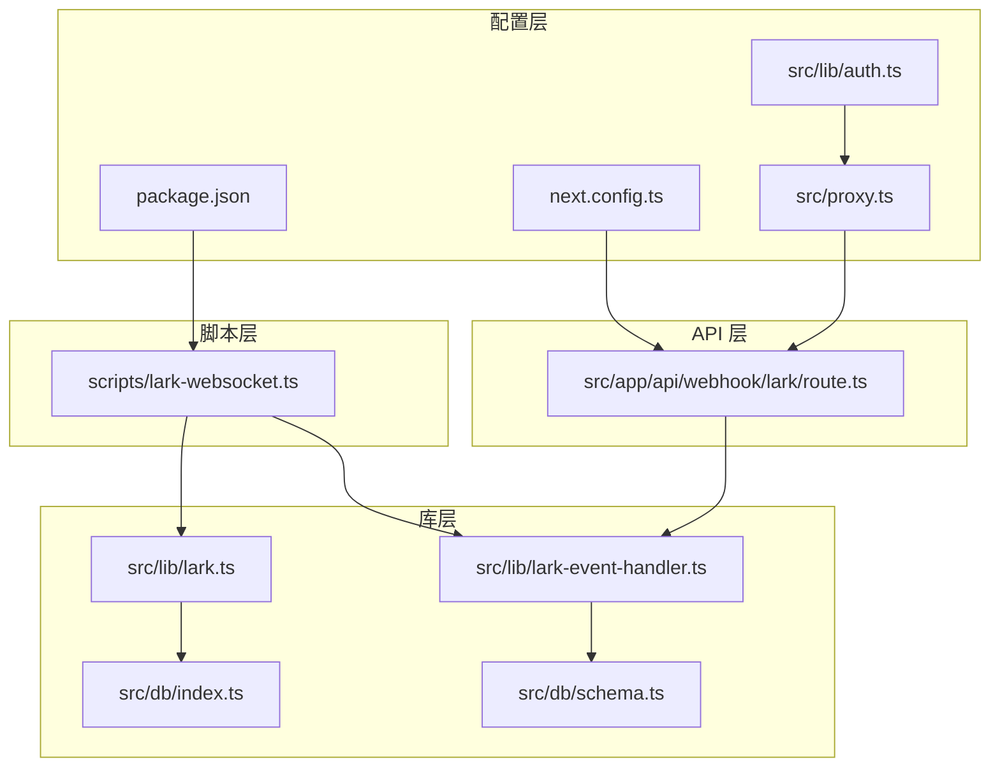
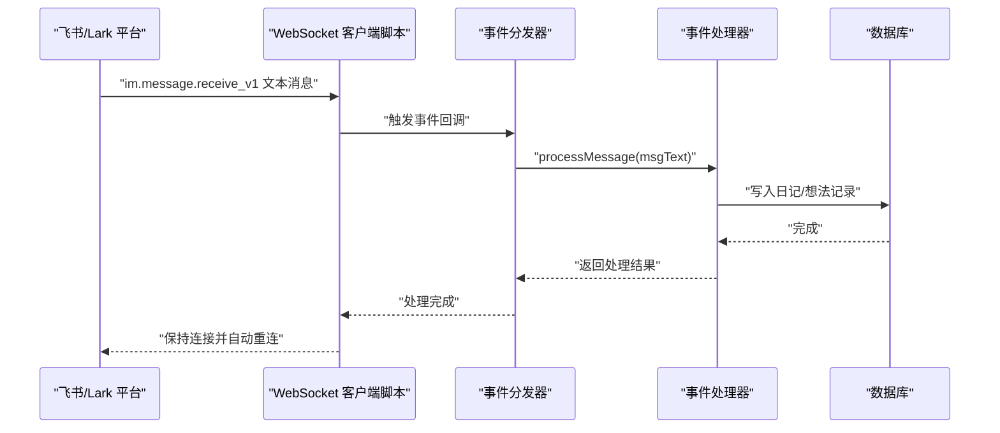
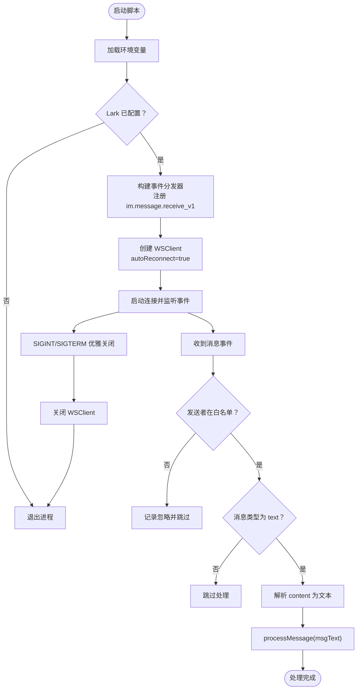
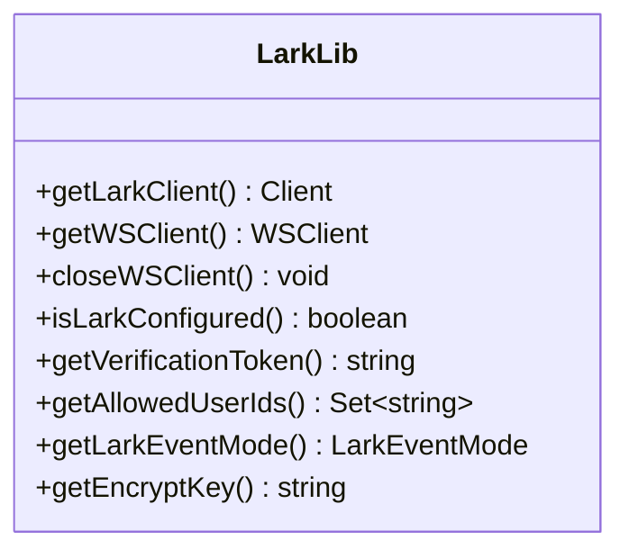
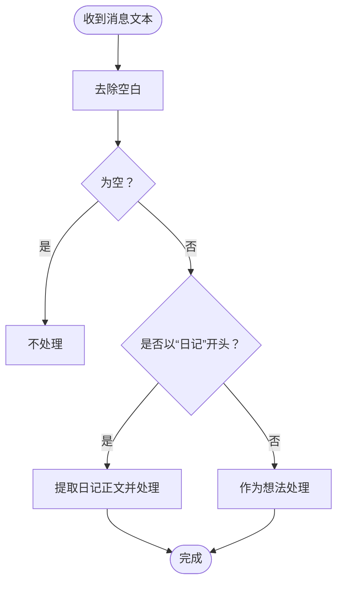
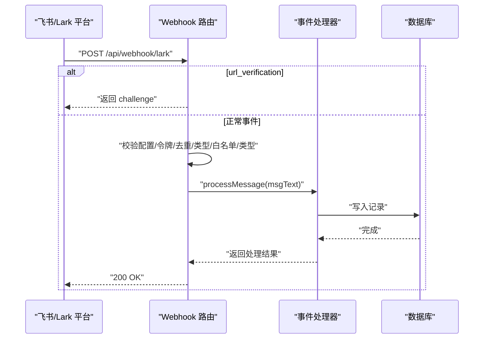
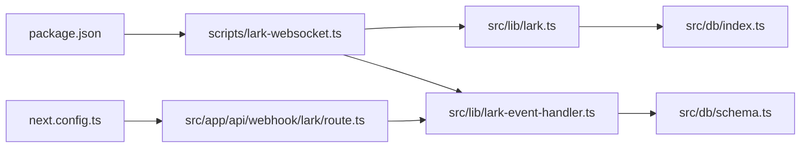

# WebSocket 实时通信

<cite>
**本文引用的文件**
- [scripts/lark-websocket.ts](file://scripts/lark-websocket.ts)
- [src/lib/lark.ts](file://src/lib/lark.ts)
- [src/lib/lark-event-handler.ts](file://src/lib/lark-event-handler.ts)
- [src/app/api/webhook/lark/route.ts](file://src/app/api/webhook/lark/route.ts)
- [package.json](file://package.json)
- [src/db/schema.ts](file://src/db/schema.ts)
- [src/db/index.ts](file://src/db/index.ts)
- [src/lib/auth.ts](file://src/lib/auth.ts)
- [src/proxy.ts](file://src/proxy.ts)
- [next.config.ts](file://next.config.ts)
</cite>

## 目录
1. [简介](#简介)
2. [项目结构](#项目结构)
3. [核心组件](#核心组件)
4. [架构总览](#架构总览)
5. [详细组件分析](#详细组件分析)
6. [依赖关系分析](#依赖关系分析)
7. [性能考量](#性能考量)
8. [故障排查指南](#故障排查指南)
9. [结论](#结论)
10. [附录](#附录)

## 简介
本文件系统性地文档化了基于飞书/Lark 的 WebSocket 实时通信方案，涵盖客户端配置与连接建立流程（含自动重连）、消息格式与事件类型、连接状态管理与错误处理、加密密钥配置与消息解密、服务器部署与配置、连接池与资源清理、调试与监控方法，以及与编辑器系统的集成方式。该方案同时支持 Webhook 与 WebSocket 两种模式，并通过共享事件处理器实现一致性行为。

## 项目结构
与 WebSocket 实时通信直接相关的模块分布如下：
- 脚本层：独立运行的 WebSocket 客户端脚本，负责长连接与事件分发
- 库层：Lark SDK 封装、事件处理器、数据库初始化与表结构
- API 层：Webhook 接入点，用于对比验证 WebSocket 模式的行为
- 配置层：包脚本、Next 配置、认证与代理中间件

图表来源
- [scripts/lark-websocket.ts:1-109](file://scripts/lark-websocket.ts#L1-L109)
- [src/lib/lark.ts:1-96](file://src/lib/lark.ts#L1-L96)
- [src/lib/lark-event-handler.ts:1-126](file://src/lib/lark-event-handler.ts#L1-L126)
- [src/app/api/webhook/lark/route.ts:1-106](file://src/app/api/webhook/lark/route.ts#L1-L106)
- [src/db/schema.ts:1-105](file://src/db/schema.ts#L1-L105)
- [src/db/index.ts:1-171](file://src/db/index.ts#L1-L171)
- [package.json:1-119](file://package.json#L1-L119)
- [next.config.ts:1-16](file://next.config.ts#L1-L16)
- [src/lib/auth.ts:1-25](file://src/lib/auth.ts#L1-L25)
- [src/proxy.ts:1-49](file://src/proxy.ts#L1-L49)

章节来源
- [scripts/lark-websocket.ts:1-109](file://scripts/lark-websocket.ts#L1-L109)
- [src/lib/lark.ts:1-96](file://src/lib/lark.ts#L1-L96)
- [src/lib/lark-event-handler.ts:1-126](file://src/lib/lark-event-handler.ts#L1-L126)
- [src/app/api/webhook/lark/route.ts:1-106](file://src/app/api/webhook/lark/route.ts#L1-L106)
- [src/db/schema.ts:1-105](file://src/db/schema.ts#L1-L105)
- [src/db/index.ts:1-171](file://src/db/index.ts#L1-L171)
- [package.json:1-119](file://package.json#L1-L119)
- [next.config.ts:1-16](file://next.config.ts#L1-L16)
- [src/lib/auth.ts:1-25](file://src/lib/auth.ts#L1-L25)
- [src/proxy.ts:1-49](file://src/proxy.ts#L1-L49)

## 核心组件
- WebSocket 客户端脚本：独立进程，加载环境变量，创建事件分发器与 WebSocket 客户端，注册 im.message.receive_v1 事件处理器，启动连接并处理优雅关闭
- Lark SDK 封装：提供获取 Lark 客户端、判断配置、获取校验令牌、允许用户集合、事件模式、加密密钥、WebSocket 客户端单例与关闭等能力
- 事件处理器：解析消息文本，按前缀路由到日记或想法处理逻辑，写入数据库
- Webhook 入口：URL 校验、配置检查、加密负载检测、令牌校验、去重、事件类型过滤、发送者白名单、消息类型过滤、内容解析与共享处理器调用
- 数据库：Better-SQLite3 初始化、表结构定义（含日记表），索引优化
- 配置与运行：NPM 脚本、并发启动、Next 外部依赖声明、JWT 认证与代理中间件

章节来源
- [scripts/lark-websocket.ts:1-109](file://scripts/lark-websocket.ts#L1-L109)
- [src/lib/lark.ts:1-96](file://src/lib/lark.ts#L1-L96)
- [src/lib/lark-event-handler.ts:1-126](file://src/lib/lark-event-handler.ts#L1-L126)
- [src/app/api/webhook/lark/route.ts:1-106](file://src/app/api/webhook/lark/route.ts#L1-L106)
- [src/db/schema.ts:1-105](file://src/db/schema.ts#L1-L105)
- [src/db/index.ts:1-171](file://src/db/index.ts#L1-L171)
- [package.json:1-119](file://package.json#L1-L119)
- [next.config.ts:1-16](file://next.config.ts#L1-L16)
- [src/lib/auth.ts:1-25](file://src/lib/auth.ts#L1-L25)
- [src/proxy.ts:1-49](file://src/proxy.ts#L1-L49)

## 架构总览
下图展示了 WebSocket 与 Webhook 两条路径在事件处理上的统一入口，以及与数据库的交互。

图表来源
- [scripts/lark-websocket.ts:38-71](file://scripts/lark-websocket.ts#L38-L71)
- [src/lib/lark-event-handler.ts:104-125](file://src/lib/lark-event-handler.ts#L104-L125)
- [src/db/schema.ts:93-104](file://src/db/schema.ts#L93-L104)

## 详细组件分析

### WebSocket 客户端脚本
- 配置加载：使用 dotenv 加载 .env，读取应用凭据、允许用户列表、加密密钥
- 事件分发器：注册 im.message.receive_v1 事件，进行发送者白名单过滤、消息类型过滤、内容解析后交由共享处理器
- 客户端创建：使用 Lark SDK 的 WSClient，启用自动重连
- 连接生命周期：启动连接、捕获失败、优雅关闭（SIGINT/SIGTERM）
- 日志与可观测性：输出连接状态、App ID 摘要、允许用户列表、错误日志

图表来源
- [scripts/lark-websocket.ts:23-27](file://scripts/lark-websocket.ts#L23-L27)
- [scripts/lark-websocket.ts:38-71](file://scripts/lark-websocket.ts#L38-L71)
- [scripts/lark-websocket.ts:73-80](file://scripts/lark-websocket.ts#L73-L80)
- [scripts/lark-websocket.ts:82-96](file://scripts/lark-websocket.ts#L82-L96)
- [scripts/lark-websocket.ts:101-108](file://scripts/lark-websocket.ts#L101-L108)

章节来源
- [scripts/lark-websocket.ts:1-109](file://scripts/lark-websocket.ts#L1-L109)

### Lark SDK 封装
- 单例客户端：Lark Client 与 WSClient 均采用惰性初始化与单例缓存，避免重复创建
- 配置项：应用 ID/Secret、校验令牌、允许用户集合、事件模式、加密密钥
- 关闭接口：提供关闭 WSClient 并清空缓存的方法，便于资源回收

图表来源
- [src/lib/lark.ts:8-23](file://src/lib/lark.ts#L8-L23)
- [src/lib/lark.ts:69-85](file://src/lib/lark.ts#L69-L85)
- [src/lib/lark.ts:89-95](file://src/lib/lark.ts#L89-L95)
- [src/lib/lark.ts:25-41](file://src/lib/lark.ts#L25-L41)
- [src/lib/lark.ts:51-57](file://src/lib/lark.ts#L51-L57)
- [src/lib/lark.ts:62-64](file://src/lib/lark.ts#L62-L64)

章节来源
- [src/lib/lark.ts:1-96](file://src/lib/lark.ts#L1-L96)

### 事件处理器与消息格式
- 事件类型：im.message.receive_v1（文本消息）
- 消息格式：包含消息体与发送者信息；内容为 JSON 字符串，需解析出 text 字段
- 路由规则：以“日记：”或“日记:”开头的消息进入日记处理分支，否则作为想法处理
- 数据持久化：日记按日期聚合，想法直接插入；均使用共享处理器与数据库表结构

图表来源
- [src/lib/lark-event-handler.ts:104-125](file://src/lib/lark-event-handler.ts#L104-L125)
- [src/lib/lark-event-handler.ts:28-87](file://src/lib/lark-event-handler.ts#L28-L87)
- [src/lib/lark-event-handler.ts:92-98](file://src/lib/lark-event-handler.ts#L92-L98)

章节来源
- [src/lib/lark-event-handler.ts:1-126](file://src/lib/lark-event-handler.ts#L1-L126)

### Webhook 对比验证
- URL 校验：识别 url_verification 类型请求，校验 token 后返回 challenge
- 配置检查：未配置时返回提示
- 加密负载：检测到 encrypt 字段时记录警告（建议在控制台关闭加密或配置密钥）
- 令牌校验：校验 v2.0 schema 的 header.token
- 去重：基于 event_id 的内存去重（5 分钟 TTL）
- 事件过滤：仅处理 im.message.receive_v1
- 发送者白名单：允许用户集合为空则不限制
- 消息类型过滤：仅 text 类型
- 内容解析与共享处理器：与 WebSocket 一致

图表来源
- [src/app/api/webhook/lark/route.ts:28-105](file://src/app/api/webhook/lark/route.ts#L28-L105)
- [src/lib/lark-event-handler.ts:104-125](file://src/lib/lark-event-handler.ts#L104-L125)

章节来源
- [src/app/api/webhook/lark/route.ts:1-106](file://src/app/api/webhook/lark/route.ts#L1-L106)

### 连接状态管理与错误处理
- 自动重连：WSClient 构造时启用 autoReconnect，确保网络抖动后的恢复
- 优雅关闭：监听 SIGINT/SIGTERM，关闭连接并退出进程
- 错误处理：事件回调内捕获异常并记录日志，避免中断连接
- Webhook：异常时记录错误并始终返回 200，避免平台重试

章节来源
- [scripts/lark-websocket.ts:79-96](file://scripts/lark-websocket.ts#L79-L96)
- [scripts/lark-websocket.ts:67-69](file://scripts/lark-websocket.ts#L67-L69)
- [src/app/api/webhook/lark/route.ts:100-104](file://src/app/api/webhook/lark/route.ts#L100-L104)

### 加密密钥配置与消息解密
- 密钥来源：从环境变量 LARK_ENCRYPT_KEY 获取
- WebSocket：事件分发器构造时传入 encryptKey，SDK 内部负责解密
- Webhook：若收到 encrypt 字段，记录警告并拒绝处理（建议关闭加密或正确配置密钥）

章节来源
- [src/lib/lark.ts:62-64](file://src/lib/lark.ts#L62-L64)
- [scripts/lark-websocket.ts:39-42](file://scripts/lark-websocket.ts#L39-L42)
- [src/app/api/webhook/lark/route.ts:47-53](file://src/app/api/webhook/lark/route.ts#L47-L53)

### 服务器部署与配置指南
- 环境变量
  - LARK_APP_ID、LARK_APP_SECRET：Lark 应用凭据
  - LARK_ENCRYPT_KEY：可选，用于消息解密
  - LARK_VERIFICATION_TOKEN：Webhook 校验令牌
  - LARK_ALLOWED_USER_IDS：可选，逗号分隔的 open_id 列表
  - LARK_EVENT_MODE：websocket 或 webhook，默认 webhook
- NPM 脚本
  - lark:ws：运行独立 WebSocket 客户端
  - dev:ws：与 Next.js 开发服务并行运行
- Next 配置
  - serverExternalPackages 包含 @larksuiteoapi/node-sdk，避免打包问题
  - proxyClientMaxBodySize 提升上传限制
- 认证与代理
  - JWT 密钥与过期时间配置
  - 代理中间件对受保护路径进行鉴权

章节来源
- [package.json:5-11](file://package.json#L5-L11)
- [next.config.ts:3-14](file://next.config.ts#L3-L14)
- [src/lib/auth.ts:3-4](file://src/lib/auth.ts#L3-L4)
- [src/proxy.ts:1-49](file://src/proxy.ts#L1-L49)

### 连接池管理与资源清理
- 连接池：当前实现为单实例 WSClient，无显式连接池参数；autoReconnect 提供基础的断线恢复
- 资源清理：closeWSClient 清空缓存并关闭连接，适合在进程退出或重启时调用
- 数据库：Better-SQLite3 单实例连接，初始化时开启 WAL 与外键约束，具备唯一索引与迁移逻辑

章节来源
- [src/lib/lark.ts:69-95](file://src/lib/lark.ts#L69-L95)
- [src/db/index.ts:160-171](file://src/db/index.ts#L160-L171)

### 调试工具与监控方法
- 日志级别：WSClient 与事件分发器均设置 info 级别日志，便于观察连接与事件流转
- 事件去重：Webhook 中使用 Map 存储 event_id 及时间戳，定期清理过期条目
- 连接状态检查：脚本输出连接建立与关闭状态，结合平台事件统计确认消息到达率
- 消息追踪：事件处理器记录处理开始与结束，数据库写入成功日志

章节来源
- [scripts/lark-websocket.ts:39-42](file://scripts/lark-websocket.ts#L39-L42)
- [src/app/api/webhook/lark/route.ts:9-25](file://src/app/api/webhook/lark/route.ts#L9-L25)

### 与编辑器系统的集成方式
- 编辑器组件：PlateEditor 使用自定义比较函数与状态管理，支持内容变更与保存状态
- 事件驱动：WebSocket/Webhook 事件触发数据库写入，编辑器可基于数据变化刷新视图
- 认证与代理：登录态通过 JWT 与代理中间件保障，编辑器 API 请求受保护

章节来源
- [src/components/editor/plate-editor.tsx:16-61](file://src/components/editor/plate-editor.tsx#L16-L61)
- [src/lib/auth.ts:18-24](file://src/lib/auth.ts#L18-L24)
- [src/proxy.ts:24-42](file://src/proxy.ts#L24-L42)

## 依赖关系分析
- 脚本依赖 Lark SDK，通过封装库统一获取凭据与加密密钥
- 事件处理器依赖数据库初始化与表结构
- Webhook 路由复用事件处理器，保证两种接入方式行为一致
- Next 配置声明外部依赖，避免打包问题

图表来源
- [scripts/lark-websocket.ts:13-21](file://scripts/lark-websocket.ts#L13-L21)
- [src/lib/lark.ts:1-1](file://src/lib/lark.ts#L1-L1)
- [src/lib/lark-event-handler.ts:6-10](file://src/lib/lark-event-handler.ts#L6-L10)
- [src/db/schema.ts:1-1](file://src/db/schema.ts#L1-L1)
- [src/db/index.ts:1-3](file://src/db/index.ts#L1-L3)
- [src/app/api/webhook/lark/route.ts:1-7](file://src/app/api/webhook/lark/route.ts#L1-L7)
- [package.json:10-11](file://package.json#L10-L11)
- [next.config.ts:3-10](file://next.config.ts#L3-L10)

章节来源
- [scripts/lark-websocket.ts:1-109](file://scripts/lark-websocket.ts#L1-L109)
- [src/lib/lark.ts:1-96](file://src/lib/lark.ts#L1-L96)
- [src/lib/lark-event-handler.ts:1-126](file://src/lib/lark-event-handler.ts#L1-L126)
- [src/app/api/webhook/lark/route.ts:1-106](file://src/app/api/webhook/lark/route.ts#L1-L106)
- [src/db/schema.ts:1-105](file://src/db/schema.ts#L1-L105)
- [src/db/index.ts:1-171](file://src/db/index.ts#L1-L171)
- [package.json:1-119](file://package.json#L1-L119)
- [next.config.ts:1-16](file://next.config.ts#L1-L16)

## 性能考量
- 自动重连：降低网络波动对可用性的影响，但需关注频繁重连的开销
- 事件去重：内存 Map 去重减少重复处理，注意内存占用与清理周期
- 数据库：WAL 模式提升并发写入性能，索引优化查询效率
- 传输大小：Next 配置提升代理最大请求体，适配大文档场景

## 故障排查指南
- 无法建立连接
  - 检查 LARK_APP_ID/LARK_APP_SECRET 是否正确
  - 查看日志中连接建立与失败信息
- 消息未被处理
  - 确认事件类型为 im.message.receive_v1 且消息类型为 text
  - 校验发送者是否在允许列表
  - 检查消息内容是否为合法 JSON 且包含 text 字段
- 加密消息
  - 若使用加密，请正确配置 LARK_ENCRYPT_KEY
  - Webhook 模式若收到 encrypt 字段，需在平台关闭加密或配置密钥
- Webhook 重复接收
  - 观察去重日志与 Map 清理间隔
- 进程退出
  - 确保优雅关闭流程执行，避免残留连接

章节来源
- [scripts/lark-websocket.ts:24-27](file://scripts/lark-websocket.ts#L24-L27)
- [scripts/lark-websocket.ts:43-70](file://scripts/lark-websocket.ts#L43-L70)
- [src/app/api/webhook/lark/route.ts:32-85](file://src/app/api/webhook/lark/route.ts#L32-L85)
- [src/app/api/webhook/lark/route.ts:47-53](file://src/app/api/webhook/lark/route.ts#L47-L53)
- [src/app/api/webhook/lark/route.ts:13-18](file://src/app/api/webhook/lark/route.ts#L13-L18)

## 结论
该 WebSocket 实时通信方案通过独立脚本与 Lark SDK 实现稳定长连接，配合事件分发器与共享处理器确保消息处理的一致性。Webhook 作为对比验证路径，提供了完整的鉴权、去重与类型过滤能力。数据库层采用 Better-SQLite3 并具备索引与迁移能力，满足轻量级实时场景需求。建议在生产环境中结合日志与监控完善可观测性，并根据业务规模评估扩展策略。

## 附录
- 环境变量清单
  - LARK_APP_ID、LARK_APP_SECRET：Lark 应用凭据
  - LARK_ENCRYPT_KEY：消息解密密钥（可选）
  - LARK_VERIFICATION_TOKEN：Webhook 校验令牌
  - LARK_ALLOWED_USER_IDS：允许的发送者 open_id 列表（可选）
  - LARK_EVENT_MODE：事件模式（websocket/webhook）
  - DATABASE_PATH：SQLite 文件路径
  - JWT_SECRET、JWT_EXPIRY：JWT 密钥与过期时间
  - AUTH_SECRET_KEY：管理员账户初始化密钥（可选）
- 常用命令
  - npm run lark:ws：运行 WebSocket 客户端
  - npm run dev:ws：与 Next.js 并行运行
  - npm run dev/build/start：标准 Next.js 生命周期

章节来源
- [src/lib/lark.ts:25-64](file://src/lib/lark.ts#L25-L64)
- [src/db/index.ts:8-8](file://src/db/index.ts#L8-L8)
- [src/lib/auth.ts:3-4](file://src/lib/auth.ts#L3-L4)
- [package.json:5-11](file://package.json#L5-L11)