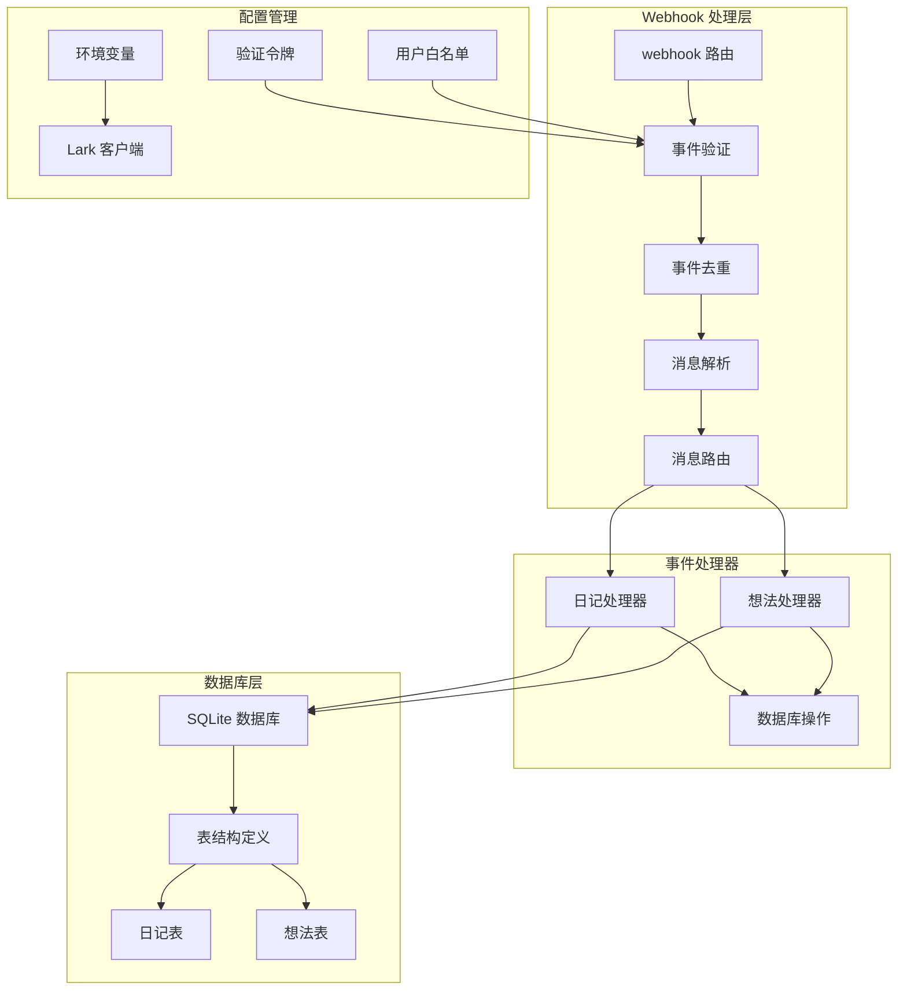
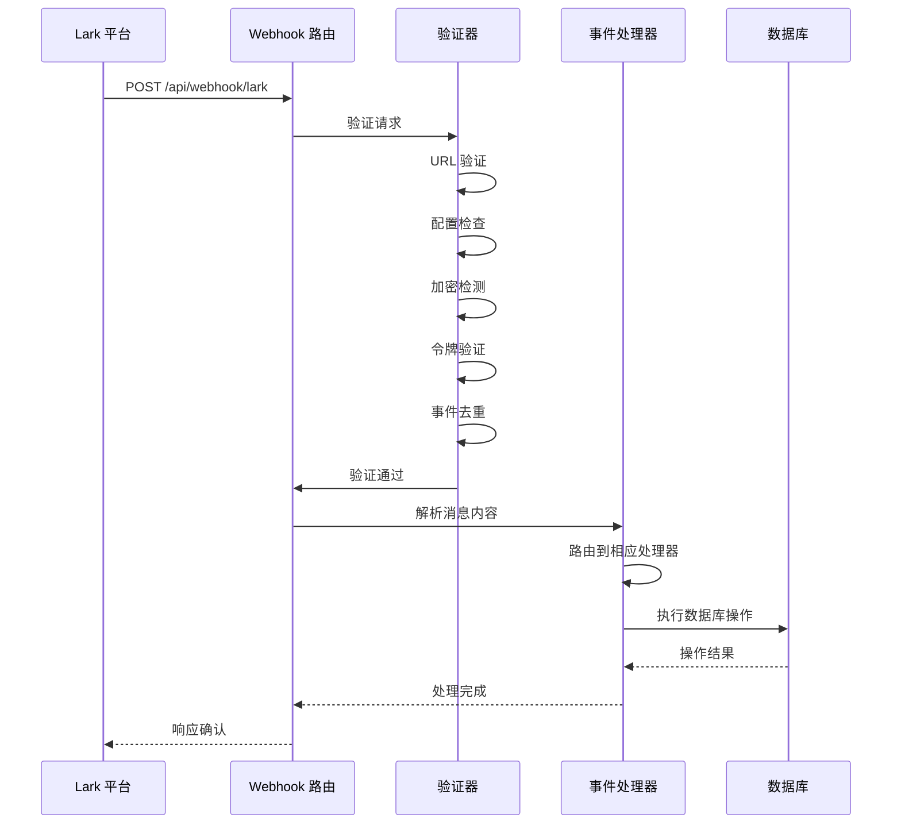
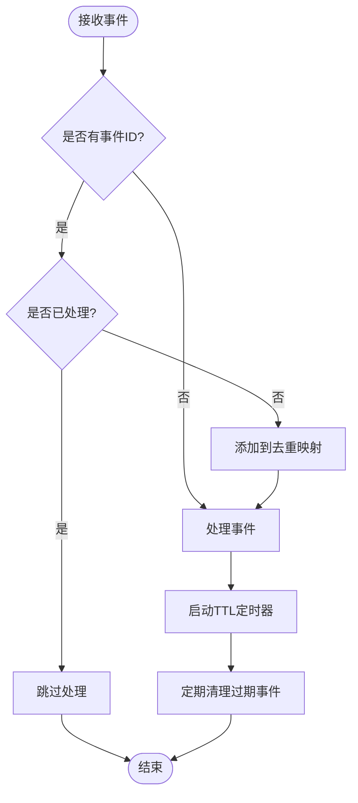
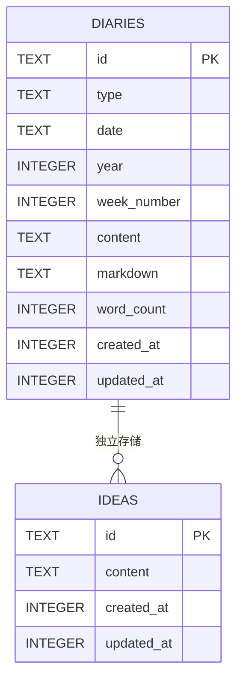
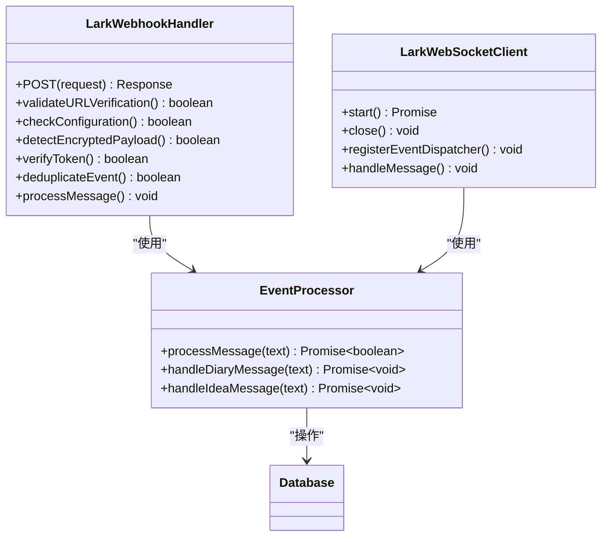

# Webhook 事件处理

<cite>
**本文档引用的文件**
- [src/app/api/webhook/lark/route.ts](file://src/app/api/webhook/lark/route.ts)
- [src/lib/lark-event-handler.ts](file://src/lib/lark-event-handler.ts)
- [src/lib/lark.ts](file://src/lib/lark.ts)
- [src/db/schema.ts](file://src/db/schema.ts)
- [src/db/index.ts](file://src/db/index.ts)
- [scripts/lark-websocket.ts](file://scripts/lark-websocket.ts)
- [package.json](file://package.json)
- [src/lib/rate-limit.ts](file://src/lib/rate-limit.ts)
</cite>

## 目录
1. [简介](#简介)
2. [项目结构](#项目结构)
3. [核心组件](#核心组件)
4. [架构概览](#架构概览)
5. [详细组件分析](#详细组件分析)
6. [依赖关系分析](#依赖关系分析)
7. [性能考虑](#性能考虑)
8. [故障排除指南](#故障排除指南)
9. [结论](#结论)

## 简介

本文档详细介绍了 ynNote v2 项目中的 Webhook 事件处理系统。该系统实现了与 Lark/飞书平台的集成，通过 Webhook 和 WebSocket 两种模式接收消息事件，并将其转换为本地的数据操作。系统支持事件验证、去重、路由分发等功能，能够处理日记创建、想法记录等业务场景。

## 项目结构

Webhook 事件处理系统主要分布在以下模块中：



**图表来源**
- [src/app/api/webhook/lark/route.ts:28-105](file://src/app/api/webhook/lark/route.ts#L28-L105)
- [src/lib/lark-event-handler.ts:104-125](file://src/lib/lark-event-handler.ts#L104-L125)
- [src/lib/lark.ts:29-41](file://src/lib/lark.ts#L29-L41)

**章节来源**
- [src/app/api/webhook/lark/route.ts:1-106](file://src/app/api/webhook/lark/route.ts#L1-L106)
- [src/lib/lark-event-handler.ts:1-126](file://src/lib/lark-event-handler.ts#L1-L126)
- [src/lib/lark.ts:1-335](file://src/lib/lark.ts#L1-L335)

## 核心组件

### Webhook 路由处理器

Webhook 路由处理器是整个事件处理系统的核心入口点，负责接收 Lark 平台发送的事件请求并进行初步验证。

**主要功能特性：**
- URL 验证挑战响应
- 配置状态检查
- 加密负载检测
- 验证令牌匹配
- 事件去重处理
- 事件类型过滤
- 发送者身份验证
- 消息内容解析

**章节来源**
- [src/app/api/webhook/lark/route.ts:28-105](file://src/app/api/webhook/lark/route.ts#L28-L105)

### 事件处理器

事件处理器负责将接收到的消息内容路由到相应的业务逻辑处理函数。

**消息路由规则：**
- 以"日记："或"日记:"开头的消息 → 日记处理器
- 其他消息 → 想法处理器

**章节来源**
- [src/lib/lark-event-handler.ts:104-125](file://src/lib/lark-event-handler.ts#L104-L125)

### 数据库操作层

系统使用 SQLite 作为本地存储，通过 Drizzle ORM 进行数据访问。

**核心数据表：**
- `diaries` - 日记表，支持每日和每周日记
- `ideas` - 想法表，存储临时想法内容

**章节来源**
- [src/db/schema.ts:93-104](file://src/db/schema.ts#L93-L104)
- [src/db/index.ts:114-130](file://src/db/index.ts#L114-L130)

## 架构概览



**图表来源**
- [src/app/api/webhook/lark/route.ts:28-105](file://src/app/api/webhook/lark/route.ts#L28-L105)
- [src/lib/lark-event-handler.ts:104-125](file://src/lib/lark-event-handler.ts#L104-L125)

## 详细组件分析

### Webhook 验证机制

系统实现了多层验证机制来确保事件的安全性和完整性：

#### URL 验证挑战
当 Lark 平台首次配置 Webhook 时，会发送 URL 验证请求：
- 检查 `body.type === "url_verification"`
- 验证 `body.token` 与配置的验证令牌匹配
- 返回 `challenge` 参数完成验证

#### 配置状态检查
- 验证 `LARK_APP_ID` 和 `LARK_APP_SECRET` 是否配置
- 确保 Lark SDK 客户端正确初始化

#### 加密负载检测
- 检测 `body.encrypt` 字段判断消息是否加密
- 当检测到加密时，建议配置 `LARK_ENCRYPT_KEY` 或在 Lark 控制台禁用加密

#### 验证令牌匹配
- 验证 `body.header.token` 与 `LARK_VERIFICATION_TOKEN` 匹配
- 支持 v2.0 事件格式的令牌验证

**章节来源**
- [src/app/api/webhook/lark/route.ts:32-60](file://src/app/api/webhook/lark/route.ts#L32-L60)
- [src/lib/lark.ts:29-31](file://src/lib/lark.ts#L29-L31)

### 事件去重机制

为了防止重复处理相同的事件，系统实现了基于内存的事件去重：



**图表来源**
- [src/app/api/webhook/lark/route.ts:9-25](file://src/app/api/webhook/lark/route.ts#L9-L25)

**章节来源**
- [src/app/api/webhook/lark/route.ts:9-25](file://src/app/api/webhook/lark/route.ts#L9-L25)

### 消息路由和处理

系统支持两种主要的消息类型处理：

#### 日记消息处理
- 消息前缀识别：`"日记："` 或 `"日记:"`
- 自动创建或追加到当天日记
- 支持 Markdown 格式内容
- 统计字数和更新时间戳

#### 想法消息处理
- 默认处理所有其他消息
- 创建新的想法记录
- 存储原始文本内容

**章节来源**
- [src/lib/lark-event-handler.ts:28-98](file://src/lib/lark-event-handler.ts#L28-L98)
- [src/lib/lark-event-handler.ts:104-125](file://src/lib/lark-event-handler.ts#L104-L125)

### 数据库操作实现

#### 日记表操作


**图表来源**
- [src/db/schema.ts:93-104](file://src/db/schema.ts#L93-L104)
- [src/db/schema.ts:57-62](file://src/db/schema.ts#L57-L62)

**章节来源**
- [src/db/schema.ts:93-104](file://src/db/schema.ts#L93-L104)
- [src/db/index.ts:114-130](file://src/db/index.ts#L114-L130)

### WebSocket 对比实现

系统同时提供了 WebSocket 实现作为 Webhook 的替代方案：



**图表来源**
- [src/app/api/webhook/lark/route.ts:28-105](file://src/app/api/webhook/lark/route.ts#L28-L105)
- [scripts/lark-websocket.ts:74-108](file://scripts/lark-websocket.ts#L74-L108)

**章节来源**
- [scripts/lark-websocket.ts:1-109](file://scripts/lark-websocket.ts#L1-L109)

## 依赖关系分析

```mermaid
graph LR
subgraph "外部依赖"
A[@larksuiteoapi/node-sdk]
B[better-sqlite3]
C[drizzle-orm]
D[date-fns]
E[nanoid]
end
subgraph "内部模块"
F[webhook 路由]
G[事件处理器]
H[配置管理]
I[数据库层]
end
F --> A
F --> H
F --> G
G --> I
H --> A
I --> B
I --> C
G --> D
G --> E
```

**图表来源**
- [package.json:13-99](file://package.json#L13-L99)
- [src/app/api/webhook/lark/route.ts:1-7](file://src/app/api/webhook/lark/route.ts#L1-L7)

**章节来源**
- [package.json:13-99](file://package.json#L13-L99)

## 性能考虑

### 内存去重机制
- 使用 `Map` 结构存储已处理事件 ID
- 5分钟 TTL 清理机制，避免内存泄漏
- 定期清理任务每分钟执行一次

### 数据库优化
- 启用 WAL 模式提高并发性能
- 启用外键约束确保数据完整性
- 为常用查询字段建立索引

### 并发处理
- 单线程事件处理，避免竞态条件
- 异步数据库操作，非阻塞事件响应
- WebSocket 模式支持长连接，减少连接开销

## 故障排除指南

### 常见问题诊断

#### Webhook 配置问题
- **症状**：收到 `not configured` 响应
- **原因**：缺少 `LARK_APP_ID` 或 `LARK_APP_SECRET`
- **解决方案**：在 `.env` 文件中正确配置 Lark 应用凭据

#### 验证令牌不匹配
- **症状**：控制台显示验证失败
- **原因**：`LARK_VERIFICATION_TOKEN` 配置错误
- **解决方案**：确保与 Lark 控制台配置的验证令牌完全一致

#### 加密消息处理
- **症状**：收到加密负载警告
- **原因**：Lark 控制台启用了消息加密
- **解决方案**：配置 `LARK_ENCRYPT_KEY` 或在 Lark 控制台禁用加密

#### 用户权限限制
- **症状**：消息被忽略但无错误提示
- **原因**：发送者不在允许的用户列表中
- **解决方案**：在 `LARK_ALLOWED_USER_IDS` 中添加允许的用户 Open ID

### 日志记录和监控

系统在关键节点添加了详细的日志输出：
- Webhook 验证过程
- 事件处理状态
- 错误信息和异常情况
- WebSocket 连接状态

**章节来源**
- [src/app/api/webhook/lark/route.ts:36-104](file://src/app/api/webhook/lark/route.ts#L36-L104)
- [scripts/lark-websocket.ts:34-108](file://scripts/lark-websocket.ts#L34-L108)

## 结论

ynNote v2 的 Webhook 事件处理系统提供了完整的企业级消息处理能力。通过多层验证机制确保事件安全性，通过内存去重避免重复处理，通过清晰的消息路由实现灵活的业务逻辑扩展。系统支持两种事件接收模式（Webhook 和 WebSocket），为不同部署环境提供了最佳实践选择。

该系统的设计充分考虑了性能、可维护性和扩展性，为后续的功能扩展和集成提供了良好的基础架构。