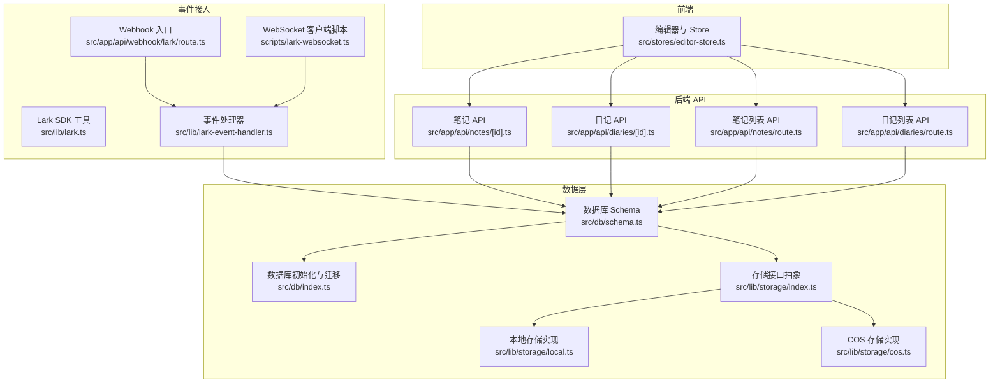
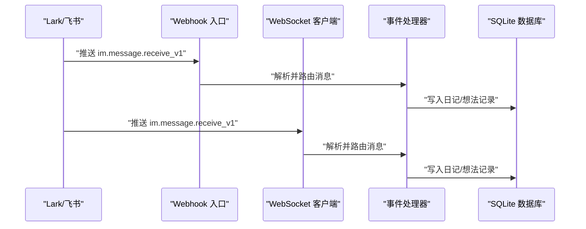
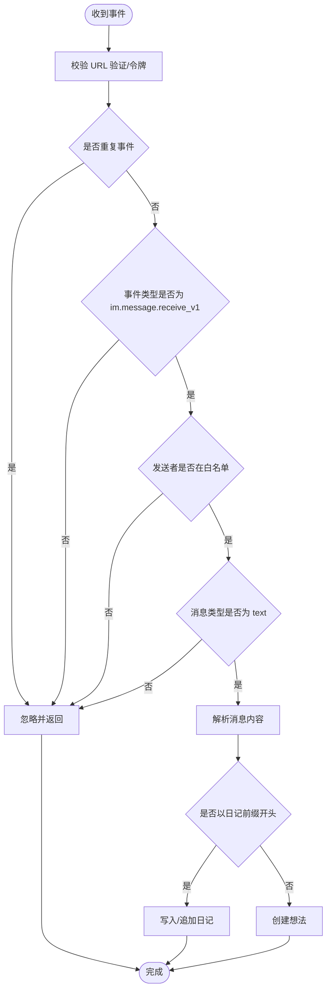
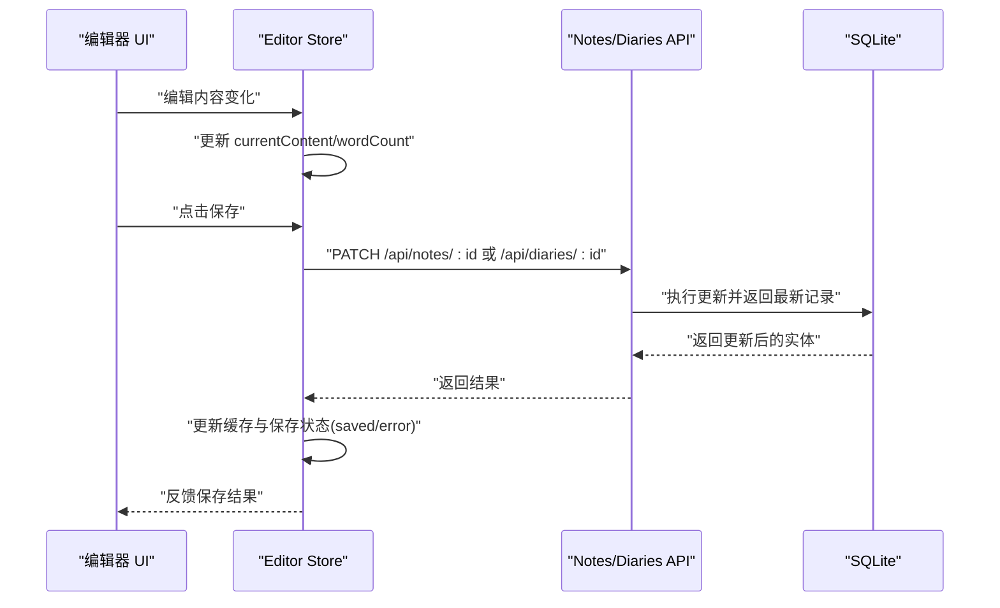
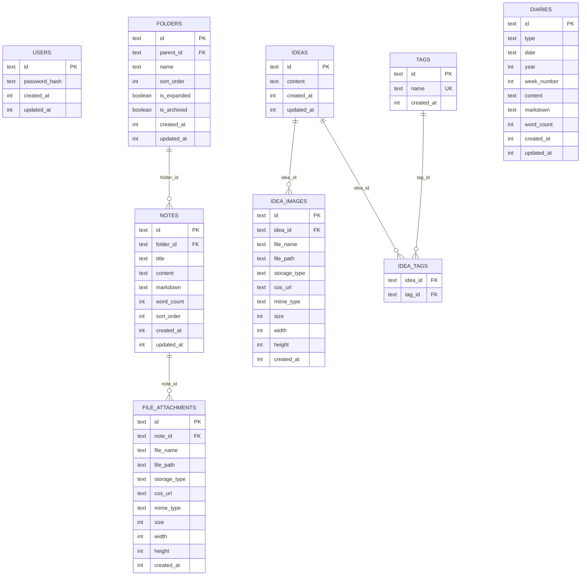
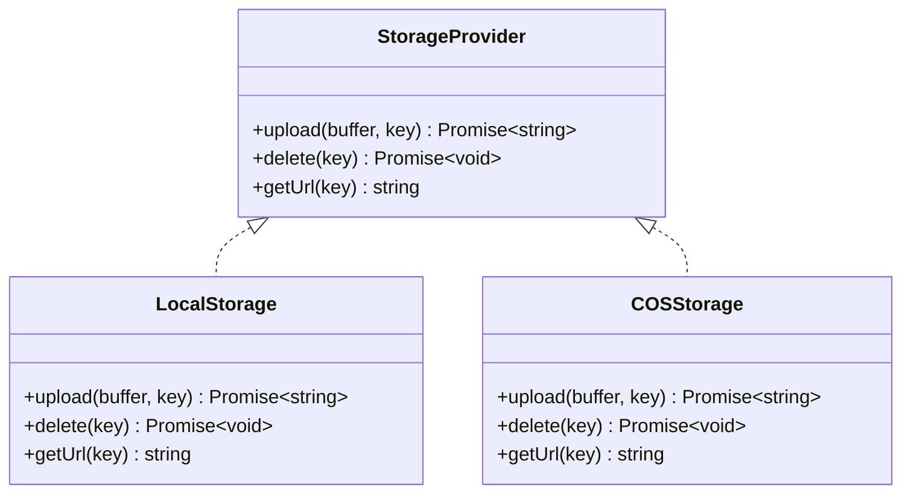
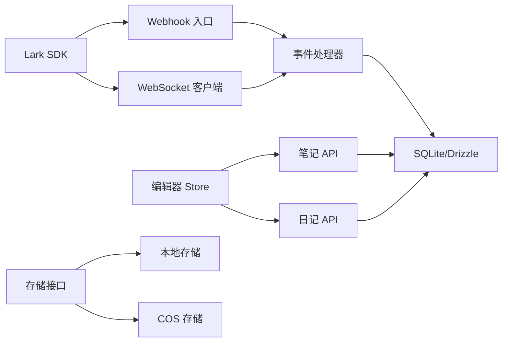

# 云文档同步机制

<cite>
**本文档引用的文件**
- [src/lib/lark.ts](file://src/lib/lark.ts)
- [src/lib/lark-event-handler.ts](file://src/lib/lark-event-handler.ts)
- [src/app/api/webhook/lark/route.ts](file://src/app/api/webhook/lark/route.ts)
- [scripts/lark-websocket.ts](file://scripts/lark-websocket.ts)
- [src/stores/editor-store.ts](file://src/stores/editor-store.ts)
- [src/app/api/notes/[id]/route.ts](file://src/app/api/notes/[id]/route.ts)
- [src/app/api/diaries/[id]/route.ts](file://src/app/api/diaries/[id]/route.ts)
- [src/app/api/notes/route.ts](file://src/app/api/notes/route.ts)
- [src/app/api/diaries/route.ts](file://src/app/api/diaries/route.ts)
- [src/db/schema.ts](file://src/db/schema.ts)
- [src/db/index.ts](file://src/db/index.ts)
- [src/lib/storage/index.ts](file://src/lib/storage/index.ts)
- [src/lib/storage/local.ts](file://src/lib/storage/local.ts)
- [src/lib/storage/cos.ts](file://src/lib/storage/cos.ts)
</cite>

## 目录
1. [简介](#简介)
2. [项目结构](#项目结构)
3. [核心组件](#核心组件)
4. [架构总览](#架构总览)
5. [详细组件分析](#详细组件分析)
6. [依赖关系分析](#依赖关系分析)
7. [性能考虑](#性能考虑)
8. [故障排查指南](#故障排查指南)
9. [结论](#结论)
10. [附录](#附录)

## 简介
本文件系统性阐述本项目的云文档同步机制，重点覆盖以下方面：
- 双向同步：本地到云端与云端到本地的数据传输流程
- 冲突检测与解决：版本比较与合并策略
- 同步模式：增量同步与全量同步的选择机制
- 同步状态跟踪与进度展示
- 错误处理与恢复策略
- 数据一致性与事务处理
- 性能优化：批量与并发控制
- 本地缓存与持久化策略
- 同步日志与审计能力

当前代码库以本地 SQLite 数据库存储为核心，通过 Webhook/WebSocket 接收来自 Lark/飞书的消息事件，实现“云端到本地”的写入；同时前端编辑器通过 API 将本地内容保存至后端数据库，形成“本地到云端”的写入通道。整体采用事件驱动与请求驱动相结合的方式，实现近实时的双向同步。

## 项目结构
项目采用 Next.js 路由 API 作为后端接口层，Drizzle ORM 进行数据库访问，Zustand 管理前端编辑器状态，Lark SDK 提供消息事件接入。核心模块如下：
- 事件接入：Webhook 与 WebSocket 两种模式，统一消息处理器
- 编辑器与状态：前端编辑器 Store 管理内容、保存状态与缓存
- 数据访问：Drizzle ORM 访问 SQLite，支持索引与迁移
- 存储抽象：本地文件存储与腾讯云 COS 的统一接口
- API 层：笔记、日记等资源的 CRUD 接口

图表来源
- [src/stores/editor-store.ts:1-281](file://src/stores/editor-store.ts#L1-L281)
- [src/app/api/notes/[id]/route.ts:1-104](file://src/app/api/notes/[id]/route.ts#L1-L104)
- [src/app/api/diaries/[id]/route.ts:1-63](file://src/app/api/diaries/[id]/route.ts#L1-L63)
- [src/app/api/notes/route.ts:1-86](file://src/app/api/notes/route.ts#L1-L86)
- [src/app/api/diaries/route.ts:1-45](file://src/app/api/diaries/route.ts#L1-L45)
- [src/app/api/webhook/lark/route.ts:1-106](file://src/app/api/webhook/lark/route.ts#L1-L106)
- [scripts/lark-websocket.ts:1-109](file://scripts/lark-websocket.ts#L1-L109)
- [src/lib/lark.ts:1-335](file://src/lib/lark.ts#L1-L335)
- [src/lib/lark-event-handler.ts:1-126](file://src/lib/lark-event-handler.ts#L1-L126)
- [src/db/schema.ts:1-105](file://src/db/schema.ts#L1-L105)
- [src/db/index.ts:1-171](file://src/db/index.ts#L1-L171)
- [src/lib/storage/index.ts:1-30](file://src/lib/storage/index.ts#L1-L30)
- [src/lib/storage/local.ts:1-29](file://src/lib/storage/local.ts#L1-L29)
- [src/lib/storage/cos.ts:1-62](file://src/lib/storage/cos.ts#L1-L62)

章节来源
- [src/stores/editor-store.ts:1-281](file://src/stores/editor-store.ts#L1-L281)
- [src/app/api/webhook/lark/route.ts:1-106](file://src/app/api/webhook/lark/route.ts#L1-L106)
- [scripts/lark-websocket.ts:1-109](file://scripts/lark-websocket.ts#L1-L109)
- [src/lib/lark.ts:1-335](file://src/lib/lark.ts#L1-L335)
- [src/lib/lark-event-handler.ts:1-126](file://src/lib/lark-event-handler.ts#L1-L126)
- [src/db/schema.ts:1-105](file://src/db/schema.ts#L1-L105)
- [src/db/index.ts:1-171](file://src/db/index.ts#L1-L171)
- [src/lib/storage/index.ts:1-30](file://src/lib/storage/index.ts#L1-L30)
- [src/lib/storage/local.ts:1-29](file://src/lib/storage/local.ts#L1-L29)
- [src/lib/storage/cos.ts:1-62](file://src/lib/storage/cos.ts#L1-L62)

## 核心组件
- 事件接入层
  - Webhook：统一入口校验、去重、过滤与消息解析，调用共享处理器
  - WebSocket：长连接客户端，事件分发器注册 im.message.receive_v1，与 Webhook 共享处理器
  - Lark SDK 工具：客户端初始化、加密配置、文件夹与云空间操作
- 事件处理器：根据消息前缀路由到日记或想法的处理逻辑，写入本地数据库
- 前端编辑器 Store：管理当前编辑内容、保存状态、字数统计与 LRU 缓存
- API 层：提供笔记与日记的增删改查接口，支持排序与筛选
- 数据层：SQLite + Drizzle ORM，定义表结构、索引与迁移
- 存储抽象：统一上传、删除、URL 获取接口，支持本地与 COS 两种实现

章节来源
- [src/app/api/webhook/lark/route.ts:1-106](file://src/app/api/webhook/lark/route.ts#L1-L106)
- [scripts/lark-websocket.ts:1-109](file://scripts/lark-websocket.ts#L1-L109)
- [src/lib/lark.ts:1-335](file://src/lib/lark.ts#L1-L335)
- [src/lib/lark-event-handler.ts:1-126](file://src/lib/lark-event-handler.ts#L1-L126)
- [src/stores/editor-store.ts:1-281](file://src/stores/editor-store.ts#L1-L281)
- [src/app/api/notes/[id]/route.ts:1-104](file://src/app/api/notes/[id]/route.ts#L1-L104)
- [src/app/api/diaries/[id]/route.ts:1-63](file://src/app/api/diaries/[id]/route.ts#L1-L63)
- [src/db/schema.ts:1-105](file://src/db/schema.ts#L1-L105)
- [src/db/index.ts:1-171](file://src/db/index.ts#L1-L171)
- [src/lib/storage/index.ts:1-30](file://src/lib/storage/index.ts#L1-L30)

## 架构总览
系统采用“事件驱动 + 请求驱动”的双向同步架构：
- 云端到本地：Lark 通过 Webhook 或 WebSocket 推送消息，经统一处理器写入本地数据库
- 本地到云端：前端编辑器通过 API 将变更保存到后端，后端持久化到 SQLite
- 数据一致性：通过时间戳字段与唯一约束保障；事务模式采用 SQLite WAL
- 缓存与持久化：前端 Store 使用 LRU 缓存；后端使用 SQLite 表与索引

图表来源
- [src/app/api/webhook/lark/route.ts:28-105](file://src/app/api/webhook/lark/route.ts#L28-L105)
- [scripts/lark-websocket.ts:43-71](file://scripts/lark-websocket.ts#L43-L71)
- [src/lib/lark-event-handler.ts:28-87](file://src/lib/lark-event-handler.ts#L28-L87)
- [src/db/index.ts:163-171](file://src/db/index.ts#L163-L171)

## 详细组件分析

### 事件接入与处理组件
- Webhook 入口
  - 校验 URL 验证、验证令牌、去重（5 分钟 TTL）、仅处理文本消息、白名单用户过滤
  - 仅响应 im.message.receive_v1 事件，其余忽略
- WebSocket 客户端脚本
  - 注册 im.message.receive_v1 事件分发器，与 Webhook 共享处理器
  - 支持优雅关闭与自动重连
- 事件处理器
  - 日记消息：按日期聚合，支持追加；计算字数与更新时间
  - 想法消息：直接创建新记录
  - 统一消息前缀路由与空值处理

图表来源
- [src/app/api/webhook/lark/route.ts:28-105](file://src/app/api/webhook/lark/route.ts#L28-L105)
- [src/lib/lark-event-handler.ts:104-125](file://src/lib/lark-event-handler.ts#L104-L125)

章节来源
- [src/app/api/webhook/lark/route.ts:1-106](file://src/app/api/webhook/lark/route.ts#L1-L106)
- [scripts/lark-websocket.ts:1-109](file://scripts/lark-websocket.ts#L1-L109)
- [src/lib/lark-event-handler.ts:1-126](file://src/lib/lark-event-handler.ts#L1-L126)

### 编辑器与同步状态组件
- 编辑器 Store
  - 管理当前笔记/日记 ID、初始内容、当前编辑内容、Markdown 序列化回调
  - 保存状态枚举：saved/saving/error
  - 字数统计与 LRU 内容缓存（最大 20 条），加载时优先命中缓存
  - 手动保存：序列化内容与 Markdown，发起 PATCH 请求，成功后更新缓存
- API 协议
  - 笔记/日记 GET：按 ID 查询
  - 笔记 PATCH：支持标题、内容、markdown、wordCount、sortOrder、folderId 更新
  - 日记 PATCH：支持内容、markdown、wordCount 更新

图表来源
- [src/stores/editor-store.ts:204-275](file://src/stores/editor-store.ts#L204-L275)
- [src/app/api/notes/[id]/route.ts:29-82](file://src/app/api/notes/[id]/route.ts#L29-L82)
- [src/app/api/diaries/[id]/route.ts:26-62](file://src/app/api/diaries/[id]/route.ts#L26-L62)

章节来源
- [src/stores/editor-store.ts:1-281](file://src/stores/editor-store.ts#L1-L281)
- [src/app/api/notes/[id]/route.ts:1-104](file://src/app/api/notes/[id]/route.ts#L1-L104)
- [src/app/api/diaries/[id]/route.ts:1-63](file://src/app/api/diaries/[id]/route.ts#L1-L63)

### 数据模型与一致性
- 数据模型
  - notes：标题、内容、markdown、wordCount、排序、文件夹关联
  - diaries：类型、日期、周信息、内容、markdown、wordCount
  - ideas：内容
  - file_attachments：附件元数据
- 一致性与事务
  - SQLite 使用 WAL 模式提升并发读写性能
  - 外键约束启用，确保删除级联与引用完整性
  - 初始化时创建必要索引，加速查询
  - 迁移逻辑：新增列与唯一索引，避免重复迁移

图表来源
- [src/db/schema.ts:1-105](file://src/db/schema.ts#L1-L105)

章节来源
- [src/db/schema.ts:1-105](file://src/db/schema.ts#L1-L105)
- [src/db/index.ts:132-158](file://src/db/index.ts#L132-L158)

### 存储抽象与云空间集成
- 存储接口抽象：upload/delete/getUrl
- 本地存储：文件写入 data/uploads 目录，提供相对 URL
- COS 存储：基于 cos-nodejs-sdk-v5，上传至 ynote/{key}，生成公网 URL
- 云空间文件夹：提供获取根目录、递归获取子文件夹、按名称查找、创建文件夹、确保路径存在等能力

图表来源
- [src/lib/storage/index.ts:1-30](file://src/lib/storage/index.ts#L1-L30)
- [src/lib/storage/local.ts:1-29](file://src/lib/storage/local.ts#L1-L29)
- [src/lib/storage/cos.ts:1-62](file://src/lib/storage/cos.ts#L1-L62)

章节来源
- [src/lib/storage/index.ts:1-30](file://src/lib/storage/index.ts#L1-L30)
- [src/lib/storage/local.ts:1-29](file://src/lib/storage/local.ts#L1-L29)
- [src/lib/storage/cos.ts:1-62](file://src/lib/storage/cos.ts#L1-L62)
- [src/lib/lark.ts:97-335](file://src/lib/lark.ts#L97-L335)

## 依赖关系分析
- 组件耦合
  - Webhook 与 WebSocket 共享事件处理器，降低重复逻辑
  - 事件处理器依赖数据库访问与时间工具
  - 编辑器 Store 依赖 API 层，API 层依赖 Drizzle ORM 与数据库
  - 存储抽象解耦具体实现，便于扩展
- 外部依赖
  - Lark SDK：事件接入与云空间操作
  - better-sqlite3 + drizzle-orm：高性能 SQLite 访问
  - zustand：轻量状态管理
  - cos-nodejs-sdk-v5：对象存储服务

图表来源
- [src/app/api/webhook/lark/route.ts:1-106](file://src/app/api/webhook/lark/route.ts#L1-L106)
- [scripts/lark-websocket.ts:1-109](file://scripts/lark-websocket.ts#L1-L109)
- [src/lib/lark-event-handler.ts:1-126](file://src/lib/lark-event-handler.ts#L1-L126)
- [src/stores/editor-store.ts:1-281](file://src/stores/editor-store.ts#L1-L281)
- [src/app/api/notes/[id]/route.ts:1-104](file://src/app/api/notes/[id]/route.ts#L1-L104)
- [src/app/api/diaries/[id]/route.ts:1-63](file://src/app/api/diaries/[id]/route.ts#L1-L63)
- [src/lib/storage/index.ts:1-30](file://src/lib/storage/index.ts#L1-L30)

章节来源
- [src/app/api/webhook/lark/route.ts:1-106](file://src/app/api/webhook/lark/route.ts#L1-L106)
- [scripts/lark-websocket.ts:1-109](file://scripts/lark-websocket.ts#L1-L109)
- [src/lib/lark-event-handler.ts:1-126](file://src/lib/lark-event-handler.ts#L1-L126)
- [src/stores/editor-store.ts:1-281](file://src/stores/editor-store.ts#L1-L281)
- [src/app/api/notes/[id]/route.ts:1-104](file://src/app/api/notes/[id]/route.ts#L1-L104)
- [src/app/api/diaries/[id]/route.ts:1-63](file://src/app/api/diaries/[id]/route.ts#L1-L63)
- [src/lib/storage/index.ts:1-30](file://src/lib/storage/index.ts#L1-L30)

## 性能考虑
- 并发与事务
  - SQLite 使用 WAL 模式，提升并发读取与写入吞吐
  - 外键约束启用，减少脏数据风险
- 查询优化
  - 为常用查询建立索引（文件夹、笔记、附件、日记等）
  - 列裁剪与排序字段合理使用，避免全表扫描
- 缓存策略
  - 前端 Store 使用 LRU 缓存，命中优先，减少网络请求
  - 缓存大小上限 20，淘汰最久未使用项
- I/O 优化
  - 本地存储与 COS 存储接口抽象，便于替换与扩展
  - 批量上传/删除建议在上层业务中合并操作
- 网络与事件
  - Webhook 去重（5 分钟 TTL）避免重复处理
  - WebSocket 自动重连，提升稳定性

[本节为通用性能指导，无需特定文件来源]

## 故障排查指南
- Webhook/WebSocket 配置
  - 确认 LARK_APP_ID/LARK_APP_SECRET 是否设置
  - 校验验证令牌与加密密钥配置
  - 白名单用户过滤导致消息被忽略时，检查允许用户集合
- 事件处理
  - URL 验证失败：核对 verification token
  - 加密负载：若开启加密需配置加密密钥或关闭加密
  - 事件去重：确认事件 ID 是否重复
- 数据库
  - WAL 模式与外键约束：确保 SQLite 版本支持
  - 迁移失败：检查权限与表结构兼容性
- 编辑器保存
  - 保存状态 error：检查网络与 API 返回
  - 缓存未更新：手动失效缓存或等待下次加载覆盖
- 存储
  - 本地存储路径：确认 data/uploads 可写
  - COS 上传失败：核对 SecretId/SecretKey/Bucket/Region

章节来源
- [src/app/api/webhook/lark/route.ts:28-105](file://src/app/api/webhook/lark/route.ts#L28-L105)
- [scripts/lark-websocket.ts:24-32](file://scripts/lark-websocket.ts#L24-L32)
- [src/db/index.ts:163-171](file://src/db/index.ts#L163-L171)
- [src/stores/editor-store.ts:204-275](file://src/stores/editor-store.ts#L204-L275)
- [src/lib/storage/local.ts:8-27](file://src/lib/storage/local.ts#L8-L27)
- [src/lib/storage/cos.ts:25-60](file://src/lib/storage/cos.ts#L25-L60)

## 结论
本项目通过 Webhook/WebSocket 与 Lark/飞书事件对接，结合前端编辑器 Store 与后端 API，实现了近实时的双向同步。事件驱动确保云端到本地的即时写入，请求驱动保障本地到云端的可控提交。数据库采用 SQLite + Drizzle ORM，具备良好的性能与可维护性；存储抽象支持本地与云端对象存储。当前实现未内置版本号与自动合并逻辑，建议后续引入版本字段与冲突合并策略以进一步增强一致性与可靠性。

[本节为总结性内容，无需特定文件来源]

## 附录

### 同步模式与选择机制
- 当前实现
  - 云端到本地：Webhook 或 WebSocket 接收事件，写入本地数据库
  - 本地到云端：前端编辑器通过 API 提交变更，后端持久化
- 增量 vs 全量
  - 事件驱动为增量同步（按事件触发）
  - 列表 API 支持按条件筛选，可用于全量拉取场景
- 建议
  - 引入 lastModified/版本号字段，实现更精细的增量同步
  - 对热点资源增加缓存与批量刷新策略

[本节为概念性说明，无需特定文件来源]

### 冲突检测与解决算法
- 当前状态
  - 事件处理器按日期聚合日记，追加内容；未实现版本比较与自动合并
- 建议策略
  - 版本比较：基于时间戳或版本号进行比较
  - 合并策略：内容差异检测与合并（如时间线合并、冲突标记）
  - 回退与通知：冲突时保留原状并提示用户介入

[本节为概念性说明，无需特定文件来源]

### 同步状态跟踪与进度显示
- 前端
  - 保存状态枚举：saved/saving/error，用于 UI 反馈
  - LRU 缓存命中率与字数统计
- 后端
  - 事件去重（Map + TTL）避免重复处理
  - API 返回最新记录，前端据此更新缓存

章节来源
- [src/stores/editor-store.ts:104-105](file://src/stores/editor-store.ts#L104-L105)
- [src/app/api/webhook/lark/route.ts:9-25](file://src/app/api/webhook/lark/route.ts#L9-L25)

### 数据一致性与事务处理
- 事务模式：SQLite WAL
- 约束与索引：外键、唯一索引、复合索引
- 迁移：动态添加列与索引，幂等执行

章节来源
- [src/db/index.ts:17-18](file://src/db/index.ts#L17-L18)
- [src/db/index.ts:73-130](file://src/db/index.ts#L73-L130)
- [src/db/index.ts:132-158](file://src/db/index.ts#L132-L158)

### 本地缓存与持久化策略
- 前端缓存：LRU（最大 20），按需淘汰
- 后端持久化：SQLite 表与索引，初始化时创建
- 存储持久化：本地文件或 COS 对象存储

章节来源
- [src/stores/editor-store.ts:66-77](file://src/stores/editor-store.ts#L66-L77)
- [src/db/index.ts:27-130](file://src/db/index.ts#L27-L130)
- [src/lib/storage/local.ts:8-27](file://src/lib/storage/local.ts#L8-L27)
- [src/lib/storage/cos.ts:25-60](file://src/lib/storage/cos.ts#L25-L60)

### 同步日志与审计
- 日志点
  - Webhook：URL 验证、令牌校验、去重、事件类型过滤、消息解析
  - WebSocket：连接建立、事件分发、异常捕获
  - 事件处理器：日记/想法写入成功日志
  - 编辑器保存：序列化、请求、响应与缓存更新
- 建议
  - 增加结构化日志（级别、事件 ID、用户 ID、耗时）
  - 审计字段：操作人、时间、资源 ID、变更前后对比

章节来源
- [src/app/api/webhook/lark/route.ts:28-105](file://src/app/api/webhook/lark/route.ts#L28-L105)
- [scripts/lark-websocket.ts:34-108](file://scripts/lark-websocket.ts#L34-L108)
- [src/lib/lark-event-handler.ts:28-87](file://src/lib/lark-event-handler.ts#L28-L87)
- [src/stores/editor-store.ts:204-275](file://src/stores/editor-store.ts#L204-L275)