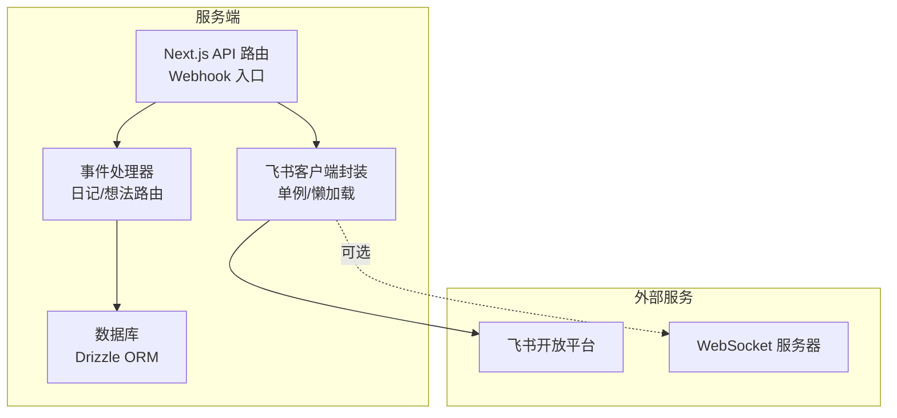
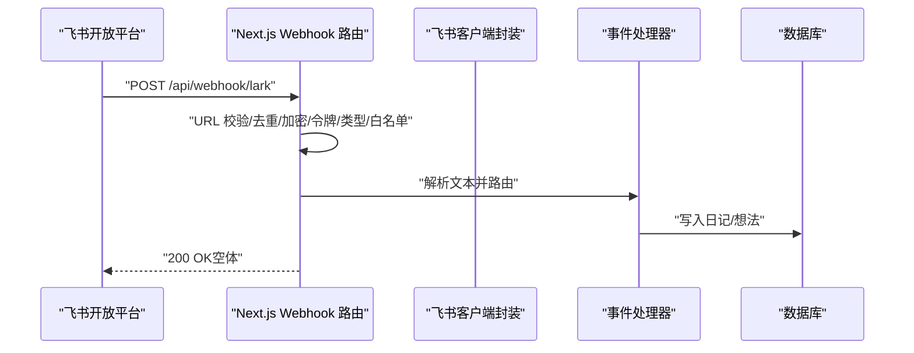
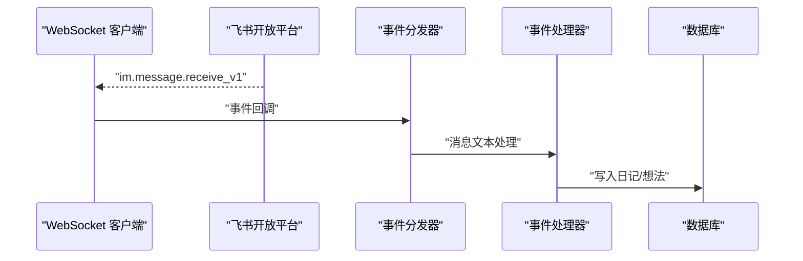
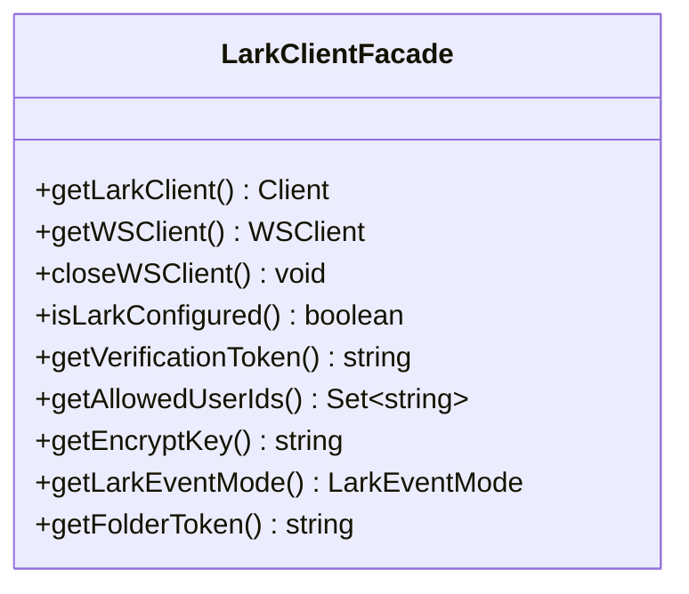
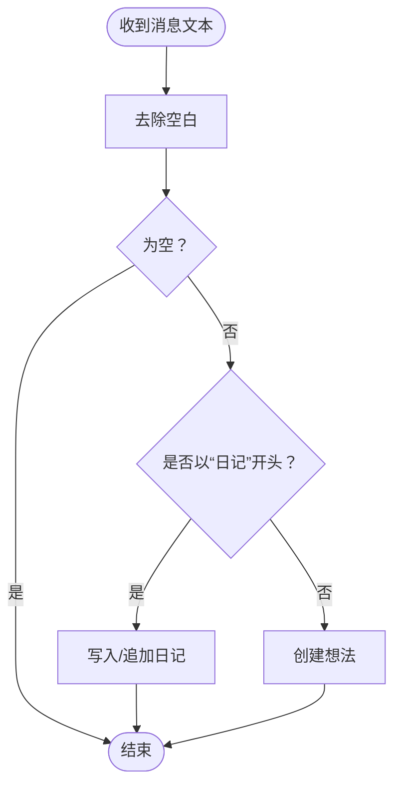
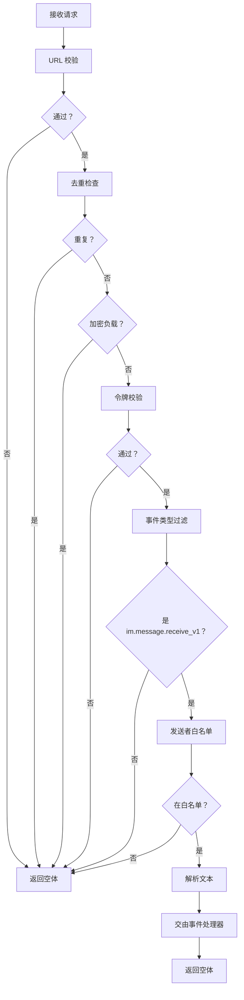
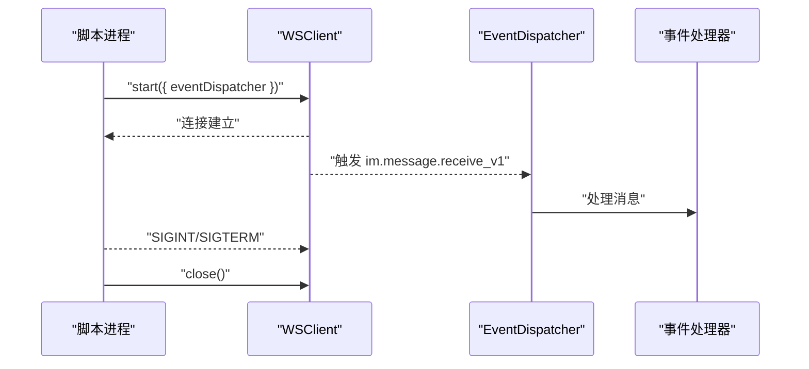
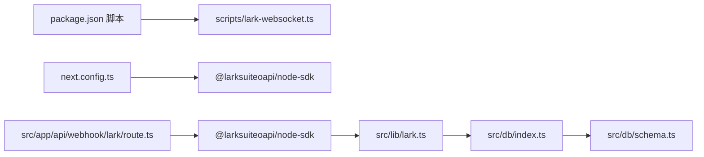

# 飞书 API 客户端

<cite>
**本文引用的文件**
- [src/lib/lark.ts](file://src/lib/lark.ts)
- [src/lib/lark-event-handler.ts](file://src/lib/lark-event-handler.ts)
- [src/app/api/webhook/lark/route.ts](file://src/app/api/webhook/lark/route.ts)
- [scripts/lark-websocket.ts](file://scripts/lark-websocket.ts)
- [src/db/index.ts](file://src/db/index.ts)
- [src/db/schema.ts](file://src/db/schema.ts)
- [package.json](file://package.json)
- [next.config.ts](file://next.config.ts)
</cite>

## 目录
1. [简介](#简介)
2. [项目结构](#项目结构)
3. [核心组件](#核心组件)
4. [架构总览](#架构总览)
5. [详细组件分析](#详细组件分析)
6. [依赖关系分析](#依赖关系分析)
7. [性能考虑](#性能考虑)
8. [故障排查指南](#故障排查指南)
9. [结论](#结论)
10. [附录](#附录)

## 简介
本文件系统性地文档化了飞书（Lark/Feishu）API 客户端在本项目中的实现与使用方式。内容涵盖：
- 客户端的单例模式与懒加载机制
- 自建应用（SelfBuild）与飞书域名配置
- Webhook 与 WebSocket 两种事件接收模式
- 文档操作、用户管理与权限控制的封装与使用
- 环境变量配置指南
- 错误处理与异常策略
- 实际使用路径与最佳实践

## 项目结构
围绕飞书能力的相关模块主要分布在以下位置：
- 客户端与事件处理：src/lib/lark.ts、src/lib/lark-event-handler.ts
- Webhook 入口：src/app/api/webhook/lark/route.ts
- WebSocket 长连接脚本：scripts/lark-websocket.ts
- 数据库与模型：src/db/index.ts、src/db/schema.ts
- 依赖与构建配置：package.json、next.config.ts

图表来源
- [src/app/api/webhook/lark/route.ts:1-105](file://src/app/api/webhook/lark/route.ts#L1-L105)
- [src/lib/lark.ts:1-95](file://src/lib/lark.ts#L1-L95)
- [src/lib/lark-event-handler.ts:1-126](file://src/lib/lark-event-handler.ts#L1-L126)
- [src/db/index.ts:1-171](file://src/db/index.ts#L1-L171)

章节来源
- [src/lib/lark.ts:1-95](file://src/lib/lark.ts#L1-L95)
- [src/app/api/webhook/lark/route.ts:1-105](file://src/app/api/webhook/lark/route.ts#L1-L105)
- [src/lib/lark-event-handler.ts:1-126](file://src/lib/lark-event-handler.ts#L1-L126)
- [scripts/lark-websocket.ts:1-109](file://scripts/lark-websocket.ts#L1-L109)
- [src/db/index.ts:1-171](file://src/db/index.ts#L1-L171)
- [src/db/schema.ts:1-105](file://src/db/schema.ts#L1-L105)
- [package.json:1-119](file://package.json#L1-L119)
- [next.config.ts:1-16](file://next.config.ts#L1-L16)

## 核心组件
- 飞书客户端封装（单例 + 懒加载）
  - 提供 getLarkClient() 获取自建应用客户端
  - 提供 getWSClient()/closeWSClient() 管理 WebSocket 客户端
  - 提供 isLarkConfigured()/getVerificationToken()/getAllowedUserIds()/getEncryptKey()/getLarkEventMode() 等配置读取工具
- 事件处理器（共享逻辑）
  - 统一处理 im.message.receive_v1 事件，按消息前缀路由到日记或想法处理
  - 支持白名单用户过滤
- Webhook 入口
  - 负责 URL 校验、重复事件去重、加密负载检测、令牌校验、事件类型过滤、发送者白名单校验、文本消息解析与转发
- WebSocket 脚本
  - 建立长连接，注册 im.message.receive_v1 事件分发器，支持加密解密与优雅关闭

章节来源
- [src/lib/lark.ts:1-95](file://src/lib/lark.ts#L1-L95)
- [src/lib/lark-event-handler.ts:1-126](file://src/lib/lark-event-handler.ts#L1-L126)
- [src/app/api/webhook/lark/route.ts:1-105](file://src/app/api/webhook/lark/route.ts#L1-L105)
- [scripts/lark-websocket.ts:1-109](file://scripts/lark-websocket.ts#L1-L109)

## 架构总览
下图展示了 Webhook 与 WebSocket 两种模式下的请求流与组件交互。

图表来源
- [src/app/api/webhook/lark/route.ts:28-105](file://src/app/api/webhook/lark/route.ts#L28-L105)
- [src/lib/lark-event-handler.ts:104-126](file://src/lib/lark-event-handler.ts#L104-L126)
- [src/db/index.ts:160-168](file://src/db/index.ts#L160-L168)

图表来源
- [scripts/lark-websocket.ts:39-71](file://scripts/lark-websocket.ts#L39-L71)
- [src/lib/lark-event-handler.ts:104-126](file://src/lib/lark-event-handler.ts#L104-L126)
- [src/db/index.ts:160-168](file://src/db/index.ts#L160-L168)

## 详细组件分析

### 飞书客户端封装（单例与懒加载）
- 单例与懒加载
  - 通过内部私有变量缓存 lark.Client 与 lark.WSClient 实例，首次调用时才创建
  - 若缺少必要环境变量，会在创建阶段抛出错误，避免静默失败
- 认证模式与域名
  - 使用自建应用（SelfBuild）类型
  - 飞书域名（Feishu）配置
- 事件模式与加密
  - 通过环境变量选择事件模式（webhook 或 websocket）
  - 支持加密事件的解密密钥读取
- 权限与安全
  - 支持验证令牌读取
  - 支持允许的用户 Open ID 白名单集合
- 方法清单
  - getLarkClient()：获取自建应用客户端
  - getWSClient()/closeWSClient()：创建/关闭 WebSocket 客户端
  - isLarkConfigured()：检查是否完成基础配置
  - getVerificationToken()/getAllowedUserIds()/getEncryptKey()/getLarkEventMode()/getFolderToken()

图表来源
- [src/lib/lark.ts:8-95](file://src/lib/lark.ts#L8-L95)

章节来源
- [src/lib/lark.ts:1-95](file://src/lib/lark.ts#L1-L95)

### 事件处理器（日记与想法）
- 功能职责
  - 接收文本消息，去除前后空白
  - 前缀路由：以“日记”开头的消息写入日记；否则作为想法写入
  - 日记：按日期聚合，支持新增与追加
  - 想法：直接插入
- 数据持久化
  - 使用数据库单例进行写入
  - 日记表含内容、Markdown、字数统计等字段
  - 想法表含内容与时间戳

图表来源
- [src/lib/lark-event-handler.ts:104-126](file://src/lib/lark-event-handler.ts#L104-L126)
- [src/db/schema.ts:93-104](file://src/db/schema.ts#L93-L104)
- [src/db/index.ts:160-168](file://src/db/index.ts#L160-L168)

章节来源
- [src/lib/lark-event-handler.ts:1-126](file://src/lib/lark-event-handler.ts#L1-L126)
- [src/db/schema.ts:1-105](file://src/db/schema.ts#L1-L105)
- [src/db/index.ts:1-171](file://src/db/index.ts#L1-L171)

### Webhook 入口（URL 校验、去重、白名单、加密）
- 关键流程
  - URL 校验：匹配 verification token
  - 去重：基于事件 ID 的内存去重（5 分钟 TTL）
  - 加密：若存在加密字段，记录警告并忽略
  - 令牌：校验 v2.0 schema 的 header.token
  - 类型：仅处理 im.message.receive_v1
  - 发送者：白名单过滤
  - 内容：解析 JSON 并提取文本
  - 处理：委托事件处理器
- 返回策略
  - 成功处理返回 200（空体），避免平台重试

图表来源
- [src/app/api/webhook/lark/route.ts:28-105](file://src/app/api/webhook/lark/route.ts#L28-L105)

章节来源
- [src/app/api/webhook/lark/route.ts:1-105](file://src/app/api/webhook/lark/route.ts#L1-L105)

### WebSocket 客户端（长连接）
- 运行方式
  - 通过独立脚本启动，支持优雅关闭信号
  - 注册 im.message.receive_v1 事件分发器
  - 支持加密解密与发送者白名单
- 生命周期
  - 首次使用时创建 WSClient，支持自动重连
  - 提供 closeWSClient() 主动关闭

图表来源
- [scripts/lark-websocket.ts:74-108](file://scripts/lark-websocket.ts#L74-L108)
- [src/lib/lark.ts:69-95](file://src/lib/lark.ts#L69-L95)

章节来源
- [scripts/lark-websocket.ts:1-109](file://scripts/lark-websocket.ts#L1-L109)
- [src/lib/lark.ts:69-95](file://src/lib/lark.ts#L69-L95)

## 依赖关系分析
- 外部 SDK
  - @larksuiteoapi/node-sdk：飞书官方 Node SDK，用于 HTTP 客户端与 WebSocket 客户端
- 服务端集成
  - Next.js API 路由：承载 Webhook 入口
  - Drizzle ORM + better-sqlite3：本地数据库访问
- 构建与运行
  - next.config.ts 将 @larksuiteoapi/node-sdk 标记为外部包，避免打包问题
  - package.json 提供 lark:ws 与 dev:ws 脚本，便于开发联调

图表来源
- [package.json:5-12](file://package.json#L5-L12)
- [next.config.ts:3-10](file://next.config.ts#L3-L10)
- [src/app/api/webhook/lark/route.ts:1-8](file://src/app/api/webhook/lark/route.ts#L1-L8)
- [src/lib/lark.ts:1](file://src/lib/lark.ts#L1)
- [src/db/index.ts:1-25](file://src/db/index.ts#L1-L25)
- [src/db/schema.ts:1-105](file://src/db/schema.ts#L1-L105)

章节来源
- [package.json:1-119](file://package.json#L1-L119)
- [next.config.ts:1-16](file://next.config.ts#L1-L16)

## 性能考虑
- 单例与懒加载
  - 避免重复创建 SDK 客户端实例，降低初始化开销
- 事件去重
  - Webhook 侧采用内存 Map 去重，减少重复处理
- 连接管理
  - WebSocket 支持自动重连，提升稳定性
- 数据库
  - 使用 WAL 模式与外键约束，保证一致性与性能

[本节为通用建议，不直接分析具体文件]

## 故障排查指南
- 环境变量缺失
  - 症状：创建客户端时报错或无法启动
  - 排查：确认 LARK_APP_ID、LARK_APP_SECRET 是否设置
  - 参考：客户端懒加载与错误抛出逻辑
- Webhook 未生效
  - 症状：飞书平台无法收到回包或无日志
  - 排查：检查 URL 校验 token、事件类型、加密负载、去重与白名单
  - 参考：Webhook 路由处理流程
- WebSocket 无法连接
  - 症状：连接失败或立即断开
  - 排查：确认事件模式、App ID/Secret、加密密钥、允许用户列表
  - 参考：WebSocket 脚本与客户端封装
- 数据未入库
  - 症状：消息已处理但数据库无变化
  - 排查：检查数据库单例初始化、表结构与索引
  - 参考：数据库初始化与模型定义

章节来源
- [src/lib/lark.ts:8-27](file://src/lib/lark.ts#L8-L27)
- [src/app/api/webhook/lark/route.ts:28-105](file://src/app/api/webhook/lark/route.ts#L28-L105)
- [scripts/lark-websocket.ts:24-27](file://scripts/lark-websocket.ts#L24-L27)
- [src/db/index.ts:160-168](file://src/db/index.ts#L160-L168)

## 结论
本项目通过统一的飞书客户端封装，结合 Webhook 与 WebSocket 两种事件接收模式，实现了对飞书消息的可靠接入，并以事件处理器抽象出日记与想法两类业务场景。配合严格的配置校验、白名单与去重策略，以及数据库单例与懒加载机制，整体具备良好的可维护性与扩展性。

[本节为总结，不直接分析具体文件]

## 附录

### 环境变量配置指南
- 必填项
  - LARK_APP_ID：自建应用 App ID
  - LARK_APP_SECRET：自建应用 App Secret
- 可选项
  - LARK_VERIFICATION_TOKEN：Webhook 验证令牌
  - LARK_ALLOWED_USER_IDS：允许的用户 Open ID 列表（逗号分隔）
  - LARK_ENCRYPT_KEY：事件加密密钥（如启用加密）
  - LARK_EVENT_MODE：事件模式，"websocket" 或 "webhook"（默认 webhook）
  - LARK_FOLDER_TOKEN：文件夹令牌（用于文件/空间相关操作）
- 数据库路径
  - DATABASE_PATH：SQLite 数据库存储路径（默认 ./data/ynote.db）

章节来源
- [src/lib/lark.ts:25-64](file://src/lib/lark.ts#L25-L64)
- [src/app/api/webhook/lark/route.ts:32-60](file://src/app/api/webhook/lark/route.ts#L32-L60)
- [scripts/lark-websocket.ts:29-32](file://scripts/lark-websocket.ts#L29-L32)
- [src/db/index.ts:8](file://src/db/index.ts#L8)

### 使用示例与最佳实践
- 初始化与获取客户端
  - 在需要调用飞书 API 的模块中调用 getLarkClient() 获取单例客户端
  - 在 WebSocket 场景调用 getWSClient() 获取长连接客户端
- Webhook 集成
  - 在飞书平台配置 Webhook URL，确保验证令牌一致
  - 开启加密时需配置 LARK_ENCRYPT_KEY
- WebSocket 集成
  - 设置 LARK_EVENT_MODE=websocket
  - 使用 npm run lark:ws 或 npm run dev:ws 启动
- 权限控制
  - 通过 LARK_ALLOWED_USER_IDS 限制消息来源
- 数据落库
  - 事件处理器会自动写入日记/想法表，无需额外处理

章节来源
- [src/lib/lark.ts:8-95](file://src/lib/lark.ts#L8-L95)
- [src/app/api/webhook/lark/route.ts:28-105](file://src/app/api/webhook/lark/route.ts#L28-L105)
- [scripts/lark-websocket.ts:74-108](file://scripts/lark-websocket.ts#L74-L108)
- [src/lib/lark-event-handler.ts:104-126](file://src/lib/lark-event-handler.ts#L104-L126)