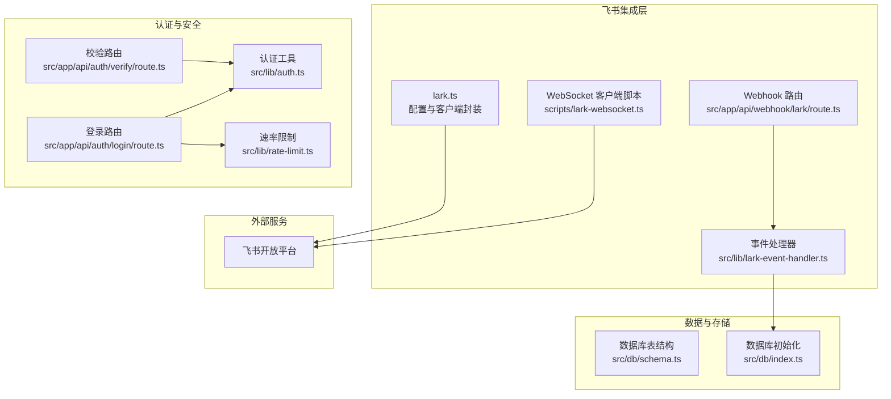
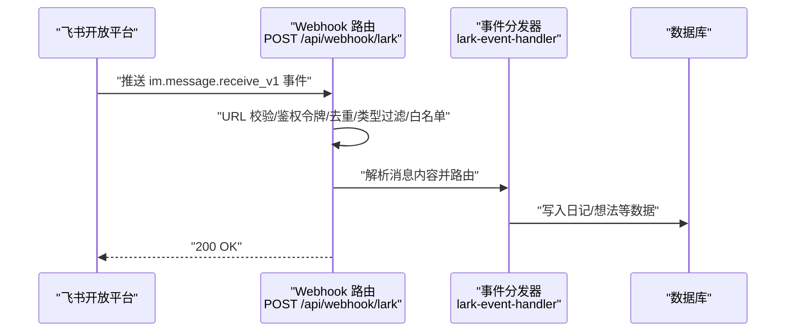
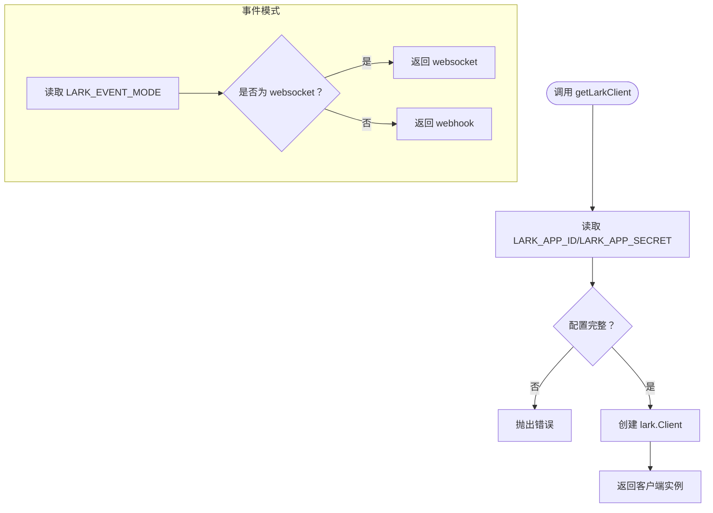
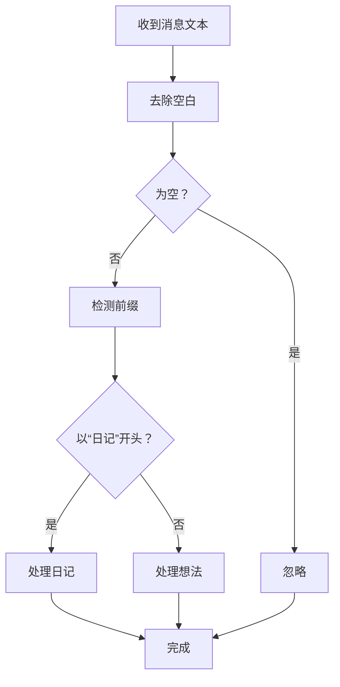
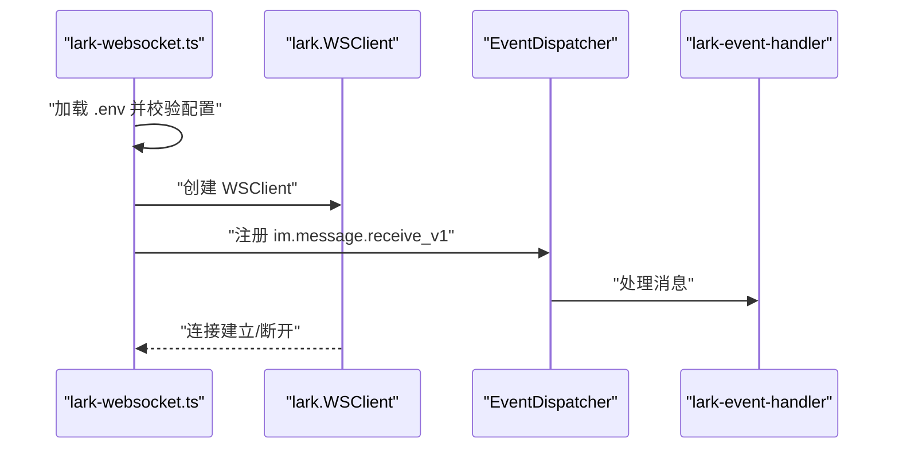
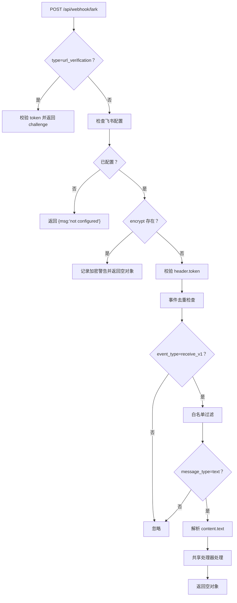
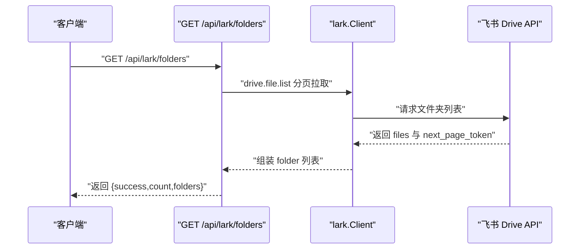
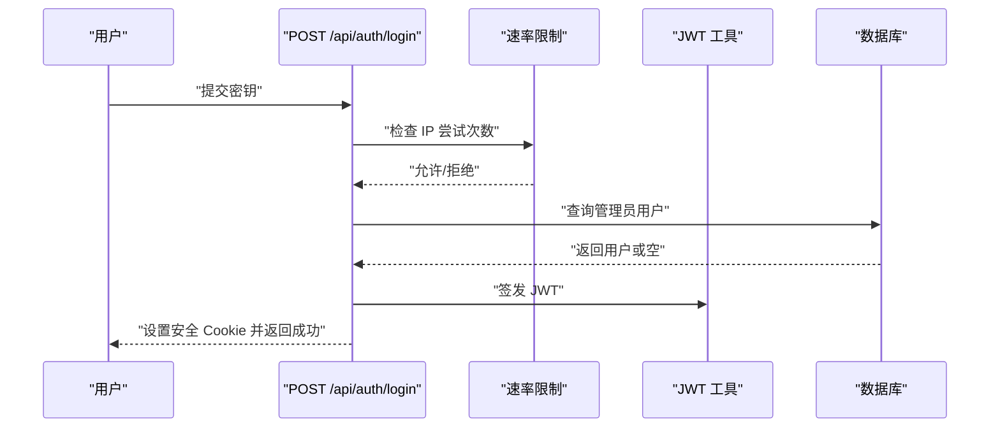
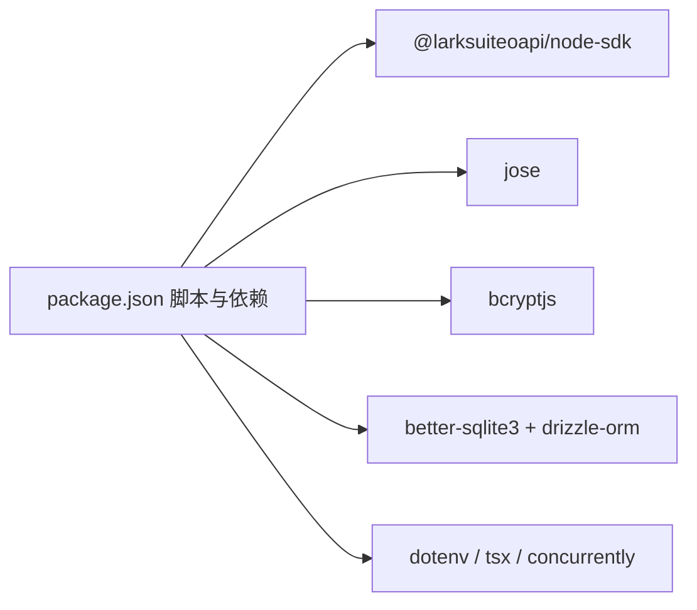

# 飞书应用配置

<cite>
**本文引用的文件**
- [lark.ts](file://src/lib/lark.ts)
- [lark-event-handler.ts](file://src/lib/lark-event-handler.ts)
- [lark-websocket.ts](file://scripts/lark-websocket.ts)
- [webhook-lark-route.ts](file://src/app/api/webhook/lark/route.ts)
- [lark-folders-route.ts](file://src/app/api/lark/folders/route.ts)
- [package.json](file://package.json)
- [auth.ts](file://src/lib/auth.ts)
- [login-route.ts](file://src/app/api/auth/login/route.ts)
- [verify-route.ts](file://src/app/api/auth/verify/route.ts)
- [rate-limit.ts](file://src/lib/rate-limit.ts)
- [schema.ts](file://src/db/schema.ts)
- [db-index.ts](file://src/db/index.ts)
- [README.md](file://README.md)
</cite>

## 目录
1. [简介](#简介)
2. [项目结构](#项目结构)
3. [核心组件](#核心组件)
4. [架构总览](#架构总览)
5. [详细组件分析](#详细组件分析)
6. [依赖关系分析](#依赖关系分析)
7. [性能考虑](#性能考虑)
8. [故障排查指南](#故障排查指南)
9. [结论](#结论)
10. [附录](#附录)

## 简介
本文件面向飞书应用的创建与配置，提供从应用注册、权限申请、回调地址设置到环境变量配置、事件模式选择（Webhook 与 WebSocket）、用户白名单与权限控制、安全配置（加密密钥生成与管理）、常见问题排查、部署环境配置管理策略以及配置验证与测试方法的完整指南。本文档基于仓库中的实际实现进行说明，确保读者能够按步骤完成飞书应用的本地开发与生产部署。

## 项目结构
本项目采用 Next.js 应用结构，飞书相关能力主要集中在以下模块：
- 配置与客户端封装：src/lib/lark.ts
- 事件处理共享逻辑：src/lib/lark-event-handler.ts
- WebSocket 客户端脚本：scripts/lark-websocket.ts
- Webhook 接收路由：src/app/api/webhook/lark/route.ts
- 飞书云空间文件夹查询路由：src/app/api/lark/folders/route.ts
- 认证与安全：src/lib/auth.ts、src/app/api/auth/login/route.ts、src/app/api/auth/verify/route.ts
- 数据库与表结构：src/db/schema.ts、src/db/index.ts
- 速率限制：src/lib/rate-limit.ts
- 包脚本与依赖：package.json
- 项目说明：README.md

图表来源
- [lark.ts:1-120](file://src/lib/lark.ts#L1-L120)
- [lark-websocket.ts:1-109](file://scripts/lark-websocket.ts#L1-L109)
- [webhook-lark-route.ts:1-106](file://src/app/api/webhook/lark/route.ts#L1-L106)
- [lark-event-handler.ts:1-126](file://src/lib/lark-event-handler.ts#L1-L126)
- [auth.ts:1-26](file://src/lib/auth.ts#L1-L26)
- [login-route.ts:1-63](file://src/app/api/auth/login/route.ts#L1-L63)
- [verify-route.ts:1-7](file://src/app/api/auth/verify/route.ts#L1-L7)
- [rate-limit.ts:1-40](file://src/lib/rate-limit.ts#L1-L40)
- [schema.ts:1-105](file://src/db/schema.ts#L1-L105)
- [db-index.ts:1-171](file://src/db/index.ts#L1-L171)

章节来源
- [README.md:1-37](file://README.md#L1-L37)
- [package.json:1-119](file://package.json#L1-L119)

## 核心组件
- 飞书客户端与配置封装：负责读取环境变量、创建 SDK 客户端、获取事件模式、用户白名单、加密密钥、文件夹令牌等；同时提供租户访问令牌获取与云空间文件夹操作能力。
- 事件处理器：统一处理飞书消息事件，支持“日记”与“想法”两类消息前缀路由。
- WebSocket 客户端脚本：独立运行的长连接客户端，用于接收飞书事件，支持加密密钥与用户白名单过滤。
- Webhook 路由：Next.js API 路由，处理飞书回调，包含 URL 校验、事件去重、鉴权令牌校验、加密负载检测、事件类型过滤、发送者白名单过滤与消息解析。
- 认证与安全：基于 HS256 的 JWT 签发与校验，登录接口配合速率限制与 Cookie 安全策略。
- 数据库与表结构：包含用户、想法、日记等表，支持初始化与索引。

章节来源
- [lark.ts:1-120](file://src/lib/lark.ts#L1-L120)
- [lark-event-handler.ts:1-126](file://src/lib/lark-event-handler.ts#L1-L126)
- [lark-websocket.ts:1-109](file://scripts/lark-websocket.ts#L1-L109)
- [webhook-lark-route.ts:1-106](file://src/app/api/webhook/lark/route.ts#L1-L106)
- [auth.ts:1-26](file://src/lib/auth.ts#L1-L26)
- [login-route.ts:1-63](file://src/app/api/auth/login/route.ts#L1-L63)
- [schema.ts:1-105](file://src/db/schema.ts#L1-L105)

## 架构总览
飞书应用支持两种事件接收模式：
- Webhook 模式：通过飞书开放平台配置回调地址，由飞书主动推送事件至服务器。
- WebSocket 模式：客户端建立长连接，无需公网可访问的回调地址，适合本地开发与内网环境。

图表来源
- [webhook-lark-route.ts:28-105](file://src/app/api/webhook/lark/route.ts#L28-L105)
- [lark-event-handler.ts:104-125](file://src/lib/lark-event-handler.ts#L104-L125)

章节来源
- [lark.ts:47-85](file://src/lib/lark.ts#L47-L85)
- [lark-websocket.ts:74-108](file://scripts/lark-websocket.ts#L74-L108)

## 详细组件分析

### 飞书配置与客户端封装（lark.ts）
- 环境变量读取：应用 ID、应用密钥、验证令牌、加密密钥、允许的用户 Open ID 列表、事件模式、文件夹令牌等。
- 客户端创建：根据环境变量创建飞书 SDK 客户端与 WebSocket 客户端，支持自建应用类型与飞书域名。
- 事件模式选择：默认 Webhook，显式设置为 websocket 时切换为 WebSocket 模式。
- 云空间文件夹操作：提供租户访问令牌获取、根文件夹元数据查询、子文件夹分页拉取、按名称查找、创建文件夹、确保路径存在、删除文件等能力。
- 工具函数：判断配置状态、获取验证令牌、解析用户白名单、获取文件夹令牌、获取事件模式、获取加密密钥。

图表来源
- [lark.ts:8-27](file://src/lib/lark.ts#L8-L27)
- [lark.ts:47-57](file://src/lib/lark.ts#L47-L57)

章节来源
- [lark.ts:1-120](file://src/lib/lark.ts#L1-L120)
- [lark.ts:120-367](file://src/lib/lark.ts#L120-L367)

### 事件处理器（lark-event-handler.ts）
- 消息路由：以“日记：/日记:”开头的消息路由到日记处理，否则作为想法处理。
- 日记处理：按日期与周信息聚合，支持新建与追加内容，维护 Markdown 与字数统计。
- 想法处理：插入新想法记录。
- 共享逻辑：Webhook 与 WebSocket 均复用此处理器，保证一致性。

图表来源
- [lark-event-handler.ts:104-125](file://src/lib/lark-event-handler.ts#L104-L125)

章节来源
- [lark-event-handler.ts:1-126](file://src/lib/lark-event-handler.ts#L1-L126)

### WebSocket 客户端脚本（scripts/lark-websocket.ts）
- 独立进程：加载 .env，校验飞书配置，读取允许用户与加密密钥。
- 事件分发器：注册 im.message.receive_v1 事件，执行用户白名单过滤、消息类型过滤、内容解析与共享处理器。
- 连接管理：自动重连、优雅关闭信号处理。
- 启动方式：通过 package.json 中的 lark:ws 或 dev:ws 脚本运行。

图表来源
- [lark-websocket.ts:20-108](file://scripts/lark-websocket.ts#L20-L108)

章节来源
- [lark-websocket.ts:1-109](file://scripts/lark-websocket.ts#L1-L109)
- [package.json:5-12](file://package.json#L5-L12)

### Webhook 路由（src/app/api/webhook/lark/route.ts）
- URL 校验：识别 url_verification 类型，校验 token 并返回 challenge。
- 配置检查：若未配置飞书参数，直接返回提示。
- 加密负载检测：若收到加密字段，记录警告并拒绝处理（需配置加密密钥或关闭加密）。
- 鉴权令牌校验：校验 v2.0 schema 的 header.token。
- 事件去重：基于内存 Map 维护 5 分钟 TTL 的事件 ID 去重。
- 事件类型过滤：仅处理 im.message.receive_v1。
- 用户白名单过滤：仅处理允许用户发送的消息。
- 文本消息解析：解析 content 中的 text 字段，交由共享处理器。
- 返回策略：异常时记录日志并始终返回 200，避免飞书重复推送。

图表来源
- [webhook-lark-route.ts:28-105](file://src/app/api/webhook/lark/route.ts#L28-L105)

章节来源
- [webhook-lark-route.ts:1-106](file://src/app/api/webhook/lark/route.ts#L1-L106)

### 飞书云空间文件夹查询（src/app/api/lark/folders/route.ts）
- 功能：递归列出飞书云空间文件夹，支持分页与路径拼接。
- 客户端：使用 SDK 客户端 drive.file.list 进行分页拉取。
- 排序：按路径字符串排序输出。
- 错误处理：捕获异常并返回统一错误响应。

图表来源
- [lark-folders-route.ts:14-89](file://src/app/api/lark/folders/route.ts#L14-L89)
- [lark.ts:8-23](file://src/lib/lark.ts#L8-L23)

章节来源
- [lark-folders-route.ts:1-99](file://src/app/api/lark/folders/route.ts#L1-L99)
- [lark.ts:97-130](file://src/lib/lark.ts#L97-L130)

### 认证与安全（JWT、登录、校验、速率限制）
- JWT 签发与校验：基于 HS256，密钥来自环境变量，支持过期时间配置。
- 登录接口：校验输入密钥与数据库中管理员密码哈希，成功后设置 HttpOnly、Secure、SameSite 严格 Cookie。
- 校验接口：仅用于确认中间件已校验通过。
- 速率限制：基于 Map 的滑动窗口计数，15 分钟窗口最多 5 次尝试，超限返回 429。

图表来源
- [login-route.ts:9-62](file://src/app/api/auth/login/route.ts#L9-L62)
- [auth.ts:1-26](file://src/lib/auth.ts#L1-L26)
- [rate-limit.ts:21-40](file://src/lib/rate-limit.ts#L21-L40)

章节来源
- [auth.ts:1-26](file://src/lib/auth.ts#L1-L26)
- [login-route.ts:1-63](file://src/app/api/auth/login/route.ts#L1-L63)
- [verify-route.ts:1-7](file://src/app/api/auth/verify/route.ts#L1-L7)
- [rate-limit.ts:1-40](file://src/lib/rate-limit.ts#L1-L40)

## 依赖关系分析
- 飞书 SDK：@larksuiteoapi/node-sdk，用于 Webhook 与 WebSocket、云空间文件夹操作。
- 数据库：better-sqlite3 + drizzle-orm，提供 SQLite 存储与 ORM 能力。
- 工具库：date-fns、nanoid、jose（JWT）、bcryptjs（密码哈希）等。
- 开发工具：dotenv、tsx、concurrently 等，支持 .env 加载、脚本运行与并发启动。

图表来源
- [package.json:1-119](file://package.json#L1-L119)

章节来源
- [package.json:1-119](file://package.json#L1-L119)

## 性能考虑
- Webhook 去重：内存 Map 维护 5 分钟 TTL，避免重复处理相同事件。
- 分页拉取：云空间文件夹列表采用分页拉取，避免一次性请求过大。
- 自动重连：WebSocket 客户端启用自动重连，提升稳定性。
- 速率限制：登录接口采用滑动窗口，降低暴力破解风险与系统压力。
- 数据库索引：针对常用查询字段建立索引，优化读写性能。

章节来源
- [webhook-lark-route.ts:9-25](file://src/app/api/webhook/lark/route.ts#L9-L25)
- [lark.ts:167-216](file://src/lib/lark.ts#L167-L216)
- [lark-websocket.ts:74-80](file://scripts/lark-websocket.ts#L74-L80)
- [rate-limit.ts:1-40](file://src/lib/rate-limit.ts#L1-L40)
- [db-index.ts:73-130](file://src/db/index.ts#L73-L130)

## 故障排查指南
- Webhook 无法接收事件
  - 确认回调地址已正确配置且可被飞书访问。
  - 检查验证令牌是否一致，查看日志中 token 不匹配警告。
  - 若开启加密，请配置加密密钥或在飞书控制台关闭加密。
  - 查看事件去重日志，确认事件 ID 是否重复。
  - 参考：[webhook-lark-route.ts:32-105](file://src/app/api/webhook/lark/route.ts#L32-L105)

- WebSocket 无法连接
  - 确认已设置 LARK_EVENT_MODE=websocket，并正确加载 .env。
  - 检查应用 ID 与应用密钥是否配置完整。
  - 查看连接失败日志，确认网络可达性与自动重连是否生效。
  - 参考：[lark-websocket.ts:24-108](file://scripts/lark-websocket.ts#L24-L108)

- 事件未被处理
  - 确认事件类型为 im.message.receive_v1。
  - 确认消息类型为 text。
  - 确认发送者在允许用户列表中（若配置）。
  - 参考：[webhook-lark-route.ts:68-85](file://src/app/api/webhook/lark/route.ts#L68-L85)，[lark-websocket.ts:43-71](file://scripts/lark-websocket.ts#L43-L71)

- 登录失败或频繁触发限流
  - 检查 AUTH_SECRET_KEY 是否正确初始化管理员账户。
  - 查看速率限制窗口与剩余次数，等待重置或减少尝试。
  - 参考：[login-route.ts:12-25](file://src/app/api/auth/login/route.ts#L12-L25)，[rate-limit.ts:21-40](file://src/lib/rate-limit.ts#L21-L40)

- 云空间文件夹列表为空
  - 确认租户访问令牌获取成功，检查飞书权限与应用范围。
  - 参考：[lark.ts:102-130](file://src/lib/lark.ts#L102-L130)，[lark-folders-route.ts:71-98](file://src/app/api/lark/folders/route.ts#L71-L98)

## 结论
本项目提供了完整的飞书应用配置与集成方案，涵盖 Webhook 与 WebSocket 两种事件模式、用户白名单与权限控制、安全配置与速率限制、云空间文件夹操作以及数据库持久化。通过明确的环境变量约定与清晰的组件职责划分，开发者可以快速完成从应用注册到生产部署的全流程配置。

## 附录

### 环境变量配置清单
- LARK_APP_ID：飞书应用 ID
- LARK_APP_SECRET：飞书应用密钥
- LARK_VERIFICATION_TOKEN：Webhook 验证令牌
- LARK_ENCRYPT_KEY：事件加密密钥（可选）
- LARK_ALLOWED_USER_IDS：允许使用的用户 Open ID 列表（逗号分隔）
- LARK_EVENT_MODE：事件模式，"webhook" 或 "websocket"
- LARK_FOLDER_TOKEN：云空间根文件夹令牌（可选）
- JWT_SECRET：JWT 密钥（用于内部认证）
- JWT_EXPIRY：JWT 过期时间（如 7d）
- AUTH_SECRET_KEY：登录密钥（初始化管理员账户）

章节来源
- [lark.ts:10-64](file://src/lib/lark.ts#L10-L64)
- [auth.ts:3-4](file://src/lib/auth.ts#L3-L4)
- [db-index.ts:143-157](file://src/db/index.ts#L143-L157)

### 事件模式选择与适用场景
- Webhook
  - 优点：标准回调模式，飞书主动推送，适合生产环境。
  - 注意：需要稳定的公网回调地址与正确的验证令牌配置。
- WebSocket
  - 优点：无需公网回调，适合本地开发与内网环境。
  - 注意：需运行独立的 WebSocket 客户端脚本，配置加密密钥或关闭加密。

章节来源
- [lark.ts:47-57](file://src/lib/lark.ts#L47-L57)
- [lark-websocket.ts:7-11](file://scripts/lark-websocket.ts#L7-L11)

### 用户白名单与权限控制机制
- 白名单：通过 LARK_ALLOWED_USER_IDS 设置允许的用户 Open ID，未配置则视为全部放行。
- 发送者过滤：Webhook 与 WebSocket 均在事件到达时进行发送者过滤。
- 事件类型与消息类型过滤：仅处理 im.message.receive_v1 与 text 类型消息。

章节来源
- [lark.ts:33-41](file://src/lib/lark.ts#L33-L41)
- [webhook-lark-route.ts:74-85](file://src/app/api/webhook/lark/route.ts#L74-L85)
- [lark-websocket.ts:46-55](file://scripts/lark-websocket.ts#L46-L55)

### 安全配置最佳实践
- 加密密钥生成与管理
  - 使用强随机源生成 LARK_ENCRYPT_KEY，妥善保存于密钥管理系统。
  - 在飞书控制台开启加密时务必配置对应密钥，否则 Webhook 将拒绝处理加密负载。
- JWT 密钥与过期时间
  - 使用高强度密钥与合理过期时间，定期轮换。
- Cookie 安全
  - 登录接口设置 HttpOnly、Secure、SameSite 严格 Cookie，生产环境务必启用 HTTPS。
- 速率限制
  - 合理设置窗口与最大尝试次数，防止暴力破解与资源滥用。

章节来源
- [lark-websocket.ts:39-42](file://scripts/lark-websocket.ts#L39-L42)
- [webhook-lark-route.ts:48-53](file://src/app/api/webhook/lark/route.ts#L48-L53)
- [auth.ts:3-4](file://src/lib/auth.ts#L3-L4)
- [login-route.ts:50-56](file://src/app/api/auth/login/route.ts#L50-L56)
- [rate-limit.ts:1-40](file://src/lib/rate-limit.ts#L1-L40)

### 部署环境下的配置管理策略
- 环境隔离：开发、测试、生产分别维护独立的 .env 文件与 CI/CD 密钥管理。
- 回调地址：生产环境使用稳定域名与反向代理，确保回调可达性与 TLS。
- WebSocket：在容器或服务器上常驻运行 lark:ws 脚本，结合进程管理器实现自动重启。
- 数据库：生产环境建议使用更健壮的数据库替代 SQLite，或在容器中挂载持久化卷。

章节来源
- [package.json:5-12](file://package.json#L5-L12)
- [lark-websocket.ts:8-11](file://scripts/lark-websocket.ts#L8-L11)

### 配置验证与测试方法
- Webhook 验证
  - 使用飞书开放平台提供的“验证回调地址”功能，确保 URL 校验通过。
  - 观察日志中 url_verification token 匹配与 challenge 返回。
- 事件测试
  - 在飞书中向应用发送测试消息，观察日志与数据库写入情况。
- WebSocket 测试
  - 设置 LARK_EVENT_MODE=websocket，运行 lark:ws 或 dev:ws，确认连接建立与消息处理。
- 数据库与文件夹
  - 访问 /api/lark/folders 获取文件夹树，确认云空间权限与令牌有效。

章节来源
- [webhook-lark-route.ts:32-40](file://src/app/api/webhook/lark/route.ts#L32-L40)
- [lark-websocket.ts:98-108](file://scripts/lark-websocket.ts#L98-L108)
- [lark-folders-route.ts:71-98](file://src/app/api/lark/folders/route.ts#L71-L98)