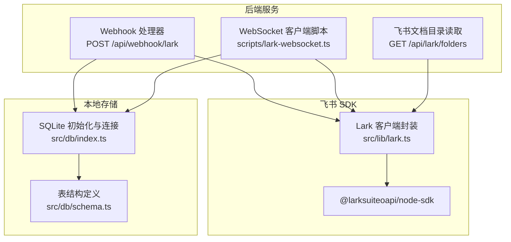
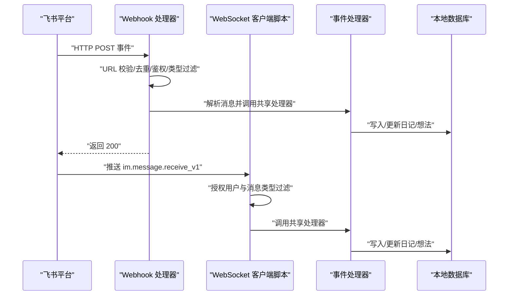
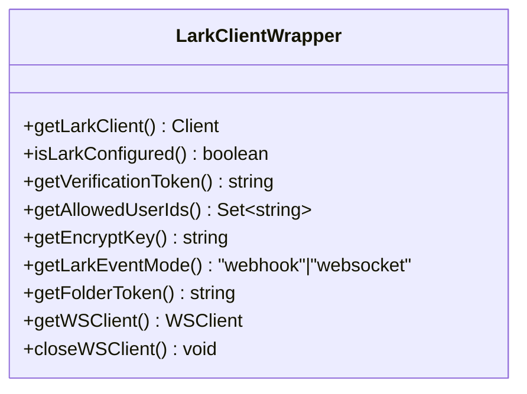
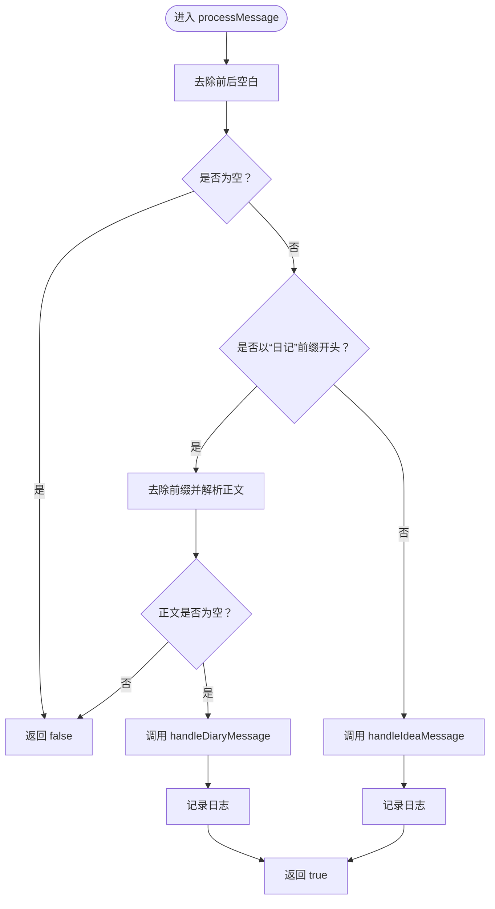
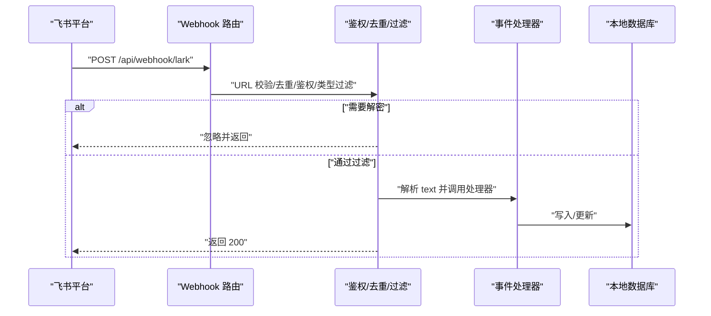
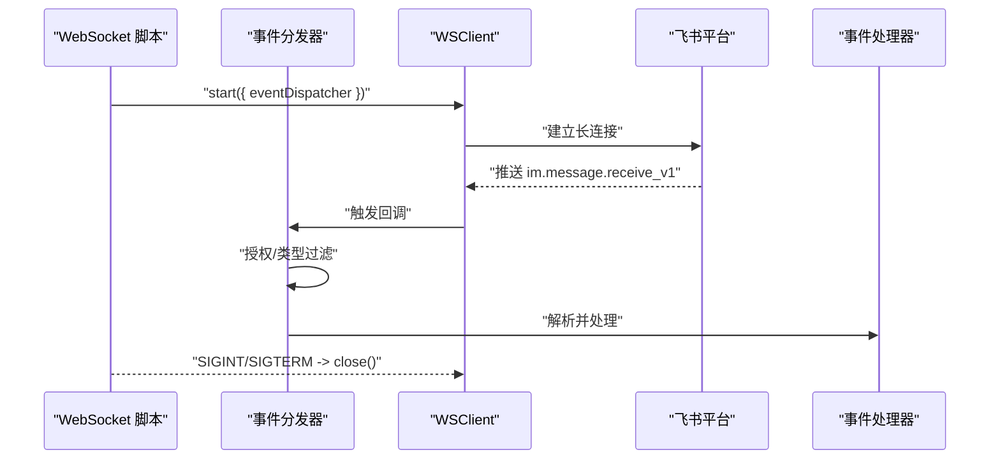
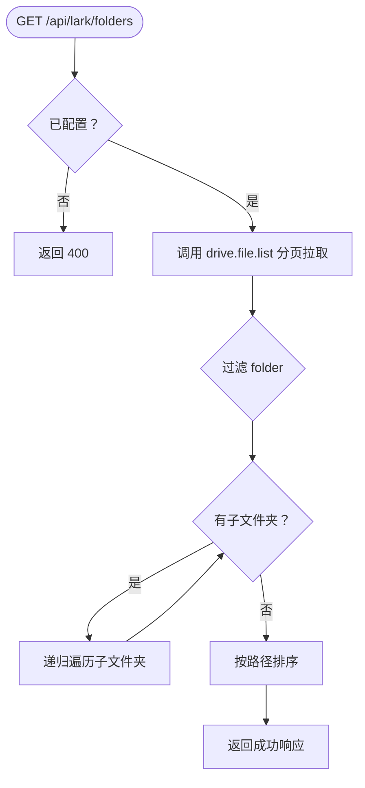
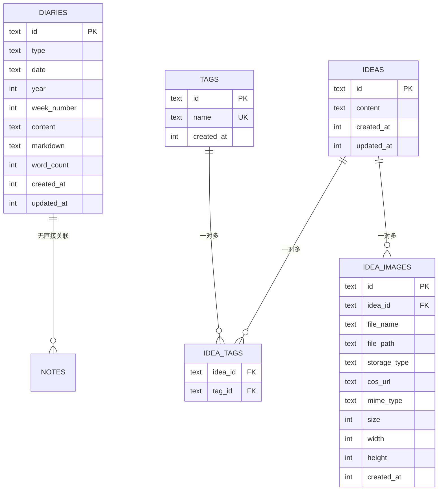
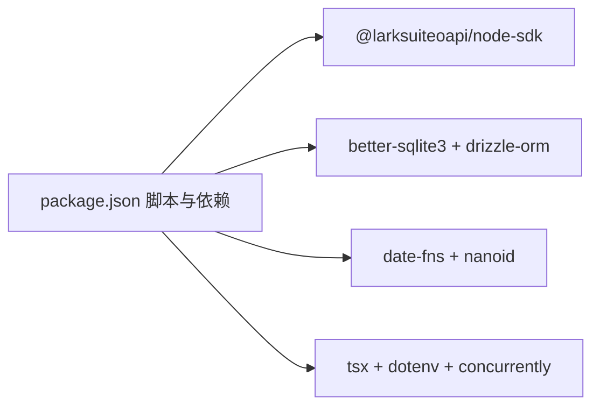

# 飞书集成

<cite>
**本文引用的文件**
- [src/lib/lark.ts](file://src/lib/lark.ts)
- [src/lib/lark-event-handler.ts](file://src/lib/lark-event-handler.ts)
- [scripts/lark-websocket.ts](file://scripts/lark-websocket.ts)
- [src/app/api/webhook/lark/route.ts](file://src/app/api/webhook/lark/route.ts)
- [src/app/api/lark/folders/route.ts](file://src/app/api/lark/folders/route.ts)
- [src/db/index.ts](file://src/db/index.ts)
- [src/db/schema.ts](file://src/db/schema.ts)
- [package.json](file://package.json)
- [README.md](file://README.md)
</cite>

## 目录
1. [简介](#简介)
2. [项目结构](#项目结构)
3. [核心组件](#核心组件)
4. [架构总览](#架构总览)
5. [详细组件分析](#详细组件分析)
6. [依赖关系分析](#依赖关系分析)
7. [性能考量](#性能考量)
8. [故障排查指南](#故障排查指南)
9. [结论](#结论)
10. [附录](#附录)

## 简介
本文件面向飞书（Lark/Feishu）集成的实现与运维，覆盖以下主题：
- 飞书 API 客户端的配置与使用（认证、域名、客户端类型）
- WebSocket 实时通信（连接建立、消息处理、自动重连）
- Webhook 事件处理（URL 校验、去重、鉴权、事件类型过滤、消息解析）
- 本地数据同步（日记与想法的写入与更新）
- 飞书应用配置指南（应用创建、权限、回调地址）
- 错误处理与重试机制
- 与本地数据的同步策略与一致性保障
- 调试工具与监控方法

## 项目结构
该仓库采用 Next.js 应用结构，飞书集成相关代码主要分布在如下位置：
- 客户端与配置：src/lib/lark.ts
- 事件处理共享逻辑：src/lib/lark-event-handler.ts
- Webhook 入口：src/app/api/webhook/lark/route.ts
- WebSocket 客户端脚本：scripts/lark-websocket.ts
- 飞书文档目录读取：src/app/api/lark/folders/route.ts
- 本地数据库与模式：src/db/index.ts、src/db/schema.ts
- 依赖与脚本：package.json

图表来源
- [src/app/api/webhook/lark/route.ts:1-106](file://src/app/api/webhook/lark/route.ts#L1-L106)
- [scripts/lark-websocket.ts:1-109](file://scripts/lark-websocket.ts#L1-L109)
- [src/app/api/lark/folders/route.ts:1-99](file://src/app/api/lark/folders/route.ts#L1-L99)
- [src/lib/lark.ts:1-96](file://src/lib/lark.ts#L1-L96)
- [src/db/index.ts:1-171](file://src/db/index.ts#L1-L171)
- [src/db/schema.ts:1-105](file://src/db/schema.ts#L1-L105)

章节来源
- [src/lib/lark.ts:1-96](file://src/lib/lark.ts#L1-L96)
- [src/app/api/webhook/lark/route.ts:1-106](file://src/app/api/webhook/lark/route.ts#L1-L106)
- [scripts/lark-websocket.ts:1-109](file://scripts/lark-websocket.ts#L1-L109)
- [src/app/api/lark/folders/route.ts:1-99](file://src/app/api/lark/folders/route.ts#L1-L99)
- [src/db/index.ts:1-171](file://src/db/index.ts#L1-L171)
- [src/db/schema.ts:1-105](file://src/db/schema.ts#L1-L105)

## 核心组件
- 飞书客户端封装：提供单例客户端、WebSocket 客户端、配置读取（App ID/Secret、校验 Token、加密密钥、允许用户集合、事件模式）、关闭 WebSocket 客户端等能力。
- 事件处理器：统一处理“日记”和“想法”两类消息，支持前缀路由与文本解析。
- Webhook 入口：负责 URL 校验、去重、鉴权、事件类型过滤、消息内容解析与调用共享处理器。
- WebSocket 客户端脚本：独立运行，建立长连接，注册事件分发器，处理授权用户与消息类型过滤。
- 飞书文档目录读取：递归列出文档库中的文件夹，支持分页与错误处理。
- 本地数据库：SQLite 初始化、索引、迁移与 Drizzle ORM 映射。

章节来源
- [src/lib/lark.ts:1-96](file://src/lib/lark.ts#L1-L96)
- [src/lib/lark-event-handler.ts:1-126](file://src/lib/lark-event-handler.ts#L1-L126)
- [src/app/api/webhook/lark/route.ts:1-106](file://src/app/api/webhook/lark/route.ts#L1-L106)
- [scripts/lark-websocket.ts:1-109](file://scripts/lark-websocket.ts#L1-L109)
- [src/app/api/lark/folders/route.ts:1-99](file://src/app/api/lark/folders/route.ts#L1-L99)
- [src/db/index.ts:1-171](file://src/db/index.ts#L1-L171)
- [src/db/schema.ts:1-105](file://src/db/schema.ts#L1-L105)

## 架构总览
下图展示飞书集成的整体交互：Webhook 与 WebSocket 两种模式均通过共享事件处理器对接到本地数据库；同时提供 API 读取飞书文档目录。

图表来源
- [src/app/api/webhook/lark/route.ts:28-105](file://src/app/api/webhook/lark/route.ts#L28-L105)
- [scripts/lark-websocket.ts:39-71](file://scripts/lark-websocket.ts#L39-L71)
- [src/lib/lark-event-handler.ts:104-125](file://src/lib/lark-event-handler.ts#L104-L125)
- [src/db/index.ts:1-171](file://src/db/index.ts#L1-L171)

## 详细组件分析

### 飞书客户端封装（src/lib/lark.ts）
- 单例客户端与 WebSocket 客户端初始化，延迟创建，避免重复实例化。
- 配置项：
  - LARK_APP_ID、LARK_APP_SECRET：必填，用于构建 SelfBuild 应用客户端。
  - LARK_VERIFICATION_TOKEN：Webhook 验证令牌。
  - LARK_ENCRYPT_KEY：消息解密密钥（WebSocket 使用）。
  - LARK_ALLOWED_USER_IDS：允许的发送者 open_id 集合（逗号分隔）。
  - LARK_EVENT_MODE：事件模式，"websocket" 或默认 "webhook"。
  - LARK_FOLDER_TOKEN：文档库根目录 token（用于目录读取 API）。
- WebSocket 客户端启用自动重连与日志级别。
- 提供关闭 WebSocket 客户端的方法。

图表来源
- [src/lib/lark.ts:8-95](file://src/lib/lark.ts#L8-L95)

章节来源
- [src/lib/lark.ts:1-96](file://src/lib/lark.ts#L1-L96)

### 事件处理器（src/lib/lark-event-handler.ts）
- 支持两类消息：
  - 日记：以“日记：/日记:”为前缀，按日期聚合，支持追加。
  - 想法：非日记类消息即视为想法，直接创建。
- 数据模型要点：
  - 日记表包含类型、日期、年周、内容（富文本 JSON）、Markdown 文本、字数统计等字段。
  - 想法表包含内容与时间戳。
- 处理流程：
  - 去除前后空白，空消息直接忽略。
  - 前缀匹配路由到对应处理器。
  - 日记：查询当日记录，不存在则新建，存在则追加富文本段落并更新 Markdown 与字数。
  - 想法：插入新记录。

图表来源
- [src/lib/lark-event-handler.ts:104-125](file://src/lib/lark-event-handler.ts#L104-L125)
- [src/lib/lark-event-handler.ts:28-87](file://src/lib/lark-event-handler.ts#L28-L87)
- [src/lib/lark-event-handler.ts:92-98](file://src/lib/lark-event-handler.ts#L92-L98)

章节来源
- [src/lib/lark-event-handler.ts:1-126](file://src/lib/lark-event-handler.ts#L1-L126)
- [src/db/schema.ts:93-104](file://src/db/schema.ts#L93-L104)

### Webhook 事件处理（src/app/api/webhook/lark/route.ts）
- URL 校验：当事件类型为 url_verification 时，校验 token 并返回 challenge。
- 配置检查：若未配置飞书参数，直接返回提示。
- 加密负载检测：收到 encrypt 字段时记录警告并忽略（需在飞书控制台关闭加密或配置密钥）。
- 鉴权：校验 header.token 与配置的验证令牌。
- 去重：基于内存 Map 的事件 ID 去重，TTL 5 分钟。
- 事件类型过滤：仅处理 im.message.receive_v1。
- 授权用户过滤：若配置了允许用户集合且发送者不在其中，则忽略。
- 消息类型过滤：仅处理 text 类型消息。
- 内容解析：从 message.content 中提取 text 字段，调用共享处理器。
- 返回：始终返回 200，避免平台重复投递。

图表来源
- [src/app/api/webhook/lark/route.ts:28-105](file://src/app/api/webhook/lark/route.ts#L28-L105)

章节来源
- [src/app/api/webhook/lark/route.ts:1-106](file://src/app/api/webhook/lark/route.ts#L1-L106)

### WebSocket 实时通信（scripts/lark-websocket.ts）
- 独立脚本，加载环境变量，检查配置后启动事件分发器与 WebSocket 客户端。
- 事件分发器注册 im.message.receive_v1：
  - 用户授权过滤（可选）。
  - 仅处理 text 类型消息。
  - 解析 message.content 中的 text 字段。
  - 调用共享事件处理器。
- 自动重连与优雅退出：捕获 SIGINT/SIGTERM，关闭连接后退出进程。
- 加密密钥：从配置读取，用于消息解密。

图表来源
- [scripts/lark-websocket.ts:39-71](file://scripts/lark-websocket.ts#L39-L71)
- [scripts/lark-websocket.ts:74-108](file://scripts/lark-websocket.ts#L74-L108)

章节来源
- [scripts/lark-websocket.ts:1-109](file://scripts/lark-websocket.ts#L1-L109)
- [src/lib/lark.ts:69-85](file://src/lib/lark.ts#L69-L85)

### 飞书文档目录读取（src/app/api/lark/folders/route.ts）
- 通过 getLarkClient 获取 SDK 客户端，递归列出文件夹（分页 page_size=200）。
- 过滤出 type=folder 的条目，拼接路径，递归遍历子文件夹。
- 最终按路径排序返回结果。
- 错误处理：对异常进行日志记录并返回 500。

图表来源
- [src/app/api/lark/folders/route.ts:71-98](file://src/app/api/lark/folders/route.ts#L71-L98)
- [src/app/api/lark/folders/route.ts:14-69](file://src/app/api/lark/folders/route.ts#L14-L69)

章节来源
- [src/app/api/lark/folders/route.ts:1-99](file://src/app/api/lark/folders/route.ts#L1-L99)
- [src/lib/lark.ts:8-27](file://src/lib/lark.ts#L8-L27)

### 本地数据库与模式（src/db/index.ts、src/db/schema.ts）
- SQLite 初始化：WAL 模式、外键约束开启、目录与文件准备。
- 表结构：
  - diaries：日记表，含类型、日期、年周、内容（JSON）、Markdown、字数等。
  - ideas：想法表，含内容与时间戳。
  - tags、idea_tags、idea_images 等用于想法的标签与图片关联。
- 迁移：动态检测并添加缺失列（如 folders 的 is_archived），初始化管理员用户。
- 单例连接：避免重复打开数据库连接。

图表来源
- [src/db/schema.ts:93-104](file://src/db/schema.ts#L93-L104)
- [src/db/schema.ts:57-62](file://src/db/schema.ts#L57-L62)
- [src/db/schema.ts:78-91](file://src/db/schema.ts#L78-L91)
- [src/db/schema.ts:41-55](file://src/db/schema.ts#L41-L55)

章节来源
- [src/db/index.ts:1-171](file://src/db/index.ts#L1-L171)
- [src/db/schema.ts:1-105](file://src/db/schema.ts#L1-L105)

## 依赖关系分析
- 飞书 SDK：@larksuiteoapi/node-sdk，提供 Client 与 WSClient。
- 数据库：better-sqlite3 + drizzle-orm，提供 ORM 能力与 WAL 模式优化。
- 工具库：date-fns 用于日期计算，nanoid 生成唯一 ID。
- 开发工具：tsx、dotenv、concurrently 用于开发与脚本执行。

图表来源
- [package.json:5-119](file://package.json#L5-L119)

章节来源
- [package.json:1-119](file://package.json#L1-L119)

## 性能考量
- 分页与递归：目录读取采用分页（page_size=200）与递归遍历，建议在大量文件夹场景下关注请求频率与超时。
- 去重策略：Webhook 使用内存 Map 去重，TTL 5 分钟，适合短期运行的单实例部署；若需多实例，建议迁移到分布式缓存（如 Redis）。
- 数据库事务：Drizzle 默认单语句执行，批量写入建议合并为事务或批量操作以减少 I/O。
- WebSocket 自动重连：SDK 层启用 autoReconnect，结合脚本的优雅退出，确保稳定性。

## 故障排查指南
- 配置缺失
  - 症状：启动时报错或接口返回未配置。
  - 排查：确认 LARK_APP_ID、LARK_APP_SECRET 是否设置；Webhook 模式下确认 LARK_VERIFICATION_TOKEN。
- URL 校验失败
  - 症状：平台无法完成 URL 校验。
  - 排查：核对回调地址与验证令牌一致。
- 加密负载
  - 症状：收到 encrypt 字段导致忽略事件。
  - 排查：在飞书控制台关闭加密，或配置 LARK_ENCRYPT_KEY。
- 事件去重
  - 症状：重复处理同一事件。
  - 排查：确认内存去重是否生效；多实例部署请使用外部缓存。
- WebSocket 连接
  - 症状：无法建立长连接或频繁断开。
  - 排查：检查网络可达性、App ID/Secret、autoReconnect 是否启用；查看日志级别输出。
- 数据库问题
  - 症状：写入失败或查询异常。
  - 排查：确认数据库初始化完成、WAL 模式与索引存在；检查迁移逻辑是否执行。

章节来源
- [src/app/api/webhook/lark/route.ts:32-60](file://src/app/api/webhook/lark/route.ts#L32-L60)
- [src/app/api/webhook/lark/route.ts:47-53](file://src/app/api/webhook/lark/route.ts#L47-L53)
- [scripts/lark-websocket.ts:24-27](file://scripts/lark-websocket.ts#L24-L27)
- [src/lib/lark.ts:69-85](file://src/lib/lark.ts#L69-L85)
- [src/db/index.ts:27-158](file://src/db/index.ts#L27-L158)

## 结论
本项目提供了飞书集成的完整闭环：通过 Webhook 与 WebSocket 两种模式接收消息，统一经由事件处理器写入本地数据库，辅以目录读取与基础的本地数据模型。整体设计清晰、模块职责明确，具备良好的扩展性与可维护性。建议在生产环境中补充分布式去重、加密解密支持、更完善的错误重试与监控告警。

## 附录

### 飞书应用配置指南
- 创建自建应用
  - 登录飞书开发者平台，创建企业自建应用，获取 App ID 与 App Secret。
- 权限设置
  - IM（即时消息）：订阅“接收消息”事件（im.message.receive_v1）。
  - Drive（云文档）：根据需要授予读取文件夹列表权限。
- 回调地址配置
  - Webhook：在应用控制台配置事件回调 URL 为 https://your-domain/api/webhook/lark，并设置验证令牌。
  - WebSocket：无需公网回调，本地运行脚本即可接收事件。
- 加密设置
  - 若启用加密，请在应用控制台配置加密密钥，或在本地配置 LARK_ENCRYPT_KEY。

### 事件处理器扩展方法
- 新增事件类型
  - 在 Webhook 路由与 WebSocket 分发器中增加事件类型判断与处理分支。
  - 在共享事件处理器中新增消息前缀或结构解析逻辑。
- 新增数据模型
  - 在数据库 schema 中新增表结构，并在 db 初始化中完成迁移。
  - 在事件处理器中新增对应的写入/更新逻辑。
- 扩展鉴权与过滤
  - 在 Webhook 与 WebSocket 中增加更细粒度的用户、群组或租户过滤。

### 错误处理与重试机制
- Webhook：始终返回 200，避免平台重复投递；内部捕获异常并记录日志。
- WebSocket：SDK 自动重连；脚本监听信号优雅退出。
- 建议：对外部依赖（如飞书 API）增加指数退避重试与熔断保护。

### 与本地数据的同步策略与一致性
- 写入策略：事件处理器对日记与想法分别进行插入或更新，保持原子性。
- 去重策略：Webhook 使用内存 Map 去重；多实例建议迁移到分布式缓存。
- 一致性：当前实现为最终一致，建议在需要强一致的场景引入版本号或变更日志。

### 调试工具与监控方法
- 日志：SDK 提供 info 级别日志，便于观察连接状态与事件流转。
- 脚本：提供 lark:ws 与 dev:ws 脚本，便于本地联调。
- 监控：建议接入应用监控（如日志聚合、指标采集）与告警（连接断开、处理异常）。

章节来源
- [package.json:5-11](file://package.json#L5-L11)
- [scripts/lark-websocket.ts:7-11](file://scripts/lark-websocket.ts#L7-L11)
- [src/lib/lark.ts:76-82](file://src/lib/lark.ts#L76-L82)
- [src/app/api/webhook/lark/route.ts:100-104](file://src/app/api/webhook/lark/route.ts#L100-L104)